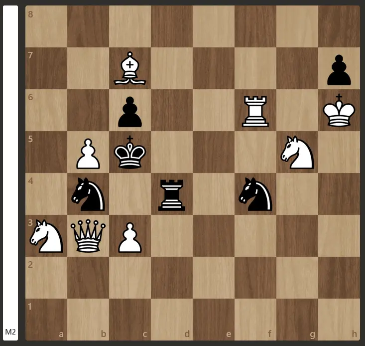
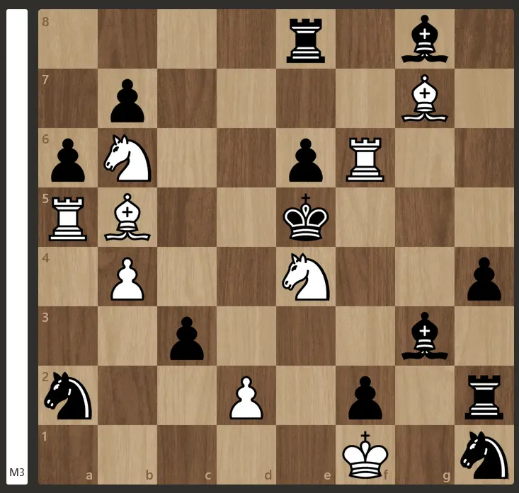
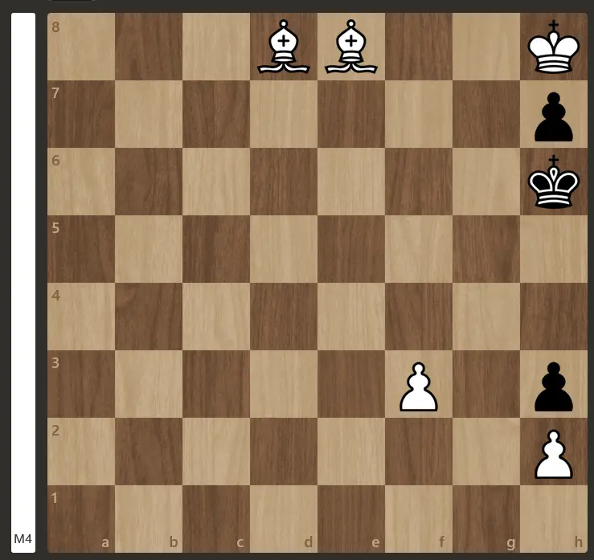
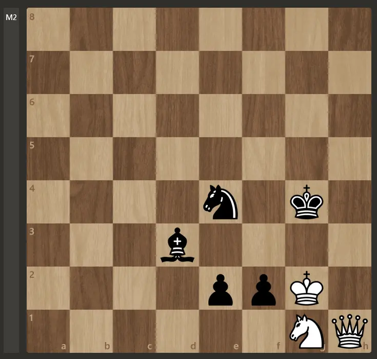
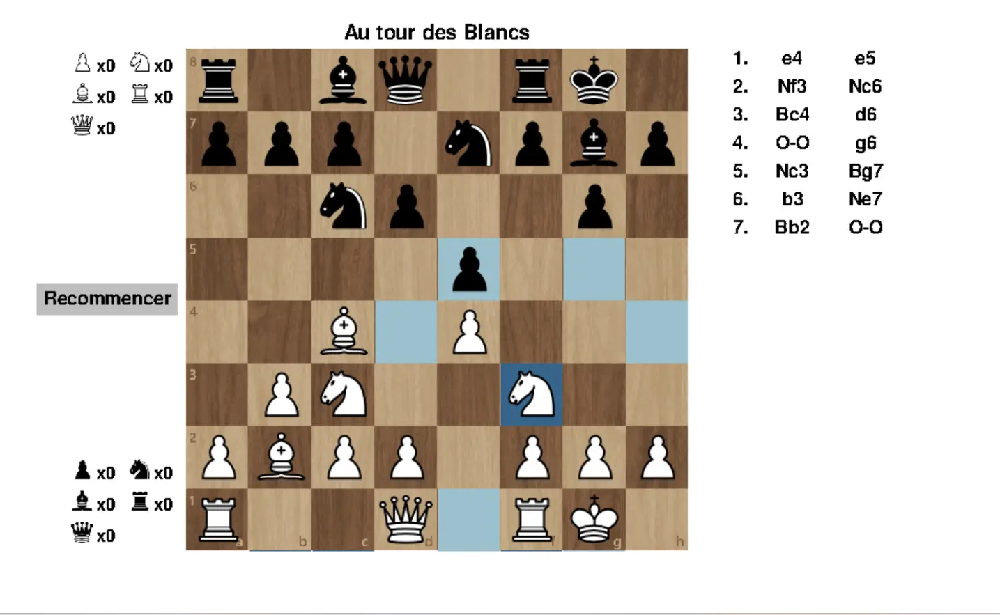
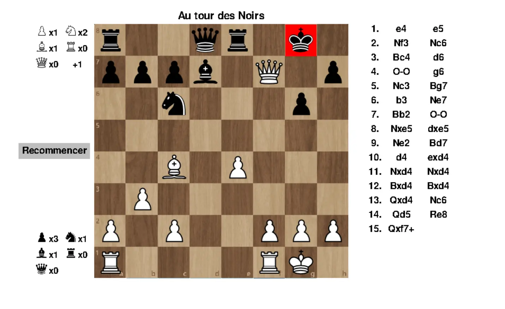
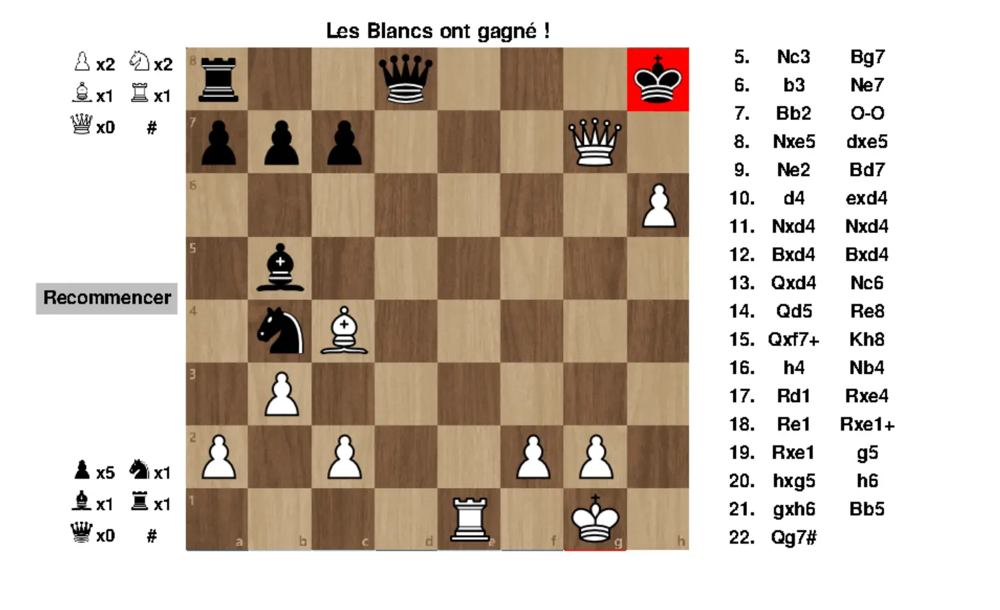


Connaissance basique de la programmation objet avec Python et des règles du jeu d'échecs.



Il est possible de tester l'implémentation du jeu sur le lien suivant: [Jeu d'échecs avec Python](https://duc-dgv.itch.io/jeu-dchecs)
Tout les codes présentés sont disponibles dans le dossier Git du POK2: [codes du POK2](https://github.com/FrancoisBrucker/do-it/tree/main/src/promos/2023-2024/Dang-Vu-Duc/pok/temps-2)


## Introduction

Le jeu d'échecs est un jeu classique, mais relativement complexe à implémenter. Ce POK utilisera les connaissances acquises lors du premier MON du temps 2, pour implémenter l'interface du jeu. Afin d'éviter tout chevauchement entre le MON et ce POK, cette partie du POK sera réalisée lors du deuxième sprint. Le premier sprint sera dédié à l'implémentation du code pour résoudre des problèmes simples.

## Backlog du premier sprint

Ce premier sprint aura donc pour objectif d'implémenter le code de résolution de problèmes simples. Voici les fonctionnalités que devront être développées, ainsi que leurs complexités:

- Implémentation de la représentation d'un plateau d'échecs (**3, 30min**)
- Implémentation des classes de chaque pièce ainsi que leur mouvements (**5, 1h30**)
- Implémentation d'une méthode pour représenter n'importe quelle position dans le code (**2, 30min**)
- Implémentation d'une méthode pour vérifier si une pièce peut être capturée ou non (**3, 45min**)
- Implémentation d'une méthode pour vérifier si un joueur est en échec et mat ou non (**8, 3h**)
- Implémentation d'une méthode pour résoudre des problèmes simples, en utilisant les méthodes précédentes. (**8, 3h**)

## Implémentation du code permettant de résoudre des problèmes simples

La première partie de ce POK a pour objectif de créer une méthode qui permettra de résoudre des problèmes simples du jeu des échecs. Autrement dit, pour une position donnée, le programme devra donner le coup gagnant qui mène à un échec et mat (en 1, 2, 3 voire 4 coups). Avant d'arriver à cette méthode, plusieurs étapes intermédiaires sont nécessaires, notamment pour représenter le plateau d'échecs et ses pièces.


Toute la suite de ce POK considérera que le lecteur connaît les règles des échecs, ainsi que son vocabulaire de base. Les termes un peu plus techniques (clouages, pat etc...) seront expliqués lorsqu'ils seront introduits.


### Représentation des éléments du plateau d'échecs

#### Implémentation des cases

Les premiers éléments à implémenter sont les 64 cases du plateau. On crée une classe **Cell**, qui contient les attributs suivants:

- *row* et *column*: entiers correspondant à la ligne et à la colonne de la case (en commençant par l'indice 0).
- *name*: chaîne de caractère correspondant au nom de la case. Par exemple, la case à la ligne d'indice 3 et à la colonne d'indice 5 aura comme nom "D6".
- *promote*: correspond au cas particulier de la promotion, qui sera expliquée plus en détail plus tard.

Ces cases vont être incluses dans la liste représentant le plateau d'échecs.



```python
class Cell():
    def __init__(self, row, column, promote = None):
        self.name = chr(column + 97) + f"{row+1}"
        self.row = row
        self.column = column
        self.promote = promote
```



#### Implémentations des pièces

Il faut maintenant implémenter les différentes pièces du jeu, ainsi que leurs mouvements. On crée une classe **Piece** qui contient les attributs suivants:

- *possible_moves*: liste d'objets de la classe **Cell** qui contiendra toutes les cases vers lesquelles la pièce pourra aller.
- *current_cell*: objet de la classe **Cell** qui correspond à la case sur laquelle se trouve la pièce.
- *IsWhite*: booléen indiquant si la pièce est blanche (*True*) ou noire (*False*)
- *value*: entier correspondant à la valeur de la pièce (1 pour un Pion, 3 pour un Cavalier et un Fou, 5 pour une Tour, 9 pour une Dame et 1000 pour un Roi).
- *letter*: chaîne de caractère correspondant à la lettre de la pièce (en notation anglaise). Cette lettre sera en majuscule si la pièce est blanche et en minuscule si la pièce est noire.



```python
class Piece():
    def __init__(self, IsWhite, value, letter, current_cell):
        self.possible_moves = []
        self.current_cell = current_cell
        self.IsWhite = IsWhite
        self.value = value
        self.letter = letter
```



A présent, il faut implémenter chaque pièce. On crée donc 6 classes qui correspond à chaque pièce (Pawn, Bishop, Knight, Rook, Queen, King). Ces classes héritent de la classe **Piece**, et ont une méthode *get_possible_moves*. Cette méthode va ajouter à l'attribut *possible_moves* toutes les cases vers lesquelles la pièce peut aller. Voilà comment fonctionnent ces méthodes:

- Pour les pièces à "longue portée" (Fou, Tour, Dame), on démarre avec les coordonnées de la pièce et on part dans les 4 directions, jusqu'à qu'on sorte des limites du plateau ou qu'on rencontre une autre pièce. Dans ce dernier cas, si la couleur de cette pièce n'est pas la même que la pièce en cours, alors on inclut cette dernière case (c'est une prise!). Sinon, on n'inclut pas cette case (on ne peut pas prendre une pièce de notre équipe).
- Pour le Cavalier et le Roi, on génère les 8 coordonnées que ces pièces peuvent attendre (déplacement en "L" pour le Cavalier). Si une coordonnée sort du plateau, on ne l'inclut pas. Si une pièce se trouve sur la case et que sa couleur est opposée, on inclut cette case (c'est une prise!)
- Pour le Pion, on doit vérifier si la case en face (ou en dessous, suivant la couleur) est vide. Si c'est le cas, on inclut cette case. Si le pion se trouve sur la deuxième ligne (ou la septième ligne, suivant la couleur), on ajoute une case supplémentaire si possible. On vérifie aussi les deux cases en diagonale, ainsi que la couleur de l'éventuelle pièce qui s'y trouve. Si cette pièce est une pièce de l'adversaire, on inclut cette case (c'est une prise!).



```python
class King(Piece):
    def __init__(self, IsWhite, current_cell):
        if IsWhite:
            super().__init__(IsWhite, 1000, "K", current_cell)
        else:
            super().__init__(IsWhite, -1000, "k", current_cell)

    def get_possible_moves(self, board):
        self.possible_moves = []
        column = self.current_cell.column
        row = self.current_cell.row
        for k in [-1, 0, 1]:
            for l in [-1, 0, 1]:
                if not (k == 0 and l == 0):
                    new_column = column + k
                    new_row = row + l
                    if new_row <= 7 and new_column <= 7 and new_row >= 0 and new_column >= 0 :
                        if board[new_row][new_column][1] is None: 
                            new_cell = Cell(new_row, new_column)
                            self.possible_moves.append(new_cell)
                        else:
                            obstacle_color = board[new_row][new_column][1].IsWhite
                            if obstacle_color ^ self.IsWhite:
                                new_cell = Cell(new_row, new_column)
                                self.possible_moves.append(new_cell)

class Rook(Piece):
    def __init__(self, IsWhite, current_cell):
        if IsWhite:
            super().__init__(IsWhite, 5, "R", current_cell)
        else:
            super().__init__(IsWhite, -5, "r", current_cell)
    
    def get_possible_moves(self, board):
        self.possible_moves = []
        for k in [-1, 1]:
            new_column = self.current_cell.column + k
            new_row = self.current_cell.row
            while new_column >= 0 and new_column <= 7 and new_row >= 0 and new_row <= 7:
                if board[new_row][new_column][1] is None: 
                        new_cell = Cell(new_row, new_column)
                        self.possible_moves.append(new_cell)
                else:
                    obstacle_color = board[new_row][new_column][1].IsWhite
                    if obstacle_color ^ self.IsWhite:
                        new_cell = Cell(new_row, new_column)
                        self.possible_moves.append(new_cell)
                    break
                new_column = new_column + k
        for l in [-1, 1]:
            new_column = self.current_cell.column
            new_row = self.current_cell.row + l
            while new_column >= 0 and new_column <= 7 and new_row >= 0 and new_row <= 7:
                if board[new_row][new_column][1] is None: 
                        new_cell = Cell(new_row, new_column)
                        self.possible_moves.append(new_cell)
                else:
                    obstacle_color = board[new_row][new_column][1].IsWhite
                    if obstacle_color ^ self.IsWhite:
                        new_cell = Cell(new_row, new_column)
                        self.possible_moves.append(new_cell)
                    break
                new_row = new_row + l

class Knight(Piece):
    def __init__(self, IsWhite, current_cell):
        if IsWhite:
            super().__init__(IsWhite, 3, "N", current_cell)
        else:
            super().__init__(IsWhite, -3, "n", current_cell)

    def get_possible_moves(self, board):
        self.possible_moves = []
        column = self.current_cell.column
        row = self.current_cell.row
        L = [-1, -2, 1, 2]
        for k in L:
            temp_L = [-1, -2, 1, 2]
            temp_L.remove(k)
            temp_L.remove(-k)
            for l in temp_L:
                new_column = column + k
                new_row = row + l
                if new_row <= 7 and new_column <= 7 and new_row >= 0 and new_column >= 0:
                    if board[new_row][new_column][1] is None: 
                            new_cell = Cell(new_row, new_column)
                            self.possible_moves.append(new_cell)
                    else:
                        obstacle_color = board[new_row][new_column][1].IsWhite
                        if obstacle_color ^ self.IsWhite:
                            new_cell = Cell(new_row, new_column)
                            self.possible_moves.append(new_cell)
        
class Bishop(Piece):
    def __init__(self, IsWhite, current_cell):
        if IsWhite:
            super().__init__(IsWhite, 3, "B", current_cell)
        else:
            super().__init__(IsWhite, -3, "b", current_cell)
    
    def get_possible_moves(self, board):
        self.possible_moves = []
        for k in [-1, 1]:
            for l in [-1, 1]:
                new_column = self.current_cell.column + k
                new_row = self.current_cell.row + l
                while new_column >= 0 and new_column <= 7 and new_row >= 0 and new_row <= 7:
                    if board[new_row][new_column][1] is None: 
                            new_cell = Cell(new_row, new_column)
                            self.possible_moves.append(new_cell)
                    else:
                        obstacle_color = board[new_row][new_column][1].IsWhite
                        if obstacle_color ^ self.IsWhite:
                            new_cell = Cell(new_row, new_column)
                            self.possible_moves.append(new_cell)
                        break
                    new_column = new_column + k
                    new_row = new_row + l

class Queen(Piece):
    def __init__(self, IsWhite, current_cell):
        if IsWhite:
            super().__init__(IsWhite, 9, "Q", current_cell)
        else:
            super().__init__(IsWhite, -9, "q", current_cell)
    
    def get_possible_moves(self, board):
        self.possible_moves = []
        for k in [-1, 1]:
            new_column = self.current_cell.column + k
            new_row = self.current_cell.row
            while new_column >= 0 and new_column <= 7 and new_row >= 0 and new_row <= 7:
                if board[new_row][new_column][1] is None: 
                        new_cell = Cell(new_row, new_column)
                        self.possible_moves.append(new_cell)
                else:
                    obstacle_color = board[new_row][new_column][1].IsWhite
                    if obstacle_color ^ self.IsWhite:
                        new_cell = Cell(new_row, new_column)
                        self.possible_moves.append(new_cell)
                    break
                new_column = new_column + k
        for l in [-1, 1]:
            new_column = self.current_cell.column
            new_row = self.current_cell.row + l
            while new_column >= 0 and new_column <= 7 and new_row >= 0 and new_row <= 7:
                if board[new_row][new_column][1] is None: 
                        new_cell = Cell(new_row, new_column)
                        self.possible_moves.append(new_cell)
                else:
                    obstacle_color = board[new_row][new_column][1].IsWhite
                    if obstacle_color ^ self.IsWhite:
                        new_cell = Cell(new_row, new_column)
                        self.possible_moves.append(new_cell)
                    break
                new_row = new_row + l
        for k in [-1, 1]:
            for l in [-1, 1]:
                new_column = self.current_cell.column + k
                new_row = self.current_cell.row + l
                while new_column >= 0 and new_column <= 7 and new_row >= 0 and new_row <= 7:
                    if board[new_row][new_column][1] is None: 
                            new_cell = Cell(new_row, new_column)
                            self.possible_moves.append(new_cell)
                    else:
                        obstacle_color = board[new_row][new_column][1].IsWhite
                        if obstacle_color ^ self.IsWhite:
                            new_cell = Cell(new_row, new_column)
                            self.possible_moves.append(new_cell)
                        break
                    new_column = new_column + k
                    new_row = new_row + l

class Pawn(Piece):
    def __init__(self, IsWhite, current_cell):
        if IsWhite:
            super().__init__(IsWhite, 1, "", current_cell)
        else:
            super().__init__(IsWhite, -1, "", current_cell)
    
    
    def get_possible_moves(self, board):
        if self.IsWhite:
            move = 1
        else:
            move = -1
        self.possible_moves = []
        if self.current_cell.row == 6 and self.IsWhite:
            new_column = self.current_cell.column + 0
            new_row = self.current_cell.row + move
            if new_column >= 0 and new_column <= 7:
                self.possible_moves.append(Cell(new_row, new_column, "Q"))
                self.possible_moves.append(Cell(new_row, new_column, "N"))
                self.possible_moves.append(Cell(new_row, new_column, "B"))
                self.possible_moves.append(Cell(new_row, new_column, "R"))
            for k in [-1, 1]:
                new_column = self.current_cell.column + k
                new_row = self.current_cell.row + move
                if new_column >= 0 and new_column <= 7:
                    if board[new_row][new_column][1] is not None:
                        obstacle_color = board[new_row][new_column][1].IsWhite
                        if obstacle_color ^ self.IsWhite:
                            self.possible_moves.append(Cell(new_row, new_column, "Q"))
                            self.possible_moves.append(Cell(new_row, new_column, "N"))
                            self.possible_moves.append(Cell(new_row, new_column, "B"))
                            self.possible_moves.append(Cell(new_row, new_column, "R"))

        elif self.current_cell.row == 1 and not self.IsWhite:
            new_column = self.current_cell.column + 0
            new_row = self.current_cell.row + move
            if new_column >= 0 and new_column <= 7:
                self.possible_moves.append(Cell(new_row, new_column, "q"))
                self.possible_moves.append(Cell(new_row, new_column, "n"))
                self.possible_moves.append(Cell(new_row, new_column, "b"))
                self.possible_moves.append(Cell(new_row, new_column, "r"))
            for k in [-1, 1]:
                new_column = self.current_cell.column + k
                new_row = self.current_cell.row + move
                if new_column >= 0 and new_column <= 7:
                    if board[new_row][new_column][1] is not None:
                        obstacle_color = board[new_row][new_column][1].IsWhite
                        if obstacle_color ^ self.IsWhite:
                            self.possible_moves.append(Cell(new_row, new_column, "q"))
                            self.possible_moves.append(Cell(new_row, new_column, "n"))
                            self.possible_moves.append(Cell(new_row, new_column, "b"))
                            self.possible_moves.append(Cell(new_row, new_column, "r"))
        else:
            if self.current_cell.row == 1 or self.current_cell.row == 6:
                for k in [1, 2]:
                    new_row = self.current_cell.row + k * move
                    new_column = self.current_cell.column + 0
                    if new_row >= 0 and new_row <= 7:
                        if board[new_row][new_column][1] is None: 
                            new_cell = Cell(new_row, new_column)
                            self.possible_moves.append(new_cell)
                        else:
                            break
                    else:
                        break
            else:
                new_row = self.current_cell.row + move
                new_column = self.current_cell.column + 0
                if new_row >= 0 and new_row <= 7:
                    if board[new_row][new_column][1] is None: 
                        new_cell = Cell(new_row, new_column)
                        self.possible_moves.append(new_cell)
            new_row = self.current_cell.row + move
            new_column = self.current_cell.column - 1
            if new_column >= 0 and new_row <= 7 and new_row >= 0:
                if board[new_row][new_column][1] is not None:
                    obstacle_color = board[new_row][new_column][1].IsWhite
                    if obstacle_color ^ self.IsWhite:
                        new_cell = Cell(new_row, new_column)
                        self.possible_moves.append(new_cell)

            new_column = self.current_cell.column + 1
            if new_column <= 7 and new_row <= 7 and new_row >= 0:
                if board[new_row][new_column][1] is not None:
                    obstacle_color = board[new_row][new_column][1].IsWhite
                    if obstacle_color ^ self.IsWhite:
                        new_cell = Cell(new_row, new_column)
                        self.possible_moves.append(new_cell)
```



### Implémentation de la classe Chessboard

Il faut maintenant implémenter une classe qui va permettre de représenter et manipuler un plateau d'échecs. Ce plateau sera un attribut de cette classe, et sera un tableau de 8 lignes et 8 colonnes. Chaque élément de ce tableau sera une liste contenant un objet de la classe **Cell**, correspondant à la case de l'échiquier, et une objet de la classe **Piece**, qui sera le contenu de cette case. Si la case est vide, il y aura un objet *None*.



```python
class Chessboard():
    def __init__(self):
        self.board = [ [None for j in range(8)] for i in range(8) ]
        for i in range(8):
            for j in range(8):
                self.board[i][j] = [Cell(i, j), None]
```



#### Récupérer une position quelconque

Implémentons à présent une méthode qui permettra de récupérer n'importe quelle position d'échecs. Pour cela, on va utiliser une notation appelée la [Notation de Forsyth-Edwards](https://fr.wikipedia.org/wiki/Notation_Forsyth-Edwards). Cette notation est celle utilisée dans le monde des échecs pour représenter une position. Pour faire court, chaque rangée de l'échiquier est décrite de haut en bas, et chaque pièce est représentée par sa lettre. En lisant les lettres une par une, il n'est pas difficile de représenter la position dans notre code.



```python
def get_position_from_fen(self, fen_position):
        new_board = [ [None for j in range(8)] for i in range(8) ]
        for i in range(8):
            for j in range(8):
                new_board[i][j] = [Cell(i, j), None]
        row_list = []
        word = ''
        count = 0
        for char in fen_position:
            if char != "/" and char != ' ':
                word += char
            elif char == "/":
                row_list.append(word)
                word = ''
            elif char == ' ':
                row_list.append(word)
                if fen_position[count + 1] == 'w':
                    IsWhiteToPlay = True
                else:
                    IsWhiteToPlay = False
                break
            count += 1
        nb_row = 7
        for row in row_list:
            counter = 0
            for k in range(len(row)):
                if row[k].isdigit():
                    digit = int(row[k])
                    counter += digit
                else:
                    if row[k] == 'r' or row[k] == 'R':
                        new_board[nb_row][counter][1] = Rook(row[k].isupper(), Cell(nb_row, counter))
                    elif row[k] == 'n' or row[k] == 'N':
                        new_board[nb_row][counter][1] = Knight(row[k].isupper(), Cell(nb_row, counter))
                    elif row[k] == 'b' or row[k] == 'B':
                        new_board[nb_row][counter][1] = Bishop(row[k].isupper(), Cell(nb_row, counter))
                    elif row[k] == 'k' or row[k] == 'K':
                        new_board[nb_row][counter][1] = King(row[k].isupper(), Cell(nb_row, counter))
                    elif row[k] == 'q' or row[k] == 'Q':
                        new_board[nb_row][counter][1] = Queen(row[k].isupper(), Cell(nb_row, counter))
                    elif row[k] == 'p' or row[k] == 'P':
                        new_board[nb_row][counter][1] = Pawn(row[k].isupper(), Cell(nb_row, counter))
                    counter += 1
            nb_row -= 1
        return(new_board, IsWhiteToPlay)
```



#### Effectuer un mouvement sur l'échiquier

La méthode *move* prend en argument une case de départ et une case d'arrivée, et modifie l'échiquier en conséquence. Pour cela, on récupère la pièce sur la case de départ et on vérifie si elle peut aller dans sa case d'arrivée grâce à l'attribut *possible_moves*. Ensuite, on supprime la pièce de la case de départ et on la place sur la case d'arrivée. Enfin, on actualise les attributs *possible_moves* de chaque pièce en utilisant les méthodes *get_possible_moves*.



```python
def move(self, current_cell, final_cell):
    piece = self.board[current_cell.row][current_cell.column][1]
    if piece is None:
        print("Il n'y a pas de pièce dans la case indiquée")
        return()
    if (final_cell.row, final_cell.column) not in [(cell.row, cell.column) for cell in piece.possible_moves]:
        print("La pièce ne peut pas aller jusqu'à la case indiquée")
        return()
    self.board[current_cell.row][current_cell.column][1] = None
    if piece.letter == "" and (current_cell.row == 6 and piece.IsWhite):
        if final_cell.promote is None:
            print("Problème : pas de promotion")
            return()
        if final_cell.promote in ["Q", "q"]:
            self.board[final_cell.row][final_cell.column][1] = Queen(piece.IsWhite, final_cell)
        elif final_cell.promote in ["N", "n"]:
            self.board[final_cell.row][final_cell.column][1] = Knight(piece.IsWhite, final_cell)
        elif final_cell.promote in ["B", "b"]:
            self.board[final_cell.row][final_cell.column][1] = Bishop(piece.IsWhite, final_cell)
        elif final_cell.promote in ["R", "r"]:
            self.board[final_cell.row][final_cell.column][1] = Rook(piece.IsWhite, final_cell)

    elif piece.letter == "" and (current_cell.row == 1 and not piece.IsWhite):
        if final_cell.promote is None:
            print("Problème : pas de promotion", piece.letter, current_cell.name, final_cell.name, final_cell.promote)
            return()
        if final_cell.promote in ["Q", "q"]:
            self.board[final_cell.row][final_cell.column][1] = Queen(piece.IsWhite, final_cell)
        elif final_cell.promote in ["N", "n"]:
            self.board[final_cell.row][final_cell.column][1] = Knight(piece.IsWhite, final_cell)
        elif final_cell.promote in ["B", "b"]:
            self.board[final_cell.row][final_cell.column][1] = Bishop(piece.IsWhite, final_cell)
        elif final_cell.promote in ["R", "r"]:
            self.board[final_cell.row][final_cell.column][1] = Rook(piece.IsWhite, final_cell) 
    elif piece.letter in ["K", "k"]:
        self.board[final_cell.row][final_cell.column][1] = King(piece.IsWhite, final_cell)
    elif piece.letter in ["R", "r"]:
        self.board[final_cell.row][final_cell.column][1] = Rook(piece.IsWhite, final_cell)
    elif piece.letter in ["B", "b"]:
        self.board[final_cell.row][final_cell.column][1] = Bishop(piece.IsWhite, final_cell)
    elif piece.letter in ["N", "n"]:
        self.board[final_cell.row][final_cell.column][1] = Knight(piece.IsWhite, final_cell)
    elif piece.letter in ["Q", "q"]:
        self.board[final_cell.row][final_cell.column][1] = Queen(piece.IsWhite, final_cell)
    elif piece.letter in [""]:
        self.board[final_cell.row][final_cell.column][1] = Pawn(piece.IsWhite, final_cell)
    self.update_possible_moves()

def update_possible_moves(self):
    for row in self.board:
        for cell in row:
            if cell[1] is not None:
                cell[1].get_possible_moves(self.board)
```



Le cas de la promotion sera expliqué plus tard, car c'est un cas qui a été traité en dernier lors de ce sprint.

#### Déterminer si une pièce peut être capturée par ou pas

Cette méthode est très importante, car elle est utilisée dans beaucoup de méthodes ci-après. Pour cela, on récupère tout les mouvements possibles du plateau, et on vérifie si les coordonnées de la pièce en question est dans cette liste.



```python
def CanBeCaptured(self, piece):
    captured_by = []
    opponent_moves = [[cell[0], cell[1]] for cell in self.get_all_possible_moves2(not piece.IsWhite)]
    for k in range(len(opponent_moves)):
        for i in range(len(opponent_moves[k][1])):
            current_cell = opponent_moves[k][1][i]
            if piece.current_cell.name == current_cell.name:
                captured_by.append(opponent_moves[k][0])
                break
    if len(captured_by) == 0:
        return(False, captured_by)
    else:
        return(True, captured_by)
```



#### Récupérer tout les mouvements possibles d'une position

Il faut ensuite récupérer tout les coups possibles d'une position. Pour cela, on parcourt le plateau et quand on rencontre une pièce, on rajoute dans une liste la case de départ et les cases d'arrivée. Une chose importante à faire est de trier cette liste finale. On place en premier les mouvements qui résultent en un échec. Ceci est important car ces mouvements sont plus susceptibles de résoudre le problème, et cela va considérablement réduire le temps d'exécution de l'algorithme.



```python
def get_all_possible_moves(self, IsWhiteToPlay):
    all_possible_moves = []
    initial_board = copy.deepcopy(self.board[:])
    for row in self.board:
        for cell in row:
            if cell[1] is not None:
                self.board = copy.deepcopy(initial_board[:])
                piece = copy.deepcopy(cell[1])
                if piece.IsWhite == IsWhiteToPlay:
                    current_moves = []
                    index = -1
                    # killer_moves = []
                    for move in piece.possible_moves:
                        piece_opponent = copy.deepcopy(self.board[move.row][move.column][1])
                        self.move(piece.current_cell, move)
                        if not self.IsCheck(IsWhiteToPlay):
                            if self.IsCheck(not IsWhiteToPlay):
                                current_moves = [move] + current_moves
                            elif piece_opponent != None and ((piece_opponent.IsWhite) ^ (piece.IsWhite)):
                                current_moves = [move] + current_moves
                            elif piece.letter not in [""] and index != -1:
                                current_moves = current_moves[:index] + [move] + current_moves[index:]
                            else:
                                current_moves.append(move)
                            self.board = copy.deepcopy(initial_board[:])
                            index += 1
                        else:
                            self.board = copy.deepcopy(initial_board[:])
                    # current_moves = killer_moves + current_moves
                    all_possible_moves.append([piece.current_cell, current_moves])
    return(all_possible_moves)
```



Notons que cette méthode gère les "clouages". Ce concept a lieu quand une pièce ne peut pas bouger car si elle bouge, son roi serait en échec.

#### Déterminer si la position est un échec et mat ou pas

Cette méthode a été la plus longue à implémenter. Ceci est dû au fait que qu'il y a plusieurs cas à vérifier. En effet, pour parer un échec, il y a plusieurs possibilités:

- Le roi en échec peut simplement bouger vers une case où il n'est pas en échec,
- Capturer la pièce qui met en échec,
- Interposer une pièce entre le roi est la pièce qui met en échec.

La méthode *IsCheckmate* gère ces cas un par un, et renvoie un booléen qui indique s'il y a uun échec et mat ou pas.
Il est inutile d'expliquer en détail comment cette fonction gère ces cas, mais il est intéressant de noter que cette méthode utilise la plupart des méthodes ci-avant.



```python
def IsCheckmate(self, IsWhiteToPlay):
    initial_board = copy.deepcopy(self.board)
    count = 0
    for row in self.board:
        for cell in row:
            if cell[1] is not None:
                piece2 = copy.deepcopy(cell[1])
                # print(piece2.letter, piece2.current_cell.name)
                if (piece2.value == 1000 or piece2.value == -1000) and (piece2.IsWhite == IsWhiteToPlay):
                    list_captured = copy.deepcopy(self.CanBeCaptured(piece2)[1])
                    if self.CanBeCaptured(piece2)[0]: #Vérifie si le roi est en échec
                        current_row = piece2.current_cell.row
                        current_column = piece2.current_cell.column
                        current_cell = Cell(current_row,current_column)
                        for move in piece2.possible_moves:
                            self.move(current_cell, move)
                            new_piece = self.board[move.row][move.column][1]
                            can_be_captured = self.CanBeCaptured(new_piece)[0]
                            # print(new_piece.current_cell.name, [cell.name for cell in self.CanBeCaptured(new_piece)[1]])
                            if can_be_captured:
                                count += 1
                            self.board = copy.deepcopy(initial_board)
                            self.update_possible_moves()
                        if count != len(piece2.possible_moves): #Vérifie si le roi peut s'échapper ou pas
                            return(False)
                        else: #Le roi ne peut pas s'échapper
                            if len(list_captured) == 1: #Une pièce met en échec
                                cell = list_captured[0]
                                piece_opponent = self.board[cell.row][cell.column][1]
                                (can_be_captured2, list_captured2) = self.CanBeCaptured(piece_opponent)
                                if can_be_captured2 and (len(list_captured2) > 1 or self.board[list_captured2[0].row][list_captured2[0].column][1].letter not in ["k", "K"]): #La pièce peut être prise par une pièce autre que le roi
                                    index = None
                                    for m in range(len(list_captured2)):
                                        if self.board[list_captured2[m].row][list_captured2[m].column][1].letter in ["K", "k"]:
                                            index = m
                                            break
                                    if index != None:
                                        list_captured2.pop(index)
                                    c = 0
                                    for cell_opponent in list_captured2:
                                        c += 1
                                        self.move(cell_opponent, piece_opponent.current_cell)
                                        if not self.IsCheck(IsWhiteToPlay): # Au moins une pièce peut prendre la pièce qui met en échec
                                            self.board = copy.deepcopy(initial_board)
                                            return(False)
                                        self.board = copy.deepcopy(initial_board)
                                    return(True)
                                else: #La pièce ne peut pas être prise par une pièce autre que le roi
                                    cells_inbetween = []
                                    piece_opponent = self.board[list_captured[0].row][list_captured[0].column][1]
                                    row_king = piece2.current_cell.row
                                    column_king = piece2.current_cell.column
                                    if piece_opponent.letter in ["R", "r", "q", "Q"]:
                                        if piece_opponent.current_cell.column == column_king and piece_opponent.current_cell.row > row_king: #la Tour est au-dessus du roi
                                            current_column = piece_opponent.current_cell.column
                                            current_row = piece_opponent.current_cell.row - 1
                                            while current_row != row_king and current_row >= 0:
                                                cells_inbetween.append(self.board[current_row][current_column][0])
                                                current_row -= 1
                                        elif piece_opponent.current_cell.column == column_king and piece_opponent.current_cell.row < row_king: #la Tour est en dessous du roi
                                            current_column = piece_opponent.current_cell.column
                                            current_row = piece_opponent.current_cell.row + 1
                                            while current_row != row_king and current_row <= 7:
                                                cells_inbetween.append(self.board[current_row][current_column][0])
                                                current_row += 1
                                        elif piece_opponent.current_cell.row == row_king and piece_opponent.current_cell.column > column_king: #la Tour est à droite du roi
                                            current_column = piece_opponent.current_cell.column - 1
                                            current_row = piece_opponent.current_cell.row
                                            while current_column != column_king and current_column >= 0:
                                                cells_inbetween.append(self.board[current_row][current_column][0])
                                                current_column -= 1
                                        elif piece_opponent.current_cell.row == row_king and piece_opponent.current_cell.column < column_king: #la Tour est à gauche du roi
                                            current_column = piece_opponent.current_cell.column + 1
                                            current_row = piece_opponent.current_cell.row
                                            while current_column != column_king and current_column <= 7:
                                                cells_inbetween.append(self.board[current_row][current_column][0])
                                                current_column += 1
                                    if piece_opponent.letter in ["B", "b", "Q", "q"]:
                                        if piece_opponent.current_cell.column > column_king and piece_opponent.current_cell.row > row_king: #le Fou est en haut à droite du roi
                                            current_column = piece_opponent.current_cell.column - 1
                                            current_row = piece_opponent.current_cell.row - 1
                                            while current_row != row_king and current_column >= 0 and current_row >= 0:
                                                cells_inbetween.append(self.board[current_row][current_column][0])
                                                current_row -= 1
                                                current_column -= 1
                                        elif piece_opponent.current_cell.column < column_king and piece_opponent.current_cell.row < row_king: #le Fou est en bas à gauche du roi
                                            current_column = piece_opponent.current_cell.column + 1
                                            current_row = piece_opponent.current_cell.row + 1
                                            while current_row != row_king and current_row <= 7 and current_column <= 7:
                                                cells_inbetween.append(self.board[current_row][current_column][0])
                                                current_row += 1
                                                current_column += 1
                                        elif piece_opponent.current_cell.column > column_king and piece_opponent.current_cell.row < row_king: #le Fou est en bas à droite du roi
                                            current_column = piece_opponent.current_cell.column - 1
                                            current_row = piece_opponent.current_cell.row + 1
                                            while current_row != row_king and current_row <= 7 and current_column >= 0:
                                                cells_inbetween.append(self.board[current_row][current_column][0])
                                                current_row += 1
                                                current_column -= 1
                                        elif piece_opponent.current_cell.column < column_king and piece_opponent.current_cell.row > row_king: #le Fou est en haut à gauche du roi
                                            current_column = piece_opponent.current_cell.column + 1
                                            current_row = piece_opponent.current_cell.row - 1
                                            while current_row != row_king and current_row >= 0 and current_column <= 7:
                                                cells_inbetween.append(self.board[current_row][current_column][0])
                                                current_row -= 1
                                                current_column += 1
                                    if piece_opponent.letter not in ["R", "r", "B", "b", "Q", "q"]: #La pièce qui met en échec n'est ni un fou, ni une tour, ni une Dame
                                        return(True)
                                    cells_inbetween = [cell.name for cell in cells_inbetween]
                                    all_possible_moves = copy.deepcopy(self.get_all_possible_moves(IsWhiteToPlay))
                                    ending_cells = []
                                    for n in range(len(all_possible_moves)):
                                        current_cell = all_possible_moves[n][0]
                                        if self.board[current_cell.row][current_cell.column][1].letter not in ['k', 'K']:
                                            ending_cells += all_possible_moves[n][1]
                                    ending_cells = [cell.name for cell in ending_cells]
                                    for cell in ending_cells:
                                        if cell in cells_inbetween:
                                            return(False)
                                    return(True)
                            else: #2 pièces ou plus mettent en échec
                                return(True)
                    else:
                        return(False)
```



#### Fonction d'évaluation

Il faut maintenant une méthode qui évalue la position d'une position donnée. Nous allons faire très simple, étant donné que l'objectif est simplement de résoudre des échecs et mat en quelques coups: l'évaluation d'une position sera donc la somme des valeurs des pièces présentes dans le plateau. S'il y a un échec et mat, on renvoie un score de 1000000.



```python
def evaluation(self):
    eval = 0
    if self.IsCheckmate(True):
        return(-1000000)
    elif self.IsCheckmate(False):
        return(1000000)
    for row in self.board:
        for cell in row:
            if cell[1] is not None:
                eval += cell[1].value
    return(eval)
```




Notons que cette fonction d'évaluation est centrale dans les meilleurs robots d'échecs. Elle est ici loin d'être complète, mais comme on s'intéresse seulement à des échecs et mat, il est inutile de pousser plus loin cette méthode.


#### L'algorithme de résolution

Nous arrivons enfin à l'algorithme de résolution. Cet algorithme va utiliser toutes les méthodes précédemment présentées pour trouver un échec et mat en quelques coups. Cette méthode prend en entrée une position en notation FEN, un nombre de coups à explorer (qui est la profondeur de calcul) et renvoie une liste de coups qui correspond à l'échec et mat trouvé.
Cet algorithme, bien connu dans la théorie des jeux, s'appelle [l'algorithme Minimax](https://fr.wikipedia.org/wiki/Algorithme_minimax). Il est inutiles d'expliquer comment fonctionne cet algorithme en détail car beaucoup de documentation est disponible sur ce sujet, mais le principe général repose sur le fait que l'algorithme trouve les mouvements qui permet de minimiser le score pour un joueur et maximiser ce même score pour l'autre joueur. Ce score est trouvé grâce à la méthode *evaluate*. Notons également que j'ai également implémenter [l'élagage "Alpha-Beta"](https://fr.wikipedia.org/wiki/%C3%89lagage_alpha-b%C3%AAta) qui permet de réduire considérablement le temps d'exécution, en coupant les branches de l'arbre qui sont inutiles à explorer.



```python
def solve(self, fen_position, IsWhiteToPlay, depth):
    self.c = 0 
    self.tot = 0
    self.best_moves = [None for i in range(depth)]
    variations = []
    (self.board, IsWhiteToPlay) = self.get_position_from_fen(fen_position)
    self.update_possible_moves()
    time_begin = time.time()
    result = self.solve_assist(IsWhiteToPlay, -9999999999, 9999999999, depth)
    time_final = time.time()
    tot_time = round(time_final - time_begin, 1)
    tot_min = int((tot_time // 60) % 60)
    tot_hours = int(tot_time // 3600)
    tot_sec = round(tot_time % 60,1)
    print(f"Durée de l'exécution: {tot_hours} heures, {tot_min} minutes et {tot_sec} secondes")
    return(result)

def solve_assist(self, IsWhiteToPlay, alpha, beta, depth):
    # print(depth, self.IsCheckmate(True))
    self.c += 1
    print(f"{self.c}/{self.tot}", self.evaluation())
    if depth == 0 or self.IsCheckmate(True) or self.IsCheckmate(False):
        return(self.evaluation(), self.best_moves)
    if IsWhiteToPlay:
        best = -99999999999
        all_possible_moves = self.get_all_possible_moves(IsWhiteToPlay)
        flag = False
        IsStalemate = True
        for k in range(len(all_possible_moves)):
            self.tot += len(all_possible_moves[k][1])
        for move in all_possible_moves:
            for i in range(len(move[1])):
                initial_board = copy.deepcopy(self.board[:])
                initial_best_moves = copy.deepcopy(self.best_moves[:])
                self.move(move[0], move[1][i])
                IsStalemate = False
                val = self.solve_assist(not IsWhiteToPlay, alpha, beta, depth - 1)[0]
                self.board = copy.deepcopy(initial_board[:])
                if val > best:
                    best = val
                    next_move = ""
                    if move[1][i].promote != None:
                        if self.board[move[1][i].row][move[1][i].column][1] != None:
                            next_move = f"{chr(move[0].column + 97)}" + "x" + f"{move[1][i].name}" + "=" + f"{move[1][i].promote}"
                        else:
                            next_move = f"{move[1][i].name}" + "=" + f"{move[1][i].promote}"
                    else:
                        if self.board[move[0].row][move[0].column][1].letter == "" and self.board[move[1][i].row][move[1][i].column][1] != None:
                            next_move = f"{chr(move[0].column + 97)}" + next_move
                        if self.board[move[1][i].row][move[1][i].column][1] != None:
                            next_move = f"{self.board[move[0].row][move[0].column][1].letter}" + "x" + f"{move[1][i].name}"
                        else:
                            next_move = f"{self.board[move[0].row][move[0].column][1].letter}" + f"{move[1][i].name}"
                        if self.board[move[0].row][move[0].column][1].letter == "" and self.board[move[1][i].row][move[1][i].column][1] != None:
                            next_move = f"{chr(move[0].column + 97)}" + next_move
                    self.move(move[0], move[1][i])
                    if self.IsCheckmate(not IsWhiteToPlay):
                        next_move = next_move + "#"
                    elif self.IsCheck(not IsWhiteToPlay):
                        next_move = next_move + "+"
                    self.board = copy.deepcopy(initial_board[:])
                    self.best_moves[-depth] = next_move
                else:
                    self.best_moves = copy.deepcopy(initial_best_moves)
                alpha = max(alpha, val)
                if beta <= alpha:
                    flag = True
                    break
            if flag:
                break
        if IsStalemate:
            return(0, self.best_moves)
    else:
        best = 9999999999
        all_possible_moves = self.get_all_possible_moves(IsWhiteToPlay)
        flag = False
        IsStalemate = True
        for k in range(len(all_possible_moves)):
            self.tot += len(all_possible_moves[k][1])
        for move in all_possible_moves:
            for i in range(len(move[1])):
                initial_board = copy.deepcopy(self.board[:])
                initial_best_moves = copy.deepcopy(self.best_moves[:])
                self.move(move[0], move[1][i])
                IsStalemate = False
                val = self.solve_assist(not IsWhiteToPlay, alpha, beta, depth - 1)[0]
                self.board = copy.deepcopy(initial_board[:])
                if val < best:
                    best = val
                    next_move = ""
                    if move[1][i].promote != None:
                        if self.board[move[1][i].row][move[1][i].column][1] != None:
                            next_move = f"{chr(move[0].column + 97)}" + "x" + f"{move[1][i].name}" + "=" + f"{move[1][i].promote}"
                        else:
                            next_move = f"{move[1][i].name}" + "=" + f"{move[1][i].promote}"
                    else:
                        if self.board[move[0].row][move[0].column][1].letter == "" and self.board[move[1][i].row][move[1][i].column][1] != None:
                            next_move = f"{chr(move[0].column + 97)}" + next_move
                        if self.board[move[1][i].row][move[1][i].column][1] != None:
                            next_move = f"{self.board[move[0].row][move[0].column][1].letter}" + "x" + f"{move[1][i].name}"
                        else:
                            next_move = f"{self.board[move[0].row][move[0].column][1].letter}" + f"{move[1][i].name}"
                        if self.board[move[0].row][move[0].column][1].letter == "" and self.board[move[1][i].row][move[1][i].column][1] != None:
                            next_move = f"{chr(move[0].column + 97)}" + next_move
                    self.move(move[0], move[1][i])
                    if self.IsCheckmate(not IsWhiteToPlay):
                        next_move = next_move + "#"
                    elif self.IsCheck(not IsWhiteToPlay):
                        next_move = next_move + "+"
                    self.board = copy.deepcopy(initial_board[:])
                    self.best_moves[-depth] = next_move
                else:
                    self.best_moves = copy.deepcopy(initial_best_moves)
                beta = min(beta, val)
                if beta <= alpha:
                    flag = True
                    break
            if flag:
                break
        if IsStalemate:
            return(0, self.best_moves)
    return(best, self.best_moves)
```



## Démonstration du code

Pour vérifier si ce code fonctionne correctement, j'ai cherché des problèmes de mat en 2 et de mat en 3 sur Internet, et j'ai fait tourner l'algorithme sur ces positions. Voici un exemple sur cette position:



L'exécution de l'algorithme sur cette position donne la ligne suivante: `['Qd5+', 'nxd5', 'Rxc6#']` en 55.5 secondes. D'après l'ordinateur le plus puissant du monde "Stockfish", c'est bien la solution! (Notons le brillant sacrifice de Dame). Plusieurs lignes sont possibles, celle qui est donnée n'en est qu'un exemple.
Voici un autre exemple d'un mat en 3 sur la position suivante:



L'algorithme fournit la ligne suivante: `['Ke2', 'nc1+', 'Ke3', 'na2', 'd4#']` en 24 minutes. Encore une fois, c'est la bonne réponse. On remarque cependant que la résolution a été bien plus longue. Ceci est dû au fait qu'il y a beaucoup plus de pièces sur l'échiquier, et le nombre de mouvements explorés est également beaucoup plus élevé que le cas précédent.
Pour finir, voici l'exemple de résolution d'un mat en 4 sur la position suivante:



L'algorithme résout ce problème en 12 minutes et 57 secondes: `['Bh5', 'kxh5', 'Kg7', 'h6', 'Kf6', 'kh4', 'Kg6#']`. Notons que l'exécution est gérable grâce au fait qu'il y ait peu de pièces sur l'échiquier, et que les coups des Noirs soient forcés après le mouvement Fou H5. En réalité, j'ai essayé de faire tourner l'algorithme sur d'autres problèmes de Mat en 4 pendant plusieurs heures, sans avoir de résultat. Le mat en 4 est donc la limite, ce qui traduit le manque d'optimisation de l'algorithme.

### Gestion de la promotion des pions

De nombreux problèmes repose sur une règle des échecs, nommée la "promotion". Cette règle stipule qu'un pion a le droit de se transformer en n'importe quelle pièce lorsqu'elle arrive au bout du plateau. Pour implémenter cela dans le code, on crée un attribut *promote* dans la classe **Cell**. Cet attribut est par défaut *None*. Si un pion se trouve sur les rangées d'indice 1 ou 6, on change cet attribue en une pièce (Tour, Dame, Fou ou Cavalier). Ensuite, dans la méthode move, lorsque l'attribut *promote* n'est pas *None* on avance le pion et on le change en la pièce correspondante.

Pour tester cette implémentation, on fait tourner l'algorithme sur le problème suivant, qui est un mat en 2 qui nécessite deux promotions (Trait aux noirs):



La ligne donnée est: `['e1=n+', 'Kh2', 'f1=n#']`, qui est bien la solution. L'algorithme a bien compris qu'il fallait faire deux promotions en cavalier.

## Bilan du premier sprint et prévision du deuxième sprint

J'ai réussi à développer tout les objectifs du backlog présenté plus haut. J'ai parfois sous estimé certaines complexités, mais finalement tout s'est bien passé. L'algorithme que j'ai créé n'est pas du tout optimal, et manque cruellement de techniques pour rendre plus rapide l'exécution. Les meilleurs robots d'échecs explorent une profondeur de plus de 15 en seulement quelques secondes, tandis que mon programme met plusieurs heures pour une profondeur de 7... Cependant, le programme marche parfaitement pour des profondeurs faibles, ce qui me contente pour l'instant.

Il faut à présent décrire le backlog du deuxième sprint, qui aura pour objectif d'utiliser Pygame pour implémenter le jeu d'échecs pour qu'on puisse y jouer. Voici ce backlog, avec les complexités pour chaque fonctionnalités:

- Représentation graphique du plateau et de ses pièces **(3, 1h)**
- Détection des clics du joueur sur chaque pièces, et proposition de mouvement pour chaque pièces cliquées **(8, 2h)**
- Vérifier les échecs et les échecs et mat **(5, 1h)**
- Implémentation de sons **(3, 1h)**
- Implémentation de l'historique de la partie **(8, 2h)**
- Implémentation de la liste des pièces prises par chaque joueur **(2, 30min)**
- Implémentation d'une fonctionnalité pour retourner le plateau **(3, 45min)**
- Tests sur le programme, détection et correction des bugs **(5, 1h)**

## Implémentation du jeu d'échecs avec Pygame

Nous allons à présent implémenter le jeu d'échecs en utilisant le module Pygame (ce module est expliqué dans mon [MON2.1](../../mon/temps-2.1/)). On créé donc une nouvelle classe **Chess_game**, qui hérite de la classe précédemment créée **Chessboard**. Nous allons en effet utiliser toutes les méthodes déjà créées pour implémenter l'interface du jeu d'échecs, comme par exemple les méthodes pour manipuler la représentation du plateau d'échecs, vérifier s'il y a un échec etc...

### Initialisation de la classe

Lors de l'initialisation de la classe **Chess_game**, nous allons introduire plusieurs variables qui nous seront utiles:

- Les différentes surfaces correspondant aux différentes images à afficher sur l'écran (images des pièces blanches et noires et du plateau de jeu).
- La taille du plateau de jeu, d'une case du plateau de jeu, ainsi que les valeurs correspondant à la distance entre le plateau de jeu et le bord de la fenêtre.
- Une liste qui contiendra les cases sélectionnées par le joueur.
- Une liste qui contiendra l'historique des mouvements de la partie.
- Des listes qui contiendront les pièces prises par les Blancs et par les Noirs.
- Les différents sons que l'on pourra entendre pendant le jeu.



```python
def __init__(self):
    pygame.init()
    super().__init__()
    self.set_starting_board()
    self.screen = pygame.display.set_mode((900, 550))
    self.chessboard_surface = pygame.image.load('chessboard.webp')
    self.size = 480
    self.cell_size = self.size // 8
    self.chessboard_surface = pygame.transform.scale(self.chessboard_surface, (self.size, self.size))
    self.delta_x = 150
    self.delta_y = 30
    self.background_color = "White"
    self.screen.fill(self.background_color)
    self.font = pygame.font.Font(None, 30)
    pygame.display.set_caption("Jeu d'échecs")
    self.clock = pygame.time.Clock()
    self.black_rook_surface = pygame.image.load('Chess_pieces_png/black_rook.webp')
    self.black_rook_surface = pygame.transform.scale(self.black_rook_surface, (self.cell_size, self.cell_size))
    self.black_knight_surface = pygame.image.load('Chess_pieces_png/black_knight.webp')
    self.black_knight_surface = pygame.transform.scale(self.black_knight_surface, (self.cell_size, self.cell_size))
    self.black_bishop_surface = pygame.image.load('Chess_pieces_png/black_bishop.webp')
    self.black_bishop_surface = pygame.transform.scale(self.black_bishop_surface, (self.cell_size, self.cell_size))
    self.black_king_surface = pygame.image.load('Chess_pieces_png/black_king.webp')
    self.black_king_surface = pygame.transform.scale(self.black_king_surface, (self.cell_size, self.cell_size))
    self.black_queen_surface = pygame.image.load('Chess_pieces_png/black_queen.webp')
    self.black_queen_surface = pygame.transform.scale(self.black_queen_surface, (self.cell_size, self.cell_size))
    self.black_pawn_surface = pygame.image.load('Chess_pieces_png/black_pawn.webp')
    self.black_pawn_surface = pygame.transform.scale(self.black_pawn_surface, (self.cell_size, self.cell_size))

    self.white_rook_surface = pygame.image.load('Chess_pieces_png/white_rook.webp')
    self.white_rook_surface = pygame.transform.scale(self.white_rook_surface, (self.cell_size, self.cell_size))
    self.white_knight_surface = pygame.image.load('Chess_pieces_png/white_knight.webp')
    self.white_knight_surface = pygame.transform.scale(self.white_knight_surface, (self.cell_size, self.cell_size))
    self.white_bishop_surface = pygame.image.load('Chess_pieces_png/white_bishop.webp')
    self.white_bishop_surface = pygame.transform.scale(self.white_bishop_surface, (self.cell_size, self.cell_size))
    self.white_king_surface = pygame.image.load('Chess_pieces_png/white_king.webp')
    self.white_king_surface = pygame.transform.scale(self.white_king_surface, (self.cell_size, self.cell_size))
    self.white_queen_surface = pygame.image.load('Chess_pieces_png/white_queen.webp')
    self.white_queen_surface = pygame.transform.scale(self.white_queen_surface, (self.cell_size, self.cell_size))
    self.white_pawn_surface = pygame.image.load('Chess_pieces_png/white_pawn.webp')
    self.white_pawn_surface = pygame.transform.scale(self.white_pawn_surface, (self.cell_size, self.cell_size))
    
    self.state = "piece_not_selected"
    self.coord_piece_selected = None
    self.cells_selected = []
    self.IsWhiteToPlay = True

    self.scrolled = False
    self.move_list = []
    self.move_count = 1
    self.scroll_count = 0
    self.font_moves_size = 27
    self.limit = 18
    self.font_moves = pygame.font.Font(None, self.font_moves_size)

    self.en_passant_cell = None

    self.pieces_taken_by_white = []
    self.pieces_taken_by_black = []
    self.pieces_taken_size = 25
    self.black_rook_surface2 = pygame.image.load('Chess_pieces_png/black_rook.webp')
    self.black_rook_surface2 = pygame.transform.scale(self.black_rook_surface2, (self.pieces_taken_size, self.pieces_taken_size))
    self.black_knight_surface2 = pygame.image.load('Chess_pieces_png/black_knight.webp')
    self.black_knight_surface2 = pygame.transform.scale(self.black_knight_surface2, (self.pieces_taken_size, self.pieces_taken_size))
    self.black_bishop_surface2 = pygame.image.load('Chess_pieces_png/black_bishop.webp')
    self.black_bishop_surface2  = pygame.transform.scale(self.black_bishop_surface2, (self.pieces_taken_size, self.pieces_taken_size))
    self.black_king_surface2 = pygame.image.load('Chess_pieces_png/black_king.webp')
    self.black_king_surface2 = pygame.transform.scale(self.black_king_surface2, (self.pieces_taken_size, self.pieces_taken_size))
    self.black_queen_surface2 = pygame.image.load('Chess_pieces_png/black_queen.webp')
    self.black_queen_surface2 = pygame.transform.scale(self.black_queen_surface2, (self.pieces_taken_size, self.pieces_taken_size))
    self.black_pawn_surface2 = pygame.image.load('Chess_pieces_png/black_pawn.webp')
    self.black_pawn_surface2 = pygame.transform.scale(self.black_pawn_surface2, (self.pieces_taken_size, self.pieces_taken_size))

    self.white_rook_surface2 = pygame.image.load('Chess_pieces_png/white_rook.webp')
    self.white_rook_surface2 = pygame.transform.scale(self.white_rook_surface2, (self.pieces_taken_size, self.pieces_taken_size))
    self.white_knight_surface2 = pygame.image.load('Chess_pieces_png/white_knight.webp')
    self.white_knight_surface2 = pygame.transform.scale(self.white_knight_surface2, (self.pieces_taken_size, self.pieces_taken_size))
    self.white_bishop_surface2 = pygame.image.load('Chess_pieces_png/white_bishop.webp')
    self.white_bishop_surface2 = pygame.transform.scale(self.white_bishop_surface2, (self.pieces_taken_size, self.pieces_taken_size))
    self.white_king_surface2 = pygame.image.load('Chess_pieces_png/white_king.webp')
    self.white_king_surface2 = pygame.transform.scale(self.white_king_surface2, (self.pieces_taken_size, self.pieces_taken_size))
    self.white_queen_surface2 = pygame.image.load('Chess_pieces_png/white_queen.webp')
    self.white_queen_surface2 = pygame.transform.scale(self.white_queen_surface2, (self.pieces_taken_size, self.pieces_taken_size))
    self.white_pawn_surface2 = pygame.image.load('Chess_pieces_png/white_pawn.webp')
    self.white_pawn_surface2 = pygame.transform.scale(self.white_pawn_surface2, (self.pieces_taken_size, self.pieces_taken_size))
    self.font_pieces_taken = pygame.font.Font(None, 25)


    self.move_sound = pygame.mixer.Sound('Sounds/move.ogg')
    self.capture_sound = pygame.mixer.Sound('Sounds/capture.ogg')
    self.check_sound = pygame.mixer.Sound('Sounds/check.ogg')
    self.castle_sound = pygame.mixer.Sound('Sounds/castle.ogg')
```



### Gestion de l'affichage

Il faut tout d'abord implémenter des méthodes pour afficher les différents éléments sur l'écran. Ces éléments sont les suivants:

- Affichage du plateau de jeu (image prise sur le site [Chess.com](https://chess.com)).
- Affichage de la position actuelle, représentée par l'attribut *board* de la classe. Les images des pièces viennent du site suivant: [Wikimedia](https://commons.wikimedia.org/wiki/Category:PNG_chess_pieces/Standard_transparent)
- Affichage des pièces prises par chaque joueur.
- Affichage du bouton "Recommencer".
- Affichage du texte indiquant qui doit jouer, et qui a gagné au moment de la fin de partie.
- Affichage de l'historique des coups de la partie. Cette méthode doit également gérer le scroll de la liste, si jamais la le nombre de coups est trop élevé pour pouvoir rentrer dans la fenêtre. L'utilisateur pourra utiliser les flèches de son clavier ou la mollette de sa souris pour défiler la liste à sa guise.

Certaines de ces méthodes d'affichage utilisent une autre méthode *draw_rect* qui permettent de colorer une case d'une certaine couleur.



```python
def display_position(self):
    if self.state == "piece_selected":
        nb_row, nb_column = self.coord_piece_selected
        if self.cells_selected[1] != []:
            self.draw_rect(nb_row, nb_column, "steelblue4")
    if self.cells_selected != []:
        for cell in self.cells_selected[1]:
            self.draw_rect(cell.row, cell.column, "lightblue3")
    if self.IsCheck(self.IsWhiteToPlay):
        self.draw_check()
    for row in self.board:
        for cell in row:
            if cell[1] is not None:
                piece = cell[1]
                if piece.IsWhite:
                    coord_x, coord_y = self.get_coordinates(piece.current_cell.row, piece.current_cell.column)
                    if piece.letter == "R":
                        white_rook_rect = self.white_rook_surface.get_rect(center = (coord_x, coord_y))
                        self.screen.blit(self.white_rook_surface, white_rook_rect)
                    elif piece.letter == "N":
                        white_knight_rect = self.white_knight_surface.get_rect(center = (coord_x, coord_y))
                        self.screen.blit(self.white_knight_surface, white_knight_rect)
                    elif piece.letter == "B":
                        white_bishop_rect = self.white_bishop_surface.get_rect(center = (coord_x, coord_y))
                        self.screen.blit(self.white_bishop_surface, white_bishop_rect)
                    elif piece.letter == "Q":
                        white_queen_rect = self.white_queen_surface.get_rect(center = (coord_x, coord_y))
                        self.screen.blit(self.white_queen_surface, white_queen_rect)
                    elif piece.letter == "K":
                        white_king_rect = self.white_king_surface.get_rect(center = (coord_x, coord_y))
                        self.screen.blit(self.white_king_surface, white_king_rect)
                    elif piece.letter == "":
                        white_pawn_rect = self.white_pawn_surface.get_rect(center = (coord_x, coord_y))
                        self.screen.blit(self.white_pawn_surface, white_pawn_rect)
                else:
                    coord_x, coord_y = self.get_coordinates(piece.current_cell.row, piece.current_cell.column)
                    if piece.letter == "r":
                        black_rook_rect = self.black_rook_surface.get_rect(center = (coord_x, coord_y))
                        self.screen.blit(self.black_rook_surface, black_rook_rect)
                    elif piece.letter == "n":
                        black_knight_rect = self.black_knight_surface.get_rect(center = (coord_x, coord_y))
                        self.screen.blit(self.black_knight_surface, black_knight_rect)
                    elif piece.letter == "b":
                        black_bishop_rect = self.black_bishop_surface.get_rect(center = (coord_x, coord_y))
                        self.screen.blit(self.black_bishop_surface, black_bishop_rect)
                    elif piece.letter == "q":
                        black_queen_rect = self.black_queen_surface.get_rect(center = (coord_x, coord_y))
                        self.screen.blit(self.black_queen_surface, black_queen_rect)
                    elif piece.letter == "k":
                        black_king_rect = self.black_king_surface.get_rect(center = (coord_x, coord_y))
                        self.screen.blit(self.black_king_surface, black_king_rect)
                    elif piece.letter == "":
                        black_pawn_rect = self.black_pawn_surface.get_rect(center = (coord_x, coord_y))
                        self.screen.blit(self.black_pawn_surface, black_pawn_rect)
def display_pieces_taken(self):
    white_rect = pygame.Rect(0, 0, self.delta_x, self.delta_y + self.size)
    pygame.draw.rect(self.screen, self.background_color, white_rect)
    score = self.evaluation()

    coord_x = self.delta_x - 100
    coord_y = self.delta_y + self.size - 1.5*self.cell_size
    black_pawn_rect = self.black_pawn_surface2.get_rect(midtop = (coord_x, coord_y))
    self.screen.blit(self.black_pawn_surface2, black_pawn_rect)
    text_black_pawn_taken = self.font_pieces_taken.render(f"x{self.pieces_taken_by_white.count('')}", False, "Black")
    text_rect = text_black_pawn_taken.get_rect(midtop = (coord_x + 23, coord_y + 5))
    self.screen.blit(text_black_pawn_taken, text_rect)

    coord_x += 55
    black_knight_rect = self.black_knight_surface2.get_rect(midtop = (coord_x, coord_y))
    self.screen.blit(self.black_knight_surface2, black_knight_rect)
    text_black_knight_taken = self.font_pieces_taken.render(f"x{self.pieces_taken_by_white.count('n')}", False, "Black")
    text_rect = text_black_knight_taken.get_rect(midtop = (coord_x + 23, coord_y + 5))
    self.screen.blit(text_black_knight_taken, text_rect)

    coord_x = self.delta_x - 100
    coord_y = self.delta_y + self.size - 1*self.cell_size
    black_bishop_rect = self.black_bishop_surface2.get_rect(midtop = (coord_x, coord_y))
    self.screen.blit(self.black_bishop_surface2, black_bishop_rect)
    text_black_bishop_taken = self.font_pieces_taken.render(f"x{self.pieces_taken_by_white.count('b')}", False, "Black")
    text_rect = text_black_bishop_taken.get_rect(midtop = (coord_x + 23, coord_y + 5))
    self.screen.blit(text_black_bishop_taken, text_rect)

    coord_x += 55
    black_rook_rect = self.black_rook_surface2.get_rect(midtop = (coord_x, coord_y))
    self.screen.blit(self.black_rook_surface2, black_rook_rect)
    text_black_rook_taken = self.font_pieces_taken.render(f"x{self.pieces_taken_by_white.count('r')}", False, "Black")
    text_rect = text_black_rook_taken.get_rect(midtop = (coord_x + 23, coord_y + 5))
    self.screen.blit(text_black_rook_taken, text_rect)

    coord_x = self.delta_x - 100
    coord_y = self.delta_y + self.size - 0.5*self.cell_size
    black_queen_rect = self.black_queen_surface2.get_rect(midtop = (coord_x, coord_y))
    self.screen.blit(self.black_queen_surface2, black_queen_rect)
    text_black_queen_taken = self.font_pieces_taken.render(f"x{self.pieces_taken_by_white.count('q')}", False, "Black")
    text_rect = text_black_queen_taken.get_rect(midtop = (coord_x + 23, coord_y + 5))
    self.screen.blit(text_black_queen_taken, text_rect)
    
    if score == 1000000 or score == -1000000:
        coord_x += 45
        text_score = self.font_pieces_taken.render("#", False, "Black")
        text_rect = text_score.get_rect(midtop = (coord_x + 23, coord_y + 5))
        self.screen.blit(text_score, text_rect)
    elif score > 0:
        coord_x += 45
        text_score = self.font_pieces_taken.render(f"+{score}", False, "Black")
        text_rect = text_score.get_rect(midtop = (coord_x + 23, coord_y + 5))
        self.screen.blit(text_score, text_rect)


    coord_x = self.delta_x - 100
    coord_y = self.delta_y + self.size - 8*self.cell_size
    white_pawn_rect = self.white_pawn_surface2.get_rect(midtop = (coord_x, coord_y))
    self.screen.blit(self.white_pawn_surface2, white_pawn_rect)
    text_white_pawn_taken = self.font_pieces_taken.render(f"x{self.pieces_taken_by_black.count('')}", False, "Black")
    text_rect = text_white_pawn_taken.get_rect(midtop = (coord_x + 23, coord_y + 5))
    self.screen.blit(text_white_pawn_taken, text_rect)

    coord_x += 55
    white_knight_rect = self.white_knight_surface2.get_rect(midtop = (coord_x, coord_y))
    self.screen.blit(self.white_knight_surface2, white_knight_rect)
    text_white_knight_taken = self.font_pieces_taken.render(f"x{self.pieces_taken_by_black.count('N')}", False, "Black")
    text_rect = text_white_knight_taken.get_rect(midtop = (coord_x + 23, coord_y + 5))
    self.screen.blit(text_white_knight_taken, text_rect)

    coord_x = self.delta_x - 100
    coord_y = self.delta_y + self.size - 7.5*self.cell_size
    white_bishop_rect = self.white_bishop_surface2.get_rect(midtop = (coord_x, coord_y))
    self.screen.blit(self.white_bishop_surface2, white_bishop_rect)
    text_white_bishop_taken = self.font_pieces_taken.render(f"x{self.pieces_taken_by_black.count('B')}", False, "Black")
    text_rect = text_white_bishop_taken.get_rect(midtop = (coord_x + 23, coord_y + 5))
    self.screen.blit(text_white_bishop_taken, text_rect)

    coord_x += 55
    white_rook_rect = self.white_rook_surface2.get_rect(midtop = (coord_x, coord_y))
    self.screen.blit(self.white_rook_surface2, white_rook_rect)
    text_white_rook_taken = self.font_pieces_taken.render(f"x{self.pieces_taken_by_black.count('R')}", False, "Black")
    text_rect = text_white_rook_taken.get_rect(midtop = (coord_x + 23, coord_y + 5))
    self.screen.blit(text_white_rook_taken, text_rect)

    coord_x = self.delta_x - 100
    coord_y = self.delta_y + self.size - 7*self.cell_size
    white_queen_rect = self.white_queen_surface2.get_rect(midtop = (coord_x, coord_y))
    self.screen.blit(self.white_queen_surface2, white_queen_rect)
    text_white_queen_taken = self.font_pieces_taken.render(f"x{self.pieces_taken_by_black.count('Q')}", False, "Black")
    text_rect = text_white_queen_taken.get_rect(midtop = (coord_x + 23, coord_y + 5))
    self.screen.blit(text_white_queen_taken, text_rect)


    if score == 1000000 or score == -1000000:
        coord_x += 45
        text_score = self.font_pieces_taken.render("#", False, "Black")
        text_rect = text_score.get_rect(midtop = (coord_x + 23, coord_y + 5))
        self.screen.blit(text_score, text_rect)
    elif score < 0:
        coord_x += 45
        text_score = self.font_pieces_taken.render(f"+{-score}", False, "Black")
        text_rect = text_score.get_rect(midtop = (coord_x + 23, coord_y + 5))
        self.screen.blit(text_score, text_rect)

def display_restart_button(self):
    font_restart = pygame.font.Font(None, 27)
    coord_x = self.delta_x - 75
    coord_y = self.delta_y + self.size//2 - 20
    text_restart = font_restart.render("Recommencer", False, "Black")
    text_rect = text_restart.get_rect(center = (coord_x, coord_y))
    rect_restart = pygame.Rect(self.delta_x - 143, coord_y - 15, 135, 30)
    pygame.draw.rect(self.screen, "Gray", rect_restart)
    self.screen.blit(text_restart, text_rect)

 def display_who_to_play(self):
    self.remove_text()
    if self.IsWhiteToPlay:
        text_white_to_play = self.font.render("Au tour des Blancs", False, "Black")
        text_rect = text_white_to_play.get_rect(center = (self.size//2 + self.delta_x, self.delta_y//2))
        self.screen.blit(text_white_to_play, text_rect)
    else:
        text_black_to_play = self.font.render("Au tour des Noirs", False, "Black")
        text_rect = text_black_to_play.get_rect(center = (self.size//2 + self.delta_x, self.delta_y//2))
        self.screen.blit(text_black_to_play, text_rect)

def display_winner(self, is_white_winner):
    self.remove_text()
    if is_white_winner:
        text_white_winner = self.font.render("Les Blancs ont gagné !", False, "Black")
        text_rect = text_white_winner.get_rect(center = (self.size//2 + self.delta_x, self.delta_y//2))
        self.screen.blit(text_white_winner, text_rect)
    if not is_white_winner:
        text_black_winner = self.font.render("Les Noirs ont gagné !", False, "Black")
        text_rect = text_black_winner.get_rect(center = (self.size//2 + self.delta_x, self.delta_y//2))
        self.screen.blit(text_black_winner, text_rect)

def display_moves(self):
    self.remove_moves()
    delta_move_x = 100
    delta_move_y = 10
    if len(self.move_list) > self.limit * 2:
        max_scroll_count = math.ceil(len(self.move_list)/2) * 2 - self.limit * 2
        if (-1 * self.scroll_count * 2) == max_scroll_count or not self.scrolled:
            list_move_to_display = self.move_list[max_scroll_count:]
            if len(list_move_to_display) % 2 == 1:
                list_move_to_display.append(["", ""])
        else:
            index_start = - self.scroll_count * 2
            index_end = index_start + self.limit * 2
            list_move_to_display = self.move_list[index_start:index_end]
    else:
        list_move_to_display = self.move_list[:]
        self.scroll_count = 0
    for k in range(len(list_move_to_display)):
        coord_y = self.delta_y + (k // 2) * self.font_moves_size + delta_move_y
        if k % 2 == 0:
            coord_x = self.delta_x + self.size + delta_move_x
            text_move = self.font_moves.render(list_move_to_display[k][1], False, "Black")
            text_rect = text_move.get_rect(center = (coord_x, coord_y))
            self.screen.blit(text_move, text_rect)

            coord_x2 = self.delta_x + self.size + delta_move_x - 50
            text_move2 = self.font_moves.render(str(list_move_to_display[k][0]) + ".", False, "Black")
            text_rect2 = text_move2.get_rect(center = (coord_x2, coord_y))
            self.screen.blit(text_move2, text_rect2)
        if k % 2 == 1:
            coord_x = self.delta_x + self.size + delta_move_x + 70
            text_move = self.font_moves.render(list_move_to_display[k][1], False, "Black")
            text_rect = text_move.get_rect(center = (coord_x, coord_y))
            self.screen.blit(text_move, text_rect)
```



### Affichage des mouvements possibles

Il faut à présent créer une méthode qui permet d'afficher les cases où la pièce sélectionnée peut aller. Il faut d'abord déterminer quelle case a été sélectionnée par l'utilisateur. Pour cela, on utilise la méthode *get_row_column* qui renvoie le numéro de ligne et colonne de la case sélectionnée par le joueur.



```python
def get_row_column(self):
    pos = pygame.mouse.get_pos()
    pos_x = pos[0] - self.delta_x
    pos_y = pos[1] - self.delta_y
    if (pos_x in range(0, self.size + 1)) and (pos_y in range(0, self.size + 1)):
        nb_row = 7 - (pos_y // self.cell_size)
        nb_column = pos_x // self.cell_size
        return(nb_row, nb_column)
    else:
        return(None)
```



Ensuite, il faut récupérer l'attribut *possible_moves* qui est a été défini plus tôt, et qui contient toutes les cases possibles sur lesquelles chaque pièce peut aller. On peut ainsi récupérer les numéros de lignes et colonnes de chaque cases, et ainsi les colorer de la bonne couleur. Notons que c'est dans cette méthode que l'on gère la prise en passant.



```python
def update_cells_selected(self, piece):
    valid_moves = []
    current_cell = copy.deepcopy(piece.current_cell)
    initial_board = copy.deepcopy(self.board[:])
    if self.en_passant_cell != None and piece.letter == "":
        adjacent_column1 = self.en_passant_cell.column - 1
        adjacent_column2 = self.en_passant_cell.column + 1
        if piece.current_cell.column in [adjacent_column1, adjacent_column2]:
            if piece.current_cell.row + 1 == self.en_passant_cell.row and piece.IsWhite:
                piece.en_passant = self.en_passant_cell
                piece.possible_moves.append(self.en_passant_cell)
                valid_moves.append(self.en_passant_cell)
            elif piece.current_cell.row - 1 == self.en_passant_cell.row and not piece.IsWhite:
                piece.en_passant = self.en_passant_cell
                piece.possible_moves.append(self.en_passant_cell)
                valid_moves.append(self.en_passant_cell)
    for cell in piece.possible_moves:
        if cell.short_castle:
            if self.IsWhiteToPlay:
                row = 0
            else:
                row = 7
            if not self.IsCheck(self.IsWhiteToPlay):
                self.move(current_cell, Cell(row, 5))
                if not self.IsCheck(self.IsWhiteToPlay):
                    self.board = copy.deepcopy(initial_board)
                    self.move(current_cell, Cell(row, 6))
                    if not self.IsCheck(self.IsWhiteToPlay):
                        valid_moves.append(copy.deepcopy(cell))
                        self.board = copy.deepcopy(initial_board)
                    else:
                        self.board = copy.deepcopy(initial_board)
                else:
                    self.board = copy.deepcopy(initial_board)
        elif cell.long_castle:
            if self.IsWhiteToPlay:
                row = 0
            else:
                row = 7
            if not self.IsCheck(self.IsWhiteToPlay):
                self.move(current_cell, Cell(row, 2))
                if not self.IsCheck(self.IsWhiteToPlay):
                    self.board = copy.deepcopy(initial_board)
                    self.move(current_cell, Cell(row, 3))
                    if not self.IsCheck(self.IsWhiteToPlay):
                        valid_moves.append(copy.deepcopy(cell))
                        self.board = copy.deepcopy(initial_board)
                    else:
                        self.board = copy.deepcopy(initial_board)
                else:
                    self.board = copy.deepcopy(initial_board)
        else:
            self.move(current_cell, cell)
            if not self.IsCheck(self.IsWhiteToPlay):
                valid_moves.append(copy.deepcopy(cell))
            self.board = copy.deepcopy(initial_board)
    self.cells_selected = [piece.current_cell, copy.deepcopy(valid_moves)]
```



### Test du programme

Voici quelques captures d'écran de ce que le programme produit:


*Image d'une partie en cours, avec une pièce sélectionnée*


*Image d'une situation d'échec par les Blancs*


*Image d'une situation de fin de partie (échec et mat)*

## Bilan du deuxième sprint

Tout les éléments du backlog ont été réalisés, excepté la fonctionnalité du retournement de plateau. En effet, j'ai largement sous-estimé la difficulté de cette fonctionnalité, car elle implique d'inverser toutes les coordonnées présentes dans le code et cela prendrait un temps considérable.
