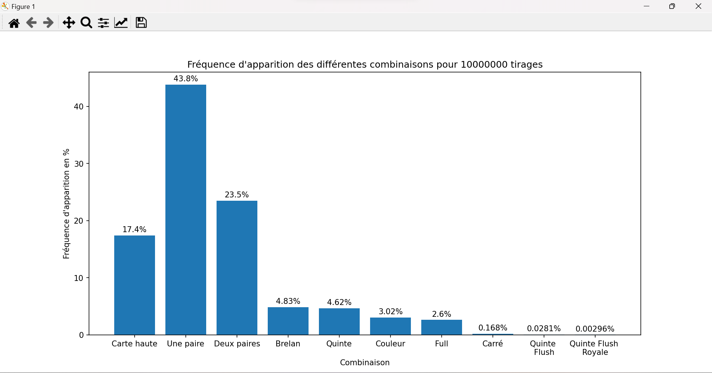
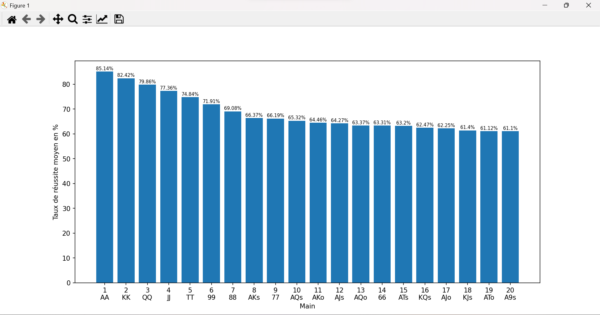
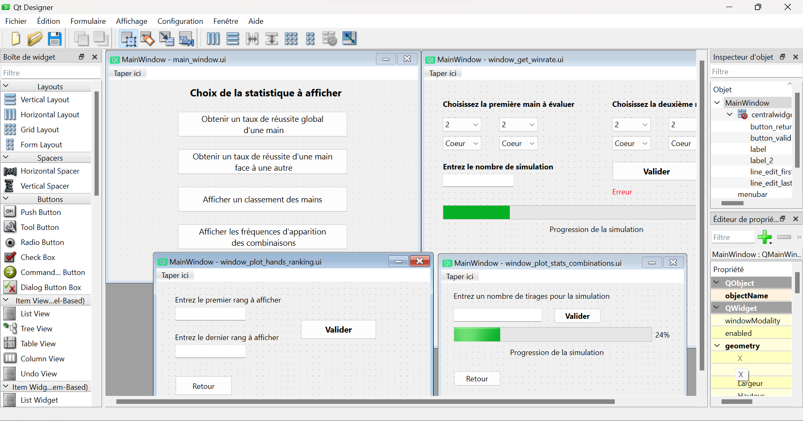
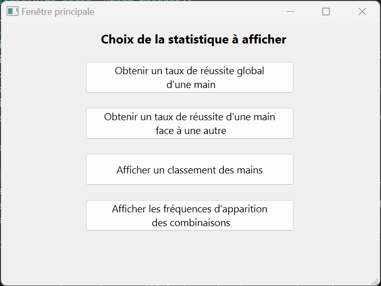
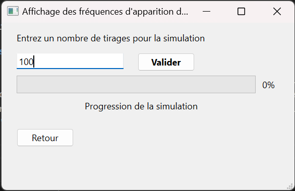
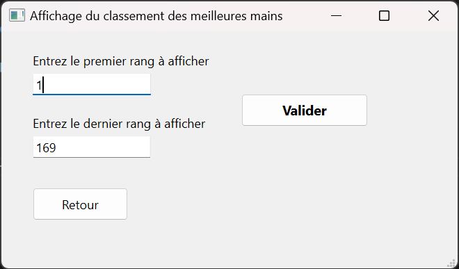


Connaissance basique de la programmation objet avec Python et des règles du jeu du poker. Connaissance du [module Qt pour Python](../../mon/temps-1.1)


## Introduction

Le poker est un jeu de carte très répandu et populaire. On le trouve dans tous les casinos et ce jeu est très complexe a comprendre en profondeur. Il y a tout un aspect mathématique et probabiliste autour du jeu et qui est très important à comprendre pour devenir fort à ce jeu. Ce POK traitera donc de cette dimension, et présentera donc des programmes Python pour calculer différents aspects du poker (variante Texas Hold'em). Le lecteur doit avoir une vague connaissance des règles du poker (notamment les combinaisons des cartes), et les termes plus techniques seront expliqué en temps voulu.

Le premier sprint sera dédié à l'écriture des méthodes de bases pour implémenter les différentes structures de données relatives au jeu de poker. Nous allons ensuite les utiliser pour montrer et représenter des premières statistiques sur ce jeu, en les mettant en forme grâce à diverses interfaces graphiques. Ensuite, le deuxième sprint utilisera les méthodes écrites lors du premier sprint pour élaborer une interface d'aide au jeu. Cette interface conseillera le joueur sur la décision à prendre selon la situation actuelle du jeu.

## Backlog du premier sprint

Comme mentionné dans l'introduction, ce premier sprint aura pour objectif de créer des interfaces graphiques pour présenter des statistiques sur le jeu. Voici le backlog de ce premier sprint, ainsi que leurs complexités et leurs temps de réalisation estimé:

- Implémentation des structures de données de base, ainsi que leurs méthodes associées (cartes, jeu de carte, pioche...): **1, 15min**
- Implémentation de la méthode pour déterminer la combinaison d'une main: **3, 1h**
- Implémentation de la méthode pour avoir toutes les mains possibles: **1, 15min**
- Implémentation de la méthode pour déterminer le gagnant entre deux mains: **2, 45min**
- Implémentation de la méthode pour obtenir différents taux de réussite: **3, 1h15**
- Réalisation de tests pour vérifier le bon fonctionnement des méthodes, débogage: **3, 1h30**
- Réalisation et design des fenêtres pour les interfaces graphiques: **3, 2h**
- Création du backend des interfaces: **2, 2h**
- Tests et débogage des interfaces: **2, 1h**

## Implémentation du code pour effectuer les simulations

### Structures de données de base

La première étape de ce projet est de créer les structures de données de base qui vont être utilisées tout le long de ce projet. Il faut donc créer une classe **Card**, dont les objets représenteront les différentes cartes. Ces objets auront donc les attributs suivant:

- *value*: correspond à la valeur de la carte (11 pour le Valet, 12 pour la Dame, 13 pour le Roi et 14 pour l'As)
- *suit*: correspond à la couleur de la carte (coeur, carreau, trèfle ou pique)
- *name*: correspond au nom de la carte ("As de coeur, "3 de pique", "Dame de carreau" etc...)



```python
class Card():
  def __init__(self, value, suit):
      self.value = value
      self.suit = suit
      if value == 14:
          self.name = "As de " + suit
      elif value == 13:
          self.name = "Roi de " + suit
      elif value == 12:
          self.name = "Dame de " + suit
      elif value == 11:
          self.name = "Valet de " + suit
      else:
          self.name = f"{value} de " + suit
```



Ensuite, on créé une classe **Poker_methods** qui, comme son nom l'indique, contiendra toutes les méthodes pour effectuer les simulations. L'initialisation de cette classe crée un jeu de 52 cartes, qui est une liste contenant 52 objets de la classe **Card**. Lors de cette étape, on crée aussi une liste contenant les 1326 mains de départ distinctes possibles (52*51) et les 169 mains possibles si l'on exclut les mains de même valeur. En effet, en termes de probabilités, deux mains qui ont les deux mêmes valeurs et une combinaison de couleur similaire ont la m$eme valeur. Par exemple, la main 3 de coeur - 6 de carreau et 3 de pique - 6 de trèfle ont la même valeur, tout comme les mains Roi de pique - Dame de pique et Roi de carreau - Dame de carreau.



```python
def __init__(self):
  self.restart_deck()
  self.all_possible_hands = self.get_all_possible_hands()
  self.all_possible_hands_2 = self.get_all_possible_hands_2()

def restart_deck(self):
  self.deck = []
  for value in range(2, 15):
    for suit in ["coeur", "carreau", "trèfle", "pique"]:
      self.deck.append(Card(value, suit))

def get_all_possible_hands(self):
  all_possible_hands = []
  list_card_names = []
  suits = ["coeur", "carreau", "trèfle", "pique"]
  values = range(2,15)
  for first_suit in suits:
    for first_value in values:
      first_card = Card(first_value, first_suit)
      for second_suit in suits:
        for second_value in values:
          second_card = Card(second_value, second_suit)
          if first_card.name != second_card.name and [second_card.name, first_card.name] not in list_card_names:
            all_possible_hands.append([first_card, second_card])
            list_card_names.append([first_card.name, second_card.name])
  return(all_possible_hands)

def get_all_possible_hands_2(self):
  all_possible_hands_2 = []
  values = range(2,15)
  for first_value in values:
      for second_value in range(first_value, 15):
          first_card = Card(first_value, "coeur")
          second_card = Card(second_value, "coeur")
          if first_card.name != second_card.name:
              if first_value > second_value:
                  all_possible_hands_2.append([first_card, second_card])
              else:
                  all_possible_hands_2.append([second_card, first_card])
          first_card = Card(first_value, "coeur")
          second_card = Card(second_value, "pique")
          if first_card.name != second_card.name:
              if first_value > second_value:
                  all_possible_hands_2.append([first_card, second_card])
              else:
                  all_possible_hands_2.append([second_card, first_card])
  return(all_possible_hands_2)
```



On crée ensuite une méthode qui permet de piocher une carte du jeu de carte. Cette méthode choisit une carte aléatoirement et la retire de l'attribut *deck* de l'objet.



```python
def draw(self):
  index = rd.randint(0, len(self.deck) - 1)
  card = self.deck[index]
  self.deck.pop(index)
  return(card)
```



### Implémentation des méthodes pour effectuer les simulations

Maintenant que l'on a implémenter les méthodes de base pour manipuler les structures de données, nous allons implémenter les fonctions pour faire les simulations. La première méthode est celle qui va permettre de déterminer le score d'un joueur, étant donné sa main de deux cartes et le tableau en cours de 5 cartes. Cette méthode prend donc en argument ces deux éléments et renvoie un score variant de 0 à 9, correspondant à une combinaison de mains (de carte haute à Quinte Flush Royale). Cette méthode retourne également une liste contenant les "kickers" de la main évaluée. Cette liste va permettre de départager deux joueurs si jamais ils ont la même main. Par exemple, si les deux joueurs ont une Couleur, il faut regarder la valeur de la carte la plus élevée pour les départager.



```python
def get_score(self, player_hand, board):
        # 0 = Carte haute
        # 1 = Une paire
        # 2 = Deux paires
        # 3 = Brelan
        # 4 = Quinte
        # 5 = Couleur
        # 6 = Full
        # 7 = Carré
        # 8 = Quinte Flush
        # 9 = Quinte Flush Royale
        cards = player_hand + board
        values = [card.value for card in cards]
        suits = [card.suit for card in cards]
        list_values = list(set(values))
        list_suits = list(set(suits))
        list_count_values = []
        list_count_suits = []
        for value in list_values:
            list_count_values.append(values.count(value))
        for suit in list_suits:
            list_count_suits.append(suits.count(suit))
        if (3 in list_count_values and 2 in list_count_values) : # Premier cas du Full
            index_first_kicker = list_count_values.index(3)
            index_second_kicker = [i for i in range(len(list_count_values)) if list_count_values[i] == 2]
            first_kicker = list_values[index_first_kicker]
            list_candidates = [list_values[index] for index in index_second_kicker]
            second_kicker = max(list_candidates)
            return(6, [first_kicker, second_kicker])
        elif (list_count_values.count(3) == 2): # Deuxième cas du Full
            index_first_kicker = [i for i in range(len(list_count_values)) if list_count_values[i] == 3]
            list_candidates = [list_values[index] for index in index_first_kicker]
            first_kicker = max(list_candidates)
            second_kicker = min(list_candidates)
            return(6, [first_kicker, second_kicker])
        elif 4 in list_count_values: # Carré
            index_first_kicker = list_count_values.index(4)
            index_second_kicker = [i for i in range(len(list_count_values)) if list_count_values[i] != 4]
            list_candidates = [list_values[index] for index in index_second_kicker]
            second_kicker = max(list_candidates)
            first_kicker = list_values[index_first_kicker]
            return(7, [first_kicker, second_kicker])
        elif 5 in list_count_suits or 6 in list_count_suits or 7 in list_count_suits: # Couleur
            if 5 in list_count_suits:
                index_winner_suit = list_count_suits.index(5)
            elif 6 in list_count_suits:
                index_winner_suit = list_count_suits.index(6)
            elif 7 in list_count_suits:
                index_winner_suit = list_count_suits.index(7) 
            winner_suit = list_suits[index_winner_suit]
            list_candidates = [cards[i].value for i in range(len(cards)) if cards[i].suit == winner_suit]
            list_candidates_removed = list(set(list_candidates))
            if len(list_candidates_removed) >= 5:
                if 14 not in list_candidates_removed:
                    values_sorted = sorted(list_candidates_removed, reverse = True)
                    for k in range(len(list_candidates_removed) - 4):
                        current_list = values_sorted[k:k+5]
                        if sorted(current_list, reverse = True) == list(range(min(current_list), max(current_list) + 1))[::-1]:
                            return(8, sorted(current_list, reverse = True))
                    return(5, sorted(list_candidates, reverse = True)[:5])
                elif 14 in list_candidates_removed:
                    values_sorted = sorted(list_candidates_removed, reverse = True)
                    for k in range(len(list_candidates_removed) - 4):
                        current_list = values_sorted[k:k+5]
                        if sorted(current_list, reverse = True) == list(range(min(current_list), max(current_list) + 1))[::-1]:
                            if sorted(current_list, reverse = True)[0] == 14:
                                return(9, sorted(current_list, reverse = True))
                            return(8, sorted(current_list, reverse = True))
                    new_values = [element if element != 14 else 1 for element in list_candidates_removed]
                    values_sorted = sorted(new_values, reverse = True)
                    for k in range(len(list_candidates_removed) - 4):
                        current_list = values_sorted[k:k+5]
                        if sorted(current_list, reverse = True) == list(range(min(current_list), max(current_list) + 1))[::-1]:
                            if sorted(current_list, reverse = True)[0] == 14:
                                return(9, sorted(current_list, reverse = True))
                            return(8, sorted(current_list, reverse = True))
                    return(5, sorted(list_candidates, reverse = True)[:5])
        if len(list_values) >= 5: # Quinte
            if 14 not in list_values:
                values_sorted = sorted(list_values, reverse = True)
                for k in range(len(list_values) - 4):
                    current_list = values_sorted[k:k+5]
                    if sorted(current_list, reverse = True) == list(range(min(current_list), max(current_list) + 1))[::-1]:
                        return(4, sorted(current_list, reverse = True))
            elif 14 in list_values:
                values_sorted = sorted(list_values, reverse = True)
                for k in range(len(list_values) - 4):
                    current_list = values_sorted[k:k+5]
                    if sorted(current_list, reverse = True) == list(range(min(current_list), max(current_list) + 1))[::-1]:
                        return(4, sorted(current_list, reverse = True))
                new_values = [element if element != 14 else 1 for element in list_values]
                values_sorted = sorted(new_values, reverse = True)
                for k in range(len(list_values) - 4):
                    current_list = values_sorted[k:k+5]
                    if sorted(current_list, reverse = True) == list(range(min(current_list), max(current_list) + 1))[::-1]:
                        return(4, sorted(current_list, reverse = True))
        if 3 in list_count_values: # Brelan
            index_first_kicker = [i for i in range(len(list_count_values)) if list_count_values[i] == 3]
            list_candidates = [list_values[index] for index in index_first_kicker]
            first_kicker = max(list_candidates)
            index_second_kicker = [i for i in range(len(list_count_values)) if list_count_values[i] != 3]
            list_candidates = [list_values[index] for index in index_second_kicker]
            list_kickers = sorted(list_candidates, reverse = True)
            return(3, [first_kicker] + list_kickers[:2])
        elif list_count_values.count(2) >= 2: # Deux paires
            index_first_kicker = [i for i in range(len(list_count_values)) if list_count_values[i] == 2]
            list_candidates = [list_values[index] for index in index_first_kicker]
            list_first_kickers = sorted(list_candidates, reverse = True)
            index_second_kicker = [i for i in range(len(list_count_values)) if list_count_values[i] != 2]
            list_candidates = [list_values[index] for index in index_second_kicker]
            list_kickers = sorted(list_candidates, reverse = True)
            return(2, list_first_kickers[:2] + list_kickers[:1])
        elif list_count_values.count(2) == 1: # Une paire
            index_first_kicker = list_count_values.index(2)
            first_kicker = list_values[index_first_kicker]
            index_second_kicker = [i for i in range(len(list_count_values)) if list_count_values[i] != 2]
            list_candidates = [list_values[index] for index in index_second_kicker]
            list_kickers = sorted(list_candidates, reverse = True)
            return(1, [first_kicker] + list_kickers[:3])
        else: # Carte haute
            return(0, sorted(values, reverse = True)[:5])
```



Cette méthode est assez longue à expliquer, mais voici quelques idées importantes:

- Utilisation de la commande `list(set())` qui permet d'obtenir une liste qui contient tout les éléments d'une liste, mais sans les doublons. Cette technique est très pratique pour détecter les paires, les doubles paires, les brelans, les fulls, les carrés et les couleurs.
- Il est important de vérifier les types de combinaisons dans l'ordre décroissant de leur valeur. Il faut par exemple traiter le cas du carré avant celui du full, et le cas de la couleur avant celui de la suite.
- Il faut trier les kickers dans l'ordre décroissant, pour faciliter le cas de l'égalité entre deux joueurs.

Il faut ensuite implémenter les méthodes pour déterminer le gagnant entre deux joueurs, étant donné leurs mains et le tableau en cours. Pour cela, on utilise la méthode *get_score* et on compare les scores des deux joueurs. Si le score est le même, on les départage grâce à la liste des kickers. On s'aide d'une autre méthode (*get_list_compare*) qui compare les éléments de deux listes un par un. Cette méthode renvoie *True* si la première main renseignée est gagnante, renvoie *False* si elle est perdante et renvoie *None* s'il y a égalité.



```python
def do_first_player_win(self, player1_hand, player2_hand, board):
  score_player1, kickers_player1 = self.get_score(player1_hand, board)
  score_player2, kickers_player2 = self.get_score(player2_hand, board)
  if score_player1 > score_player2:
    return(True)
  elif score_player1 < score_player2:
    return(False)
  else: # Cas de l'égalité
    list_compare = self.get_list_compare(kickers_player1, kickers_player2, score_player1)
    for element in list_compare:
      if element != None:
        return(element)
    return(None)

def get_list_compare(self, kickers_player1, kickers_player2, score):
  list_compare = []
  for k in range(len(kickers_player1)):
    if kickers_player1[k] == kickers_player2[k]:
      list_compare.append(None)
    else:
      list_compare.append(kickers_player1[k] > kickers_player2[k])
  return(list_compare)
```



On va ensuite utiliser cette méthode pour déterminer des taux de réussite moyens. Le premier taux de réussite à calculer et celui d'une main contre une autre. On va simplement simuler N parties et on va récolter le nombre de fois où la première main gagne grâce à la méthode *do_first_player_win*. On peut ensuite implémenter une fonction qui donne le taux de réussite moyen d'une main. Pour cela, on effectue N simulations entre une main et les 1326 mains possibles, stockées dans l'attribut *all_possible_hands*.



```python
def get_winrate(self, player1_hand, player2_hand, N):
  players_cards = []
  for k in range(2):
      players_cards.append(player1_hand[k].name)
      players_cards.append(player2_hand[k].name)
  current_deck = [card for card in self.deck if card.name not in players_cards]
  tot_wins_player1 = 0
  tot_wins_player2 = 0
  tot_draws = 0
  for k in range(N):
      board = []
      deck = current_deck[:]
      for i in range(5):
          index = rd.randint(0, len(deck) - 1)
          card = deck[index]
          deck.pop(index)
          board.append(card)
      result = self.do_first_player_win(player1_hand, player2_hand, board)
      if result == None:
          tot_draws += 1
      elif result:
          tot_wins_player1 += 1
      elif not result:
          tot_wins_player2 += 1
  return(round(tot_wins_player1/N * 100, sigfigs = 3), round(tot_wins_player2/N * 100, sigfigs = 3), round(tot_draws/N * 100, sigfigs = 3))

def get_average_winrate(self, hand, N):
  tot_winrate = 0
  winrates = []
  for possible_hand in tqdm(self.all_possible_hands, desc = "Progression de la boucle secondaire: ", position = 1, leave = False):
      if [hand[0].name, hand[1].name] != [possible_hand[0].name, possible_hand[1].name] and [hand[1].name, hand[0].name] != [possible_hand[0].name, possible_hand[1].name]:
          result = self.get_winrate(hand, possible_hand, N)[0]
          tot_winrate += result
          winrates.append(result)
      else:
          winrates.append(None)
  return(round(tot_winrate / (len(self.all_possible_hands) - 1), sigfigs = 4), winrates)
```



Enfin, on créé une dernière méthode qui va obtenir les taux de réussite de toutes les 169 mains distinctes, afin de déterminer un classement des meilleures mains. On va simplement appliquer la méthode précédente sur toutes les mains de l'attribut *all_possible_hands_2*.



```python
def get_all_average_winrates(self, N):
  all_average_winrates = []
  all_average_winrates_detail = []
  for hand in tqdm(self.all_possible_hands_2, desc = "Progression de la boucle principale", position = 0):
      winrate, winrates_list = self.get_average_winrate(hand, N)
      first_value = str(hand[0].value)
      second_value = str(hand[1].value)
      if first_value == "10":
          first_value = "T"
      elif first_value == "11":
          first_value = "J"
      elif first_value == "12":
          first_value = "Q"
      elif first_value == "13":
          first_value = "K"
      elif first_value == "14":
          first_value = "A"
      if second_value == "10":
          second_value = "T"
      elif second_value == "11":
          second_value = "J"
      elif second_value == "12":
          second_value = "Q"
      elif second_value == "13":
          second_value = "K"
      elif second_value == "14":
          second_value = "A"
      if hand[0].value == hand[1].value:
          hand_name = first_value + second_value
      elif hand[0].suit == hand[1].suit:
          hand_name = first_value + second_value + "s"
      elif hand[0].suit != hand[1].suit:
          hand_name = first_value + second_value + "o"
      all_average_winrates.append([hand_name, winrate])
      all_average_winrates_detail.append([hand_name, winrates_list])
  return(all_average_winrates, all_average_winrates_detail)
```



## Présentation des résultats

L'implémentation de la classe **Poker_methods** permet de réaliser des statistiques sur le jeu de poker. Pour les représenter, on créé une nouvelle classe **Plot_stats** qui contiendra des méthodes pour représenter ces résultats. Cette classe hérite de la classe **Poker_methods**, pour pouvoir utiliser toutes ses méthodes.

### Fréquence d'apparitions des combinaisons

Le premier résultat à représenter est la fréquence d'apparition des combinaisons. Pour cela, on va effectuer N simulations. Lors de chaque simulation, on va piocher 7 différentes cartes (2 cartes pour la main du joueur et 5 cartes pour le tableau en cours) et on va déterminer son score grâce à la méthode *get_score*. On stocke ainsi ce score, et on représente le résultat sur un graphique en barres grâce au module *matplotlib.pyplot*



```python
def plot_stats_combinations(self, N):
  combinations_type = ("Carte haute", "Une paire", "Deux paires", "Brelan", "Quinte", "Couleur", "Full", "Carré", "Quinte \nFlush", "Quinte Flush \nRoyale")
  results = [0 for i in range(len(combinations_type))]
  self.progress_plot_stats_combinations = 0
  for k in tqdm(range(N), desc = "Progression de la simulation: "):
      self.progress_plot_stats_combinations = (k / N) * 100
      player_hand = []
      board = []
      for i in range(2):
          card = self.draw()
          player_hand.append(card)
      for i in range(5):
          card = self.draw()
          board.append(card)
      score = self.get_score(player_hand, board)[0]
      results[score] += 1
      self.restart_deck()
  results = [round(element/N * 100, sigfigs = 3) for element in results]
  ax = plt.axes()
  X = np.arange(len(combinations_type))
  ax.set_xticks(X, combinations_type)
  for i in range(len(X)):
      plt.text(i, results[i] + 0.6,f"{results[i]}%", ha = "center")
  plt.title(f"Fréquence d'apparition des différentes combinaisons pour {N} tirages")
  ax.set_xlabel("Combinaison")
  ax.set_ylabel("Fréquence d'apparition en %")
  plt.bar(X, results)
  plt.show()
```



Le résultat de cette simulation pour 10 millions de simulations est le suivant:



Ces résultats concordent presque parfaitement aux résultats théoriques que l'on peut retrouver sur cette [page Wikipédia dédiée](https://en.wikipedia.org/wiki/Poker_probability).

### Classement des mains

On peut ensuite utiliser la méthode *get_all_average_winrates* pour avoir les taux de réussite associés à chacune des 169 mains distinctes possibles. Cette simulation est très lourde en calcul, puisqu'il faut confronter N fois chacune des 169 mains aux 1326 mains possibles. J'ai donc fait tourner le programme avec N = 5000 (ce qui fait plus d'1 milliard de simulations) et j'ai stocké ces résultats dans un fichier json qui sera chargé dans l'initialisation de la classe **Poker_methods**. Cette simulation a tourné pendant presque 8 heures. On crée donc une méthode pour afficher ces résultats. Il faut préciser le premier ran à afficher ainsi que le dernier, car il est impossible d'afficher les 169 mains sur un même graphique en barre sans que cela ne soit illisible.



```python
def plot_hands_ranking(self, first_rank, last_rank):
  hands = [f"{i+1}\n{self.all_average_winrates5[i][0]}" for i in range(len(self.all_average_winrates5))]
  hands_extract = hands[first_rank - 1:last_rank]
  results = [hand[1] for hand in self.all_average_winrates5]
  results_extract = results[first_rank - 1:last_rank]
  ax = plt.axes()
  X = np.arange(len(hands_extract))
  ax.set_xticks(X, hands_extract)
  for i in range(len(X)):
      plt.text(i, results_extract[i] + 0.6,f"{results_extract[i]}%", ha = "center", fontsize = 7)
  ax.set_xlabel("Main")
  ax.set_ylabel("Taux de réussite moyen en %")
  plt.bar(X, results_extract)
  plt.show()
```



Voici le classement des 20 meilleures mains obtenues:



La lettre T correspond au 10. La lettre "s" signifie que les deux cartes sont de la même couleur (de l'anglais "suited") et la lettre "o" signifie que les deux cartes ne sont pas de la même couleur (de l'anglais "offsuit"). On retrouve bien la paire d'As qui est la meilleure main de départ, suivie de près les paires de Rois et de Dames.

## Création des interfaces graphiques

Maintenant que l'on a tout les outils pour faire des simulations, on va à présent implémenter des interfaces graphiques pour interagir avec ces méthodes. Nous allons utiliser le module Qt de Python.

Il faut tout d'abord designer les différentes fenêtres que l'utilisateur pourra utiliser. On utilise pour cela le logiciel Qt Designer, et on opte pour des designs simples. Voici un aperçu des 4 fenêtres dans le logiciel:



On créé ensuite une nouvelle classe **UI_stats** qui contiendra toutes les méthodes pour afficher les interfaces graphiques. Cette classe hérite des classes **Poker_methods** et **Plot_stats**. L'initialisation de cette classe permet de récupérer tout les éléments des interfaces designées (boutons, textes, barres de progression etc...) afin de les assigner à des attributs de notre classe. Les noms de ces attributs doivent être bien distinctes.



```python
class UI_stats(Plot_stats, Poker_methods):
    def __init__(self):
        super().__init__()
        ui_file_name = "main_window.ui"
        ui_file = QFile(ui_file_name)
        loader = QUiLoader()
        self.main_window = loader.load(ui_file)
        ui_file.close()
        self.main_window.show()

        self.main_window.setWindowTitle("Fenêtre principale")
        self.button_plot_stats_combinations = self.main_window.findChild(QPushButton, "Button_plot_stats_combinations")
        self.button_plot_hands_ranking = self.main_window.findChild(QPushButton, "Button_plot_hands_ranking")
        self.button_get_winrate = self.main_window.findChild(QPushButton, "Button_get_winrate")
        self.button_get_average_winrate = self.main_window.findChild(QPushButton, "Button_get_average_winrate")

        self.button_plot_stats_combinations.clicked.connect(self.show_window_plot_stats_combinations)
        self.button_plot_hands_ranking.clicked.connect(self.show_window_hands_ranking)
        self.button_get_winrate.clicked.connect(self.show_window_get_winrate)

        ui_file_name2 = "window_plot_stats_combinations.ui"
        ui_file2 = QFile(ui_file_name2)
        loader2 = QUiLoader()
        self.window_plot_stats_combinations = loader2.load(ui_file2)
        ui_file2.close()
        self.window_plot_stats_combinations.setWindowTitle("Affichage des fréquences d'apparition des mains")

        self.line_edit_plot_stats_combinations = self.window_plot_stats_combinations.findChild(QLineEdit, "line_edit_plot_stats_combinations")
        self.button_valider_plot_stats_combinations = self.window_plot_stats_combinations.findChild(QPushButton, "button_valider_plot_stats_combinations")
        self.button_return_window_plot_stats_combinations = self.window_plot_stats_combinations.findChild(QPushButton, "button_return")
        self.progress_bar_plot_stats_combinations = self.window_plot_stats_combinations.findChild(QProgressBar, "progress_bar_plot_stats_combinations")
        self.progress_bar_plot_stats_combinations.setValue(0)

        onlyInt = QIntValidator()
        self.line_edit_plot_stats_combinations.setValidator(onlyInt)
        self.line_edit_plot_stats_combinations.textChanged.connect(self.line_edit_plot_stats_combinations_changed)
        self.line_edit_plot_stats_combinations.setText("100")
        self.button_valider_plot_stats_combinations.clicked.connect(self.valider_plot_stats_combinations)
        self.button_return_window_plot_stats_combinations.clicked.connect(self.return_main_window)
        self.N_plot_stats_combinations = 100


        ui_file_name3 = "window_plot_hands_ranking.ui"
        ui_file3 = QFile(ui_file_name3)
        loader3 = QUiLoader()
        self.window_plot_hands_ranking = loader3.load(ui_file3)
        ui_file3.close()
        self.window_plot_hands_ranking.setWindowTitle("Affichage du classement des meilleures mains")

        self.last_rank = 169        
        self.first_rank = 1
        self.button_valider_plot_hands_ranking = self.window_plot_hands_ranking.findChild(QPushButton, "button_valider_plot_hands_ranking")
        self.button_valider_plot_hands_ranking.clicked.connect(self.valider_plot_hands_ranking)
        self.line_edit_plot_hands_ranking_first_rank = self.window_plot_hands_ranking.findChild(QLineEdit, "line_edit_first_rank")
        self.line_edit_plot_hands_ranking_first_rank.setValidator(onlyInt)
        self.line_edit_plot_hands_ranking_first_rank.textChanged.connect(self.line_edit_plot_hands_ranking_first_rank_changed)
        self.line_edit_plot_hands_ranking_first_rank.setText("1")
        self.line_edit_plot_hands_ranking_last_rank = self.window_plot_hands_ranking.findChild(QLineEdit, "line_edit_last_rank")
        self.line_edit_plot_hands_ranking_last_rank.setValidator(onlyInt)
        self.line_edit_plot_hands_ranking_last_rank.textChanged.connect(self.line_edit_plot_hands_ranking_last_rank_changed)
        self.line_edit_plot_hands_ranking_last_rank.setText("169")
        self.button_return_plot_hands_ranking = self.window_plot_hands_ranking.findChild(QPushButton, "button_return_plot_hands_ranking")
        self.button_return_plot_hands_ranking.clicked.connect(self.return_main_window)

        ui_file_name4 = "window_get_winrate.ui"
        ui_file4 = QFile(ui_file_name4)
        loader4= QUiLoader()
        self.window_get_winrate = loader4.load(ui_file4)
        ui_file4.close()
        self.window_get_winrate.setWindowTitle("Affichage d'un taux de réussite")

        self.button_valider_get_winrate = self.window_get_winrate.findChild(QPushButton, "button_valider_get_winrate")
        self.button_valider_get_winrate.clicked.connect(self.valider_get_winrate)
        self.card1_player1 = self.window_get_winrate.findChild(QComboBox, "card1_player1")
        self.card2_player1 = self.window_get_winrate.findChild(QComboBox, "card2_player1")
        self.suit1_player1 = self.window_get_winrate.findChild(QComboBox, "suit1_player1")
        self.suit2_player1 = self.window_get_winrate.findChild(QComboBox, "suit2_player1")
        self.card1_player2 = self.window_get_winrate.findChild(QComboBox, "card1_player2")
        self.card2_player2 = self.window_get_winrate.findChild(QComboBox, "card2_player2")
        self.suit1_player2 = self.window_get_winrate.findChild(QComboBox, "suit1_player2")
        self.suit2_player2 = self.window_get_winrate.findChild(QComboBox, "suit2_player2")
        self.progress_bar_get_winrate = self.window_get_winrate.findChild(QProgressBar, "progress_bar_get_winrate")
        self.result_get_winrate = self.window_get_winrate.findChild(QLabel, "result_simulation_get_winrate")
        self.line_edit_get_winrate = self.window_get_winrate.findChild(QLineEdit, "line_edit_get_winrate")
        self.line_edit_get_winrate.setValidator(onlyInt)
        self.line_edit_get_winrate.textChanged.connect(self.line_edit_get_winrate_changed)
        self.line_edit_get_winrate.setText("100")
        self.N_get_winrate = 100
        self.label_erreur_get_winrate = self.window_get_winrate.findChild(QLabel, "label_erreur_get_winrate")
        self.label_erreur_get_winrate.setText("")
        self.button_return_get_winrate = self.window_get_winrate.findChild(QPushButton, "button_return_get_winrate")
        self.button_return_get_winrate.clicked.connect(self.return_main_window)
```



### Fenêtre principale

La première fenêtre à faire est la fenêtre principale, qui agira comme un menu pour l'utilisateur. Cette fenêtre comporte pour l'instant 4 boutons qui mèneront chacun sur une autre fenêtre, en fonction de la statistique à afficher.



### Affichage des fréquences d'apparition des combinaisons

Ensuite, on crée la fenêtre pour afficher les fréquences d'apparition des combinaisons. Pour cela, on reprend simplement le code présenté précédemment, en rajoutant une variable qui suit la progression de la boucle, pour actualiser la barre de progression. Voici la fenêtre qui apparaît lorsque l'on clique sur le bouton "Afficher les fréquences d'apparition des combinaisons":



L'utilisateur peur renseigner le nombre de simulations qu'il souhaite effectuer, ensuite la barre de progression évolue puis le graphique est affiché.

### Affichage du classement des meilleures mains

Cette fenêtre permet à l'utilisateur de visualiser le classement des meilleures mains. Encore une fois, on réutilise le code précédemment réalisé, et on récupère les informations renseignées par l'utilisateur dans les champs textuels grâce aux méthodes *line_edit_plot_hands_ranking_first_rank_changed* et *line_edit_plot_hands_ranking_last_rank_changed*.



```python
def line_edit_plot_hands_ranking_first_rank_changed(self, value):
    if value != '':
        self.first_rank = int(value)
        if self.first_rank > self.last_rank:
            self.button_valider_plot_hands_ranking.setEnabled(False)
        else:
            self.button_valider_plot_hands_ranking.setEnabled(True)
    else:
        self.button_valider_plot_hands_ranking.setEnabled(False)

def line_edit_plot_hands_ranking_last_rank_changed(self, value):
    if value != '':
        self.last_rank = int(value)
        if self.first_rank > self.last_rank:
            self.button_valider_plot_hands_ranking.setEnabled(False)
        else:
            self.button_valider_plot_hands_ranking.setEnabled(True)
    else:
        self.button_valider_plot_hands_ranking.setEnabled(False)
```



La fenêtre affichée est donc la suivante:



L'utilisateur peut rentrer le premier rang qu'il veut afficher et le dernier rang.

### Affichage du taux de réussite d'une main face à une autre

La dernière fenêtre implémentée est celle qui permet au joueur d'obtenir le taux de réussite d'une main face à une autre. La sélection des 4 cartes se fait grâce à des menus déroulants. On doit vérifier que plusieurs cartes n'ont pas été choisies deux fois, sinon on affiche un message d'erreur. Enfin, l'utilisateur choisit un nombre de simulations souhaité, et on réutilise la méthode précédente en suivant la progression de la boucle.



```python
def valider_get_winrate(self):
    if self.card1_player1.currentText() == "As":
        value1_player1 = 14
    elif self.card1_player1.currentText() == "Roi":
        value1_player1 = 13
    elif self.card1_player1.currentText() == "Dame":
        value1_player1 = 12
    elif self.card1_player1.currentText() == "Valet":
        value1_player1 = 11
    else:
        value1_player1 = int(self.card1_player1.currentText())
    if self.card1_player2.currentText() == "As":
        value1_player2 = 14
    elif self.card1_player2.currentText() == "Roi":
        value1_player2 = 13
    elif self.card1_player2.currentText() == "Dame":
        value1_player2 = 12
    elif self.card1_player2.currentText() == "Valet":
        value1_player2 = 11
    else:
        value1_player2 = int(self.card1_player2.currentText())

    if self.card2_player1.currentText() == "As":
        value2_player1 = 14
    elif self.card2_player1.currentText() == "Roi":
        value2_player1 = 13
    elif self.card2_player1.currentText() == "Dame":
        value2_player1 = 12
    elif self.card2_player1.currentText() == "Valet":
        value2_player1 = 11
    else:
        value2_player1 = int(self.card2_player1.currentText())
    if self.card2_player2.currentText() == "As":
        value2_player2 = 14
    elif self.card2_player2.currentText() == "Roi":
        value2_player2 = 13
    elif self.card2_player2.currentText() == "Dame":
        value2_player2 = 12
    elif self.card2_player2.currentText() == "Valet":
        value2_player2 = 11
    else:
        value2_player2 = int(self.card2_player2.currentText())
    cards = [self.get_card_name(value1_player1, str(self.suit1_player1.currentText())), self.get_card_name(value2_player1, str(self.suit2_player1.currentText())), self.get_card_name(value1_player2, str(self.suit1_player2.currentText())), self.get_card_name(value2_player2, str(self.suit2_player2.currentText()))]
    cards_removed = list(set(cards))
    if len(cards_removed) == 4:
        self.button_valider_get_winrate.setEnabled(False)
        self.label_erreur_get_winrate.setText("")
        player1_hand = [Card(value1_player1, str(self.suit1_player1.currentText())), Card(value2_player1, str(self.suit2_player1.currentText()))]
        player2_hand = [Card(value1_player2, str(self.suit1_player2.currentText())), Card(value2_player2, str(self.suit2_player2.currentText()))]
        players_cards = []
        for k in range(2):
            players_cards.append(player1_hand[k].name)
            players_cards.append(player2_hand[k].name)
        current_deck = [card for card in self.deck if card.name not in players_cards]
        tot_wins_player1 = 0
        tot_wins_player2 = 0
        tot_draws = 0
        progression = 0
        for k in range(self.N_get_winrate):
            progression += 1
            current_progression = (progression / self.N_get_winrate) * 100
            board = []
            deck = current_deck[:]
            for i in range(5):
                index = rd.randint(0, len(deck) - 1)
                card = deck[index]
                deck.pop(index)
                board.append(card)
            result = self.do_first_player_win(player1_hand, player2_hand, board)
            if result == None:
                tot_draws += 1
            elif result:
                tot_wins_player1 += 1
            elif not result:
                tot_wins_player2 += 1
            self.progress_bar_get_winrate.setValue(current_progression)
        self.result_get_winrate.setText(f"Taux de réussite de la première main: {round(tot_wins_player1/self.N_get_winrate * 100, sigfigs = 3)}% \nTaux de réussite de la deuxième main: {round(tot_wins_player2/self.N_get_winrate * 100, sigfigs = 3)}% \nTaux de parties nulles: {round(tot_draws/self.N_get_winrate * 100, sigfigs = 3)}%")
        self.button_valider_get_winrate.setEnabled(True)
    else:
        self.label_erreur_get_winrate.setText("Au moins une carte se répète")
```




## Bilan du premier sprint et prévisions du deuxième sprint

Les éléments du backlog du premier sprint ont été tous réalisés, sauf un élément qu'il faut ajouter à l'interface graphique ("Obtenir un taux de réussite global d'une main"). Voici un résumé du temps passé sur chaque item du backlog (temps réel effectué après la flèche ->):

- Implémentation des structures de données de base, ainsi que leurs méthodes associées (cartes, jeu de carte, pioche...): **1, 15min** -> **15min**
- Implémentation de la méthode pour déterminer la combinaison d'une main: **3, 1h** -> **1h**
- Implémentation de la méthode pour avoir toutes les mains possibles: **1, 15min** -> **15min**
- Implémentation de la méthode pour déterminer le gagnant entre deux mains: **2, 45min** -> **30min**
- Implémentation de la méthode pour obtenir différents taux de réussite: **3, 1h15** -> **1h**
- Réalisation de tests pour vérifier le bon fonctionnement des méthodes, débogage: **3, 1h30** -> **2h15**
- Réalisation et design des fenêtres pour les interfaces graphiques: **3, 2h** -> **1h30**
- Création du backend des interfaces: **2, 2h** -> **2h45**
- Tests et débogage des interfaces: **2, 1h** -> **1h30**

J'ai donc passé un peu plus de temps que prévu, notamment car j'ai sous estimé la création du backend des interfaces, qui est assez redondante et où il faut rentrer beaucoup d'informations. J'ai été particulièrement lent sur cette partie car elle ne me passionnait pas vraiment. J'ai également passé plus de temps que prévu sur les tests et débogages, car rien ne marchait du premier coup, et je devais vérifier mes résultats avec les résultats théoriques.

Le deuxième sprint sera dédié à la création d'une interface graphique qui assistera le joueur dans ses décisions, en fonction de la situation actuelle du jeu. Ce sprint devra aussi reprendre les quelques éléments que je n'ai pas eu le temps de faire lors du premier sprint. En voici un backlog:

- Reprise des éléments manquants de l'interface graphique du premier sprint: **2, 30min**
- Design des nouvelles interfaces pour l'assistant de jeu: **3, 2h30**
- Création du code implémentant la logique de l'assistant: **5, 3h30**
- Tests de l'assistant: **2, 1h30**
