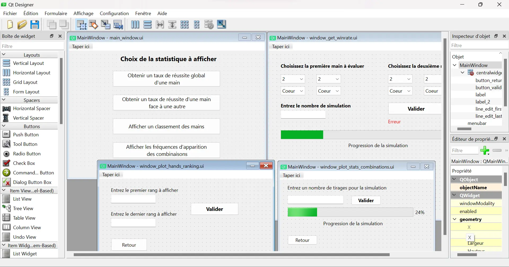
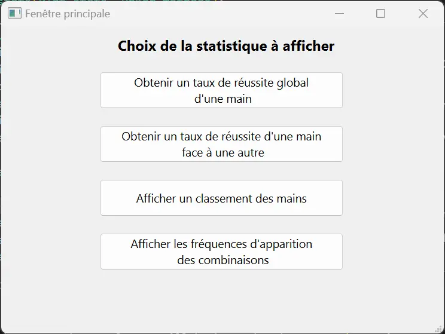
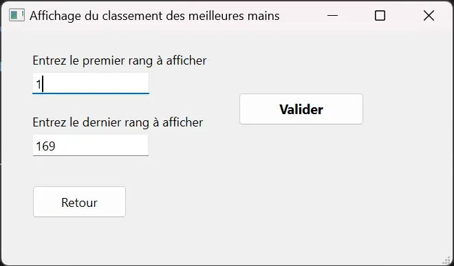
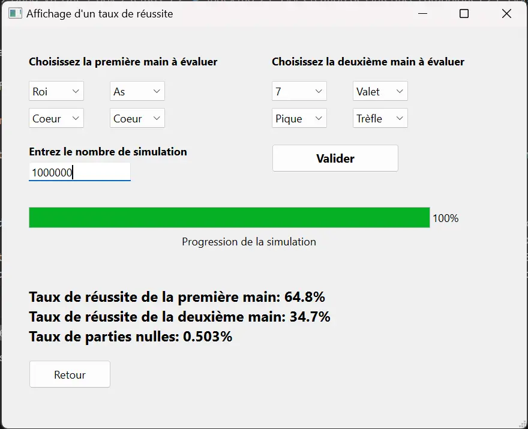
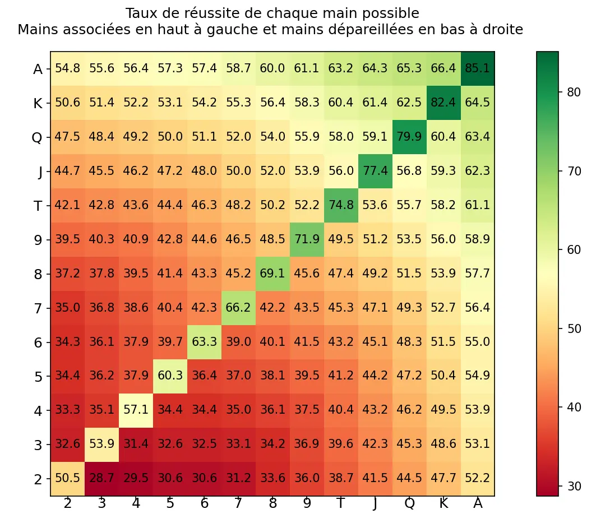
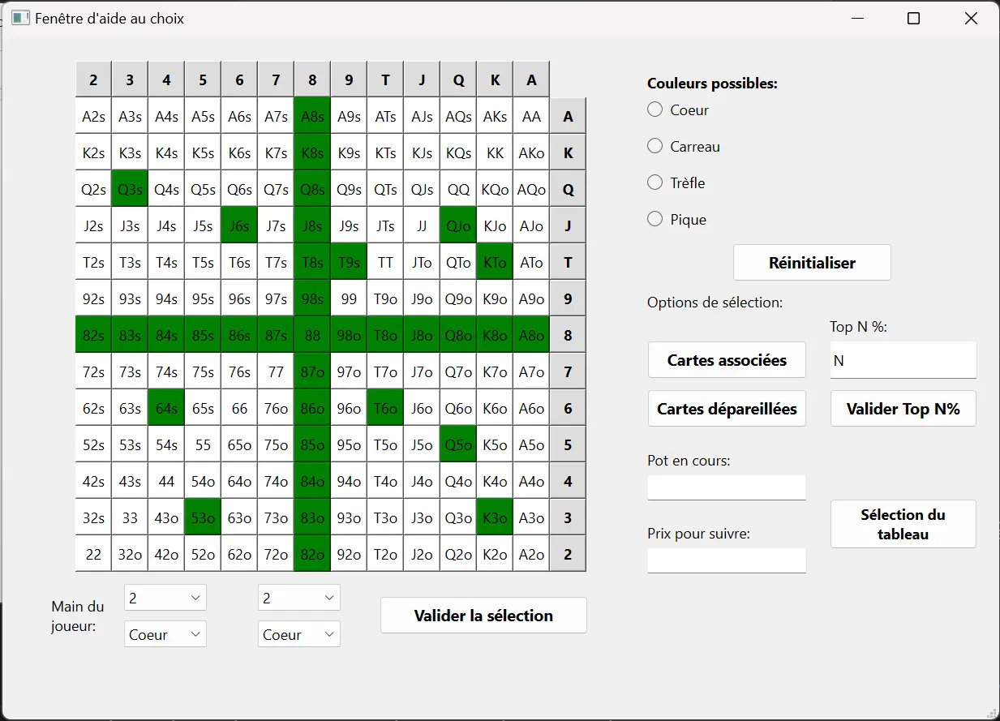
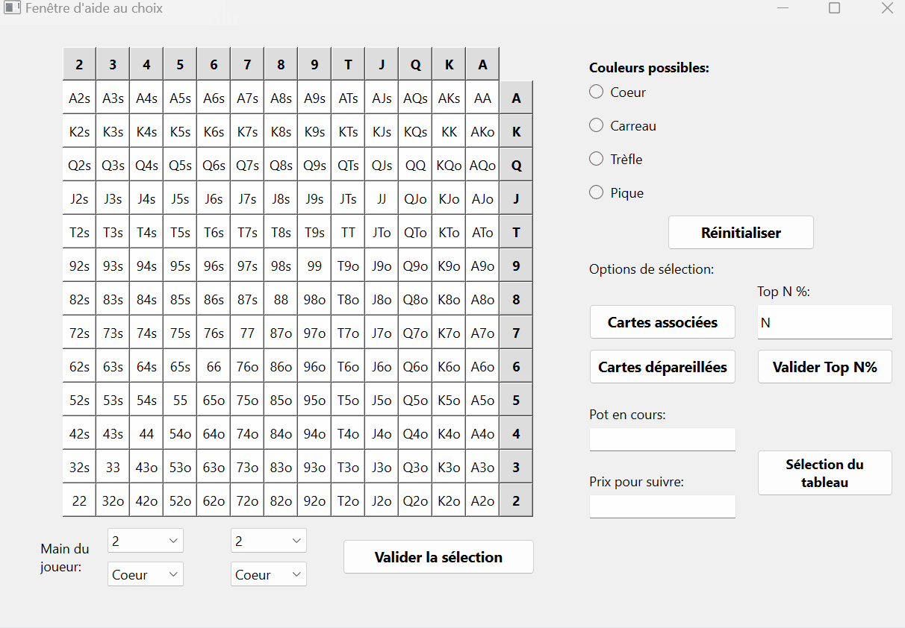
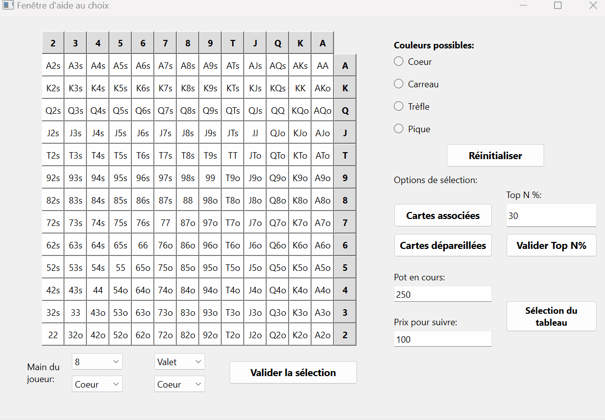
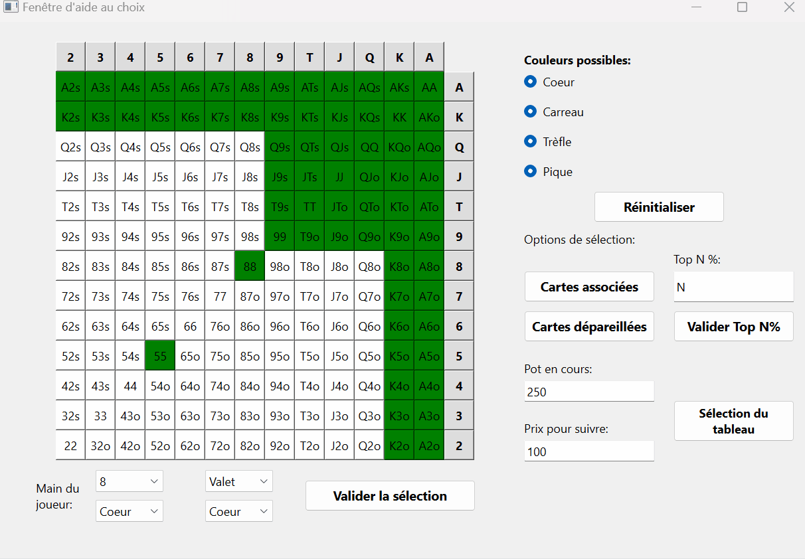


Connaissance basique de la programmation objet avec Python et des règles du jeu du poker. Connaissance du [module Qt pour Python](../../mon/temps-1.1)



Tout les codes présentés sont disponibles dans mon [dossier GitHub de temps 3](https://github.com/FrancoisBrucker/do-it/tree/main/src/promos/2023-2024/Dang-Vu-Duc/pok/temps-3)


## Introduction

Le poker est un jeu de carte très répandu et populaire. On le trouve dans tous les casinos et ce jeu est très complexe a comprendre en profondeur. Il y a tout un aspect mathématique et probabiliste autour du jeu et qui est très important à comprendre pour devenir fort à ce jeu. Ce POK traitera donc de cette dimension, et présentera donc des programmes Python pour calculer différents aspects du poker (variante Texas Hold'em). Le lecteur doit avoir une vague connaissance des règles du poker (notamment les combinaisons des cartes), et les termes plus techniques seront expliqué en temps voulu.

Le premier sprint sera dédié à l'écriture des méthodes de bases pour implémenter les différentes structures de données relatives au jeu de poker. Nous allons ensuite les utiliser pour montrer et représenter des premières statistiques sur ce jeu, en les mettant en forme grâce à diverses interfaces graphiques. Ensuite, le deuxième sprint utilisera les méthodes écrites lors du premier sprint pour élaborer une interface d'aide au jeu. Cette interface conseillera le joueur sur la décision à prendre selon la situation actuelle du jeu.

## Backlog du premier sprint

Comme mentionné dans l'introduction, ce premier sprint aura pour objectif de créer des interfaces graphiques pour présenter des statistiques sur le jeu. Voici le backlog de ce premier sprint, ainsi que leurs complexités et leurs temps de réalisation estimé:

- Implémentation des structures de données de base, ainsi que leurs méthodes associées (cartes, jeu de carte, pioche...): **1, 15min**
- Implémentation de la méthode pour déterminer la combinaison d'une main: **3, 1h**
- Implémentation de la méthode pour avoir toutes les mains possibles: **1, 15min**
- Implémentation de la méthode pour déterminer le gagnant entre deux mains: **2, 45min**
- Implémentation de la méthode pour obtenir différents taux de réussite: **3, 1h15**
- Réalisation de tests pour vérifier le bon fonctionnement des méthodes, débogage: **3, 1h30**
- Réalisation et design des fenêtres pour les interfaces graphiques: **3, 2h**
- Création du backend des interfaces: **2, 2h**
- Tests et débogage des interfaces: **2, 1h**

## Implémentation du code pour effectuer les simulations

### Structures de données de base

La première étape de ce projet est de créer les structures de données de base qui vont être utilisées tout le long de ce projet. Il faut donc créer une classe **Card**, dont les objets représenteront les différentes cartes. Ces objets auront donc les attributs suivant:

- *value*: correspond à la valeur de la carte (11 pour le Valet, 12 pour la Dame, 13 pour le Roi et 14 pour l'As)
- *suit*: correspond à la couleur de la carte (coeur, carreau, trèfle ou pique)
- *name*: correspond au nom de la carte ("As de coeur, "3 de pique", "Dame de carreau" etc...)



```python
class Card():
  def __init__(self, value, suit):
      self.value = value
      self.suit = suit
      if value == 14:
          self.name = "As de " + suit
      elif value == 13:
          self.name = "Roi de " + suit
      elif value == 12:
          self.name = "Dame de " + suit
      elif value == 11:
          self.name = "Valet de " + suit
      else:
          self.name = f"{value} de " + suit
```



Ensuite, on créé une classe **Poker_methods** qui, comme son nom l'indique, contiendra toutes les méthodes pour effectuer les simulations. L'initialisation de cette classe crée un jeu de 52 cartes, qui est une liste contenant 52 objets de la classe **Card**. Lors de cette étape, on crée aussi une liste contenant les 1326 mains de départ distinctes possibles (52*51) et les 169 mains possibles si l'on exclut les mains de même valeur. En effet, en termes de probabilités, deux mains qui ont les deux mêmes valeurs et une combinaison de couleur similaire ont la m$eme valeur. Par exemple, la main 3 de coeur - 6 de carreau et 3 de pique - 6 de trèfle ont la même valeur, tout comme les mains Roi de pique - Dame de pique et Roi de carreau - Dame de carreau.



```python
def __init__(self):
  self.restart_deck()
  self.all_possible_hands = self.get_all_possible_hands()
  self.all_possible_hands_2 = self.get_all_possible_hands_2()

def restart_deck(self):
  self.deck = []
  for value in range(2, 15):
    for suit in ["coeur", "carreau", "trèfle", "pique"]:
      self.deck.append(Card(value, suit))

def get_all_possible_hands(self):
  all_possible_hands = []
  list_card_names = []
  suits = ["coeur", "carreau", "trèfle", "pique"]
  values = range(2,15)
  for first_suit in suits:
    for first_value in values:
      first_card = Card(first_value, first_suit)
      for second_suit in suits:
        for second_value in values:
          second_card = Card(second_value, second_suit)
          if first_card.name != second_card.name and [second_card.name, first_card.name] not in list_card_names:
            all_possible_hands.append([first_card, second_card])
            list_card_names.append([first_card.name, second_card.name])
  return(all_possible_hands)

def get_all_possible_hands_2(self):
  all_possible_hands_2 = []
  values = range(2,15)
  for first_value in values:
      for second_value in range(first_value, 15):
          first_card = Card(first_value, "coeur")
          second_card = Card(second_value, "coeur")
          if first_card.name != second_card.name:
              if first_value > second_value:
                  all_possible_hands_2.append([first_card, second_card])
              else:
                  all_possible_hands_2.append([second_card, first_card])
          first_card = Card(first_value, "coeur")
          second_card = Card(second_value, "pique")
          if first_card.name != second_card.name:
              if first_value > second_value:
                  all_possible_hands_2.append([first_card, second_card])
              else:
                  all_possible_hands_2.append([second_card, first_card])
  return(all_possible_hands_2)
```



On crée ensuite une méthode qui permet de piocher une carte du jeu de carte. Cette méthode choisit une carte aléatoirement et la retire de l'attribut *deck* de l'objet.



```python
def draw(self):
  index = rd.randint(0, len(self.deck) - 1)
  card = self.deck[index]
  self.deck.pop(index)
  return(card)
```



### Implémentation des méthodes pour effectuer les simulations

Maintenant que l'on a implémenter les méthodes de base pour manipuler les structures de données, nous allons implémenter les fonctions pour faire les simulations. La première méthode est celle qui va permettre de déterminer le score d'un joueur, étant donné sa main de deux cartes et le tableau en cours de 5 cartes. Cette méthode prend donc en argument ces deux éléments et renvoie un score variant de 0 à 9, correspondant à une combinaison de mains (de carte haute à Quinte Flush Royale). Cette méthode retourne également une liste contenant les "kickers" de la main évaluée. Cette liste va permettre de départager deux joueurs si jamais ils ont la même main. Par exemple, si les deux joueurs ont une Couleur, il faut regarder la valeur de la carte la plus élevée pour les départager.



```python
def get_score(self, player_hand, board):
        # 0 = Carte haute
        # 1 = Une paire
        # 2 = Deux paires
        # 3 = Brelan
        # 4 = Quinte
        # 5 = Couleur
        # 6 = Full
        # 7 = Carré
        # 8 = Quinte Flush
        # 9 = Quinte Flush Royale
        cards = player_hand + board
        values = [card.value for card in cards]
        suits = [card.suit for card in cards]
        list_values = list(set(values))
        list_suits = list(set(suits))
        list_count_values = []
        list_count_suits = []
        for value in list_values:
            list_count_values.append(values.count(value))
        for suit in list_suits:
            list_count_suits.append(suits.count(suit))
        if (3 in list_count_values and 2 in list_count_values) : # Premier cas du Full
            index_first_kicker = list_count_values.index(3)
            index_second_kicker = [i for i in range(len(list_count_values)) if list_count_values[i] == 2]
            first_kicker = list_values[index_first_kicker]
            list_candidates = [list_values[index] for index in index_second_kicker]
            second_kicker = max(list_candidates)
            return(6, [first_kicker, second_kicker])
        elif (list_count_values.count(3) == 2): # Deuxième cas du Full
            index_first_kicker = [i for i in range(len(list_count_values)) if list_count_values[i] == 3]
            list_candidates = [list_values[index] for index in index_first_kicker]
            first_kicker = max(list_candidates)
            second_kicker = min(list_candidates)
            return(6, [first_kicker, second_kicker])
        elif 4 in list_count_values: # Carré
            index_first_kicker = list_count_values.index(4)
            index_second_kicker = [i for i in range(len(list_count_values)) if list_count_values[i] != 4]
            list_candidates = [list_values[index] for index in index_second_kicker]
            second_kicker = max(list_candidates)
            first_kicker = list_values[index_first_kicker]
            return(7, [first_kicker, second_kicker])
        elif 5 in list_count_suits or 6 in list_count_suits or 7 in list_count_suits: # Couleur
            if 5 in list_count_suits:
                index_winner_suit = list_count_suits.index(5)
            elif 6 in list_count_suits:
                index_winner_suit = list_count_suits.index(6)
            elif 7 in list_count_suits:
                index_winner_suit = list_count_suits.index(7) 
            winner_suit = list_suits[index_winner_suit]
            list_candidates = [cards[i].value for i in range(len(cards)) if cards[i].suit == winner_suit]
            list_candidates_removed = list(set(list_candidates))
            if len(list_candidates_removed) >= 5:
                if 14 not in list_candidates_removed:
                    values_sorted = sorted(list_candidates_removed, reverse = True)
                    for k in range(len(list_candidates_removed) - 4):
                        current_list = values_sorted[k:k+5]
                        if sorted(current_list, reverse = True) == list(range(min(current_list), max(current_list) + 1))[::-1]:
                            return(8, sorted(current_list, reverse = True))
                    return(5, sorted(list_candidates, reverse = True)[:5])
                elif 14 in list_candidates_removed:
                    values_sorted = sorted(list_candidates_removed, reverse = True)
                    for k in range(len(list_candidates_removed) - 4):
                        current_list = values_sorted[k:k+5]
                        if sorted(current_list, reverse = True) == list(range(min(current_list), max(current_list) + 1))[::-1]:
                            if sorted(current_list, reverse = True)[0] == 14:
                                return(9, sorted(current_list, reverse = True))
                            return(8, sorted(current_list, reverse = True))
                    new_values = [element if element != 14 else 1 for element in list_candidates_removed]
                    values_sorted = sorted(new_values, reverse = True)
                    for k in range(len(list_candidates_removed) - 4):
                        current_list = values_sorted[k:k+5]
                        if sorted(current_list, reverse = True) == list(range(min(current_list), max(current_list) + 1))[::-1]:
                            if sorted(current_list, reverse = True)[0] == 14:
                                return(9, sorted(current_list, reverse = True))
                            return(8, sorted(current_list, reverse = True))
                    return(5, sorted(list_candidates, reverse = True)[:5])
        if len(list_values) >= 5: # Quinte
            if 14 not in list_values:
                values_sorted = sorted(list_values, reverse = True)
                for k in range(len(list_values) - 4):
                    current_list = values_sorted[k:k+5]
                    if sorted(current_list, reverse = True) == list(range(min(current_list), max(current_list) + 1))[::-1]:
                        return(4, sorted(current_list, reverse = True))
            elif 14 in list_values:
                values_sorted = sorted(list_values, reverse = True)
                for k in range(len(list_values) - 4):
                    current_list = values_sorted[k:k+5]
                    if sorted(current_list, reverse = True) == list(range(min(current_list), max(current_list) + 1))[::-1]:
                        return(4, sorted(current_list, reverse = True))
                new_values = [element if element != 14 else 1 for element in list_values]
                values_sorted = sorted(new_values, reverse = True)
                for k in range(len(list_values) - 4):
                    current_list = values_sorted[k:k+5]
                    if sorted(current_list, reverse = True) == list(range(min(current_list), max(current_list) + 1))[::-1]:
                        return(4, sorted(current_list, reverse = True))
        if 3 in list_count_values: # Brelan
            index_first_kicker = [i for i in range(len(list_count_values)) if list_count_values[i] == 3]
            list_candidates = [list_values[index] for index in index_first_kicker]
            first_kicker = max(list_candidates)
            index_second_kicker = [i for i in range(len(list_count_values)) if list_count_values[i] != 3]
            list_candidates = [list_values[index] for index in index_second_kicker]
            list_kickers = sorted(list_candidates, reverse = True)
            return(3, [first_kicker] + list_kickers[:2])
        elif list_count_values.count(2) >= 2: # Deux paires
            index_first_kicker = [i for i in range(len(list_count_values)) if list_count_values[i] == 2]
            list_candidates = [list_values[index] for index in index_first_kicker]
            list_first_kickers = sorted(list_candidates, reverse = True)
            index_second_kicker = [i for i in range(len(list_count_values)) if list_count_values[i] != 2]
            list_candidates = [list_values[index] for index in index_second_kicker]
            list_kickers = sorted(list_candidates, reverse = True)
            return(2, list_first_kickers[:2] + list_kickers[:1])
        elif list_count_values.count(2) == 1: # Une paire
            index_first_kicker = list_count_values.index(2)
            first_kicker = list_values[index_first_kicker]
            index_second_kicker = [i for i in range(len(list_count_values)) if list_count_values[i] != 2]
            list_candidates = [list_values[index] for index in index_second_kicker]
            list_kickers = sorted(list_candidates, reverse = True)
            return(1, [first_kicker] + list_kickers[:3])
        else: # Carte haute
            return(0, sorted(values, reverse = True)[:5])
```



Cette méthode est assez longue à expliquer, mais voici quelques idées importantes:

- Utilisation de la commande `list(set())` qui permet d'obtenir une liste qui contient tout les éléments d'une liste, mais sans les doublons. Cette technique est très pratique pour détecter les paires, les doubles paires, les brelans, les fulls, les carrés et les couleurs.
- Il est important de vérifier les types de combinaisons dans l'ordre décroissant de leur valeur. Il faut par exemple traiter le cas du carré avant celui du full, et le cas de la couleur avant celui de la suite.
- Il faut trier les kickers dans l'ordre décroissant, pour faciliter le cas de l'égalité entre deux joueurs.

Il faut ensuite implémenter les méthodes pour déterminer le gagnant entre deux joueurs, étant donné leurs mains et le tableau en cours. Pour cela, on utilise la méthode *get_score* et on compare les scores des deux joueurs. Si le score est le même, on les départage grâce à la liste des kickers. On s'aide d'une autre méthode (*get_list_compare*) qui compare les éléments de deux listes un par un. Cette méthode renvoie *True* si la première main renseignée est gagnante, renvoie *False* si elle est perdante et renvoie *None* s'il y a égalité.



```python
def do_first_player_win(self, player1_hand, player2_hand, board):
  score_player1, kickers_player1 = self.get_score(player1_hand, board)
  score_player2, kickers_player2 = self.get_score(player2_hand, board)
  if score_player1 > score_player2:
    return(True)
  elif score_player1 < score_player2:
    return(False)
  else: # Cas de l'égalité
    list_compare = self.get_list_compare(kickers_player1, kickers_player2, score_player1)
    for element in list_compare:
      if element != None:
        return(element)
    return(None)

def get_list_compare(self, kickers_player1, kickers_player2, score):
  list_compare = []
  for k in range(len(kickers_player1)):
    if kickers_player1[k] == kickers_player2[k]:
      list_compare.append(None)
    else:
      list_compare.append(kickers_player1[k] > kickers_player2[k])
  return(list_compare)
```



On va ensuite utiliser cette méthode pour déterminer des taux de réussite moyens. Le premier taux de réussite à calculer et celui d'une main contre une autre. On va simplement simuler N parties et on va récolter le nombre de fois où la première main gagne grâce à la méthode *do_first_player_win*. On peut ensuite implémenter une fonction qui donne le taux de réussite moyen d'une main. Pour cela, on effectue N simulations entre une main et les 1326 mains possibles, stockées dans l'attribut *all_possible_hands*.



```python
def get_winrate(self, player1_hand, player2_hand, N):
  players_cards = []
  for k in range(2):
      players_cards.append(player1_hand[k].name)
      players_cards.append(player2_hand[k].name)
  current_deck = [card for card in self.deck if card.name not in players_cards]
  tot_wins_player1 = 0
  tot_wins_player2 = 0
  tot_draws = 0
  for k in range(N):
      board = []
      deck = current_deck[:]
      for i in range(5):
          index = rd.randint(0, len(deck) - 1)
          card = deck[index]
          deck.pop(index)
          board.append(card)
      result = self.do_first_player_win(player1_hand, player2_hand, board)
      if result == None:
          tot_draws += 1
      elif result:
          tot_wins_player1 += 1
      elif not result:
          tot_wins_player2 += 1
  return(round(tot_wins_player1/N * 100, sigfigs = 3), round(tot_wins_player2/N * 100, sigfigs = 3), round(tot_draws/N * 100, sigfigs = 3))

def get_average_winrate(self, hand, N):
  tot_winrate = 0
  winrates = []
  for possible_hand in tqdm(self.all_possible_hands, desc = "Progression de la boucle secondaire: ", position = 1, leave = False):
      if [hand[0].name, hand[1].name] != [possible_hand[0].name, possible_hand[1].name] and [hand[1].name, hand[0].name] != [possible_hand[0].name, possible_hand[1].name]:
          result = self.get_winrate(hand, possible_hand, N)[0]
          tot_winrate += result
          winrates.append(result)
      else:
          winrates.append(None)
  return(round(tot_winrate / (len(self.all_possible_hands) - 1), sigfigs = 4), winrates)
```



Enfin, on créé une dernière méthode qui va obtenir les taux de réussite de toutes les 169 mains distinctes, afin de déterminer un classement des meilleures mains. On va simplement appliquer la méthode précédente sur toutes les mains de l'attribut *all_possible_hands_2*.



```python
def get_all_average_winrates(self, N):
  all_average_winrates = []
  all_average_winrates_detail = []
  for hand in tqdm(self.all_possible_hands_2, desc = "Progression de la boucle principale", position = 0):
      winrate, winrates_list = self.get_average_winrate(hand, N)
      first_value = str(hand[0].value)
      second_value = str(hand[1].value)
      if first_value == "10":
          first_value = "T"
      elif first_value == "11":
          first_value = "J"
      elif first_value == "12":
          first_value = "Q"
      elif first_value == "13":
          first_value = "K"
      elif first_value == "14":
          first_value = "A"
      if second_value == "10":
          second_value = "T"
      elif second_value == "11":
          second_value = "J"
      elif second_value == "12":
          second_value = "Q"
      elif second_value == "13":
          second_value = "K"
      elif second_value == "14":
          second_value = "A"
      if hand[0].value == hand[1].value:
          hand_name = first_value + second_value
      elif hand[0].suit == hand[1].suit:
          hand_name = first_value + second_value + "s"
      elif hand[0].suit != hand[1].suit:
          hand_name = first_value + second_value + "o"
      all_average_winrates.append([hand_name, winrate])
      all_average_winrates_detail.append([hand_name, winrates_list])
  return(all_average_winrates, all_average_winrates_detail)
```



## Présentation des résultats

L'implémentation de la classe **Poker_methods** permet de réaliser des statistiques sur le jeu de poker. Pour les représenter, on créé une nouvelle classe **Plot_stats** qui contiendra des méthodes pour représenter ces résultats. Cette classe hérite de la classe **Poker_methods**, pour pouvoir utiliser toutes ses méthodes.

### Fréquence d'apparitions des combinaisons

Le premier résultat à représenter est la fréquence d'apparition des combinaisons. Pour cela, on va effectuer N simulations. Lors de chaque simulation, on va piocher 7 différentes cartes (2 cartes pour la main du joueur et 5 cartes pour le tableau en cours) et on va déterminer son score grâce à la méthode *get_score*. On stocke ainsi ce score, et on représente le résultat sur un graphique en barres grâce au module *matplotlib.pyplot*



```python
def plot_stats_combinations(self, N):
  combinations_type = ("Carte haute", "Une paire", "Deux paires", "Brelan", "Quinte", "Couleur", "Full", "Carré", "Quinte \nFlush", "Quinte Flush \nRoyale")
  results = [0 for i in range(len(combinations_type))]
  self.progress_plot_stats_combinations = 0
  for k in tqdm(range(N), desc = "Progression de la simulation: "):
      self.progress_plot_stats_combinations = (k / N) * 100
      player_hand = []
      board = []
      for i in range(2):
          card = self.draw()
          player_hand.append(card)
      for i in range(5):
          card = self.draw()
          board.append(card)
      score = self.get_score(player_hand, board)[0]
      results[score] += 1
      self.restart_deck()
  results = [round(element/N * 100, sigfigs = 3) for element in results]
  ax = plt.axes()
  X = np.arange(len(combinations_type))
  ax.set_xticks(X, combinations_type)
  for i in range(len(X)):
      plt.text(i, results[i] + 0.6,f"{results[i]}%", ha = "center")
  plt.title(f"Fréquence d'apparition des différentes combinaisons pour {N} tirages")
  ax.set_xlabel("Combinaison")
  ax.set_ylabel("Fréquence d'apparition en %")
  plt.bar(X, results)
  plt.show()
```



Le résultat de cette simulation pour 10 millions de simulations est le suivant:


Ces résultats concordent presque parfaitement aux résultats théoriques que l'on peut retrouver sur cette [page Wikipédia dédiée](https://en.wikipedia.org/wiki/Poker_probability).

### Classement des mains

On peut ensuite utiliser la méthode *get_all_average_winrates* pour avoir les taux de réussite associés à chacune des 169 mains distinctes possibles. Cette simulation est très lourde en calcul, puisqu'il faut confronter N fois chacune des 169 mains aux 1326 mains possibles. J'ai donc fait tourner le programme avec N = 5000 (ce qui fait plus d'1 milliard de simulations) et j'ai stocké ces résultats dans un fichier json qui sera chargé dans l'initialisation de la classe **Poker_methods**. Cette simulation a tourné pendant presque 8 heures. On crée donc une méthode pour afficher ces résultats. Il faut préciser le premier ran à afficher ainsi que le dernier, car il est impossible d'afficher les 169 mains sur un même graphique en barre sans que cela ne soit illisible.



```python
def plot_hands_ranking(self, first_rank, last_rank):
  hands = [f"{i+1}\n{self.all_average_winrates5[i][0]}" for i in range(len(self.all_average_winrates5))]
  hands_extract = hands[first_rank - 1:last_rank]
  results = [hand[1] for hand in self.all_average_winrates5]
  results_extract = results[first_rank - 1:last_rank]
  ax = plt.axes()
  X = np.arange(len(hands_extract))
  ax.set_xticks(X, hands_extract)
  for i in range(len(X)):
      plt.text(i, results_extract[i] + 0.6,f"{results_extract[i]}%", ha = "center", fontsize = 7)
  ax.set_xlabel("Main")
  ax.set_ylabel("Taux de réussite moyen en %")
  plt.bar(X, results_extract)
  plt.show()
```



Voici le classement des 20 meilleures mains obtenues:


La lettre T correspond au 10. La lettre "s" signifie que les deux cartes sont de la même couleur (de l'anglais "suited") et la lettre "o" signifie que les deux cartes ne sont pas de la même couleur (de l'anglais "offsuit"). On retrouve bien la paire d'As qui est la meilleure main de départ, suivie de près les paires de Rois et de Dames.

## Création des interfaces graphiques

Maintenant que l'on a tout les outils pour faire des simulations, on va à présent implémenter des interfaces graphiques pour interagir avec ces méthodes. Nous allons utiliser le module Qt de Python.

Il faut tout d'abord designer les différentes fenêtres que l'utilisateur pourra utiliser. On utilise pour cela le logiciel Qt Designer, et on opte pour des designs simples. Voici un aperçu des 4 fenêtres dans le logiciel:



On créé ensuite une nouvelle classe **UI_stats** qui contiendra toutes les méthodes pour afficher les interfaces graphiques. Cette classe hérite des classes **Poker_methods** et **Plot_stats**. L'initialisation de cette classe permet de récupérer tout les éléments des interfaces designées (boutons, textes, barres de progression etc...) afin de les assigner à des attributs de notre classe. Les noms de ces attributs doivent être bien distinctes.



```python
class UI_stats(Plot_stats, Poker_methods):
    def __init__(self):
        super().__init__()
        ui_file_name = "main_window.ui"
        ui_file = QFile(ui_file_name)
        loader = QUiLoader()
        self.main_window = loader.load(ui_file)
        ui_file.close()
        self.main_window.show()

        self.main_window.setWindowTitle("Fenêtre principale")
        self.button_plot_stats_combinations = self.main_window.findChild(QPushButton, "Button_plot_stats_combinations")
        self.button_plot_hands_ranking = self.main_window.findChild(QPushButton, "Button_plot_hands_ranking")
        self.button_get_winrate = self.main_window.findChild(QPushButton, "Button_get_winrate")
        self.button_get_average_winrate = self.main_window.findChild(QPushButton, "Button_get_average_winrate")

        self.button_plot_stats_combinations.clicked.connect(self.show_window_plot_stats_combinations)
        self.button_plot_hands_ranking.clicked.connect(self.show_window_hands_ranking)
        self.button_get_winrate.clicked.connect(self.show_window_get_winrate)

        ui_file_name2 = "window_plot_stats_combinations.ui"
        ui_file2 = QFile(ui_file_name2)
        loader2 = QUiLoader()
        self.window_plot_stats_combinations = loader2.load(ui_file2)
        ui_file2.close()
        self.window_plot_stats_combinations.setWindowTitle("Affichage des fréquences d'apparition des mains")

        self.line_edit_plot_stats_combinations = self.window_plot_stats_combinations.findChild(QLineEdit, "line_edit_plot_stats_combinations")
        self.button_valider_plot_stats_combinations = self.window_plot_stats_combinations.findChild(QPushButton, "button_valider_plot_stats_combinations")
        self.button_return_window_plot_stats_combinations = self.window_plot_stats_combinations.findChild(QPushButton, "button_return")
        self.progress_bar_plot_stats_combinations = self.window_plot_stats_combinations.findChild(QProgressBar, "progress_bar_plot_stats_combinations")
        self.progress_bar_plot_stats_combinations.setValue(0)

        onlyInt = QIntValidator()
        self.line_edit_plot_stats_combinations.setValidator(onlyInt)
        self.line_edit_plot_stats_combinations.textChanged.connect(self.line_edit_plot_stats_combinations_changed)
        self.line_edit_plot_stats_combinations.setText("100")
        self.button_valider_plot_stats_combinations.clicked.connect(self.valider_plot_stats_combinations)
        self.button_return_window_plot_stats_combinations.clicked.connect(self.return_main_window)
        self.N_plot_stats_combinations = 100


        ui_file_name3 = "window_plot_hands_ranking.ui"
        ui_file3 = QFile(ui_file_name3)
        loader3 = QUiLoader()
        self.window_plot_hands_ranking = loader3.load(ui_file3)
        ui_file3.close()
        self.window_plot_hands_ranking.setWindowTitle("Affichage du classement des meilleures mains")

        self.last_rank = 169        
        self.first_rank = 1
        self.button_valider_plot_hands_ranking = self.window_plot_hands_ranking.findChild(QPushButton, "button_valider_plot_hands_ranking")
        self.button_valider_plot_hands_ranking.clicked.connect(self.valider_plot_hands_ranking)
        self.line_edit_plot_hands_ranking_first_rank = self.window_plot_hands_ranking.findChild(QLineEdit, "line_edit_first_rank")
        self.line_edit_plot_hands_ranking_first_rank.setValidator(onlyInt)
        self.line_edit_plot_hands_ranking_first_rank.textChanged.connect(self.line_edit_plot_hands_ranking_first_rank_changed)
        self.line_edit_plot_hands_ranking_first_rank.setText("1")
        self.line_edit_plot_hands_ranking_last_rank = self.window_plot_hands_ranking.findChild(QLineEdit, "line_edit_last_rank")
        self.line_edit_plot_hands_ranking_last_rank.setValidator(onlyInt)
        self.line_edit_plot_hands_ranking_last_rank.textChanged.connect(self.line_edit_plot_hands_ranking_last_rank_changed)
        self.line_edit_plot_hands_ranking_last_rank.setText("169")
        self.button_return_plot_hands_ranking = self.window_plot_hands_ranking.findChild(QPushButton, "button_return_plot_hands_ranking")
        self.button_return_plot_hands_ranking.clicked.connect(self.return_main_window)

        ui_file_name4 = "window_get_winrate.ui"
        ui_file4 = QFile(ui_file_name4)
        loader4= QUiLoader()
        self.window_get_winrate = loader4.load(ui_file4)
        ui_file4.close()
        self.window_get_winrate.setWindowTitle("Affichage d'un taux de réussite")

        self.button_valider_get_winrate = self.window_get_winrate.findChild(QPushButton, "button_valider_get_winrate")
        self.button_valider_get_winrate.clicked.connect(self.valider_get_winrate)
        self.card1_player1 = self.window_get_winrate.findChild(QComboBox, "card1_player1")
        self.card2_player1 = self.window_get_winrate.findChild(QComboBox, "card2_player1")
        self.suit1_player1 = self.window_get_winrate.findChild(QComboBox, "suit1_player1")
        self.suit2_player1 = self.window_get_winrate.findChild(QComboBox, "suit2_player1")
        self.card1_player2 = self.window_get_winrate.findChild(QComboBox, "card1_player2")
        self.card2_player2 = self.window_get_winrate.findChild(QComboBox, "card2_player2")
        self.suit1_player2 = self.window_get_winrate.findChild(QComboBox, "suit1_player2")
        self.suit2_player2 = self.window_get_winrate.findChild(QComboBox, "suit2_player2")
        self.progress_bar_get_winrate = self.window_get_winrate.findChild(QProgressBar, "progress_bar_get_winrate")
        self.result_get_winrate = self.window_get_winrate.findChild(QLabel, "result_simulation_get_winrate")
        self.line_edit_get_winrate = self.window_get_winrate.findChild(QLineEdit, "line_edit_get_winrate")
        self.line_edit_get_winrate.setValidator(onlyInt)
        self.line_edit_get_winrate.textChanged.connect(self.line_edit_get_winrate_changed)
        self.line_edit_get_winrate.setText("100")
        self.N_get_winrate = 100
        self.label_erreur_get_winrate = self.window_get_winrate.findChild(QLabel, "label_erreur_get_winrate")
        self.label_erreur_get_winrate.setText("")
        self.button_return_get_winrate = self.window_get_winrate.findChild(QPushButton, "button_return_get_winrate")
        self.button_return_get_winrate.clicked.connect(self.return_main_window)
```



### Fenêtre principale

La première fenêtre à faire est la fenêtre principale, qui agira comme un menu pour l'utilisateur. Cette fenêtre comporte pour l'instant 4 boutons qui mèneront chacun sur une autre fenêtre, en fonction de la statistique à afficher.



### Affichage des fréquences d'apparition des combinaisons

Ensuite, on crée la fenêtre pour afficher les fréquences d'apparition des combinaisons. Pour cela, on reprend simplement le code présenté précédemment, en rajoutant une variable qui suit la progression de la boucle, pour actualiser la barre de progression. Voici la fenêtre qui apparaît lorsque l'on clique sur le bouton "Afficher les fréquences d'apparition des combinaisons":


L'utilisateur peur renseigner le nombre de simulations qu'il souhaite effectuer, ensuite la barre de progression évolue puis le graphique est affiché.

### Affichage du classement des meilleures mains

Cette fenêtre permet à l'utilisateur de visualiser le classement des meilleures mains. Encore une fois, on réutilise le code précédemment réalisé, et on récupère les informations renseignées par l'utilisateur dans les champs textuels grâce aux méthodes *line_edit_plot_hands_ranking_first_rank_changed* et *line_edit_plot_hands_ranking_last_rank_changed*.



```python
def line_edit_plot_hands_ranking_first_rank_changed(self, value):
    if value != '':
        self.first_rank = int(value)
        if self.first_rank > self.last_rank:
            self.button_valider_plot_hands_ranking.setEnabled(False)
        else:
            self.button_valider_plot_hands_ranking.setEnabled(True)
    else:
        self.button_valider_plot_hands_ranking.setEnabled(False)

def line_edit_plot_hands_ranking_last_rank_changed(self, value):
    if value != '':
        self.last_rank = int(value)
        if self.first_rank > self.last_rank:
            self.button_valider_plot_hands_ranking.setEnabled(False)
        else:
            self.button_valider_plot_hands_ranking.setEnabled(True)
    else:
        self.button_valider_plot_hands_ranking.setEnabled(False)
```



La fenêtre affichée est donc la suivante:



L'utilisateur peut rentrer le premier rang qu'il veut afficher et le dernier rang.

### Affichage du taux de réussite d'une main face à une autre

La dernière fenêtre implémentée est celle qui permet au joueur d'obtenir le taux de réussite d'une main face à une autre. La sélection des 4 cartes se fait grâce à des menus déroulants. On doit vérifier que plusieurs cartes n'ont pas été choisies deux fois, sinon on affiche un message d'erreur. Enfin, l'utilisateur choisit un nombre de simulations souhaité, et on réutilise la méthode précédente en suivant la progression de la boucle.



```python
def valider_get_winrate(self):
    if self.card1_player1.currentText() == "As":
        value1_player1 = 14
    elif self.card1_player1.currentText() == "Roi":
        value1_player1 = 13
    elif self.card1_player1.currentText() == "Dame":
        value1_player1 = 12
    elif self.card1_player1.currentText() == "Valet":
        value1_player1 = 11
    else:
        value1_player1 = int(self.card1_player1.currentText())
    if self.card1_player2.currentText() == "As":
        value1_player2 = 14
    elif self.card1_player2.currentText() == "Roi":
        value1_player2 = 13
    elif self.card1_player2.currentText() == "Dame":
        value1_player2 = 12
    elif self.card1_player2.currentText() == "Valet":
        value1_player2 = 11
    else:
        value1_player2 = int(self.card1_player2.currentText())

    if self.card2_player1.currentText() == "As":
        value2_player1 = 14
    elif self.card2_player1.currentText() == "Roi":
        value2_player1 = 13
    elif self.card2_player1.currentText() == "Dame":
        value2_player1 = 12
    elif self.card2_player1.currentText() == "Valet":
        value2_player1 = 11
    else:
        value2_player1 = int(self.card2_player1.currentText())
    if self.card2_player2.currentText() == "As":
        value2_player2 = 14
    elif self.card2_player2.currentText() == "Roi":
        value2_player2 = 13
    elif self.card2_player2.currentText() == "Dame":
        value2_player2 = 12
    elif self.card2_player2.currentText() == "Valet":
        value2_player2 = 11
    else:
        value2_player2 = int(self.card2_player2.currentText())
    cards = [self.get_card_name(value1_player1, str(self.suit1_player1.currentText())), self.get_card_name(value2_player1, str(self.suit2_player1.currentText())), self.get_card_name(value1_player2, str(self.suit1_player2.currentText())), self.get_card_name(value2_player2, str(self.suit2_player2.currentText()))]
    cards_removed = list(set(cards))
    if len(cards_removed) == 4:
        self.button_valider_get_winrate.setEnabled(False)
        self.label_erreur_get_winrate.setText("")
        player1_hand = [Card(value1_player1, str(self.suit1_player1.currentText())), Card(value2_player1, str(self.suit2_player1.currentText()))]
        player2_hand = [Card(value1_player2, str(self.suit1_player2.currentText())), Card(value2_player2, str(self.suit2_player2.currentText()))]
        players_cards = []
        for k in range(2):
            players_cards.append(player1_hand[k].name)
            players_cards.append(player2_hand[k].name)
        current_deck = [card for card in self.deck if card.name not in players_cards]
        tot_wins_player1 = 0
        tot_wins_player2 = 0
        tot_draws = 0
        progression = 0
        for k in range(self.N_get_winrate):
            progression += 1
            current_progression = (progression / self.N_get_winrate) * 100
            board = []
            deck = current_deck[:]
            for i in range(5):
                index = rd.randint(0, len(deck) - 1)
                card = deck[index]
                deck.pop(index)
                board.append(card)
            result = self.do_first_player_win(player1_hand, player2_hand, board)
            if result == None:
                tot_draws += 1
            elif result:
                tot_wins_player1 += 1
            elif not result:
                tot_wins_player2 += 1
            self.progress_bar_get_winrate.setValue(current_progression)
        self.result_get_winrate.setText(f"Taux de réussite de la première main: {round(tot_wins_player1/self.N_get_winrate * 100, sigfigs = 3)}% \nTaux de réussite de la deuxième main: {round(tot_wins_player2/self.N_get_winrate * 100, sigfigs = 3)}% \nTaux de parties nulles: {round(tot_draws/self.N_get_winrate * 100, sigfigs = 3)}%")
        self.button_valider_get_winrate.setEnabled(True)
    else:
        self.label_erreur_get_winrate.setText("Au moins une carte se répète")
```





## Bilan du premier sprint et prévisions du deuxième sprint

Les éléments du backlog du premier sprint ont été tous réalisés, sauf un élément qu'il faut ajouter à l'interface graphique ("Obtenir un taux de réussite global d'une main"). Voici un résumé du temps passé sur chaque item du backlog (temps réel effectué après la flèche ->):

- Implémentation des structures de données de base, ainsi que leurs méthodes associées (cartes, jeu de carte, pioche...): **1, 15min** -> **15min**
- Implémentation de la méthode pour déterminer la combinaison d'une main: **3, 1h** -> **1h**
- Implémentation de la méthode pour avoir toutes les mains possibles: **1, 15min** -> **15min**
- Implémentation de la méthode pour déterminer le gagnant entre deux mains: **2, 45min** -> **30min**
- Implémentation de la méthode pour obtenir différents taux de réussite: **3, 1h15** -> **1h**
- Réalisation de tests pour vérifier le bon fonctionnement des méthodes, débogage: **3, 1h30** -> **2h15**
- Réalisation et design des fenêtres pour les interfaces graphiques: **3, 2h** -> **1h30**
- Création du backend des interfaces: **2, 2h** -> **2h45**
- Tests et débogage des interfaces: **2, 1h** -> **1h30**

J'ai donc passé un peu plus de temps que prévu, notamment car j'ai sous estimé la création du backend des interfaces, qui est assez redondante et où il faut rentrer beaucoup d'informations. J'ai été particulièrement lent sur cette partie car elle ne me passionnait pas vraiment. J'ai également passé plus de temps que prévu sur les tests et débogages, car rien ne marchait du premier coup, et je devais vérifier mes résultats avec les résultats théoriques.

Le deuxième sprint sera dédié à la création d'une interface graphique qui assistera le joueur dans ses décisions, en fonction de la situation actuelle du jeu. Ce sprint devra aussi reprendre les quelques éléments que je n'ai pas eu le temps de faire lors du premier sprint. En voici un backlog:

- Reprise des éléments manquants de l'interface graphique du premier sprint: **2, 30min**
- Design des nouvelles interfaces pour l'assistant de jeu: **3, 2h30**
- Création du code implémentant la logique de l'assistant: **5, 3h30**
- Tests de l'assistant: **2, 1h30**

## Affichage des résultats sous la forme d'une carte de chaleur

Un élément manquant du premier sprint est la représentation sous forme de carte de chaleur. En effet, nous avons deja représenté le classement des meilleures mains avec un diagramme en barres. Il peut maintenant être intéressant de représenter les meilleures mains avec un dégradé de couleurs: plus les cases seront vertes, plus elles ont un taux de réussite important. Pour cela, on crée une méthode *plot_heatmap_hands_ranking* dans la classe **Plot_stats**. Cette méthode récupère le classement des mains grâce à l'attribut *all_average_winrates5* qui est une liste contenant les mains associées avec leurs taux de réussite moyen. Ensuite, on les place dans une liste à deux dimensions, qui sera la source pour la méthode *imshow* qui permettra de créer la carte de chaleur. On détermine le placement d'une valeur dans cette liste à deux dimensions grâce à la valeur de la combinaison associée. On fait en sorte que les mains associées se trouvent en haut à gauche de l'image, et les mains dépareillées en bas à droite. On fait ensuite quelques lignes pour afficher les valeurs sur l'image.



```python
def plot_heatmap_hands_ranking(self):
    table_winrates = [[0 for j in range(13)] for i in range(13)]
    for k in range(len(self.all_average_winrates5)):
        first_value = self.all_average_winrates5[k][0][0:1]
        second_value = self.all_average_winrates5[k][0][1:2]
        if first_value == "A":
            first_value = 14
        elif first_value == "K":
            first_value = 13
        elif first_value == "Q":
            first_value = 12
        elif first_value == "J":
            first_value = 11
        elif first_value == "T":
            first_value = 10
        else:
            first_value = int(first_value)
        if second_value == "A":
            second_value = 14
        elif second_value == "K":
            second_value = 13
        elif second_value == "Q":
            second_value = 12
        elif second_value == "J":
            second_value = 11
        elif second_value == "T":
            second_value = 10
        else:
            second_value = int(second_value)
        if first_value != second_value:
            suit = self.all_average_winrates5[k][0][2:3]
            if suit == "s":
                index1 = 14 - first_value
                index2 = second_value - 2
            elif suit == "o":
                index1 = 1 - second_value
                index2 = first_value - 2
        else:
            index1 = 14 - first_value
            index2 = first_value - 2
        table_winrates[index1][index2] = self.all_average_winrates5[k][1]
    size_x = 13
    size_y = 13
    x_start = 0
    x_end = 13
    y_start = 0
    y_end = 13
    extent = [x_start, x_end, y_end, y_start]
    fig = plt.figure(figsize=(10, 10))
    ax = fig.add_subplot(111)
    axes = plt.gca()
    # axes.set_ylabel('Première carte du dealer')
    axes.yaxis.set_ticks(np.arange(0.5,13.5))
    axes.yaxis.set_ticklabels(reversed(['2', '3', '4', '5', '6', '7', '8', '9', 'T', 'J', 'Q', 'K', 'A']), rotation = 0, fontsize = 12)
    # axes.set_xlabel('Main du joueur')
    axes.xaxis.set_ticks(np.arange(0.5,13.5))
    axes.xaxis.set_ticklabels(['2', '3', '4', '5', '6', '7', '8', '9', 'T', 'J', 'Q', 'K', 'A'], rotation = 0,  verticalalignment = 'center',fontsize = 12)
    im = ax.imshow(table_winrates, extent = extent, cmap="RdYlGn", vmin = 28.7, vmax = 85.1)
    plt.title("Taux de réussite de chaque main possible\nMains associées en haut à gauche et mains dépareillées en bas à droite ", pad = 15)
    fig.colorbar(im)

    jump_x = (x_end - x_start) / (2.0 * size_x)
    jump_y = (y_end - y_start) / (2.0 * size_y)
    x_positions = np.linspace(start=x_start, stop=x_end, num=size_x, endpoint=False)
    y_positions = np.linspace(start=y_start, stop=y_end, num=size_y, endpoint=False)
    
    for y_index, y in enumerate(y_positions):
        for x_index, x in enumerate(x_positions):
            label = round(table_winrates[y_index][x_index], sigfigs = 3)
            text_x = x + jump_x
            text_y = y + jump_y
            ax.text(text_x, text_y, label, color='black', ha='center', va='center')
    plt.show()
```



L'exécution de ce code donne le graphique suivant:



On observe un dégradé de couleurs: plus on augmente sur l'axe des abscisses et sur celui des ordonnées, plus le taux de réussite est important. De plus, on remarque que les paires servies, situées sur la diagonale, sont clairement des meilleures mains que les autres. Enfin, les mains associées ont un taux de réussite légèrement supérieur aux mains dépareillées.
Il ne manque plus qu'à ajouter un bouton sur la fenêtre principale associé à l'affichage de cette image.

## Création d'une aide à la décision

La deuxième étape est de créer une aide à la décision pour un joueur de poker. Nous allons utiliser les méthodes déjà créées pour construire cette interface. Il faut tout d'abord comprendre les bases de la théorie de calcul des probabilités au poker.

### Quelques mots sur la théorie des calculs de probabilités au poker

Au poker, on appelle **pot odd** le ratio entre la taille actuelle du pot total et de la taille de la relance auquel un joueur fait face. Son **equity** est son pourcentage de chance de gagner la main. Concrètement, lors d'une situation donnée, c'est-à-dire lorsqu'un joueur fait face à une relance, il doit suivre cette relance si et seulement s'il a plus d'*equity* que le *pot odd* de la situation.

Le pot odd d'une situation est calculé comme suit: Pot odd = Taille de la relance/ Taille du pot final. Notons que la taille du pot final correspond à la taille du pot si jamais le joueur suit la relance.

L'objectif pour notre programme sera donc de calculer ces deux valeurs selon la situation actuelle, pour suggérer au joueur s'il doit suivre, se coucher ou relancer.

### Application de la théorie

Maintenant que la théorie est comprise, il faut l'implémenter. Le *pot odd* est assez simple à calculer. Il faudra simplement demander au joueur le pot actuel et la taille de la relance, et on aura juste à appliquer la formule. Calculer l'*equity* est un peu plus compliqué. Cette valeur dépend en effet de ce que l'adversaire qui a relancé peut avoir en main. On appelle cela la **range** du joueur. Cette range est difficile à déterminer par un programme informatique (cela impliquerait des structures très complexes d'intelligence artificielle), mais on va considérer que le joueur a une idée de la *range* de son adversaire. La première étape est donc de créer une interface graphique permettant au joueur de renseigner la range de son adversaire. Pour cela, on met en place 169 boutons, correspondant aux 169 mains possibles. Le joueur aura donc à cliquer sur l'interface les mains dont il pense constitutives de la *range* de son adversaire. Nous allons nommer chaque bouton sur la base de la syntaxe suivante: "buttonQ7o". Les deux valeurs qui suivent le mot "button" correspondent aux deux cartes de la main correspondante, et la lettre (*o* ou *s*) indique si la main et dépareillée ou associée (*offsuit* ou *suited*). Ensuite, au niveau du backend, on va créer une classe **Button_methods** qui va contenir toutes les méthodes relatives aux boutons de cette interface. Dans l'initialisation, il faut associer les 169 boutons à 169 méthodes différentes. Cela prendrait des heures à faire à la main, mais j'ai écrit un script qui écrit ces méthodes plus rapidement. Voici un exemple d'une de ces méthodes:

```python
def button65o_clicked(self):
    if '65o' not in self.range_selected:
        self.button65o.setStyleSheet('background-color: green')
        self.range_selected.append('65o')
    else:
        self.range_selected.remove('65o')
        self.button65o.setStyleSheet('background-color: white')
```

Cette méthode est connectée au bouton correspondant à la main 6-5 dépareillée ("65o"). Lorsque ce bouton est cliqué par l'utilisateur, le bouton se colore en vert si la main n'avait pas déjà été sélectionnée, sinon elle se remet en blanc. On garde en mémoire les mains sélectionnées dans la *range* grâce à l'attribut *range_selected*, qui est une liste contenant les mains sélectionnées sour forme de chaînes de caractères.

On rajoute également des boutons aux extrémités des lignes et des colonnes, qui serviront à sélectionner une ligne ou une colonne entière. Ces boutons seront de la forme: "buttonA_2" pour les lignes et "buttonA_1" pour les colonnes. Les méthodes que nous allons connecter à chacun de ces boutons vont ajouter dans la liste *range_selected*. Voici un exemple d'une telle méthode (il y en a 26: 13 pour les lignes et 13 pour les colonnes):

```python
def select_line_K(self):
    combination = 'K' + 'K'
    if combination not in self.range_selected:
        self.range_selected.append(combination)
    values = list(range(2, 10)) + ['T', 'J', 'Q']
    for value2 in values:
        combination = "K"+ str(value2) + "s"
        if combination not in self.range_selected:
            self.range_selected.append(combination)
    values = ['A']
    for value2 in values:
        combination = str(value2) + "K" + "o"
        if combination not in self.range_selected:
            self.range_selected.append(combination)
    self.color_buttons()
```

La fin de la méthode fait appel à la méthode *color_buttons*, qui colore en vert ou en blanc les boutons correspondants aux combinaisons présentes dans la liste *range_selected*. Voici à quoi ressemble la fenêtre:



On arrive bien à sélectionner les mains unes par unes, ou bien une colonne ou une ligne entière d'un coup.

D'autres éléments sont présents sur cette fenêtre:

- Un bouton "Réinitialiser", qui vide la liste *selected_range* ce qui permet de remettre tout les boutons en blanc.
- Un champ textuel dans lequel l'utilisateur est invité à renseigner un nombre N. Ce nombre permet de sélectionner directement le top N% des meilleures mains. Cela peut s'avérer utile pour sélectionner plusieurs mains d'un seul coup. La méthode associée au bouton "Valider" utilise la liste *all_average_winrates5* qui contient le classement des meilleures mains. Il suffit ensuite d'effectuer un slicing sur cette liste.
- Quatre objets de la classe **QRadioButton**, qui permettront à l'utilisateur d'indiquer quelles couleurs il pense que l'adversaire a. Ces objets sont des icônes de type *radio button* que l'on peut cocher ou pas
- Quatre objets de la classe **QComboBox**, qui sont des menus déroulants qui permettent à l'utilisateur de renseigner le main qu'il a.
- Deux champs textuels destinés à renseigner la taille du pot en cours et du prix pour suivre la relance.
- Deux boutons "Cartes associées" et "Cartes dépareillées" qui permettent de sélectionner toutes les cartes associées ou dépareillées
- Un bouton pour ouvrir une nouvelle fenêtre qui permettra de renseigner le tableau en cours
- Un bouton pour valider la sélection.

Maintenant que l'on a toutes ces informations, on peut écrire la méthode qui calcule le *pot odd* et l'*equity* d'une situation donnée. Pour calculer l'*equity*, on récupère les mains sélectionnées dans la *range* et on effectue un nombre N de simulations contre la main du joueur. On récupère les taux de réussite moyens grâce à la méthode *get_winrate* définie précédemment. On fait une moyenne de tout ces taux de réussite, ce qui donne l'*equity* du joueur compte tenu de la *range* qu'il a déterminé.



```python
def get_decision(self, pot: int, amount_to_call: int, player_hand: list, N: int):
    pot_odd = amount_to_call /(pot + amount_to_call)
    tot_winrate = 0
    count = 0
    suits = []
    if self.radio_button_heart.IsChecked():
        suits.append("coeur")
    if self.radio_button_diamond.IsChecked():
        suits.append("carreau")
    if self.radio_button_club.IsChecked():
        suits.append("trèfle")
    if self.radio_button_spade.IsChecked():
        suits.append("pique")
    for combination in tqdm(self.range_selected):
        if len(combination) == 2:
            value = combination[0]
            value = self.value_name(value)
            for k in range(3):
                suit1 = suits[k]
                card1 = Card(value, suit1)
                suits2 = suits[k+1:]
                for suit2 in suits2:
                    card2 = Card(value, suit2)
                    opponent_hand = [card1, card2]
                    tot_winrate += self.get_winrate(player_hand, opponent_hand, N)[0]
                    count += 1
        else:
            suited = combination[-1]
            if suited == "o":
                value1 = combination[0]
                value1 = self.value_name(value1)
                value2 = combination[1]
                value2 = self.value_name(value2)
                for k in range(3):
                    suit1 = suits[k]
                    card1 = Card(value1, suit1)
                    suits2 = suits[k+1:]
                    for suit2 in suits2:
                        card2 = Card(value2, suit2)
                        opponent_hand = [card1, card2]
                        tot_winrate += self.get_winrate(player_hand, opponent_hand, N)[0]
                        count += 1
            if suited == "s":
                value1 = combination[0]
                value1 = self.value_name(value1)
                value2 = combination[1]
                value2 = self.value_name(value2)
                for k in range(4):
                    suit = suits[k]
                    card1 = Card(value1, suit)
                    card2 = Card(value2, suit)
                    opponent_hand = [card1, card2]
                    tot_winrate += self.get_winrate(player_hand, opponent_hand, N)[0]
                    count += 1
    average_winrate = round(tot_winrate/count, sigfigs = 3)
    return(average_winrate, pot_odd * 100)
```



#### Test de l'interface

Pour tester cette méthode, on va se mettre dans la peau d'un joueur de poker. Voici le déroulement d'une main:
Le joueur 1 (le Héros) a la main constituée d'un 8 de coeur et d'un Valet de coeur. Les joueurs autour de la table construisent un pot et un des joueurs (le Vilain) mise 300 dans un pot de 200. Tout le monde se couche et c'est au Héros de parler. Considérant les mains qui se sont passées plus tôt dans la soirée, le Héros se fait une idée de la *range* du Vilain. La taille de la relance l'amène à penser que la *range* de son adversaire contient toutes les paires servies, toutes les cartes contenant un As ou un Roi et quelques combinaisons qui sont dans le top 30% des meilleures mains.

Pour avoir l'aide à la décision de notre algorithme, on rentre toutes ces informations sur l'interface et on lance les calculs:



Le programme envoie une *equity* de 40.5%, et un *pot odd* de 37.5%. Le Héros doit donc suivre la relance, et il peut même relancer encore pour ajuster le *pot odd* à son *equity*.

La situation au *flop* (3 premières cartes) est la suivante: le flop est constitué des cartes 5 de coeur, Roi de coeur et As de pique. Le Héros ouvre avec une mise à 150 et le Vilain relance de 100. Le Héros affine donc la *range* de son adversaire: il y inclut les combinaisons suivantes:

- Les mains avec un As ou un Roi qui font une bonne paire avec le flop, mais pas les cartes avec un 5 compte tenu de la taille de la relance
- Les paires servies jusqu'à la main 8-8, et la paire servie 5-5 pour compléter le 5 de coeur
- Des combinaisons allant de 9-10 jusqu'à K-Q, pour compléter une potentielle suite.
- Toutes les couleurs sont pour l'instant possibles.



Le programme renvoie une *equity* de 34.7% et un *pot odd* de 28.6%. On remarque que l'*equity* au flop est plus faible que celle au preflop, car la *range* a été affinée. Cependant, elle est toujours supérieure au *pot odd*, donc le Héros suit la relance.

La situation au *turn* est la suivante. La quatrième carte dévoilée est le Valet de pique: le Héros fait une paire. Le Héros ouvre avec une mise à 300 et le Vilain relance pour 400 de plus. Compte tenu de la situation, le Héros pense que le Vilain a une main associée avec deux cartes de pique. C'est donc ce qu'il rentre dans l'interface:



L'*equity* du Héros est passée à 56.4% et le *pot odd* est de 36.4%. L'*equity* est bien plus élevée grâce au fait qu'un Valet soit arrivé au *turn*, ce qui fait que le Héros a une main gagnante face à plus de la moitié de la *range* de son adversaire. Le *pot odd* est également assez élevé car le Vilain a fortement relancé. Le Héros suit donc la relance.

Voici la dernière situation de ce test: la carte à la *river* est le 5 de pique. Le Héros ouvre à 100 et le Vilain relance pour 200 de plus. D'après le Héros, la *range* de son adversaire n'a pas changé. Il rentre ces informations comme suit:


L'*equity* du Héros est de... 0%. En effet, d'après la range renseignée, le Héros perd tout le temps à cause car son adversaire a une couleur à pique. Le Héros se couche donc et perd la main.

#### Bilan du test

L'interface a été globalement fluide et il n'y a pas eu de problème lors de l'exécution de l'algorithme. Cependant, il met environ 1 à 2 minutes pour s'exécuter pour 3500 simulations (ce qui est suffisant, d'après mes tests). Notons tout de même que cette aide à la décision dépend de la *range* déterminée par le joueur. Cette *range* est ce qui est le plus difficile au poker, donc l'interface est inutile pour un joueur débutant.

## Bilan du deuxième sprint

Si l'on reprend le backlog du deuxième sprint, voici les items qui ont été réalisé et avec combien de temps:

- Reprise des éléments manquants de l'interface graphique du premier sprint: **2, 30min** -> **45min**
- Design des nouvelles interfaces pour l'assistant de jeu: **3, 2h30** -> **3h30**
- Création du code implémentant la logique de l'assistant: **5, 3h30** -> **4h30**
- Tests de l'assistant: **2, 1h30** -> **1h**

J'ai largement sous-estimé le temps qu'il fallait pour développer les interfaces graphiques, notamment car il fallait lier énormément de méthodes aux centaines de boutons qu'il y avait. J'ai donc passé un peu moins de temps sur les tests.
