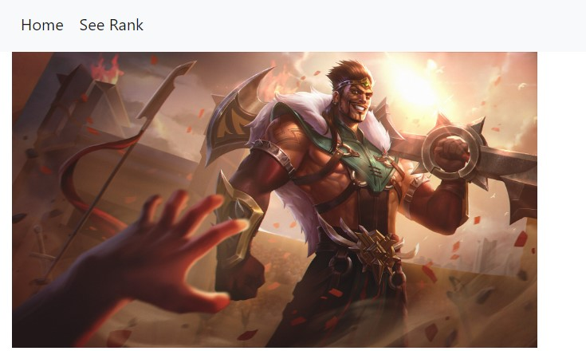

 
Ce MON ne nécessite pas de prérequis car il reprend les bases du HTML et du CSS.



## Résumé

Le but de ce premier MON est de me familiariser avec le langage HTML et le langage CSS, ainsi que de m'initier à l'utilisation du framework Bootstrap. 
La mise en pratique se fera à travers mon POK "Récupérer les données du jeu vidéo League of Legends" car j'illustrerai mes résultats à travers un site en local.
Ce MON passera donc en revue les principes de fonctionnement de l'HTML et du CSS, et mettra l'accent sur un cas pratique de Bootstrap.

## Rappels d'HTML

Afin de revoir les bases de l'HTML, j'ai suivi deux ressources en ligne, le [tutoriel de Mozilla Developer Network](https://developer.mozilla.org/fr/docs/Learn/HTML) ainsi que le [cours HTML d'Openclassrooms](https://openclassrooms.com/fr/courses/1603881-apprenez-a-creer-votre-site-web-avec-html5-et-css3)
Je vous redirige vers le MON de [Jeffrey Edisah](https://francoisbrucker.github.io/do-it/promos/2022-2023/Edisah-Jeffrey/mon/webfront1/) afin d'avoir un résumé de ce que l'on peut trouver dans ces formations.


## Rappels CSS

Pour ce qui est du CSS, j'ai également suivi le tutoriel disponible sur [Mozilla Developer Network](https://developer.mozilla.org/fr/docs/Learn/CSS).

Je vous invite cette fois-ci à regarder le MON de [Bermond Timothée](https://francoisbrucker.github.io/do-it/promos/2022-2023/Bermond-Timoth%C3%A9e/mon/CSS/) que je trouve plutôt complet.

## Initiation Bootstrap


### Qu'est ce que Bootstrap ?


Bootstrap est un framework front-end open-source qui a révolutionné la manière dont les développeurs web conçoivent et déploient leurs projets en ligne.
Bootstrap est un ensemble de ressources préconçues, de styles CSS, de composants interactifs, et de scripts JavaScript qui simplifient considérablement le processus de création d'un site web. Il a été créé par Twitter et est maintenant maintenu par une grande communauté de développeurs. La principale caractéristique de Bootstrap est sa capacité à rendre la conception de sites web réactifs. 
Les sites créés avec Bootstrap s'adaptent automatiquement à différentes tailles d'écrans, des smartphones aux ordinateurs, offrant ainsi une expérience utilisateur cohérente sur tous les appareils.


### Pour qui est Bootstrap ?

Bootstrap est adapté à une large gamme d'utilisateurs, qu'il s'agisse de développeurs débutants cherchant à créer rapidement des sites web fonctionnels ou de professionnels expérimentés souhaitant gagner du temps et maintenir des normes de qualité élevées.


### Ressources


### Exemple de code utilisant Boostrap

Pour mon premier POK, j'avais besoin de mettre en place une barre de navigation avec des boutons cliquables me permettant de changer de page efficacement et ce de manière esthétique.
Bootstrap répondait parfaitement à mon besoin puisque j'ai pu très facilement importé un code HTML me permettant d'afficher une barre de navigation.

Voici un exemple de mon code :


```
<!DOCTYPE html> 
<html>
<head>
    
    
        <meta charset="UTF-8">
    <meta name="viewport" content="width=device-width, initial-scale=1.0">
    <style>
        body {
            margin: 0;
            padding: 0;
            overflow: hidden;
        }

        img {
            width: 100%;
            height: 20vh; /* 1/8 de la hauteur de l'écran (100vh) */
            object-fit: cover; /* Pour maintenir le rapport d'aspect */
        }
    </style>
    
    
    
    
    
    
    
    
    <link rel="stylesheet" href="https://stackpath.bootstrapcdn.com/bootstrap/4.5.2/css/bootstrap.min.css" integrity="sha384-JcKb8q3iqJ61gNV9KGb8thSsNjpSL0n8PARn9HuZOnIxN0hoP+VmmDGMN5t9UJ0Z" crossorigin="anonymous">
    <link rel="stylesheet" type="text/css" href="{{ url_for('static',filename='style.css')}}">
    
    
    
    
    
    
    
</head>
<body>
    
    
    
<nav class="navbar bg-body-tertiary">
    <div class="container d-flex justify-content-between">
        <a class="navbar-brand" href="/league">
            
        </a>
        
        <!-- Deux menus supplémentaires -->
        <div class="d-flex">
            <a class="nav-link" href="/tft">
                
            </a>
            <a class="nav-link" href="/valorant">
                
            </a>
        </div>
    </div>
</nav>


    <div class="container-fluid">
        
         
        
    </div>
    
    
     <script src="https://code.jquery.com/jquery-3.5.1.slim.min.js" integrity="sha384-DfXdz2htPH0lsSSs5nCTpuj/zy4C+OGpamoFVy38MVBnE+IbbVYUew+OrCXaRkfj" crossorigin="anonymous"></script>
<script src="https://cdn.jsdelivr.net/npm/popper.js@1.16.1/dist/umd/popper.min.js" integrity="sha384-9/reFTGAW83EW2RDu2S0VKaIzap3H66lZH81PoYlFhbGU+6BZp6G7niu735Sk7lN" crossorigin="anonymous"></script>
<script src="https://stackpath.bootstrapcdn.com/bootstrap/4.5.2/js/bootstrap.min.js" integrity="sha384-B4gt1jrGC7Jh4AgTPSdUtOBvfO8shuf57BaghqFfPlYxofvL8/KUEfYiJOMMV+rV" crossorigin="anonymous"></script>
</body>
</html>
```

Ce qui donne :




> La barre de navigation est défini ici avec des icones !


Le FrameWork Python Flask permet le développement d'application web, c'est ce qui m'a permis de faire ma mini-application en utilisant les données de Riot Games.
Ce framework fera sûrement l'objet de mon projet MON !