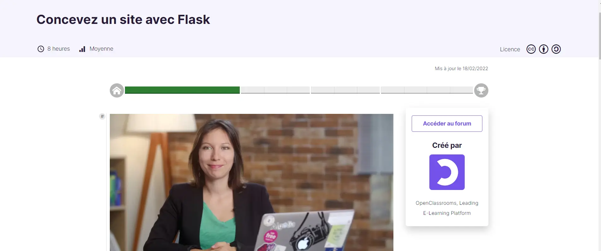
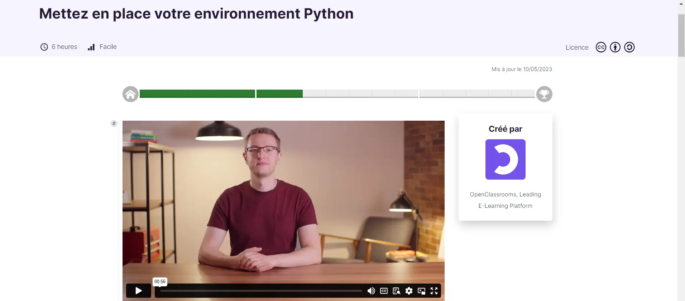
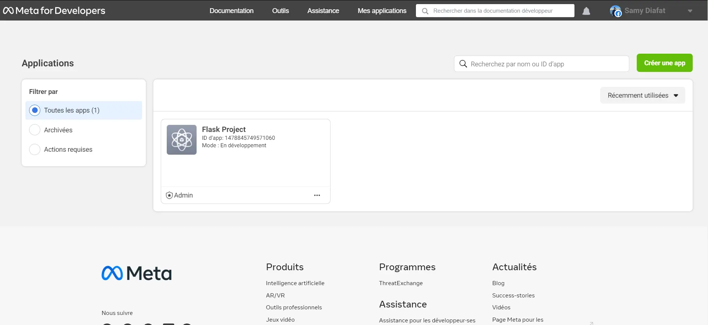
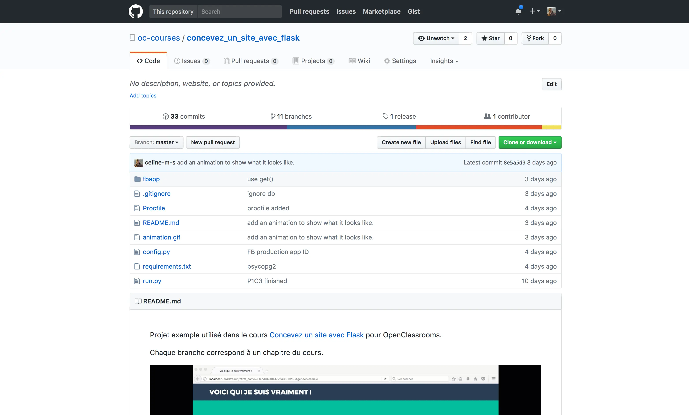
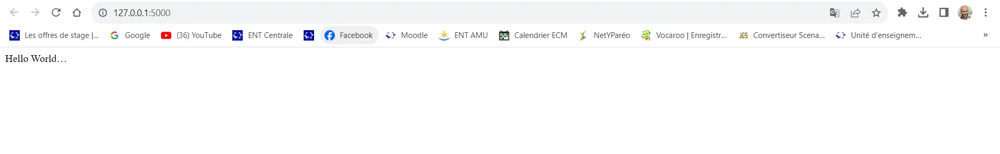
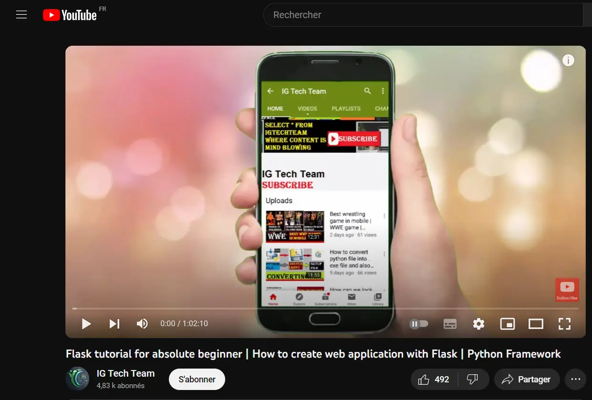
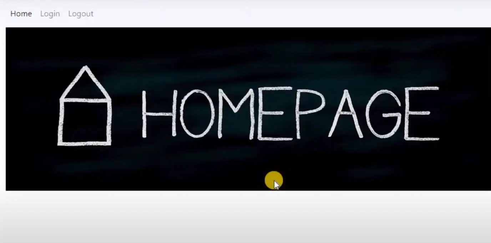
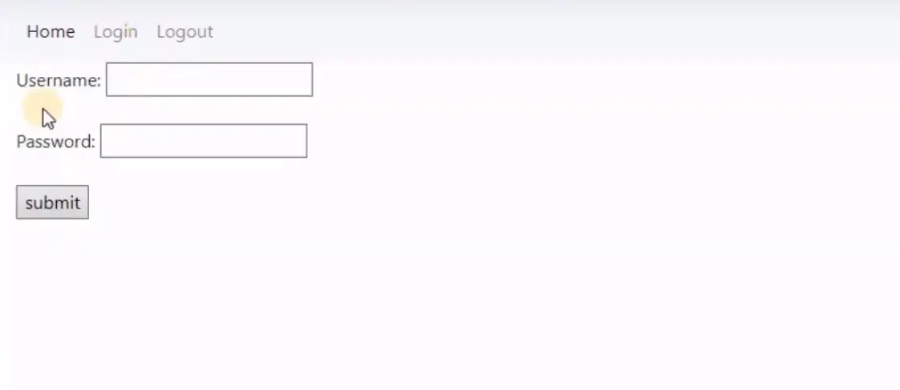

 
Ce MON nécessite quelques prérequis :
- savoir utiliser une invitation de commande
- savoir utiliser github
- de la patience



## Introduction


## Table des matières

1. [1ère tentative : OpenClassroom](#section-1)
    - [Environnement virtuel ? Kezako ?](#subsection-1)
    - [ Utilisation de Flask ](#subsection-2)
2. [2ème tentative : DigitalOcean](#section-2)
2. [Retour aux sources : Youtube](#section-3)
3. [Mon avis sur les formations](#section-4)


## 1ère tentative : OpenClassroom <a id="section-1"></a>

Afin d'apprendre à utililiser le micro-framework Flask, j'ai décidé de suivre une formation sur le fameux site OpenClassRoom.


Mais avant cela, c'est quoi Flask ? &#129300;


Définition : Flask est un petit framework web Python léger, qui fournit des outils et des fonctionnalités utiles qui facilitent la création d’applications web en Python.  Il offre aux développeurs une certaine flexibilité et constitue un cadre plus accessible pour les nouveaux développeurs puisque vous pouvez construire rapidement une application web en utilisant un seul fichier Python. Flask est également extensible et ne force pas une structure de répertoire particulière ou ne nécessite pas de code standard compliqué avant de commencer.


La formation d'OpenClassRoom est censé durer 8h.





Comme vous pouvez le voir sur la capture d'écran ci-dessus, je n'ai terminé le tutoriel.
Je vais tout d'abord restituer ce que j'ai appris de ce tutoriel et expliquer les difficultés que j'ai rencontrés.


Pour commencer le guide nous demande de savoir créer et activer un environnement virtuel.
Celui-ci nous dirige vers une autre formation d'OpenClassroom

{: width="150px" height="100px"}


### Créer un environnement virtuel ? Kezako ? <a id="subsection-1"></a>

J'ai donc suivi cette autre formation sur OpenClassroom.





Un environnement virtuel est un outil qui permet d'isoler les dépendances d'un projet Python spécifique.
Autrement dit, un projet peut avoir ses propres bibliothèques et versions de modules Python sans interférer avec d'autres projets.


Voici 4 raisons d'utiliser un environnement virtuel :

- **Couverture fonctionnelle** : Isolation des dépendances : Chaque projet peut avoir ses propres dépendances, indépendamment des autres projets. Cela évite les conflits entre les versions de bibliothèques et garantit que chaque projet a accès à ses propres versions spécifiques de modules.

- **Couverture fonctionnelle** : Gestion des versions : Les environnements virtuels permettent de spécifier et de gérer les versions exactes des bibliothèques utilisées dans un projet. Cela aide à assurer la reproductibilité du code sur différentes machines ou à différents moments.

- **Couverture fonctionnelle** : Facilité de déploiement : En utilisant un environnement virtuel, vous pouvez spécifier les dépendances exactes de votre projet, ce qui facilite le déploiement sur d'autres machines sans risque d'incompatibilité de versions.

- **Couverture fonctionnelle** : Propreté du système : En évitant d'installer des bibliothèques directement dans le système, vous évitez de polluer l'environnement global avec des dépendances potentiellement incompatibles.


#### Les commandes pour créer, activer et désactiver un environnement virtuel


Pour créer et gérer des environnements virtuels, il est possible d'utiliser *venv*


>venv est une nouveauté de Python 3.3 donc il devrait être installer par défaut.


Afin de créer un environnement virtuel, il suffit d'utiliser un terminal, de se placer dans le dossier du projet, et de taper la commmande :


```bash
$ python -m venv env
```

Sur windows, la commande permettant d'activer l'environnement virtuel est la suivante :

```bash
env\Scripts\activate.bat
```

Sur Linux :
```bash
source env/bin/activate
```
L'environnement virtuel est maintenant activé.

```bash
C:\Users\samid\Documents>env\Scripts\activate.bat

(env) C:\Users\samid\Documents>
```

>Le petit (env) tout à gauche permet de savoir si l'environnement virtuel est activée ou non.


Pour désactiver l'environnement virtuel, il suffit de taper la commande :

```bash
deactivate
```

Une fois cela fait, on peut maintenant passer à la création d'une application web.

### Utilisation de Flask <a id="subsection-2"></a>

Après avoir appris comment créer un environnement virtuel, il est enfin temps de créer une application !

Le but de la formation d'OpenClassroom web est d'apprendre à développer une application web, appelée "Le test ultime", permettant aux utilisateurs de découvrir une description de leur personnalité en se connectant via Facebook, générant ainsi des résultats personnalisés et offrant la possibilité de partager ces résultats sur les réseaux sociaux. 


La première étape est donc de créer un compte développeur sur le site de facebook, de créer une application qui servira pour récupérer les informations d'un compte Facebook.




Le site fourni ensuite un dossier contenant l'architecture du projet, et indique les variables à remplacer afin de connecter notre application précedemment créée à l'aide d'un identifiant.




Après cela, j'ai suivi le tutoriel et j'ai réussi à avoir une application basique qui fonctionnait avec des données en static, puis les problèmes ont commencé lorsque j'ai tenté de connecter une base de données SQL Lite.

C'est au moment d'interagir avec la console Flask, pour ajouter/modifier/supprimer des données qui rien ne fonctionnait.


Pour lancer la console Flask : 

```bash
$ set FLASK_APP=run.py
$ flask shell
```

La console doit s'ouvrir après cela :

```bash
Python 3.6.1 (default, Mar 23 2017, 16:49:06)
[GCC 4.2.1 Compatible Apple LLVM 8.0.0 (clang-800.0.42.1)] on darwin
App: fbapp.views
Instance: /Users/celinems/sites/oc/exercices_exemples/flask_example/instance
>>> 
```


Après avoir perdu beaucoup de temps à tenter de lancer la console, j'ai décidé de changer de tutoriel.


## 2ème tentative : DigitalOcean <a id="section-2"></a>

Ce deuxième tutoriel reprend les mêmes bases que le précedent, à savoir la création d'un environnement virtuel.

Il permet ensuite de déployer un application de base 

```python
from flask import Flask

app = Flask(__name__)

@app.route('/')
def hello():
    return 'Hello, World!'
```


```python
 * Serving Flask app "__main__" (lazy loading)
 * Environment: production
   WARNING: This is a development server. Do not use it in a production deployment.
   Use a production WSGI server instead.
 * Debug mode: off
 * Running on http://127.0.0.1:5000/ (Press CTRL+C to quit)
127.0.0.1 - - [17/Oct/2023 20:32:55] "GET / HTTP/1.1" 200 -
127.0.0.1 - - [17/Oct/2023 20:32:55] "GET / HTTP/1.1" 200 -
```


Et voici ce que l'on obtient




Après ça, on nous demande à nous d'interagir avec la console Flask.

Les instructions sont les mêmes que les précedentes. J'ai de nouveau tenter de lancer la console, j'ai réussi à une occasion mais je n'ai pas réussi à le refaire.

Enfin, face à ce mur qui se dressait devant moi, j'ai décidé de faire un retour aux sources et d'aller chercher un tuto youtube


## Retour aux sources : Youtube <a id="section-3"></a>




En suivant ce tutoriel, je suis parvenu à avoir une simple application fonctionnel.




J'ai par la suite réaliser une application un peu plus élaboré à travers mon POK 1.

## Mon avis sur les formations <a id="section-4"></a>


La formation d'OpenClassroom est bien détaillée mais je ne le conseille pas car je trouve qu'elle manque de clarté parfois, et surtout parce que j'ai échoué lol.

La formation de DigitalOcean est beaucoup plus technique et permet de mieux comprendre les concepts sous-jacents (et aussi les erreurs que l'on peut rencontrer !)

La vidéo youtube est un peu longue mais avec elle on est sûr d'avoir un résultat !


 
- Formation OpenClassroom : https://openclassrooms.com/fr/courses/4425066-concevez-un-site-avec-flask et https://openclassrooms.com/fr/courses/6951236-mettez-en-place-votre-environnement-python
- Formation DigitalOcean : https://www.digitalocean.com/community/tutorials/how-to-make-a-web-application-using-flask-in-python-3-fr#etape-1-installation-de-flask 
- Vidéo Youtube : https://www.youtube.com/watch?v=Yh23ZtfYOSs
 
