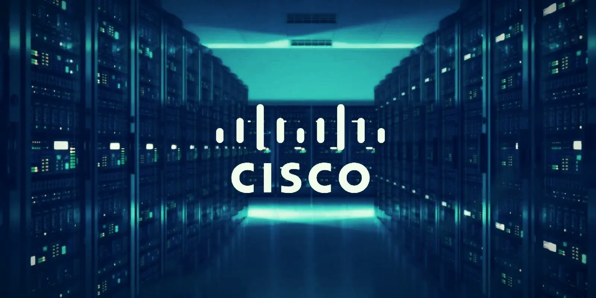
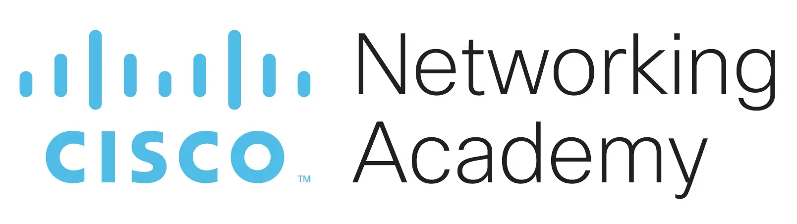
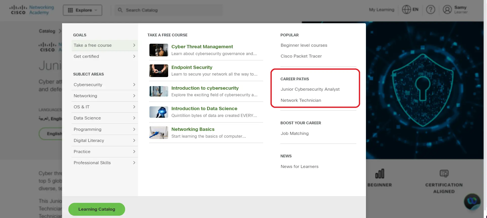
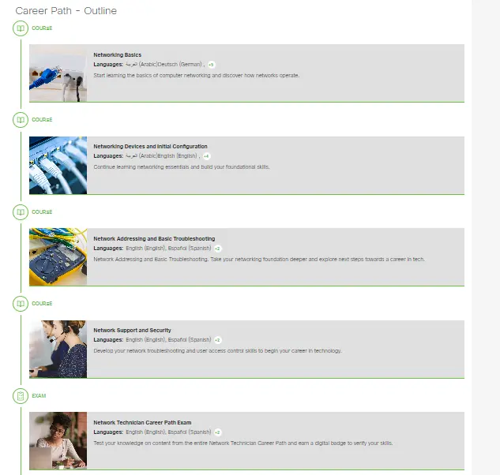
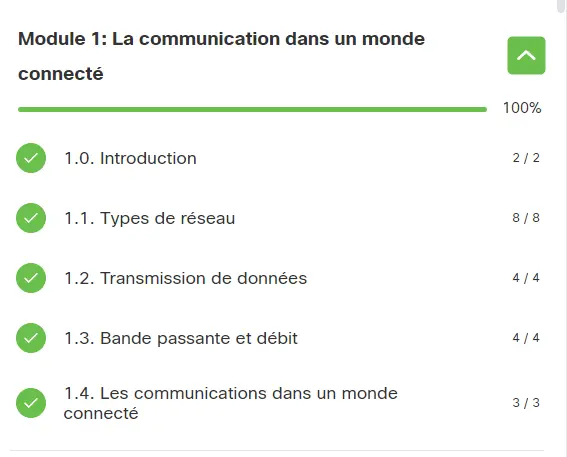
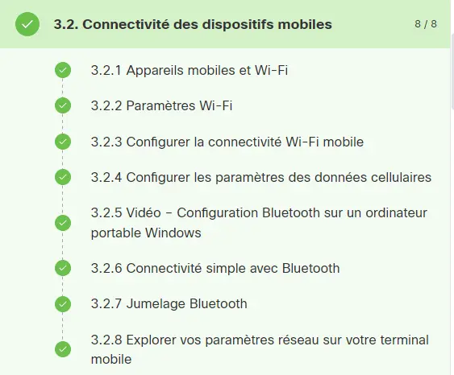
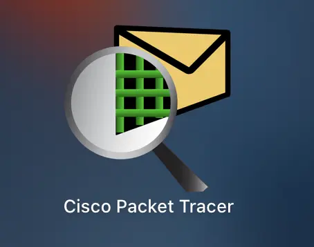
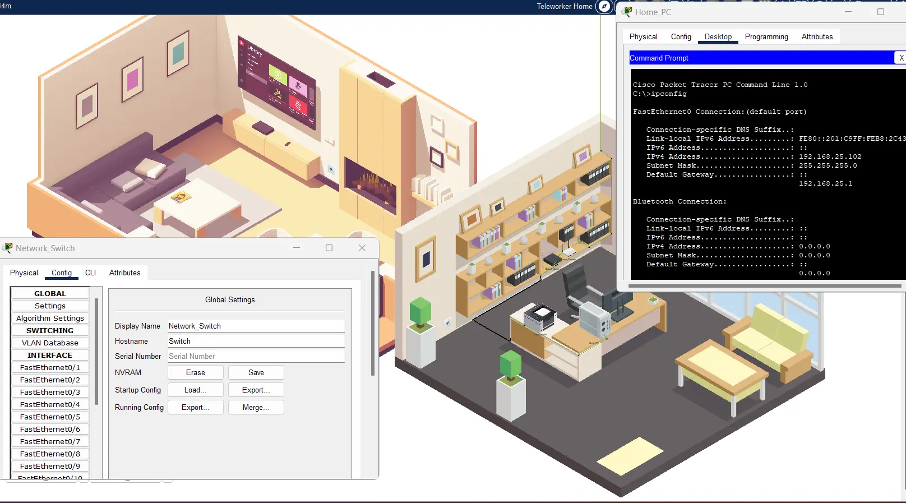
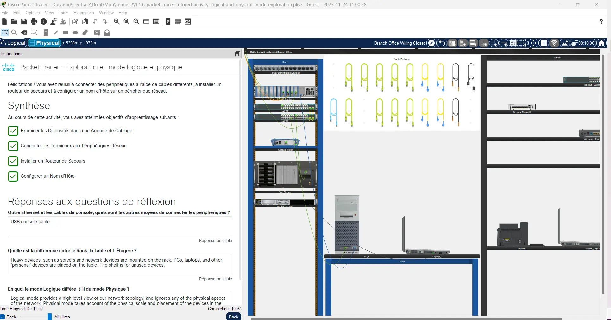
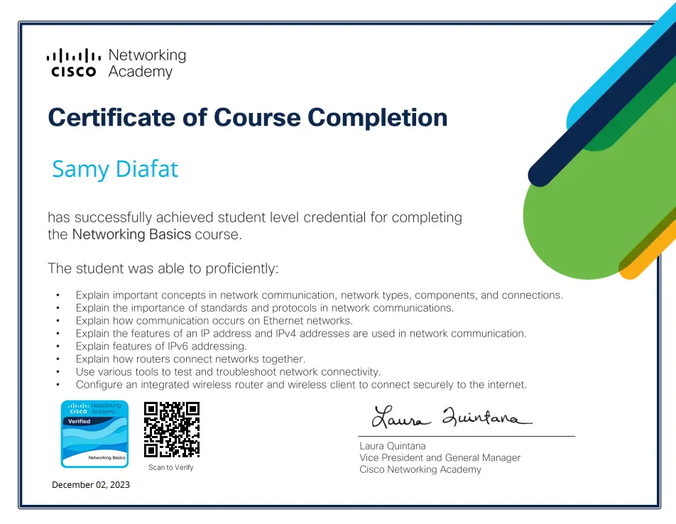

 
Aucun prérequis.


### Sommaire 
1. Présentation de la formation
1.1 Pourquoi suivre un cours de réseaux  ? 
1.2 A quoi ressemble une formation  ? 
1.3 Comment est-on évalué ?
1.4 Quelles sont les thèmes abordés ?
2. Points positifs & Points négatifs
3. Recommandation
  
## Présentation de la formation

**Cisco Systems** est une entreprise américaine spécialisée dans les technologies de l'information et de la communication (TIC).
Cette entreprise est devenue l'une des plus grandes entreprises mondiales dans son domaine.
**Cisco** est particulièrement connue pour ses équipements réseau, notamment les routeurs et les commutateurs, utilisés dans le monde entier pour la construction et la gestion de réseaux informatiques.

Le programme éducatif **Networking Academy** developpé par **Cisco** vise à former des professionels aux technologies réseaux.

Sur la plateforme Networking Academy, nous pouvons retrouver **deux parcours professionels gratuits**, constitués chacuns de plusieurs formations d'une quinzaine d'heure. Le premier parcours porte sur les divers technologies liées au réseau, tandis que le second porte sur des notions de cyber-sécurité.

Chaque formation donne accès à une certification suite à un petit examen de 50 questions. Il est cependant possible d'obtenir une certification payante à l'issu de chaque parcours professinels.

J'ai donc décidé de commencer le parcours "Network Technician" ! 

La première formation s'intitule "Networking Basics", est destinée aux débutants, et a une durée estimée de 22h.

### Pourquoi suivre ce cours ? 

Afin de comprendre pourquoi ce cours est interessant, je vais simplement citer l'aperçu de la formation rédigée sur la plateforme.


Internet est construit sur des réseaux informatiques. Quel que soit le type de carrière technologique qui vous intéresse, il est donc essentiel de connaître les bases de la mise en réseau ! Que vous vous prépariez à une carrière en réseau, que vous rafraîchissiez vos connaissances en vue d'une certification reconnue par le secteur ou que vous soyez simplement curieux de savoir ce qu'est le réseau, ce cours est fait pour vous.

Ce cours couvre les bases de la mise en réseau et des périphériques, supports et protocoles réseau. Vous observerez les données circulant dans un réseau et configurerez les périphériques pour les connecter aux réseaux. Enfin, vous apprendrez à utiliser différentes applications et protocoles réseau pour accomplir des tâches de mise en réseau. Les connaissances et les compétences que vous allez acquérir peuvent vous donner un point de départ pour trouver une carrière enrichissante dans le domaine de la technologie.


### A quoi ressemble un cours ? 

Les formations commencent tout d'abord avec une évaluation permettant de faire un état des lieux de nos connaissances.
Celles-ci sont  decoupées en module traitant chacun d'une thématique.
 Ces modules sont eux aussi segmentés en chapitre.

 
 
 Au sein de chaque chapitre, il y a plusieurs ressources différentes : 

 

Des vidéos explicatives, des schémas interractifs, des paragraphes descriptifs, des tableaux résumés et enfin des applications pratiques à l'aide du logiciel de simulation **Cisco Packet Tracer**.

 

Le logiciel Cisco Packet Tracer est un excellent outil permettant de s'exercer afin de s'appropier au mieux les connaissances théoriques acquises à travers les nombreux chapitres.

Des activités guidées permettent de s'amuser à configurer des réseaux de A à Z ( ou en tout cas d'essayer ! ).

 

 

>Le logiciel est très complet et gratuit ! 
### Comment est-on évalué ?

A la fin de chaque chapitre, il y a une petite évaluation de 20 questions, puis, une évaluation intermédiaire tous les 3/4 modules est proposée pour valider nos connaissances. Les questions sont soit des QCMs, soit des cas pratiques à l'aide de Cisco Packet Tracer.

Enfin, au terme de la formation, il est possible de passer une évaluation finale permettant d'obtenir une petite certification attestant la réussite de la formation.

### Thèmes abordés

Voici les différentes modules de la formation :

0. Introduction aux cours (Formation au logiciel Cisco Packet Tracer)
1. La communication dans un monde connecté
2. Composants réseau, types et connexions
3. Réseaux sans fil et mobiles
4. Construire un réseau domestique
5. Principes de communication
6. Médias réseau
7. La couche d'accès
8. Protocole Internet
9. IPV4 et segmentation du réseau
10. Formats et règles d'adressage IPv6
11. Adressage dynamique avec DHCP
12. Passerelles vers d'autres réseaux
13. Le processus ARP
14. Routage entre les réseaux
15. TCP et UDP
16. Services de la couche d'application
17. Utilitaires de test du réseau

## Points positifs & Points négatifs

Quelles sont les points négatifs selon moi ?

- Étant donné que le site est traduit en plusieurs langues, la traduction française n'est parfois pas très pertinente en raison du vocabulaire technique, en particulier lors des tests. 
- Le cours est parfois lourd car les informations sont répétées trop de fois à mon sens. Par exemple, une vidéo explicative de quelques minutes suivie d'un texte réexpliquant le même concept.

Quelles sont les points positifs selon moi ?

- Le cours est simple et très bien expliqué.
- Les vidéos peuvent être accélérées et sous-titrées.
- Il y a beaucoup de tests et d'activités.
- Le site est ergonomique.
- Le contenu de la formation a été mis à jour. 
- Les parcours sont bien définis et donc  motivants !

##  Recommandation

Je recommande évidemment cette formation pour tout le monde, et surtout aux étudiants souhaitant travailler dans le monde de l'informatique.
En particulier, je pense qu'il serait intéressant de suivre la formation avant le cours du temps 1 "OPS/ Unix" afin d'être beaucoup plus au clair sur les notions liées au réseau. 

## Horodateur
| Date | Heures passées | Indications | 
| -------- | -------- |-------- |
| 24/11 | 3H  | Formation logiciel Cisco Packet Tracer et Intro, Module 1 et 2|
| 25/11 | 1H  | Module 3|
| 25/11 | 1H  | Module 4 et Checkpoint Exam|
| 26/11 | 2H  | Module 5, 6, 7 et Checkpoint Exam|
| 26/11 | 1H  | Module 8, 9|
| 27/11 | 1H  | Module 10, 11 et Checkpoint Exam|
| 01/12 | 1H30  | Module 12, 13, 14 et Checkpoint Exam|
| 02/12 | 1H30  | Module 15, 16, 17 et Checkpoint Exam|
| 02/12 | 1H  | Exam Final|
| Total | 13H  | Formation Notions de base sur les réseaux|

 
- Le parcours Network Technician : https://skillsforall.com/career-path/network-technician?courseLang=en-US
- Logo Cisco Network : https://www.betterinternetforkids.eu/web/cisco-networking-academy
- Illustration Cisco : https://le-guide-du-secops.fr/2022/02/14/ok-finale-prenez-garde-a-vos-anciens-equipements-cisco-politique-des-mots-de-passe/
 
