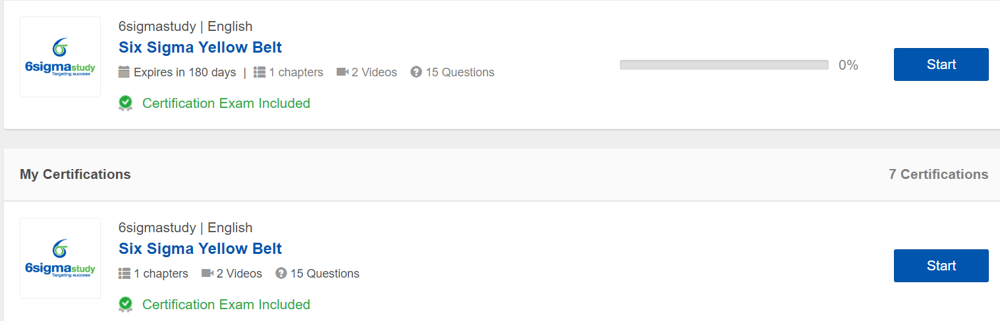

 
Aucun prérequis.


### Sommaire 
1. Méthode Scrum
2. Six Sigma White&Yellow Belt
3. Introduction à la cyber-sécurité
  
### Méthode Scrum

1 module d'environ 1h30

### Six Sigma White&Yellow Belt

2 modules d'environ 1h30

### Introduction à la cyber-sécurité

3 modules d'environ 10h

### Horodateur
| Date | Heures passées | Indications | 
| -------- | -------- |-------- |
| Jour | H  | Activité |

