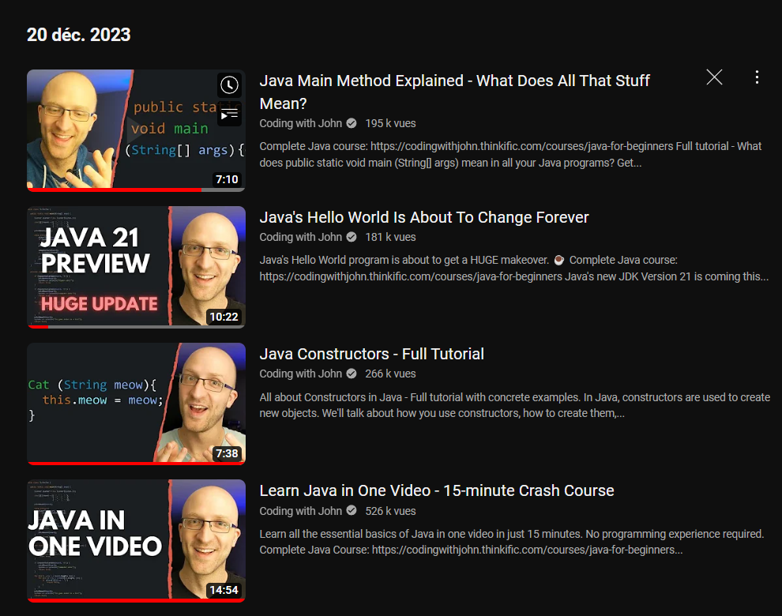
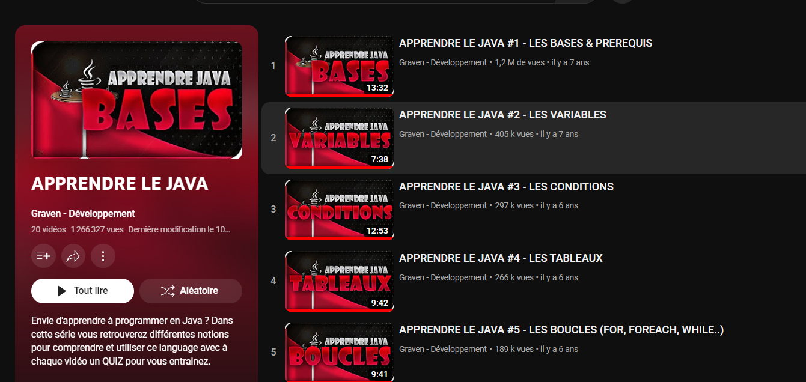
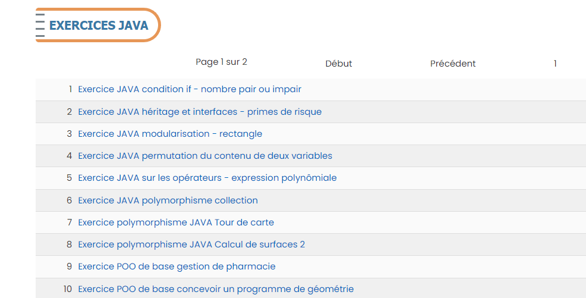
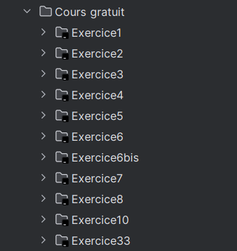
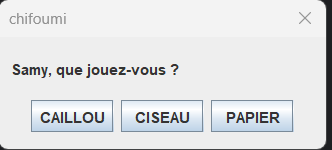
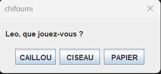
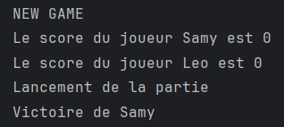

 
Aucun prérequis.

  
### Sommaire 
1. Introduction
2. Apprendre
2.1 Pourquoi suivre un cours de réseaux  ? 
2.2 A quoi ressemble une formation  ? 
3. Pratiquer en s'amusant
  
## Introduction

J'ai décidé de dédié mon MON au langage Java car c'est un langage que je souhaitais découvrir cette année, c'est d'ailleurs une option que j'ai choisi pour le temps 2 et qui nécessite d'avoir les bases.
Ayant quelques notions en programmation orientée objet, je ne savais pas par où commencer car un cours pour vrai débutant allait vite devenir ennuyant, mais un cours de niveau intermédiaire pourrait être trop difficile d'accès pour mon niveau actuel.

Mais avant de commencer, qu'est ce que Java ? 


**Java** est un langage de programmation polyvalent et orienté objet, créé par Sun Microsystems. Il est réputé pour sa portabilité, permettant l'exécution du code sur différentes plates-formes via la machine virtuelle Java (JVM). Java favorise la réutilisation du code avec son approche orientée objet, garantit la sécurité grâce à l'exécution dans la JVM, prend en charge le multithreading, dispose d'une gestion automatique de la mémoire via un garbage collector, et offre une riche bibliothèque standard. Sa plateforme indépendante le rend largement utilisé dans le développement d'applications diverses, de logiciels embarqués à des applications d'entreprise.


## Apprendre 

Pour commencer, je suis allé voir le POK de Sarah, qui s'initie au langage Java et qui a pour objectif de coder le jeu Mastermind. Celle-ci recommande une chaine Youtube pour apprendre les bases de Java.

J'ai suivi sa piste et commencé par regarder des vidéos sur plusieurs chaînes différentes, en fonction de ce que j'avais besoin d'apprendre.

Tout d'abord, j'ai visionné quelques vidéos de la chaine Coding with John.

Ces vidéos sont en anglais mais j'ai trouvé que les explications étaient très clairs et maitrisées par le formateur, j'aurais bien voulu en voir davantage mais le formateur vend une formation payante sur son site.

Après avoir effectué quelques tests sur ma machine, j'ai suivi une autre playlist pour réellement entrer dans la Programmation Orientée Objet.

Sur la chaine Youtube de Graven, chez qui j'avais déjà suivi une playlist pour apprendre à développer une application mobile avec Flutter, se trouve une formation pour apprendre les bases de Java.

J'ai alors regardé une quinzaine de ces vidéos :

Afin de comprendre pourquoi ce cours est interessant, je vais simplement citer l'aperçu de la formation rédigée sur la plateforme.

## Pratiquer

Cela faisait beaucoup de vidéos visionnées, mais peu de pratique.
Toujours sur les recommandations du POK de Sarah, j'ai consulté 3 sites pour m'exercer : 

- [w3schools](https://www.w3schools.com/java/default.asp) : Les exercices sont très rapides à terminer et sont à faire directement sur la page web. Permet de survoler les notions. Je recommande si l'on débute vraiment la POO.
- [cours-gratuit](https://www.cours-gratuit.com/java) : Des exercices complets et prenant parfois du temps. J'ai terminé les 10 premiers exercices ce qui m'a permis d'appréhender les concepts d'héritage, de surcharge, d'interface, de polymorphismes...

- [site de Télécom Paris](https://perso.telecom-paristech.fr/hudry/coursJava/exercices/) : Super site avec des exercices très bien guidés et des bons corrigés. J'ai terminé environ 25 exercices sur ce site et je le recommande vivement. Les exercices sont suffisament guidés pour qu'un débutant puisse les réussir à son rythme.

Voici l'exemple d'un exercice ayant pour but de coder un jeu du chifoumi avec une petite interface graphique.

Samy clique sur Caillou

Leo clique sur Ciseaux (dsl pour la faute d'orthographe dans le jeu
)

Samy gagne donc.

##  Recommandation

 
- Le parcours Network Technician : https://skillsforall.com/career-path/network-technician?courseLang=en-US
- Logo Cisco Network : https://www.betterinternetforkids.eu/web/cisco-networking-academy
 
