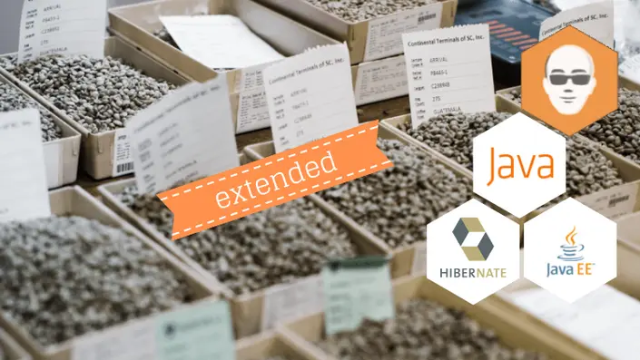
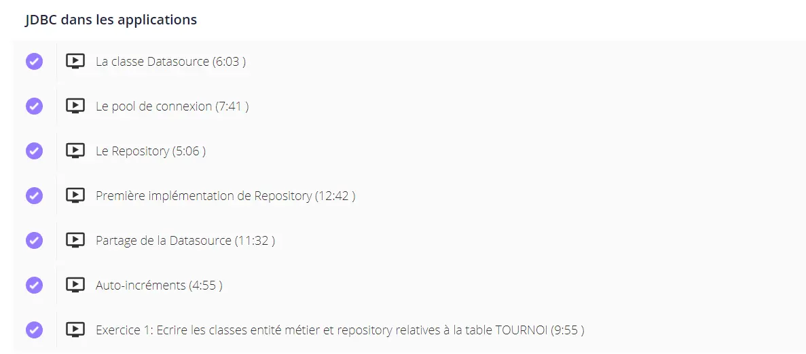

 
Première expérience avec Java.
Avoir un environnement de devéloppement type IntelliJ.


J'ai choisi de suivre la formation de [Jean-Philippe Ehret](https://www.udemy.com/course/java-et-les-bases-de-donnees-avec-jdbc-hibernate-et-jpa/) à ce sujet, et je compte suivre les autres formations proposées sur son site.
Il est possible d'obtenir 30 jours d'essai gratuit sur toutes les formations Java, puis de payer 10 euros par mois pour garder un accès aux formations. L'abonnement est sans engagement donc il est possible de ne rien payer. Je trouve personnellement que la qualité des vidéos proposées en vaut largement le prix.

### Sommaire 
1. Présentation de la formation
1.1 Pourquoi suivre ce cours ?
1.2 A quoi ressemble un chapitre  ? 
1.3 Comment valide-t-on nos connaissances ?
1.4 Quelles sont les thèmes abordés ?
2. Points positifs & Points négatifs
3. Recommandation

## Présentation de la formation

L'enseignant de la formation est Jean-Philippe EHRET, voici sa description sur le site Udemy :

Voulant en apprendre plus sur le framework Spring que j'ai un peu manipulé dans l'option Java du temps 2, je suis tombé sur une vidéo youtube de Jean-Philippe que j'ai trouvé très pédagogue et surtout véritablement expert dans ce sujet.
En me renseignant sur internet, j'ai vu qu'il proposait plusieurs formations Java sur Udemy, mais surtout sur son site [apprendre-java](https://apprendre-java.com/courses) (où les formations sont beaucoup moins chères).

J'ai donc voulu commencé par le commencement :  Java et les bases de données avec JDBC, Hibernate et JPA !

## Pourquoi suivre ce cours ?

A mon sens, ce cours est à suivre car il explique les fondements de l'accès et de l'utilisation des bases de données avec Java, plus particulièrement à travers le framework Spring qui est très majoritairement utilisé aujourd'hui.

Pour moi, ce cours s'adresse à ceux qui souhaitent véritablement comprendre le fonctionnement des outils qu'ils utilisent,  qui apprécient le côté magique (les utilisateurs de Spring Boot sauront de quoi je parle) que l'on peut ressentir en developpant, mais qui veulent quand même savoir comment le magicien arrive à produire cette magie.

Egalement, il est parfois compliqué de s'y retrouver dans les normes et usages standards car les outils évoluent beaucoup, ce cours revient donc parfois en arrière et explique les raisons de ces évolutions !

### A quoi ressemble un chapitre ? 

Les cours sont assez classiques dans leur forme : un lecteur vidéo (avec la possiblité d'accélérer la vidéo et de la sous-titrer), une section commentaire dédiée, et des fichiers utilisés dans le cours disponibles en téléchargement.

### Comment valide-t-on nos connaissances ?

Généralement, il y a, au bout de chaque chapitre, un exercice similaire à ce qui a été traité dans les vidéos, permettant de refaire par soi-même les manipulations.

## Quelles sont les thèmes abordés ?

Voici le sommaire de la formation :

1. Mise en place de l'environnement
2. Opérations de base en JDBC
3. JDBC dans les applications
4. Interaction avec la logique métier
5. Introduction aux frameworks ORM
6. Hibernate : Ce qu'il faut savoir pour bien démarrer
7. Hibernate : entités liées
8. Hibernate : Requétage HQL
9. JPA : La spécification qui normalise les solutions ORM
10. Intégration à une application Web
11. Section bonus : Installer Java, Installer Intellij, Utiliser Maven avec Intellij

##  Points positifs & Points négatifs

Quelles sont les points négatifs selon moi ?

- Il peut être frustrant d'étudier des concepts dépassés lorsque l'on cherche à acqhérir des compétences

- Je n'arrive pas à trouver de points négatifs

Quelles sont les points positifs selon moi ?

- Le cours est très bien expliqué.
- Le formateur va au-délà de l'explication du fonctionnement, il tente d'expliquer comment les choses ont été construites.
- Le découpage des vidéos est pertinent.
- Les vidéos peuvent être accélérées et sous-titrées.
- Le site est ergonomique.
- Le contenu de la formation a été mis à jour. 
- Les exercices sont simples à faire après avoir vu les vidéos.
- Le code est disponible.
- Les vidéos sont téléchargeables.

## Recommandation

Je recommande évidemment de suivre ce cours de par sa qualité et son prix (si l'on évite la plateforme Udemy).
Je recommande également de le faire avant d'entamer l'option Java du temps 2, ou de commencer à utiliser le framework Spring.

## Horodateur

Il y a environ une dizaine d'heures de vidéo, mais j'ai passé environ 16h suivre cette formation.

