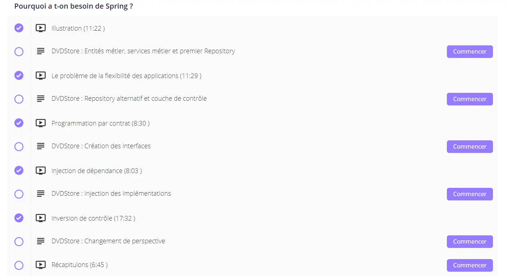

 
Bonne expérience du developpement Java.
Une première expérience du developpement Java avec les bases de donnnées.
Une première expérience en developpement web.
Avoir un environnement de devéloppement type IntelliJ.


Tout comme mon précédent MON, j'ai choisi de suivre la formation du même formateur [Jean-Philippe Ehret](https://www.udemy.com/course/bien-debuter-avec-spring-et-spring-boot/) à ce sujet.
Il est possible d'obtenir 30 jours d'essai gratuit sur toutes les formations Java, puis de payer 10 euros par mois pour garder un accès aux formations. L'abonnement est sans engagement donc il est possible de ne rien payer. Je trouve personnellement que la qualité des vidéos proposées en vaut largement le prix.

### Sommaire 
1. Présentation de la formation
1.1 Pourquoi suivre ce cours ?
1.2 A quoi ressemble un chapitre  ? 
1.3 Comment valide-t-on nos connaissances ?
1.4 Quelles sont les thèmes abordés ?
2. Points positifs & Points négatifs
3. Recommandation

## Présentation de la formation

L'enseignant de la formation est Jean-Philippe EHRET, voici sa description sur le site Udemy :

Ce mon fait suite à mon précedent [MON](https://francoisbrucker.github.io/do-it/promos/2023-2024/Diafat-Samy/mon/temps-3-1/), vous pouvez trouver la formation que j'ai suivie directement sur le site du formateur [apprendre-java](https://apprendre-java.com/courses) (où les formations sont beaucoup moins chères).

Après avoir commencé par le commencement (pour mon cas), c'est à dire "Java et les bases de données avec JDBC, Hibernate et JPA", j'ai poursuivi ma formation avec le cours sur le framework Spring "Bien débuter avec Spring et Spring Boot pour Java"

## Pourquoi suivre ce cours ?

### A quoi ressemble un chapitre ? 

Les cours sont assez classiques dans leur forme : un lecteur vidéo (avec la possiblité d'accélérer la vidéo et de la sous-titrer), une section commentaire dédiée, et des fichiers utilisés dans le cours disponibles en téléchargement.

### Comment valide-t-on nos connaissances ?

Généralement, il y a, après chaque vidéo, un exercice similaire à ce qui a été traité dans les vidéos, permettant de refaire par soi-même les manipulations.

## Quelles sont les thèmes abordés ?

Voici le sommaire de la formation :

1. Pourquoi a t-on besoin de Spring ?
2. Les fondamentaux du framework Spring
3. Mise en place de Spring Boot
4. Les applications Web avec Spring Boot
5. Developper une API ReST avec Spring
6. Spring et les bases de données relationnelles
7. Architectures “Cloud native” et microservices

##  Points positifs & Points négatifs

Quelles sont les points négatifs selon moi ?

- Je n'arrive pas à trouver de points négatifs

Quelles sont les points positifs selon moi ?

- Le cours est très bien expliqué.
- Le formateur va au-délà de l'explication du fonctionnement, il tente d'expliquer comment les choses ont été construites.
- Le découpage des vidéos est pertinent.
- Les vidéos peuvent être accélérées et sous-titrées.
- Le site est ergonomique.
- Le contenu de la formation a été mis à jour. 
- Les exercices sont simples à faire après avoir vu les vidéos.
- Le code est disponible.
- Les vidéos sont téléchargeables.
- Il y a plus d'exercices dans cette formation

## Recommandation

Je recommande évidemment de suivre ce cours de par sa qualité et son prix (si l'on évite la plateforme Udemy).
Je recommande également de le faire avant d'entamer l'option Java du temps 2, ou de commencer à utiliser le framework Spring. Le mieux reste de suivre ce cours après la premiere formation sur les bases de données avec Java.

## Horodateur

Il y a plus d'une dizaine d'heures de vidéo, mais je n'ai pas pu terminé l'ensemble de la formation en dix heures car les exercices prennent du temps. Je me suis arrêté à la fin du chapitre 5 et j'ai passé un total de 12 heures sur la formation.

