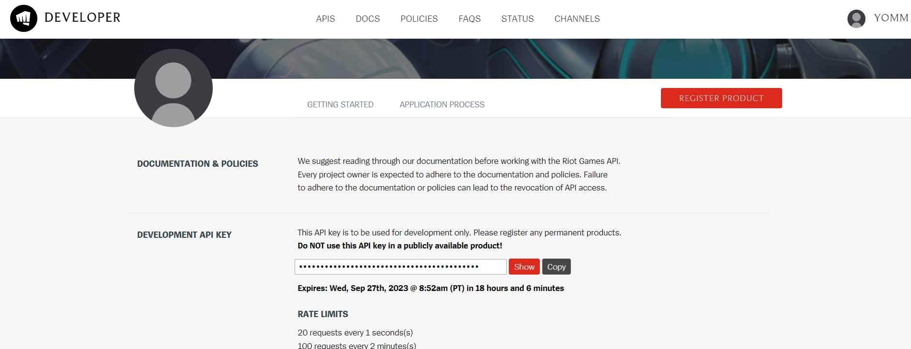
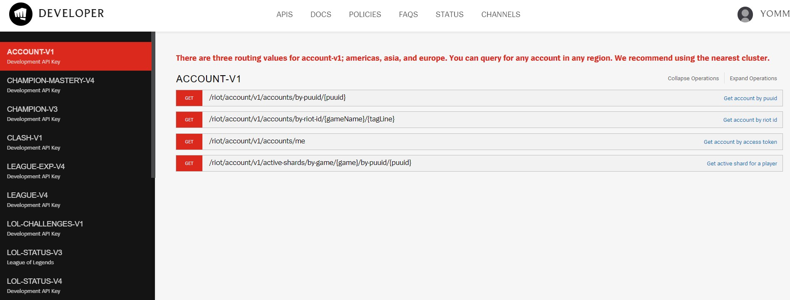
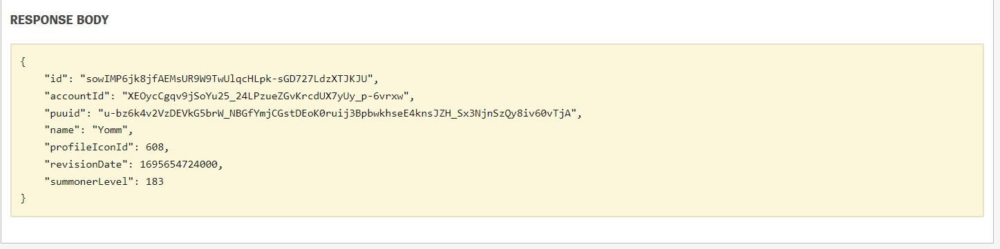
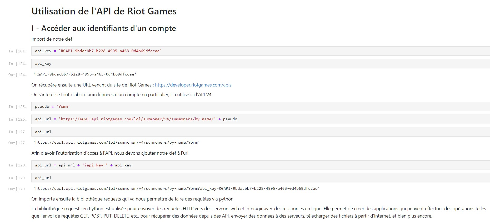
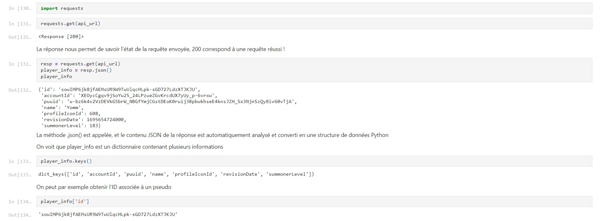
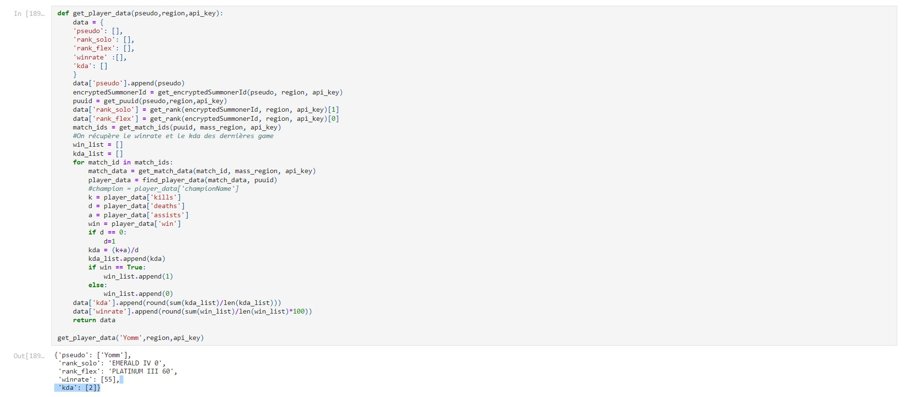
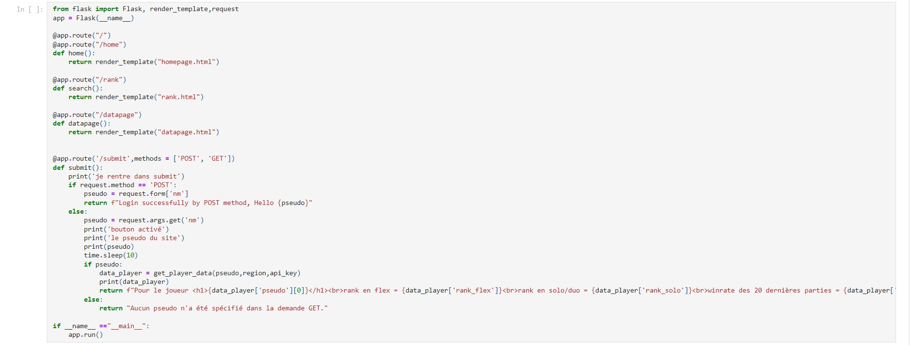
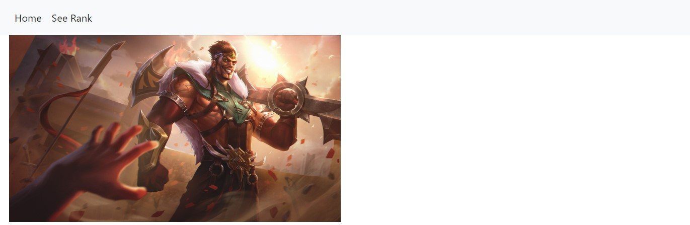
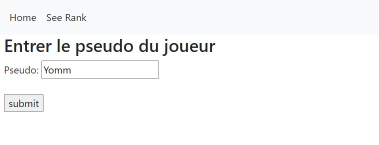
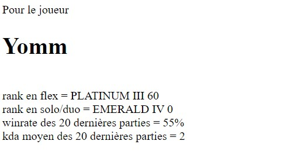

## Ce que j'ai prévu pour le 1er point POK
- Faire des reqûetes aux APIs
- Nettoyer les données que j'aurai collecté
- Analyser les données pour en sortir des informations pertinentes
- Bonus : Mettre les informations sur un site web

## Ce que j'ai fait

### 1. Faire des requêtes directement sur le site de RiotGames

Afin d'accéder aux données, j'ai tout d'abord dû récupérer une clef me permettant de faire des requêtes aux API disponibles

Une fois ma clef récupérée, j'ai tout d'abord pris connaissance de l'ensemble des API mis à notre disposition (il y a plus d'une dizaine d'APIs disponibles pour le jeu League of Legends)

J'ai ensuite testé la requête suivante qui permet de récupérer des informations sur un compte à partir du pseudo

Ce qui m'a permis d'obtenir les données suivantes

On passe maintenant à un notebook afin d'automatiser tout cela avec python !

### 2. Automatiser les requêtes sur python

Les deux captures d'écran précédentes permettent d'utiliser la clef afin de faire des requêtes directement via Jupyter Notebook.

### 3. Faire des calculs à l'aide des données récoltées

Par la suite, j'ai créé des fonctions me permettant de faire des reqûetes dans plusieurs APIs différentes afin de croiser les informations, et de faire des calculs de moyenne par exemple.

Ici par exemple, on arrive à récupérer le classement d'un joueur, à calculer son taux de victoire, ansi qu'un indicateur de permorfance au cours de ses récentes parties (KDA).

### 4. Utiliser le framework Flask pour développer une petite application

Enfin, voici le code permettant d'utiliser Flask et d'avoir une petite interface graphique

## Ce que j'ai prévu pour le second point POK

Pour le second point, je voudrais tout d'abord corriger les bugs que j'ai eu lors de l'utilisation de l'application web car au bout de quelques requêtes mon site plante.
Je souhaiterais également améliorer l'interface graphique, par exemple en ajoutant des images correspondant au rang du joueur dans le jeu.

## Ce que j'ai fait à la fin du temps 1

## Des ressources

[Playlist de iTero Gaming à propos de l'API](https://www.youtube.com/watch?v=jkzq9j5yeT8&list=PL3vL1pnMCbUERqllcwhcvEJbKum-M9zT5).

[Guide pour utiliser Flask](https://www.youtube.com/watch?v=Yh23ZtfYOSs)
