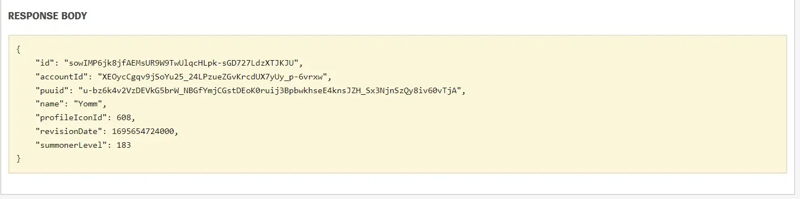
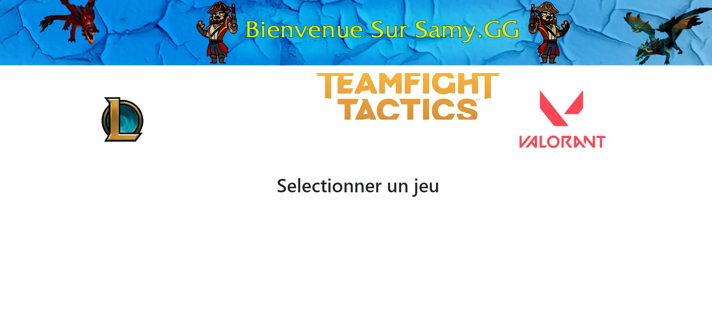


Avoir les bases en html/css, python (pandas), invit de commande et avoir de la patience.


## Table des matières

1. [Ce que j'ai prévu pour le 1er point POK](#section-1)
2. [Ce que j'ai fait au 1er sprint](#section-2)
   - [Faire des requêtes directement sur le site de RiotGames](#subsection-1)
   - [Automatiser les requêtes sur python](#subsection-2)
   - [Faire des calculs à l'aide des données récoltées](#subsection-3)
   - [Utilisation du framework Flask pour développer une petite application](#subsection-4)
3. [Ce que j'ai prévu pour le second point POK](#section-3)
4. [Ce que j'ai fait à la fin du temps 1](#section-4)
   - [Page d'accueil](#subsection-5)
   - [Page du jeu TFT](#subsection-6)
   - [Page du jeu Valorant](#subsection-7)
   - [Page du jeu League of Legends](#subsection-8)
   - [Comparaison avec des statistiques issues du site OP.GG](#subsection-9)

5. [Conclusion](#section-5)


## Ce que j'ai prévu pour le 1er point POK<a id="section-1"></a>

- Faire des reqûetes aux APIs
- Nettoyer les données que j'aurai collecté
- Analyser les données pour en sortir des informations pertinentes
- Bonus : Mettre les informations sur un site web

## Ce que j'ai fait au 1er sprint<a id="section-2"></a>


### Faire des requêtes directement sur le site de RiotGames<a id="subsection-1"></a>

Afin d'accéder aux données, j'ai tout d'abord dû récupérer une clef me permettant de faire des requêtes à l'API.


Une fois ma clef récupérée, j'ai tout d'abord pris connaissance de l'ensemble de méthodes mis à notre disposition.

>Il y a plus d'une dizaine de méthodes disponibles pour le jeu League of Legends.


J'ai ensuite testé la requête suivante qui permet de récupérer des informations sur un compte à partir du pseudo :


Ce qui m'a permis d'obtenir les données suivantes :



On passe maintenant à un notebook afin d'automatiser tout cela avec python !

### Automatiser les requêtes sur python<a id="subsection-2"></a>


Import de notre clef


```python
api_key = 'RGAPI-d26162a7-7ea3-4af5-91b3-1087f97591e8'
```


```python
api_key
```


    'RGAPI-d26162a7-7ea3-4af5-91b3-1087f97591e8'


On récupère ensuite une URL venant du site de Riot Games : https://developer.riotgames.com/apis

On s'interesse tout d'abord aux données d'un compte en particulier, on utilise ici l'API V4


```python
pseudo = 'Yomm'
```


```python
api_url = 'https://euw1.api.riotgames.com/lol/summoner/v4/summoners/by-name/' + pseudo
```


```python
api_url
```


    'https://euw1.api.riotgames.com/lol/summoner/v4/summoners/by-name/Yomm'


Afin d'avoir l'autorisation d'accès à l'API, nous devons ajouter notre clef à l'url


```python
api_url = api_url + '?api_key=' + api_key
```


```python
api_url
```


    'https://euw1.api.riotgames.com/lol/summoner/v4/summoners/by-name/Yomm?api_key=RGAPI-d26162a7-7ea3-4af5-91b3-1087f97591e8'


On importe ensuite la bibliothèque requests qui va nous permettre de faire des requêtes via python.

>La bibliothèque requests en Python est utilisée pour envoyer des requêtes HTTP vers des serveurs web et interagir avec des ressources en ligne. Elle permet de créer des applications qui peuvent effectuer des opérations telles que l'envoi de requêtes GET, POST, PUT, DELETE, etc., pour récupérer des données depuis des API, envoyer des données à des serveurs, télécharger des fichiers à partir d'Internet, et bien plus encore.


```python
import requests
```


```python
requests.get(api_url)
```


    <Response [200]>


La réponse nous permet de savoir l'état de la requête envoyée, 200 correspond à une requête réussi !


```python
resp = requests.get(api_url)
player_info = resp.json()
player_info
```


    {'id': 'sowIMP6jk8jfAEMsUR9W9TwUlqcHLpk-sGD727LdzXTJKJU',
     'accountId': 'XEOycCgqv9jSoYu25_24LPzueZGvKrcdUX7yUy_p-6vrxw',
     'puuid': 'u-bz6k4v2VzDEVkG5brW_NBGfYmjCGstDEoK0ruij3BpbwkhseE4knsJZH_Sx3NjnSzQy8iv60vTjA',
     'name': 'Yomm',
     'profileIconId': 608,
     'revisionDate': 1697225190000,
     'summonerLevel': 184}


La méthode .json() est appelée, et le contenu JSON de la réponse est automatiquement analysé et converti en une structure de données Python

On voit que player_info est un dictionnaire contenant plusieurs informations


```python
player_info.keys()
```


    dict_keys(['id', 'accountId', 'puuid', 'name', 'profileIconId', 'revisionDate', 'summonerLevel'])


On peut par exemple obtenir l'ID associée à un pseudo


```python
player_info['id']
```

### Faire des calculs à l'aide des données récoltées<a id="subsection-3"></a>

Par la suite, j'ai créé des fonctions me permettant de faire des requêtes dans plusieurs sources différentes afin de croiser les informations, et de faire des calculs de moyenne par exemple.


```python
# Cette fonction permet de récupérer le puuid d'un joueur à partir du nom d'invocateur, de la région, et d'une clef api
def get_puuid(summoner_name, region, api_key):
    api_url = (
        "https://" + 
        region +
        ".api.riotgames.com/lol/summoner/v4/summoners/by-name/" +
        summoner_name +
        "?api_key=" +
        api_key
    )
    resp = requests.get(api_url)
    player_info = resp.json()
    puuid = player_info['puuid']
    return puuid  


# cette fonction permet de récupérer les identifiants des 20 dernières parties d'un joueur
def get_match_ids(puuid, mass_region, api_key):
    api_url = (
        "https://" +
        mass_region +
        ".api.riotgames.com/lol/match/v5/matches/by-puuid/" +
        puuid + 
        "/ids?start=0&count=20" + 
        "&api_key=" + 
        api_key
    )   
    # we need to add this "while" statement so that we continuously loop until it's successful
    while True:
        resp = requests.get(api_url)
        
        # whenever we see a 429, we sleep for 10 seconds and then restart from the top of the "while" loop
        if resp.status_code == 429:
            print("Rate Limit hit, sleeping for 10 seconds")
            time.sleep(10)
            # continue means start the loop again
            continue
            
        # if resp.status_code isn't 429, then we carry on to the end of the function and return the data
        resp = requests.get(api_url)
        match_ids = resp.json()
        return match_ids 


# Cette fonction permet de récupérer les données d'une partie
def get_match_data(match_id, mass_region, api_key):
    api_url = (
        "https://" + 
        mass_region + 
        ".api.riotgames.com/lol/match/v5/matches/" +
        match_id + 
        "?api_key=" + 
        api_key
    )   
    # we need to add this "while" statement so that we continuously loop until it's successful
    while True:
        resp = requests.get(api_url)
        
        # whenever we see a 429, we sleep for 10 seconds and then restart from the top of the "while" loop
        if resp.status_code == 429:
            print("Rate Limit hit, sleeping for 10 seconds")
            time.sleep(10)
            # continue means start the loop again
            continue
            
        # if resp.status_code isn't 429, then we carry on to the end of the function and return the data
        resp = requests.get(api_url)
        match_data = resp.json()
        return match_data 
```


```python
pseudo = 'Yomm'
region = 'euw1'
mass_region = 'EUROPE'

```


```python
get_puuid(pseudo,region,api_key)
```


    'u-bz6k4v2VzDEVkG5brW_NBGfYmjCGstDEoK0ruij3BpbwkhseE4knsJZH_Sx3NjnSzQy8iv60vTjA'


```python
puuid_player = get_puuid(pseudo,region,api_key)
id_matches = get_match_ids(puuid_player, mass_region, api_key)
print('Les identifiants des 20 dernières parties de',pseudo,'sont',id_matches)
```

    Les identifiants des 20 dernières parties de Yomm sont ['EUW1_6620612418', 'EUW1_6620591242', 'EUW1_6620117730', 'EUW1_6616569027', 'EUW1_6616516559', 'EUW1_6615412808', 'EUW1_6611335474', 'EUW1_6611256844', 'EUW1_6610248381', 'EUW1_6610147341', 'EUW1_6609656368', 'EUW1_6607254752', 'EUW1_6607085859', 'EUW1_6606463762', 'EUW1_6603360397', 'EUW1_6603288425', 'EUW1_6603210097', 'EUW1_6601582307', 'EUW1_6601554856', 'EUW1_6600766557']
    


```python
# Fonction permettant de récupérer les données d'un joueur à partie des données d'une partie et d'un ID
def find_player_data(match_data, puuid):
    participants = match_data['metadata']['participants']
    player_index = participants.index(puuid)
    player_data = match_data['info']['participants'][player_index]
    return player_data
```


    

Si l'on veut regarder uniquement une info


```python
print(data)
data['kda']
```

    {'champion': ['TwistedFate', 'TwistedFate', 'TwistedFate', 'Talon', 'Taliyah', 'Taliyah', 'Taliyah', 'Taliyah', 'KSante', 'Taliyah', 'Taliyah', 'Gangplank', 'Gangplank', 'Taliyah', 'Taliyah', 'Taliyah', 'Gangplank', 'Gangplank', 'Gangplank', 'Gangplank'], 'kills': [4, 7, 6, 3, 2, 1, 4, 18, 1, 8, 4, 3, 5, 2, 5, 15, 14, 9, 5, 14], 'deaths': [11, 6, 11, 19, 11, 14, 10, 10, 9, 12, 4, 14, 13, 13, 9, 13, 12, 17, 16, 8], 'assists': [11, 8, 7, 10, 6, 4, 8, 10, 4, 9, 7, 3, 8, 7, 7, 14, 9, 7, 5, 3], 'kda': [5.0, 8.333333333333334, 6.636363636363637, 3.526315789473684, 2.5454545454545454, 1.2857142857142856, 4.8, 19.0, 1.4444444444444444, 8.75, 5.75, 3.2142857142857144, 5.615384615384615, 2.5384615384615383, 5.777777777777778, 16.076923076923077, 14.75, 9.411764705882353, 5.3125, 14.375], 'win': ['Défaite', 'Défaite', 'Défaite', 'Victoire', 'Défaite', 'Défaite', 'Victoire', 'Victoire', 'Défaite', 'Défaite', 'Victoire', 'Défaite', 'Défaite', 'Défaite', 'Victoire', 'Défaite', 'Victoire', 'Défaite', 'Défaite', 'Victoire']}
    


    [5.0,
     8.333333333333334,
     6.636363636363637,
     3.526315789473684,
     2.5454545454545454,
     1.2857142857142856,
     4.8,
     19.0,
     1.4444444444444444,
     8.75,
     5.75,
     3.2142857142857144,
     5.615384615384615,
     2.5384615384615383,
     5.777777777777778,
     16.076923076923077,
     14.75,
     9.411764705882353,
     5.3125,
     14.375]


Vous pouvez trouver l'ensemble de mes fonctions sur mon github ! lien github

### Utilisation du framework Flask pour développer une petite application<a id="subsection-4"></a>

Enfin, voici le code permettant d'utiliser Flask et d'avoir une petite interface graphique




```python
from flask import Flask, render_template,request
app = Flask(__name__)

@app.route("/")
@app.route("/home")
def home():
    return render_template("homepage.html")
 
@app.route("/league")
def search():
    return render_template("league.html")

@app.route("/tft")
def datapage():
    return render_template("tft.html")

@app.route("/valorant")
def datapage2():
    return render_template("valorant.html")


@app.route('/submit',methods = ['POST', 'GET'])
def submit():
    print('je rentre dans submit')
    if request.method == 'POST':
        pseudo = request.form['nm']
        return f"Login successfully by POST method, Hello {pseudo}"
    else:
        pseudo = request.args.get('nm')
        data_player_ranked = get_data_champion(pseudo,region,api_key)
        data_player = get_player_data(pseudo,region,api_key)
        #print('bouton activé')
        print('le pseudo du site')
        print(pseudo)
        if pseudo:
            #data_player_ranked = get_data_champion(pseudo,region,api_key)
            print(data_player_ranked)
            #data_player = get_player_data(pseudo,region,api_key)
            icone = data_player['icon_id'][0]
            rank_flex = data_player['rank_flex']
            rank_solo = data_player['rank_solo']
            rank_flex_icon = change_rank(data_player['rank_flex'])
            rank_solo_icon = change_rank(data_player['rank_solo'])
            summoner_level = data_player['summoner_level'][0]
                
            champ_solo = data_player_ranked['solo']['Champion_solo']
            champ_flex =data_player_ranked['flex']['Champion_flex']
            winrate_solo = round(data_player_ranked['solo']['Winrate_solo'] * 100)
            winrate_flex = round(data_player_ranked['flex']['Winrate_flex'] * 100)
            
            
            print(champ_solo,champ_flex,winrate_solo,winrate_flex)
            print('pseudo=',pseudo)
            print('lvl=',summoner_level)
            print('rank solo',rank_solo)
            print('rank flex',rank_flex)
            print('icone solo',rank_solo_icon)
            print('icone flex',rank_flex_icon)
            print('icone joueur',icone)
            print(data_player_ranked)
            return render_template("datapage.html",pseudo=pseudo,summoner_level=summoner_level,icone=icone,rank_flex=rank_flex,rank_solo=rank_solo,rank_flex_icon=rank_flex_icon,rank_solo_icon=rank_solo_icon,champ_solo=champ_solo,champ_flex=champ_flex,winrate_solo=winrate_solo,winrate_flex=winrate_flex)
        else:
            return "Aucun pseudo n'a été spécifié dans la demande GET."
   
if __name__ =="__main__":  
    app.run()
```

     * Serving Flask app "__main__" (lazy loading)
     * Environment: production
       WARNING: This is a development server. Do not use it in a production deployment.
       Use a production WSGI server instead.
     * Debug mode: off
    

     * Running on http://127.0.0.1:5000/ (Press CTRL+C to quit)
    127.0.0.1 - - [16/Oct/2023 18:02:09] "GET / HTTP/1.1" 200 -
    127.0.0.1 - - [16/Oct/2023 18:02:09] "GET /static/style.css HTTP/1.1" 404 -
    127.0.0.1 - - [16/Oct/2023 18:02:09] "GET / HTTP/1.1" 200 -
    127.0.0.1 - - [16/Oct/2023 18:02:10] "GET /league HTTP/1.1" 200 -
    127.0.0.1 - - [16/Oct/2023 18:02:10] "GET /static/style.css HTTP/1.1" 404 -
    127.0.0.1 - - [16/Oct/2023 18:02:10] "GET /league HTTP/1.1" 200 -
    

    je rentre dans submit
    Récupération des statistiques en classés
    Récupération des parties classés
    Rate Limit hit, sleeping for 10 seconds
    Rate Limit hit, sleeping for 10 seconds
    Rate Limit hit, sleeping for 10 seconds
    Rate Limit hit, sleeping for 10 seconds
    Rate Limit hit, sleeping for 10 seconds
    Rate Limit hit, sleeping for 10 seconds
    Rate Limit hit, sleeping for 10 seconds
    Rate Limit hit, sleeping for 10 seconds
    Rate Limit hit, sleeping for 10 seconds
    Rate Limit hit, sleeping for 10 seconds
    Récupération des parties classés
    Rate Limit hit, sleeping for 10 seconds
    Rate Limit hit, sleeping for 10 seconds
    Rate Limit hit, sleeping for 10 seconds
    Rate Limit hit, sleeping for 10 seconds
    Rate Limit hit, sleeping for 10 seconds
    Rate Limit hit, sleeping for 10 seconds
    Rate Limit hit, sleeping for 10 seconds
    Rate Limit hit, sleeping for 10 seconds
    Rate Limit hit, sleeping for 10 seconds
    Rate Limit hit, sleeping for 10 seconds
    

    127.0.0.1 - - [16/Oct/2023 18:06:41] "GET /submit?nm=nicpsy HTTP/1.1" 200 -
    127.0.0.1 - - [16/Oct/2023 18:06:41] "GET /static/style.css HTTP/1.1" 404 -
    

    le pseudo du site
    nicpsy
    {'solo': {'Champion_solo': 'Sylas', 'Winrate_solo': 0.515625}, 'flex': {'Champion_flex': 'Sylas', 'Winrate_flex': 0.6056338028169014}}
    Sylas Sylas 52 61
    pseudo= nicpsy
    lvl= 208
    rank solo PLATINUM IV 0
    rank flex EMERALD II 0
    icone solo platine
    icone flex emeraude
    icone joueur 6271
    {'solo': {'Champion_solo': 'Sylas', 'Winrate_solo': 0.515625}, 'flex': {'Champion_flex': 'Sylas', 'Winrate_flex': 0.6056338028169014}}
    je rentre dans submit
    Récupération des statistiques en classés
    

    127.0.0.1 - - [16/Oct/2023 18:06:41] "GET /static/Sylas.webp HTTP/1.1" 200 -
    

    Récupération des parties classés
    Rate Limit hit, sleeping for 10 seconds
    Rate Limit hit, sleeping for 10 seconds
    Rate Limit hit, sleeping for 10 seconds
    Rate Limit hit, sleeping for 10 seconds
    Rate Limit hit, sleeping for 10 seconds
    Rate Limit hit, sleeping for 10 seconds
    Rate Limit hit, sleeping for 10 seconds
    Rate Limit hit, sleeping for 10 seconds
    Rate Limit hit, sleeping for 10 seconds
    Rate Limit hit, sleeping for 10 seconds
    Récupération des parties classés
    Rate Limit hit, sleeping for 10 seconds
    Rate Limit hit, sleeping for 10 seconds
    Rate Limit hit, sleeping for 10 seconds
    Rate Limit hit, sleeping for 10 seconds
    Rate Limit hit, sleeping for 10 seconds
    Rate Limit hit, sleeping for 10 seconds
    Rate Limit hit, sleeping for 10 seconds
    Rate Limit hit, sleeping for 10 seconds
    Rate Limit hit, sleeping for 10 seconds
    Rate Limit hit, sleeping for 10 seconds
    

    127.0.0.1 - - [16/Oct/2023 18:11:06] "GET /submit?nm=nicpsy HTTP/1.1" 200 -
    

    le pseudo du site
    nicpsy
    {'solo': {'Champion_solo': 'Sylas', 'Winrate_solo': 0.515625}, 'flex': {'Champion_flex': 'Sylas', 'Winrate_flex': 0.6056338028169014}}
    Sylas Sylas 52 61
    pseudo= nicpsy
    lvl= 208
    rank solo PLATINUM IV 0
    rank flex EMERALD II 0
    icone solo platine
    icone flex emeraude
    icone joueur 6271
    {'solo': {'Champion_solo': 'Sylas', 'Winrate_solo': 0.515625}, 'flex': {'Champion_flex': 'Sylas', 'Winrate_flex': 0.6056338028169014}}



Voici ce que l'on obtient


## Ce que j'ai prévu pour le second point POK<a id="section-3"></a>


- Rédiger un Notebook permettant de montrer comment utiliser l'API pour automatiser les requêtes

- Rédiger un Notebook permettant de lancer une application web interactive, on pourra y rentrer le pseudo d'un joueur et voir les informations du comptes

- Améliorer de l'interface de l'application

- Ajout et traitement de nouvelles données issues de l'API (personnage le plus joué et taux de victoire associé )

- Ajout d'illustration (icone choisie dans le jeu, icone des champions...)

- Correction des bugs faisant planter l'application 


## Ce que j'ai fait à la fin du temps 1 <a id="section-4"></a>


- Notebook permettant de montrer comment utiliser l'API pour automatiser les requêtes (des extraits de ce notebook sont utilisés sur cette page, mais vous pouvez retrouver le fichier complet sur github).

- Notebook permettant de lancer une application web interactive.


- Amélioration de l'interface graphique et ajout de données.

- Correction des bugs (gestion des cas limite : données non trouvées...)


Présentation des pages de l'application :


### Page d'accueil<a id="subsection-5"></a>

Les 3 icones forment une barre de navigation, il faut cliquer sur le jeu désiré.




### Page du jeu TFT<a id="subsection-6"></a>


### Page du jeu Valorant<a id="subsection-7"></a>


### Page du jeu League of Legends<a id="subsection-8"></a>


### Comparaison avec des statistiques issues du site OP.GG<a id="subsection-9"></a>


Comparaison avec le site op.gg qui permet d'avoir des statistiques :


On peut voir sur le site que les données coincident bien !

Pour un autre joueur :


## Conclusion <a id="section-5"></a>


Je suis assez content du résultat obtenu, mais je n'ai clairement pas réussi à estimer mon temps correctement car j'ai passé beaucoup plus de temps que prévu sur ce premier POK.
En revanche, cela m'a permis d'aller plus loin que prévu donc je ne pense pas continuer sur ce sujet.


 
- [Playlist de iTero Gaming à propos de l'API](https://www.youtube.com/watch?v=jkzq9j5yeT8&list=PL3vL1pnMCbUERqllcwhcvEJbKum-M9zT5).
- [Guide pour utiliser Flask](https://www.youtube.com/watch?v=Yh23ZtfYOSs)
- [Illustrations](https://www.artstation.com/artwork/vD2bwv)
- [Le lien vers mon github](https://github.com/SamyDiafat/API-Riot-Games)
- [RiotGames data (icones...)](https://developer.riotgames.com/docs/lol#data-dragon)
 
