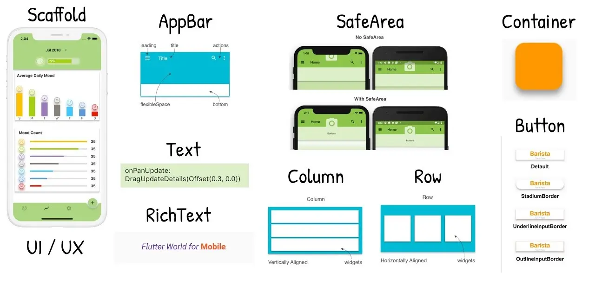
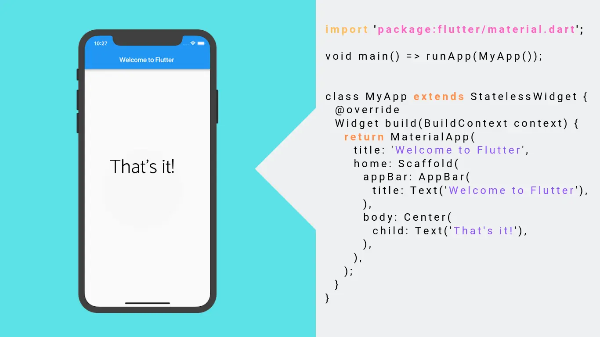
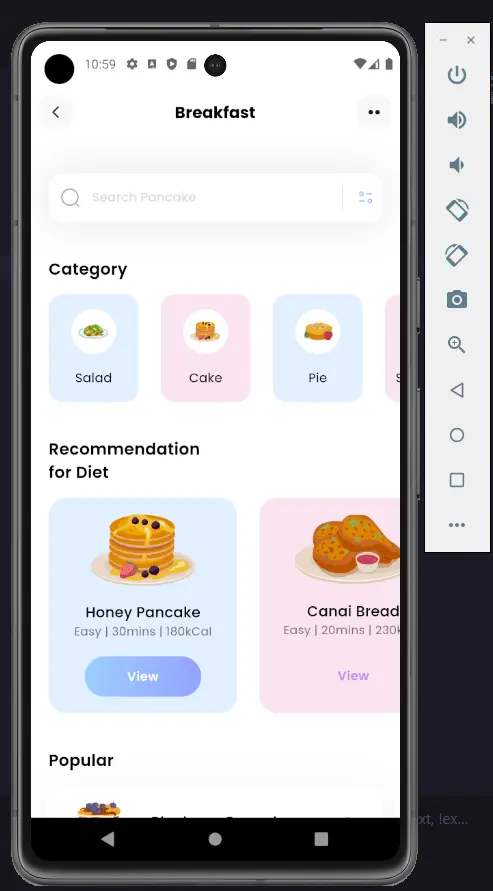
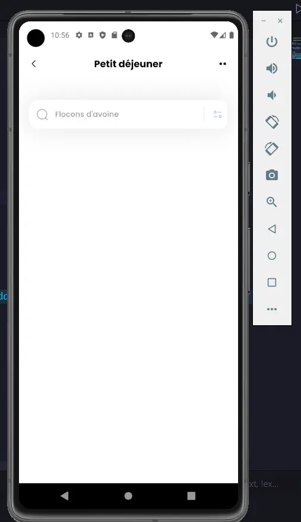
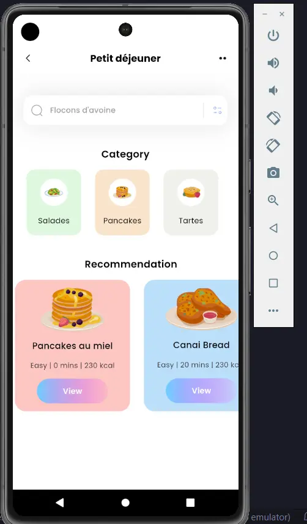

 
Ce MON nécessite quelques prérequis :
- avoir des notions de programmation orientée objet
- avoir un pc qui tient la route pour émuler une téléphone
- du courage


## Objectifs et backlog produit 

**L'objectif**

Je souhaiterais m'initier au développement d'application mobile, et pour ce faire j'ai choisi d'utiliser Flutter à travers le langage Dart.

**Qu'est ce que Flutter ?** &#129300;


Flutter, créé par Google, est un framework **open-source** conçu pour simplifier et accélérer le développement d'applications mobiles multiplateformes.
La particularité de Flutter réside dans son approche de création d'interfaces utilisateur riche et réactive, permettant aux développeurs de construire des applications qui offrent une expérience utilisateur fluide et cohérente, que ce soit sur **iOS, Android, ou même web.**


L'un des principaux avantages de Flutter réside dans son architecture de **widget**. Chaque élément de l'interface utilisateur, qu'il s'agisse de boutons, de mises en page, ou d'animations, est un widget.

Cette approche modulaire simplifie la création et la personnalisation des interfaces tout en facilitant la maintenance du code. De plus, Flutter propose une vaste bibliothèque de widgets prêts à l'emploi, facilitant ainsi la création d'applications esthétiquement attrayantes et fonctionnelles.

Un autre atout majeur de Flutter est sa rapidité de développement. Grâce à la fonctionnalité de rechargement "hot reload", les développeurs peuvent voir les modifications apportées à leur code en temps réel, accélérant ainsi le processus de test et d'itération. Cette caractéristique, combinée à la facilité de partage de code entre les plateformes, fait de Flutter un choix idéal pour les projets nécessitant une mise sur le marché rapide et une maintenance efficace.

**Qu'est ce que Dart ?** &#129300;

Dart est le langage de programmation qui accompagne Flutter. Également développé par Google, Dart est un langage moderne, orienté objet, offrant une syntaxe propre et concise. Conçu pour être à la fois performant et facile à apprendre, Dart s'intègre harmonieusement avec Flutter pour permettre aux développeurs de créer des applications mobiles robustes et élégantes.

La compilation just-in-time (JIT) de Dart offre une exécution rapide du code pendant le développement, tandis que la compilation anticipée (AOT) garantit des performances optimales une fois l'application déployée.

En résumé, Dart et Flutter forment un tandem puissant, offrant aux développeurs une solution complète pour la création d'applications mobiles modernes. La combinaison de la facilité de développement, de la rapidité d'exécution, et de la capacité à produire des interfaces utilisateur exceptionnelles fait de Flutter avec Dart un choix de prédilection pour ceux qui cherchent à exceller dans le domaine du développement mobile multiplateforme.

### Backlog

**Sprint 1**

|Intitulé|Complexité|Temps estimé|Temps réalisé|
|---|---|---|---|
|- Installer Flutter et mettre en place un émulateur Android   - M'initier au langage Dart à travers le tutoriel Codelabs   - Regarder des tutoriels pour débuter sur Flutter   - Rechercher un petit projet sympas à faire sur youtube   - Réaliser ce projet sympas   | 3   3   2   1   5 |1h   1h30   2h   30 mins   1h |**2h30   1h30   2h   30 mins   2h**  |

(Merci Sarah pour le beau tableau &#128526;)

**Retour et ajustement du Sprint 1**

J'ai dédié environ 8h30 de mon temps sur le premier Sprint, mais je pense avoir commis une erreur qui m'a fait perdre pas mal de temps.
En effet, j'ai voulu avancer petit à petit sur mon POK en installant tout l'environnement nécessaire au développement avec Flutter dans un premier temps, puis en espaçant mes sessions de travail afin d'avoir une certaine continuité. 
J'ai justement trop espacé ces sessions et j'avais donc du mal à replonger dans le logiciel et les formations que je suivais du fait que je sois purement débutant (d'autant plus que l'installation de tout l'environnement de développement m'a joué des tours)

Le petit projet sympas que je souhaite réaliser doit ressembler à cela :

Et voici ce que j'ai obtenu pour l'instant :

Et voici la vidéo youtube que j'ai suivi : [petit projet sympas](https://www.youtube.com/watch?v=D4nhaszNW4o&list=LL&index=2)

**Sprint 2**

|Intitulé|Complexité|Temps estimé|Temps réalisé|
|---|---|---|---|
|- Terminer mon petit projet sympas   - Commencer un projet un peu plus conséquent | 3   5| 2h   10h| **3h**   **8h**

Pour le second Sprint, je souhaite terminer mon premier projet Flutter.
Je souhaiterais ensuite rejoindre Monsieur Assane Diouf sur son fameux projet CupCare ou démarrer un projet en solo si cela n'est pas possible.

**Ce qu'il s'est passé durant le Sprint 2**

Durant le deuxième Sprint, j'ai tout d'abord terminé mon petit projet solo :

Assane a accepté de me laisser travailler avec lui sur son projet d'application [CupCare](https://francoisbrucker.github.io/do-it/promos/2023-2024/Diouf-Asssane/pok/temps-2/). Je vous invite à aller voir sa superbe application !

Voici comment nous avons travaillé ensemble.

J'ai tout d'abord eu accès au Figma de son projet ainsi qu'au code mis sur github. Nous avons ensuite discuté de la répartition des tâches afin d'être efficace. Voici le Backlog du projet pour le Sprint 2 :

- [ ] Finir la création des pages (3) **(Samy)**
  - [ ] Page d'un produit (1) **(Samy)**
  - [ ] Page d'une machine (1) **(Samy)**
  - [ ] Login et logout avec validation du form (1) **(Samy)**
- [ ] Faire une navigation fonctionnelle (sans se préoccuper de l'authentification) (1) **(Samy)**
- [ ] Ajouter des données factices dans Firebase (1) **(Assane)**
- [ ] Lier Firebase à Flutter (1) **(Assane)**
- [ ] Mettre en place l'authentification (3) **(Assane)**
  - [ ] Faire les config sur Firebase (1) **(Assane)**
  - [ ] Afficher les page de connexion/inscription que si le user n'est pas connecté (2) **(Assane)**
- [ ] Mettre à jour les pages avec les données (2) **(Assane)**
- [ ] Ajouter de vraies données (3) **(Assane)**

 
- Flutter installation et guide: https://docs.flutter.dev/get-started/install
- Playlist tutoriel Graven : https://www.youtube.com/watch?v=eKoo5gkEFjQ&list=PLMS9Cy4Enq5LUTdetDXnCwf8Q2j0xeMGD&pp=iAQB
Petit projet sympas sur youtube : https://www.youtube.com/watch?v=D4nhaszNW4o&list=LL&index=2
- Illustration Flutter : https://www.appstud.com/fr/flutter-faut-il-y-aller/
- Illustration Widget : https://miro.medium.com/v2/resize:fit:2000/1*LD4cLqvDpT0NG5lp9AUL2A.png
- Illustration liste Widget : Screen depuis https://www.youtube.com/watch?v=WOvj84xq_fc
 