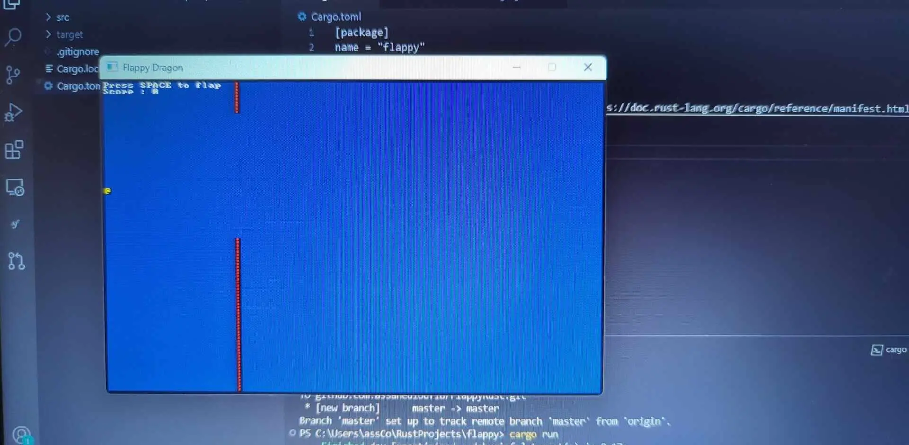
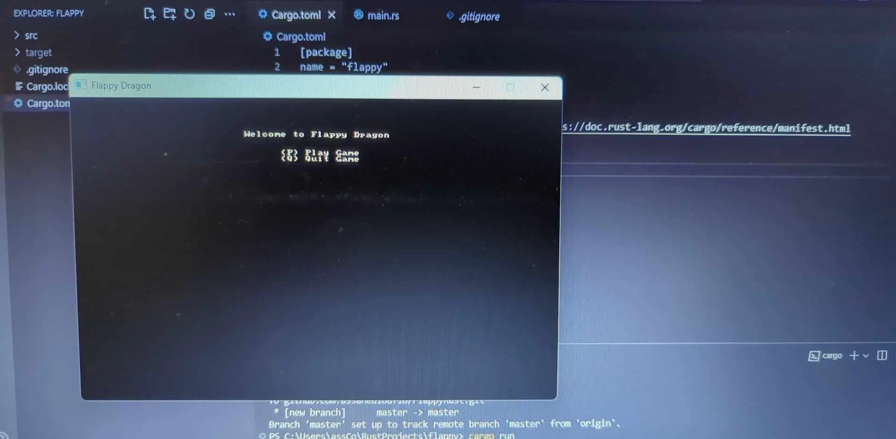
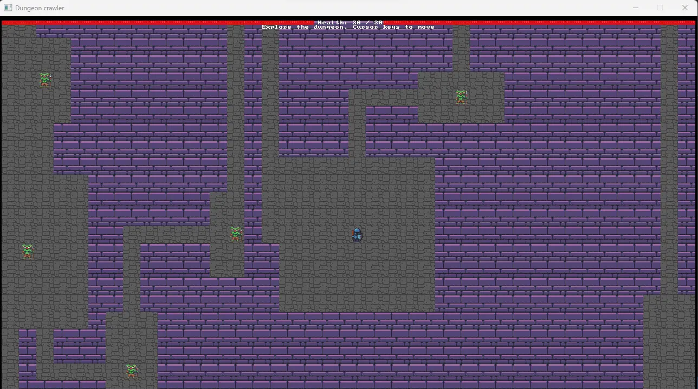

 
Il faut connaître : 
- des bases en C/C++ 
- l'utilisation d'un CLI (un terminal de commande) 


Pour faire mes débuts en Rust j'ai d'abord consulté le [site officiel](https://www.rust-lang.org/fr) du langage. On peut y trouver un livre (gratuit) pour apprendre le langage : [https://doc.rust-lang.org/book/](https://doc.rust-lang.org/book/).

J'ai aussi pu me baser sur un livre que m'a prêté M. Brucker : **Hands-on Rust : Effective learning through 2D Game Development and Play** de Herbert Wolverson. Etant donné que le livre proposé par Rust est composé de plusieurs chapitres d'explication avec peu de pratique, il m'a permis de commencer à pratiquer en même temps que j'apprenais les concepts du langage.

Cette vidéo Youtube est aussi une présentation (très) rapide à Rust : [Rust](https://www.youtube.com/watch?v=5C_HPTJg5ek)

## Présentation de Rust
- Parmis les langages préféré des développeurs
- Performant, sécurisé (typage, ownership), productif
- Permet de :
  - construire des CLI
  - se compile en web assembly
  - faire du réseau
  - faire du développement embarqué

## Comment faire du Rust ?
Rust étant un langage compilé, il faut commencer par installer le compilateur rustc. Ensuite, pour éditer du code en Rust, il faut un IDE comme Visual Studio Code ou CLIon (et bientôt RustRover). Enfin, pour exécuter son premier programme Rust, il faut créer l'exécutable avec la commande :
```bash
rustc main.rs 
```
et exécuter ce dernier avec : 
```bash
./main
```

L'usage est cependant d'utiliser **cargo** pour développer avec Rust. Cargo va permettre de gérer l'ensemble des dépendances du projet avec d'autres librairies Rust (des crates) et de facilement créer un exécutable et le tester.

Voilà à quoi ressemble un programme Hello World en Rust :
```rust
fn main() {
    println!("Hello, world!");
}
```

Dans Rust, tout le programme qui s'execute est dans la fonction main. On peut aussi noter le point d'exclamation de println!, il ne s'agit pas d'une fonction mais d'une macro.

## Les particularités de Rust
Tout d'abord, Rust est un **langage** typé, mais contrairement à d'autres langages, il prend aussi en compte l'espace occupé par chaque type. Par exemple, un entier signé sur 32bits a pour type i32 alors qu'un entier signé sur 8bits a pour type i8. Je trouve Rust particulièrement plus lisible que le C/C++ avec ces notations. En plus de ce système de type, Rust vient avec un système *simple* de conversion des variables d'un type à un autre. Rust introduit aussi une forme de string plus piégeuse que dans d'autres langages mais, en contrepartie, permet vraiment de travailler avec tout type de charactères de façon sécurisée.


On peut aussi parler du fait que la valeur nulle n'existe pas dans Rust. A la place, Rust introduit des énumérations comme les Options qui peuvent valoir Some(quelque chose) ou None. Couplé avec les matchs par exemple, cela permet de mieux gérer les erreurs à mon sens.


Ensuite, il y a l'**ownership** (la *propriété* en français), qui est un ensemble de 3 règles dont le but est de réduire le nombre d'erreurs dûe à la manipulation de la mémoire.


## C'est quoi l'ownership ?
L'ownership est un système de **management de la mémoire** en Rust, basé sur les règles suivantes :
- Chaque valeur a un propriétaire.
- Il ne peut y avoir qu'un proprétaire à la fois par valeur.
- Les valeurs sont automatiquement détruites avec le propriétaire.

Ces règles sont importantes à garder en tête lors du maniement de certaines valeurs. Il est alors intéressant, à mon sens, de tout voir alors comme dans le cas où l'on possède un objet :
- il n'a qu'un seul propriétaire
- si on le donne, il n'est plus à nous
- on peut cependant le prêter
- il y a plusieurs type de prêts (on récupère toujours l'objet identique ou on le récupère modifié)

Le cas des prêts représente les **références** en Rust. Les références permettent, par exemple, de passer une de ces valeurs à une fonction sans en perdre la propriété.

## Comment apprendre Rust ?
Comme je le disais plus haut, pour mon MON, j'ai étudié le livre officiel sur le site de Rust ainsi que le livre que M. Brucker m'a prêté qui explique Rust au travers du développement de jeu vidéo.

Le livre officiel sur le site de Rust est très complet et explique les concepts de base en détaillant le plus possible pour les lecteurs qui découvrent Rust. C'est une très bonne ressource pour découvrir les concepts centraux de Rust ainsi que les bonnes pratiques. Son point faible est que c'est beaucoup d'explications pour assez peu de projets pratiques (il y en a trois).

C'est sur ce dernier point que le livre qu'on m'a prêté était intéressant. Il est moins général sur les différents principes du langage, mais explique très bien tous les principes qu'il introduit. De plus, il permet de suivre un pro dans le domaine du jeu vidéo lorsqu'il crée un jeu (avec pleins de conseils, de pratiques, etc...).

J'ai donc réalisé les projets suivants pendant ces 20h :
- **GuessingGame** : deviner un nombre aléatoire entre 0 et 100 (Rust Handbook)
Voici le code de ce jeu d'introduction à Rust
```rust
use std::io;
use std::cmp::Ordering;
use rand::Rng;

fn main() {
    println!("Guessing game");

    let secret_value = rand::thread_rng().gen_range(0..=100);

    loop {
        let mut guess = String::new();

        println!("Please enter your guess :");

        io::stdin()
            .read_line(&mut guess)
            .expect("An error occured");

        let guess : u32 = match guess.trim().parse() {
            Ok(num) => num,
            Err(_) => continue,
        };

        println!("You guessed : {guess}");

        match guess.cmp(&secret_value) {
            Ordering::Less => println!("Too small"),
            Ordering::Greater => println!("Too big !"),
            Ordering::Equal => {
                println!("You win !");
                break;
            },
        };
    }
}
```
- **Flappy Dragon** : comme flappy bird mais avec un dragon; et sans les beaux graphismes (Hands-on Rust)
Voici quelques images du résultat obtenu :


*Retrouve le code sur mon [Github](https://github.com/assanediouf18/FlappyRust)*
- **Minigrep** : coder en Rust un programme qui trouve les occurrences d'une chaine de caractère dans un fichier (Rust Handbook)
L'objectif ici était de faire un grep vraiment très simple en utilisant de nouvelles connaissances en Rust (gestion des erreurs, tests, architecture du projet, etc...). C'est un programme a utiliser dans l'invité de commandes, retrouve le code sur mon [github](https://github.com/assanediouf18/Minigrep).
- **DungeonCrawl** : un aventurier cherche une amulette dans un donjon rempli de monstre. Je n'ai pas terminé le jeu au complet (Hands-on Rust)
Ce projet m'a vraiment permis d'en apprendre beaucoup sur Rust et sur le développement de jeu vidéo. J'ai pu gérer la création du donjon, son affichage, l'affichage du joueur et des monstres, implémenter un sytème de mouvement, etc...

*Retrouve le code sur mon [github](https://github.com/assanediouf18/DungeonCrawl).*

## Conclusion
A mon avis, Rust est un langage intéressant qui vaut le détour. Je souhaite maintenant étendre mes connaissances du langage et pratiquer davantage. Durant ces 20h, j'ai pu explorer plus profondément le langage mais je sens que j'ai encore besoin de beaucoup de pratique pour vraiment saisir certains concepts. Je vais donc terminer le livre officiel de Rust (il ne me reste que 3 chapitres) et essayer de faire quelques projets avec Rust.

## Pour la suite...
Rust est un langage aux multiples applications. Il est organisé autour d'une communauté active qui propose beaucoup de crates (packages).

Par exemple, Rust est un langage qui se compile très facilement en WebAssembly. J'aborde le WebAssembly plus en détail dans mon premier [POK](./../../pok/temps-1). Je vais donc juste dire ici que le webassembly peut directement s'éxécuter dans le navigateur. A partir de ce point, des membres de la communauté ont introduit des crates pour faire le front entier d'un site avec Rust ([Trunk](https://trunkrs.dev) avec [Yew](https://yew.rs) ou d'autres).

Il est aussi possible d'utiliser Rust pour développer des jeux-vidéos(avec [Bevy](https://bevyengine.org) ou encore bracket-lib), des applications de bureaux ([Tauri](https://tauri.app/fr/)) ou de faire du Rust côté serveur (on peut gérer tous les aspects d'une application avec Rust comme le montre cette video : [RSTY stack](https://youtu.be/luOgEhLE2sg?si=-GECHavzkNbjqvlI)).