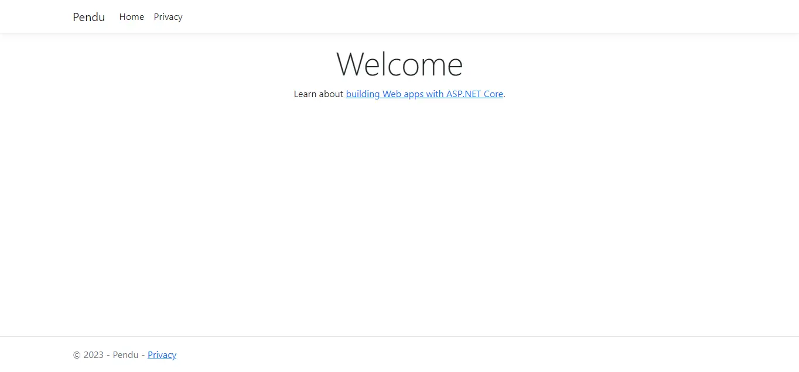

## Pourquoi ?
C# est un langage connu avec une large communanuté de développeur. Avec C#, on a un large éventail de choix allant de l'application web au jeu vidéo en passant par l'application mobile.
Je vais particulièrement m'intéresser au développement web ici.

## Faire un pendu
En me basant sur les MON précédent sur le langage, et la documentation, je vais essayer de réaliser un petit jeu textuel pour assimiler les bases du langages.

Voici les taches que j'identifie pour réaliser ce jeu :
- [X] Savoir lire dans un fichier le prochain mot
- [X] Savoir lire les entrées de l'utilisateur
- [X] Apprendre à organiser le code correctement

### Méthode
J'ai commencé par relire les MON des élèves ayant travaillé sur le langage avant moi (Vladimir et Savinien, voir dans la partie Source). Je me suis ensuite directement rendu sur le site officiel du langage (lien dans les Sources). J'ai ensuite suivi les étapes de découvertes du C# et fait un premier Hello World.

### Ce que j'ai fait
Pour mieux assimiler les principes du langages et pratiquer, j'ai décidé de réaliser un pendu en C#. Mon objectif final et d'avoir un petit site web avec un back en C# depuis lequel on peut jouer au pendu.

Pour commencer, j'ai développé un pendu auquel on peut jouer depuis la console. Pour le faire proprement, j'ai voulu bien séparer mon code. Pour se faire, j'ai fait les choix suivant :
- Avoir une classe Pendu, qui va représenter l'état du jeu : le jeu est-il en cours ? Combien d'erreurs ont été commises ? Etc...
- Avoir quelque chose pour sélectionner le mot à trouver. Je dis "quelque chose" car je voudrais me laisser la possibilité de changer la méthode de sélection de ce mot : le lire dans un fichier, le récupérer sur internet, etc... Afin d'avoir cette liberté d'implémentation, j'ai décidé de créer une interface nommée IWordProvider.
- Avoir un programme qui va utiliser la classe Pendu et communiquer avec le user (nombre d'essais restant, est-ce que le joueur a gagné, etc...).

J'ai donc séparé toutes les classes relatives au jeu (la class Pendu et l'interface dans leur namespace) pour obtenir l'architecture suivante :

```
projet
└── JeuPendu
    ├── WordProviders
    |   └── IWordProvider.cs
    |   └── OneWordProvider.cs
    └── Pendu.cs
 └── Program.cs
```

Je vais me concentrer sur les fournisseurs de mots, je mettrais mon code dans un github pour que ceux qui veulent puissent aller voir le reste.

#### L'interface IWordProvider

Cette interface a pour rôle de fournir des mots pour le jeu du pendu, la seule méthode a définir est donc une méthode qui réalise cette tache.
Voici le code de l'interface :

``` c#
// JeuPendu/WordProviders/IWordProvider.cs
namespace JeuPendu
{
    namespace WordProviders
    {
        public interface IWordProvider
        {
            public String GetWord();
        }
    }
}
```

Ainsi, toutes les classes qui implémenterons cette interface seront obligées de définir une méthode GetWord.

#### Qu'est-ce que ça donne dans la classe Pendu ?

Pour profiter de la flexibilité qu'offrent les interfaces, on va ajouter un champs dans la classe Pendu de type IWordProvider et demander à l'utilisateur de fournir ce IWordProvider :

```c#
// JeuPendu/Pendu.cs
using JeuPendu.WordProviders;

namespace JeuPendu
{
    public class Pendu
    {
        private IWordProvider _wordProvider;
        private string _secret = "";
        
        // D'autres champs

        public Pendu(IWordProvider provider)
        {
            _wordProvider = provider;
        }

        public void Start()
        {
            // Récupération du mot à deviner
            _secret = _wordProvider.GetWord().ToUpper();

            // Suite de la fonction...
        }

    }
}
```

#### Testons
Comme on ne peut pas instancier une interface, on doit créer une classe qui implémente cette interface pour pouvoir adapter notre programme principal et avoir un mot à deviner.

On va faire simple, et créer une classe qui renvoie toujours le même mot : OneWordProvider.
Voici le code de cette classe :

```c#
// JeuPendu/WordProviders/OneWordProvider.cs
namespace JeuPendu
{
    namespace WordProviders
    {
        public class OneWordProvider(string uniqueWord = "PENDU") : IWordProvider // on implémente l'interface
        {
            private readonly string onlyWord = uniqueWord.ToUpper();

            // On est donc obliger d'ajouter cette méthode dans la classe OneWordProvider
            public string GetWord()
            {
                return this.onlyWord;
            }
        }
    }
}
```

On arrive ensuite a avoir un jeu du Pendu qui fonctionne avec le code suivant dans le fichier Program.cs :

``` c#
// Program.cs
using JeuPendu;
using JeuPendu.WordProviders;

Console.WriteLine("Jouons au pendu !");

// On donne le provider qui nous intéresse ici !
Pendu Jeu = new Pendu(new OneWordProvider("Pendu"));

Jeu.Start();

Console.WriteLine(Jeu.KnownLetters);
Console.WriteLine("Entre une lettre ou un mot pour commencer.");
while(Jeu.IsGoingOn())
{
    string guess = Console.ReadLine() ?? "";
    if(Jeu.IsGoodGuess(guess))
    {
        Console.WriteLine("Bravo !");
        if(Jeu.Won) continue;
    }
    else
    {
        Console.WriteLine("Et non, essaie autre chose...");
        
        if(Jeu.Lost) continue;
        
        Console.WriteLine("Il te reste {0} essais", Jeu.NbAllowedMistakes - Jeu.Mistakes);
    }
    Console.WriteLine(Jeu.KnownLetters);
    Console.WriteLine("As-tu d'autres propositions ?");
}

if(Jeu.Won)
{
    Console.WriteLine("Bravo ! Le mot est bien {0}, tu as gagné !", Jeu.SecretWord);
}
else 
{
    Console.WriteLine("Le mot était {0}...", Jeu.SecretWord);
}
```

#### Récupérer les mots depuis un ficher
Pour la suite, j'ai demandé à chatGPT de générer une liste de 100 mots en rapport avec le développement, la gestion de projet ou les systèmes d'information. J'ai mis ces mots dans un fichier appelé "do_it.txt".

Ensuite j'ai créé une nouvelle classe de fournisseur de mots pour lire dans le fichier en question et renvoyer un mot aléatoirement :
```c#
// JeuPendu/WordProviders/WordFromFileProvider.cs
namespace JeuPendu	
{
    namespace WordProviders
    {
        public class WordFromFileProvider : IWordProvider
        {
            private readonly String[] words;

            public WordFromFileProvider(string filepath)
            {
                if(File.Exists(filepath))
                {
                    words = File.ReadAllLines(filepath);
                }
                else {
                    throw new Exception("Le fichier " + filepath + " est introuvable");
                }
            }

            public string GetWord()
            {
                Random rand = new Random();
                int chosenWordIndex = rand.Next(words.Length);
                return words[chosenWordIndex];
            }
        }
    }
}
```

Pour pouvoir jouer avec cette liste de 100 mots, il n'y a qu'une seule ligne a modifier dans le fichier Program.cs :

```c#
// JeuPendu/WordProviders/Program.cs

//code...

//Ligne à modifier !
Pendu Jeu = new Pendu(new WordFromFileProvider("do_it.txt"));

//suite du programme
```

### Faire du web avec C#

Satisfait de mon petit Pendu, je me suis dit qu'il était temps de découvrir le développement web avec C#. Le MON de Savinien est un très bon début pour avoir une meilleure idée du développement web avec C#. J'ai aussi visionné une playlist de vidéos publiée par dotnet sur le web avec C# (voir Sources).

Il est possible aussi bien de faire des applications Web que des API Web en C# avec ASP.NET. Etant donné que Savinien a fait une introduction aux API Web avec C# (cf Sources). Je vais donc faire une applications Web avec ASP.NET et je vous renvoie vers son MON si ce sont les API qui vous intéressent.

Pour me rapprocher des tutoriels que j'ai vu sur ASP.NET, je vais utilise Visual Studio 2022 dans la suite de mon MON (mais tout reste faisable avec VSCode ou Rider par exemple).

Pour lancer un projet d'application Web sur Visual Studio, il faut cliquer sur Nouveau Projet > Applications Web ASP.NET Core. Une fois que la solution est ouverte dans Visual Studio, on peut lancer le site généré en appuyant sur le bouton "play" vert. On a alors une page de ce type :



**A suivre dans mon deuxième MON du temps 2**

## Sources
- [MON Vladimir](../../../Vladimir-Jeantroux/mon/temps-1-2/) : vue d'ensemble syntax + POO en C#
- [MON Savinien](../../../../2022-2023/Laeuffer-Savinien/mon/csharp/) : vue d'ensemble .NET et différentes possibilités + exemple API Web bien détaillé
- [Tour of C#](https://learn.microsoft.com/fr-fr/dotnet/csharp/tour-of-csharp/) : vue plus détaillée du langages et accès à la documentation
- [Les namespaces](https://youtu.be/mw254_XAnGU?si=w7nkqOI2DmRyp9Ak) : clarification utilisation des namespaces
- [Playlist ASP.NET Web Application](https://youtube.com/playlist?list=PLdo4fOcmZ0oW8nviYduHq7bmKode-p8Wy&si=fJe1Oh3-JxUdWSva) : playlist ASP.NET débutant, pour découvrir le web avec C# (date de 4 ans)
