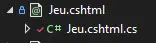
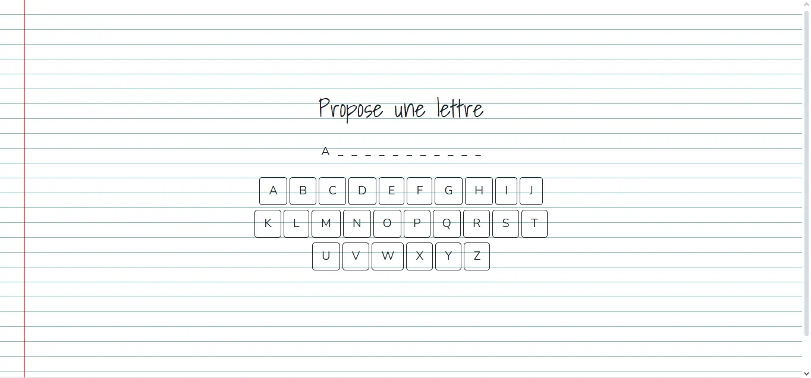
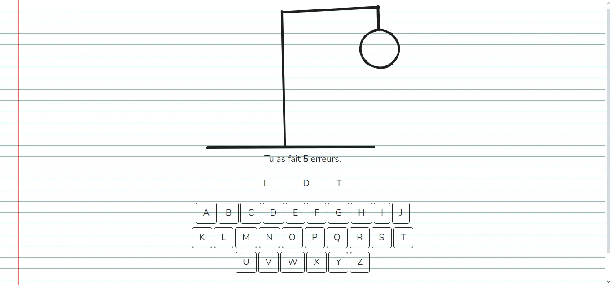
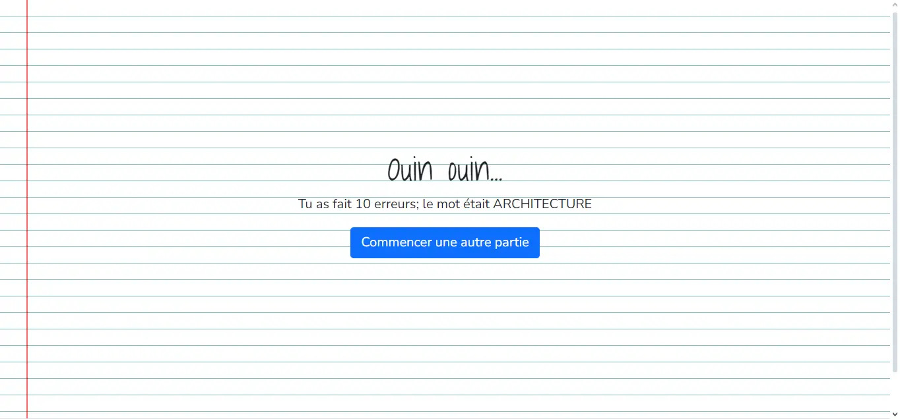
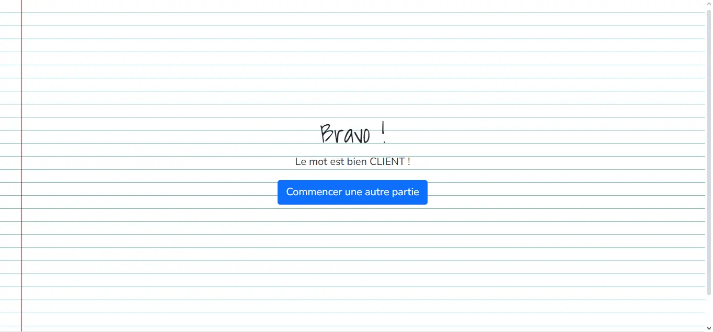

## Introduction
ASP.NET Core est un framework .NET pour le développement web avec C#. Dans ce MON, je me suis appuyé sur les vidéos citées dans les sources ainsi que les différentes pages du site de Microsoft. J'ai trouvé qu'il y avait beaucoup de choses à voir/comprendre car le framework offre beaucoup de possibilités.

## Blazor, Razor Pages et ASP.NET Core (MVC)
Pour faire une application Web ASP.NET, il y a 3 outils possibles : Blazor, Razor Pages et ASP.NET Core (MVC). Voici une courte comparaison (je vous encourage tout de même à lire [cette page](https://learn.microsoft.com/en-us/aspnet/core/tutorials/choose-web-ui?view=aspnetcore-8.0))

### Blazor :
Avantages : Il est côté client et permet le développement d'applications entièrement en C# et .NET (côté client et côté serveur).

Inconvénients : Les applications Blazor peuvent avoir une taille de téléchargement plus importante en raison de la nécessité de télécharger le runtime .NET sur le navigateur client.

### Razor Pages :
Avantages : Offre une approche plus légère qu'ASP.NET Core (c'est comme si chaque page embarquait sa logique back avec elle). C'est aussi très facile de l'utiliser avec le moteur de vue Razor, en créant des razors components par exemple.

Inconvénients : Comme ça ne suis pas vraiment l'architecture MVC ça offre un peu moins de controle.

### ASP.NET Core (MVC) :
Avantages : Il s'agit de l'architecture MVC qui est assez connue et offre une séparation claire des préoccupations.

Inconvénients : Un peu plus long à prendre en main pour les débutants par rapport à des solutions plus légères comme Razor Pages.

## Organisation d'un projet d'application Web ASP.NET Core

Lorsqu'on crée un projet par défaut d'application Web, on a un peu de code généré automatiquement pour aider les développeurs. Le projet de base utilise des Razor Pages et intègre Bootstrap par exemple. 

Le dossier wwwroot contient les fichiers js, css  et autres. 

Le dossier Pages contient toutes les pages et définis aussi les différents url accessibles depuis notre site; par exemple si vous avez un fichiers Pages/About.cshtml, alors cette page s'affiche lorsque le client va sur l'url /about. Il est rempli de fichiers .cshtml qui permettent de faire de templates html avec C# et d'utiliser Razor. C'est fichiers sont en fait comme des dossiers comme le montre l'image ci-dessous.


Le fichier cshtml contient du code qui ressemble à ça:
```c#
// Pages/Index.cshtml
@page
@model IndexModel
@{
    ViewData["Title"] = "Le pendu de DO It";
}

<div class="text-center">
    <h1 class="display-4 custom-font">Le Pendu</h1>
</div>

<p>
    Bienvenue sur ce jeu développé dans le cadre d'un MON.
    Il s'agit d'un pendu utilisant une liste de mots en rapport avec la gestion de projet,
    le management et le développement.
</p>
<a asp-page="Jeu" class="btn btn-primary">Jouer au pendu du jour</a>
```
*Si vous trouvez que ce n'est pas suffisant pour faire une page web, vous avez raison. Au fait, la balise html, les éléments du head, le footer et la navbar sont dans un fichiers de Layouts sur lequel toutes nos pages se basent.*

Tandis que le fichier .cshtml.cs contient une classe qui définit les données accessibles par cette page, ainsi que les différentes méthodes que l'on peut appeler :
```c#
// Pages/Index.cshtml/Index.cshtml.cs
using Microsoft.AspNetCore.Mvc.RazorPages;

namespace Pendu.Pages
{
    public class IndexModel : PageModel
    {
        private readonly ILogger<IndexModel> _logger;

        public IndexModel(ILogger<IndexModel> logger)
        {
            _logger = logger;
        }

        public void OnGet()
        {

        }
    }
}
```


Le fichier le plus important est sans doute le Program.cs. C'est dans ce fichier que notre programme se lance et qu'il est configuré. C'est dans ce fichier qu'on va ajouter nos services, configurer notre base de données, activer l'architecture MVC et ainsi de suite.

## Comment faire un site pour jouer au pendu ?
Entrons dans le vif du sujet. Dans mon premier MON du temps, j'ai développé un pendu version texte en C#; J'ai essayé de faire le développement en ayant bien en tête que je voulais qu'un maximum de code soit réutilisable. Mais pour faire celà, j'ai d'abord dû comprendre comment ajouter des services.

### Ajouter mes services
Tout d'abord, un service c'est du code que l'on souhaite pouvoir utiliser à plusieurs endroit de notre application et qui est chargé d'effectuer une seule chose. Par exemple, les WordProvider de mon MON précédents pourraient y correspondre. L'intérêt d'avoir des services dans ce genre de projets, c'est qu'on peut profiter de l'injection de dépendances et de l'inversion de controle. Pour se faire, il suffit d'ajouter la classe en question et d'ajouter une ligne dans le Program.cs qui indique à ASP.NET qu'on veut ajouter ce service. Dans mon cas, j'ai d'abord ajoutés mes différents WordProviders dans un dossiers Service de mon projet. Ensuite, j'ai ajouté la ligne suivante dans mon Program.cs :

```c#
// Program.cs
builder.Services.AddTransient<IWordProvider, WordFromFileProvider>();
```

*Ce que je dis à ASP.NET c'est d'instancier un WordFromFileProvider et de le fournir aux classes de mon projet qui ont besoin d'un IWordProvider*

### Intégrer le jeu du pendu à l'application
Ensuite il a fallu créer une page Jeu.cshtml dans laquelle j'ai pu appeler l'objet jeu de mon Mon précédent. Dans une Razor Page, on peut intéragir avec tous les éléments publics de notre classe dans le fichier .cshtml.cs. On peut aussi intégrer du code en C# en le préfixant d'un @.

### La persistence
Pour ce petit projet, je voulais qu'un utilisateur puisse jouer à une partie du pendu, puis en refaire autant qu'il le souhaite. Pour faire cela, je ne voulais cependant pas créer de classe utilisateur et mettre en place l'authentification. J'ai donc utiliser la session. Lorsqu'un joueur arrive pour la première fois sur la page du pendu, on lui crée un Jeu. Ensuite on enregistre les informations importantes momentanément (nombre d'erreurs, mot à trouver, etc...) grace à la session et on efface ce qui est inutile lorsque le joueur a terminé.

J'y étais réticent mais j'ai dû utiliser une base de données pour rendre le tout possible. Pour créer une base de données avec les Razor Pages, on utilise EF Framework. Il s'agit d'un ORM. Je vous renvoie vers les pages en sources pour voir plus en détail les étapes à suivre.

### Le résultat





*Retrouvez mon code sur [github](https://github.com/assanediouf18/PenduWeb)*


## Sources
- [Playlist ASP.NET Web Application](https://youtube.com/playlist?list=PLdo4fOcmZ0oW8nviYduHq7bmKode-p8Wy&si=fJe1Oh3-JxUdWSva) : présente simplement et rapidement les différentes possibilités d'ASP.NET Core
- [Choisir une UI Web avec ASP.NET Core 8](https://learn.microsoft.com/en-us/aspnet/core/tutorials/choose-web-ui?view=aspnetcore-8.0) : donne plus de précisions sur les avantages et les inconvénients de chaque possibilités
- [Les fondamentaux d'ASP.NET Core](https://learn.microsoft.com/en-us/aspnet/core/fundamentals/?view=aspnetcore-8.0&tabs=windows) : donne plus de détails sur le fonctionnement du framework et sur les différentes façons de le configurer
- [Paper effect in CSS](https://www.codesdope.com/blog/article/getting-notebook-paper-effect-with-css/) : J'ai utilisé le CSS de ce site pour faire le background de mon site