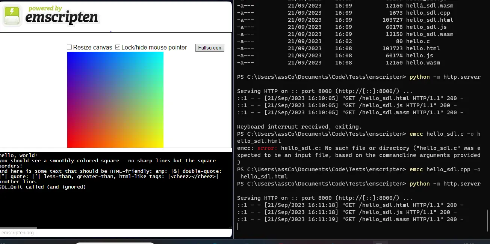
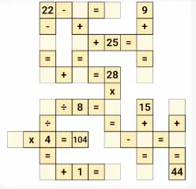
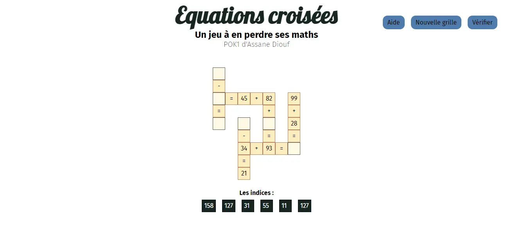

## C'est quoi le WebAssembly ?

> WebAssembly (abbreviated Wasm) is a binary instruction format for a stack-based virtual machine. Wasm is designed as a portable compilation target for programming languages, enabling deployment on the web for client and server applications.

*Cette définition est tirée de [webassembly.org](https://webassembly.org)*

WebAssembly est un langage qui est executé par une machine virtuelle et ceci directement dans le navigateur. De plus, de nombreux langages, comme le C/C++, peuvent être compilés en WebAssembly.

La majeur partie des navigateurs sont capables d'exécuter ce WebAssembly depuis quelques années. Il est donc possible d'écrire un programme dans un autre langage que le javascript, de porter celui-ci en WebAssembly et de faire appel à ce code depuis votre javascript. Le code ainsi réalisé est alors très rapide et offre des performances proches d'applications natives.

## Ce que j'ai prévu pour le 1er point POK
- Me former sur Rust (voir mon [premier MON](../../mon/Rust/))
- Compiler le Rust en WebAssembly et l'utiliser dans un site
- Trouver une idée plus précise du site que je vais réaliser
- Ajouter les fichiers HTML/CSS/etc... primordiaux au site

## Ce que j'ai fait

### Découvrir le WebAssembly
J'ai commencé par découvrir le WebAssembly. Pour ce faire, je suis allé sur leur site et j'ai visionné quelques vidéos youtube comme :
- Une présentation de WebAssembly par Fireship ([lien](https://youtu.be/cbB3QEwWMlA?si=ueUqehMnqwMaQCWD))
- Une introduction intéressante au WebAssembly ([lien](https://youtu.be/3sU557ZKjUs?si=YLLlOl5MAQwoTh27))
- Une autre vidéo de Fireship avec un exemple d'application ([lien](https://youtu.be/-OTc0Ki7Sv0?si=zvRBlrsuw_4xKhbY))

Ces informations m'ont permis de mieux saisir ce qu'est le WebAssembly. Elles ont aussi considérablement renforcés mon envie de le tester.

### Du C++ au WebAssembly
J'ai donc décidé d'essayer wasm. J'ai commencé par un autre langage que Rust car je ne le connaissais pas encore assez. Il est cependant possible de cibler le WebAssembly depuis plusieurs langages comme le C et le C++ par exemple, j'ai donc commencé par là.

Pour créer un code wasm avec du C++, il faut utiliser [emscripten](https://emscripten.org). Emscripten va prendre les fichiers sources et sortir un fichier en WebAssembly (.wasm), un fichier javascript et un fichier en HTML. Le javascript va automatiquement appelé le WebAssembly et définir les fonctions nécessaires pour que nos méthodes puissent être appelées depuis le javascript. Le HTML est alors une page générée automatiquement pour appeler ce javascript (en tout cas sa fonction main). J'ai pu obtenir le résultat suivant en utilisant emscripten sur un programme en C++/SDL :

### Rust et WebAssembly
J'ai ensuite suivi le tutoriel fournit par Rust sur le WebAssembly accessible [ici](https://rustwasm.github.io/docs/book/introduction.html).

Après cette étape, la majorité de mes questions sur le WebAssembly avaient trouvées leur réponses.

### Des équations croisées
Ensuite, il me fallait appliquer ce que je venais d'apprendre sur le WebAssembly et produire un livrable pour mon POK. Je me suis donc lancé le défi de réaliser un jeu d'équations croisées. Le résultat final, ressemblerait à ça :

*Cette image a été tirée du jeu Crossmath*

Je n'ai pas d'affichage pour l'instant, cependant voici ma progression jusqu'à présent :
- Création du code de génération d'équations
- Création des fichiers HTML de base
- Test de mes méthodes existantes jusqu'à présent

J'ai donc pu en arriver au point que je visais à la fin de ce premier point POK !

## Ce que j'ai prévu pour le second point POK
Pour la suite, voici les taches que je souhaite terminer :
- Terminer l'algorithme de génération des grilles *(difficulté estimée : 5)*
- Envoyer une grille avec des cases non complétées ainsi que les indices associés *(difficulté estimée : 2)*
- Afficher la grille dans la page *(difficulté estimée : 1)*
- Gérer le remplissage de la grille par le joueur *(difficulté estimée : 3)*
- Gérer la validation de la grille remplie par le joueur *(difficulté estimée : 1)*

## Ce que j'ai fait à la fin du temps 1

[Jouez au jeu en cliquant ici !](https://crossmath.assanediouf.com/)

### Les péripéties
Comme je l'avais estimé, le plus difficile a été l'algorithme de génération de la grille. Je l'ai fait un bon coup un soir puis j'ai commencé à mettre en place le js pour l'afficher. Seulement, cet affichage m'a juste montrer à quelle point je passais à côté de plein de cas : mon implémentation n'allait pas. J'ai donc modifié mon algorithme, pour ensuite m'apercevoir que j'avais encore oublié quelque chose. Ca a continuer comme ça encore une ou deux fois avant que j'ai quelque chose qui fonctionne pour de bon !

Il me restait ensuite assez peu de temps pour mettre en place mon CSS.

### Rétrospectives
Je pense que le code que j'ai écris pourrait être amélioré (ou au moins écrit de façon plus lisible). J'ai utilisé des tests en Rust, je pense que les tests relatifs à la création de la grille pourraient être améliorés. En effet, tous les tests des fonctions qui interviennent dans le processus étaient convaincants mais pas celui du tout.

Ensuite, je suis sûr qu'il est possible de rendre mon implémentation encore plus rapide en utilisant des éléments de Rust que je ne connaissais pas encore.

Je suis tout de même assez satisfait du résultat, je trouve assez incroyable que le tout se déroule uniquement en front.

### Et ensuite ?
Plein d'améliorations et de prolongements sont possibles, comme par exemple :
- améliorer le style (rendre la page responsive, équilibrer le design car on dirait qu'il y a un vide à gauche, etc..)
- ajouter des opérations comme les divisions et les multiplications
- optimiser l'algorithme de création de la grille
- rendre le remplissage de la grille plus intuitif (par exemple, griser une option si l'utilisateur a déjà placé la valeur)
- et biensûr, publier le site

## Conclusion
J'ai pu découvrir le webassembly avec Rust et réaliser cette application. Le webassembly est une très belle découverte, il ouvre de toutes nouvelles possibilités à mon sens. Je souhaite toutefois noter qu'il y a des façons différentes de faire du web avec Rust. Ces autres méthodes vont un peu masquer le côté web mais se basent aussi sur le webassembly (voir [Trunk](https://trunkrs.dev)).
Enfin, le code est disponible dans mon [github](https://github.com/assanediouf18/Crossmath).