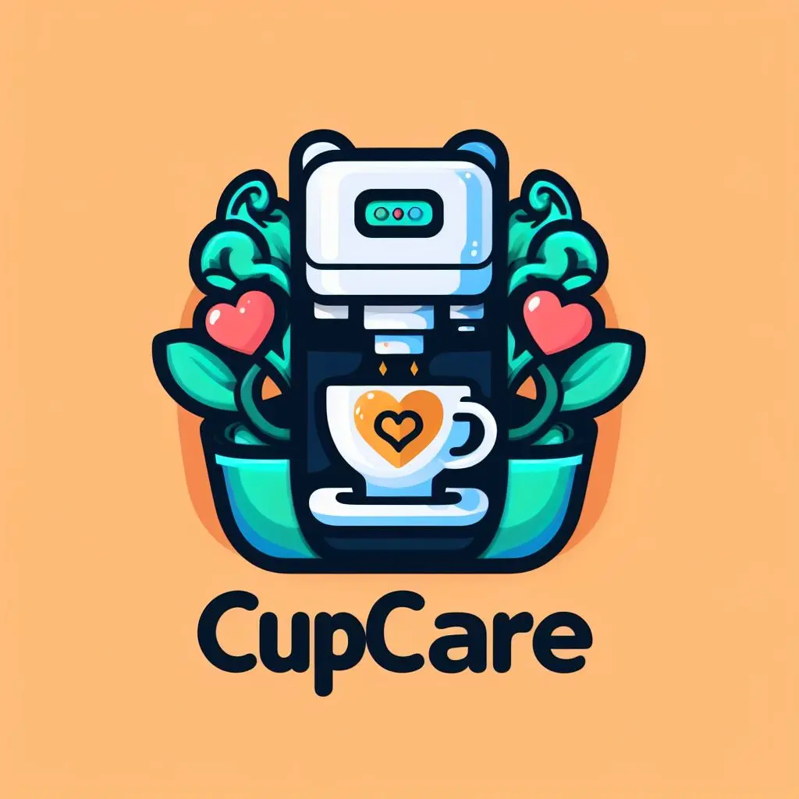
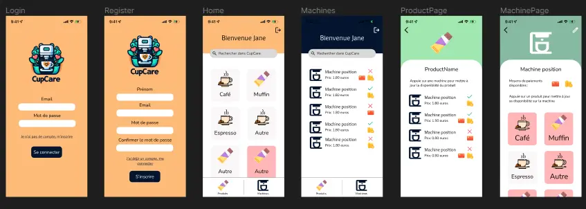
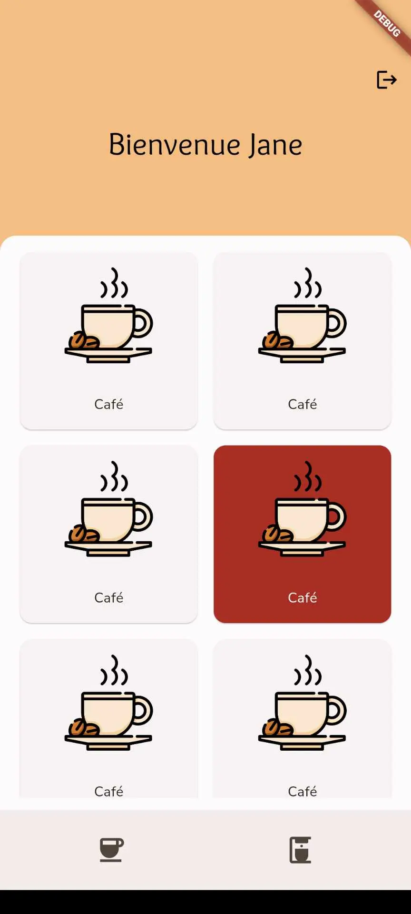
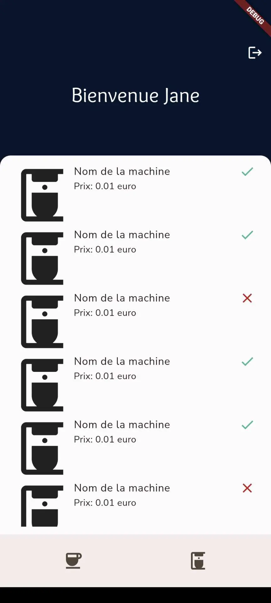

## Introduction
Personnellement, je ne bois pas de café. L'idée m'est venu en voyant sans arrêt mes camarades courir dans l'école à la recherche d'une machine à café qui fonctionne.

L'objectif de CupCare - l'application mobile que je vais développer - est donc de faciliter cette étape de recherche de la bonne machine à café. Les fonctionnalités auxquelles j'ai pensées sont donc les suivantes :
- Voir les machines à café et leur état (en panne, en marche ou inconnue)
- Voir quels produits sont disponibles
- Rechercher où trouver un produit en particulier. *Par exemple, savoir ou il est possible de récupérer un chocolat chaud (si c'est possible)*
- Un système d'authentification simple
- Laisser la possibilité aux utilisateurs de dire si un produit est accessible (ou pas) depuis une certaine machine
- Mme Piet a aussi proposer l'idée d'ajouter des informations sur l'affluence

### Quel point de départ ?
ChatGPT a fait des suggestions pour le nom du projet, et a généré un petit texte de présentation de l'application.

```
Bienvenue sur CupCare - Votre Café, Votre Instant!
Découvrez une nouvelle façon de vivre votre rituel matinal avec CupCare, votre compagnon de confiance pour un café parfait à tout moment de la journée!

✨ Pourquoi choisir CupCare?

CupCare est bien plus qu'une simple application – c'est votre alliée matinale, toujours prête à vous guider vers le café parfait, accompagné du biscuit qui mettra un sourire sur votre visage.

🌍 Un Café, Une Aventure

Que vous soyez étudiant en quête d'inspiration ou jeune ingénieur prêt à conquérir le monde, CupCare vous assure que votre pause café soit aussi exceptionnelle que vous l'êtes. Notre application vous permet de localiser instantanément les machines à café fonctionnelles les plus proches, vous assurant ainsi de ne jamais être loin de votre pause café bien méritée.

☕ Toujours à portée de main

Avec CupCare, la recherche du café parfait devient une aventure quotidienne. Où que vous soyez, quoi que vous fassiez, votre café idéal et votre biscuit préféré ne sont qu'à quelques clics. Soyez prêt à redécouvrir le plaisir d'une pause café à chaque instant.

🎓 Pour les Étudiants, Par les Étudiants

CupCare comprend les besoins des étudiants et des jeunes ingénieurs. Nous sommes là pour simplifier votre journée bien remplie en vous offrant un accès rapide à votre carburant essentiel – le café !

Rejoignez la communauté CupCare dès aujourd'hui et transformez chaque tasse en une expérience inoubliable. Parce que chaque journée mérite un café exceptionnel.

Commencez votre journée avec CupCare! ☕✨
```

J'ai aussi fait générer un logo par Bing Image Creator. Cela m'a permis d'avoir une piste pour la charte graphique de l'application. Voici le logo en question :


### Comment je vais m'y prendre ?
J'ai prévu d'utiliser Flutter et Firebase pour développer cette application. 

Flutter est un framework Dart de développement multiplateforme développé par Google. Pas de panique : j'explique la phrase. Dart est un langage développé par Google pour concurrencer javascript à l'origine - ça n'a pas fonctionné. En revanche, Google a tout de même décidé de développer Flutter en se basant dessus. Flutter est multiplateforme, car il permet de cibler plusieurs plateformes "en même temps" : mobile (Android et iOS), web et desktop (Windows, Mac et Linux).

Firebase est une plateforme de développement d'application et dispose d'outils pour accélérer le développement (base de données en NoSQL, authentification, etc...), le déploiement et le monitoring d'applications.

Il s'agit de deux technologies que j'avais déjà utilisées ensemble, ce POK me permet de réactiver mes connaissances et d'ajouter une meilleure application mobile à mon portefolio.


## Ce que je vais faire dans le premier sprint
*J'ai mis la difficulté estimée entre parenthèses pour chaque tache*
- [X] Lister les pages essentielles (1)
- [X] Etablir la charte graphique (1)
- [X] Faire le design des pages principales (2)
  - [X] Accueil
  - [X] Page produit
  - [X] Inscription
  - [X] Connexion
- [X] Initialiser le projet (1)
- [ ] Ajouter les pages principales dans l'application (3)
- [ ] Ajouter des données factices dans Firebase (1)

## Ce que j'ai fait à la fin du sprint 1

### Le figma
J'ai commencé par lister les fonctionnalités du projet plus en détail. Ensuite j'ai défini la structure de base de mes données.

A partir de ces éléments, j'ai commencé à réaliser le design de l'application. Je voulais faire quelque chose de simple et aller relativement vite sur cette partie mais je voulais tout de même bien la réaliser.

Après un retour d'Arthur j'ai ajouté les pages suivantes ainsi que quelques components et modaux :
- Page avec une liste des machines
- Page avec la liste des produits par machines
- Le mode de paiement disponible par machines

Comme j'ai pris le cours de spécialité sur le design au temps 2, j'ai pu appliqué les principes vus en cours au fur et à mesure.


[Lien vers le figma](https://www.figma.com/file/KrzuGL4Nrb4MhMlsdhjwRe/CupCare?type=design&node-id=0%3A1&mode=design&t=5il8f3tk5P32RCeI-1)

### Le début du développement
Initialiser le projet en Flutter s'est fait très rapidement. J'ai ensuite pu commencer à développer les pages. Pour ce premier sprint, j'ai réaliser l'armature des pages de mon figma. En effet, elles partagent toutes une base commune exceptée les pages d'inscription et de connexion. J'avais simplement noté que je voulais réaliser les pages principales de l'application, ayant réalisé la page d'accueil côté produit et machine, je ne sais pas si cela correspond à ce que je voulais.
**La prochaine fois je serai plus claire dans les taches que je souhaite entreprendre**




### Et Firebase ?
Je n'ai pas ajouté de données factices à Firebase, ni même initialisé Firebase dans le projet, car je me suis laissé prendre par Flutter. En effet, depuis ma dernière utilisation le framework a bien évolué et je me suis un peu perdu en explorant ses changements !
C'est donc une tache que je reporte pour le prochain sprint ! Je ne pense pas que sa difficulté estiméee doive changer.

## Ce que je vais faire dans le deuxième sprint
- [ ] Finir la création des pages (3)
  - [ ] Page d'un produit (1)
  - [ ] Page d'une machine (1)
  - [ ] Login et logout avec validation du form (1)
- [ ] Faire une navigation fonctionnelle (sans se préoccuper de l'authentification) (1)
- [ ] Ajouter des données factices dans Firebase (1)
- [ ] Lier Firebase à Flutter (1)
- [ ] Mettre en place l'authentification (3)
  - [ ] Faire les config sur Firebase (1)
  - [ ] Afficher les page de connexion/inscription que si le user n'est pas connecté (2)
- [ ] Mettre à jour les pages avec les données (2)
- [ ] Ajouter de vraies données (3)

## Ce que j'ai fait à la fin du sprint 2
- [ ] Finir la création des pages (3) -> Samy
  - [ ] Page d'un produit (1)
  - [ ] Page d'une machine (1)
  - [ ] Login et logout avec validation du form (1)
- [ ] Faire une navigation fonctionnelle (sans se préoccuper de l'authentification) (1) -> Samy
- [X] Ajouter des données factices dans Firebase (1)
- [X] Lier Firebase à Flutter (1)
- [X] Mettre en place l'authentification (3)
  - [X] Faire les config sur Firebase (1)
  - [X] Afficher les page de connexion/inscription que si le user n'est pas connecté (2)
- [X] Mettre à jour les pages avec les données (2)
- [X] Ajouter de vraies données (3) -> Je reconnais ne pas avoir ajouté tous les produits de toutes les machines

Certaines taches m'ont surpris car malgré une difficulté plutot faible elles ont été longues (ajouter Firebase au projet par exemple).
J'ai donc pu terminer en 20H pile, je remercie Samy pour l'aide qu'il m'a apportée.

## Ajout de dernière minute
Je ne peux pas vous faire tester l'application directement sur votre téléphone car le processus de publication sur Google Play et l'App Store prend plusieurs jours et est payant. Cependant, Flutter est un framework multiplateforme, je peux donc construire une version web et déployer ça pour vous montrer !

**Attention** L'application n'a pas été pensée pour bien s'afficher sur d'autres appareils que les téléphones, je vous recommande donc d'essayer l'application sur votre mobile (ou avec une fenêtre pas trop large). Cependant, il est possible dans Flutter de faire des UI qui s'adapte aux différents appareils et aux différentes taille d'écran (comme des medias queries).

<iframe src="https://cupcare.assanediouf.com" width="353px" height="745px"></iframe>

*Retrouvez l'application [ici](https://cupcare.assanediouf.com)*

## Conclusion
J'ai pu compléter les taches que je m'étais attribuées, cependant il resterai encore quelques petites choses à faire sur ce projet à mon avis. Par exemple, pour l'instant le pseudo de l'utilisateur n'est pas accessible dans l'application. Et il faudra continuer à ajouter des produits et mettre à jour la disponibilité des produits sur les machines

Ca m'a fait plaisir de revoir Dart, Flutter et Firebase. J'ai sans doute mal évalué certaines taches parce que, comme j'avais déjà réalisé un projet avec Flutter auparavant, j'ai dû surévaluer ma vitesse/mon aisance.