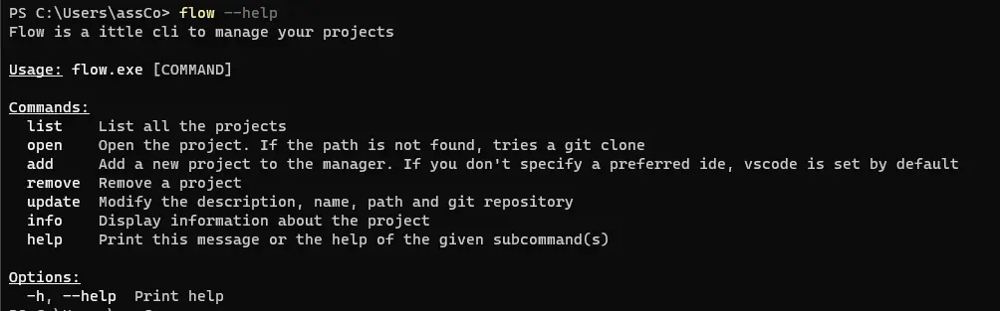
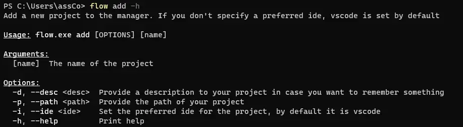
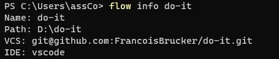

## Introduction
Lors du premier temps à Do_It, j'ai découvert Rust. Rust est un langage bas niveau très apprécié par les développeurs pour son aspect "safe by design". J'ai donc envie d'appliquer mes connaissances en Rust pour progresser davantages.
Dans ce POK, je vais développer un CLI (Command Line Interface). Il s'agit d'un programme qui tourne dans l'invité de commande avec laquelle l'utilisateur peut intéragir grace à des commandes. Pour ce faire je vais utiliser le crate clap.rs, qui vient avec plein d'outils pour créer des commandes avec Rust.

## Idée
J'ai pensé développer un outil simple de suivi des projets pour les développeurs sur leur machine locale. Les fonctionnalités seraient les suivantes :
- Ajouter un projet (nom, description)
- L'ouvrir dans l'IDE qui convient
- Le cloner directement dans le bon dossier si le projet n'est pas présent en local
- Suivre le temps passé sur chaque projet

## Ce que j'aimerai faire pour le sprint 1
- [ ] Découvrir les commandes clap.rs (2h)
- [ ] Sérializer/désérializer les configurations (2h)
- [ ] Pouvoir ajouter des projets (1h)
- [ ] Pouvoir lister les projets présents sur la machine (1h)
- [ ] Afficher les informations spécifiques à un projet (1h)
- [ ] Supprimer des projets (1h30)
- [ ] Mettre à jour des projets (1h30)

## Ce que j'ai fait au premier sprint

Je pense avoir mal évalué le temps nécessaire pour chacune des taches car j'ai pu effectuer toutes les  taches prévues ainsi que quelques taches prévues pour le sprint 2.

- [X] Découvrir les commandes clap.rs
- [X] Sérializer/désérializer les configurations
- [X] Pouvoir ajouter des projets
- [X] Pouvoir lister les projets présents sur la machine
- [X] Afficher les informations spécifiques à un projet
- [X] Supprimer des projets
- [X] Mettre à jour des projets

Réalisé en plus :
- [X] Pouvoir ouvrir les projets dans vscode
- [X] Pouvoir ouvrir les projets dans l'ide souhaité par le développeur

Pour la suite j'aimerai aussi passer du temps sur la gestion correcte des erreurs.

En attendant voici quelques images de mon POK. *J'ai décidé d'appeler ma commande flow.*

Toutes les commandes listées ci-dessous ont bien été entièrement implémentées sauf la commande open qui ne clone pas encore les projets lorsque le chemin d'accès n'est pas déterminé.

## Ce que j'aimerai faire au sprint 2
- [ ] Pouvoir ouvrir les projets dans l'ide souhaité par le développeur (2h) *réalisé au sprint 1*
- [ ] Pouvoir suivre le temps passé sur chaque projet (4h)
  - [ ] Conserver dernière date d'ouverture (1h)
  - [ ] Ajouter une commande pour indiquer que l'utilisateur arrête de travailler sur le projet (2h)
  - [ ] Garder en mémoire le temps passé (1h)
- [ ] Pouvoir ouvrir les projets dans vscode (1h) *réalisé au sprint 1*
- [ ] Cloner le projet si il n'est pas présent en local (1h)

## Ce que j'ai fait au sprint 2
- [X] Pouvoir suivre le temps passé sur chaque projet
  - [X] Garder en mémoire le temps passé
  - [X] Ajouter un système pour lancer le timer et pour l'arrêter
- [X] Cloner le projet si il n'est pas présent en local

Les taches suivantes n'ont pas été réalisée car je ne suis pas sûr de leur utilité dans le projet :
- [ ] Conserver dernière date d'ouverture
- [ ] Ajouter une commande pour indiquer que l'utilisateur arrête de travailler sur le projet

## Conclusion
Le CLI fonctionne avec les fonctionnalités attendues ! Je l'utilise régulièrement et, pour la suite, je vois quelques pistes d'évolution comme par exemple :
- Mettre un meilleur système de gestion des erreurs
- Automatiquement lancer l'installation des dépendances après le clonage d'un projet
- Automatiquement trouver les liens github des projets
- Améliorer le README
- Publier le programme
