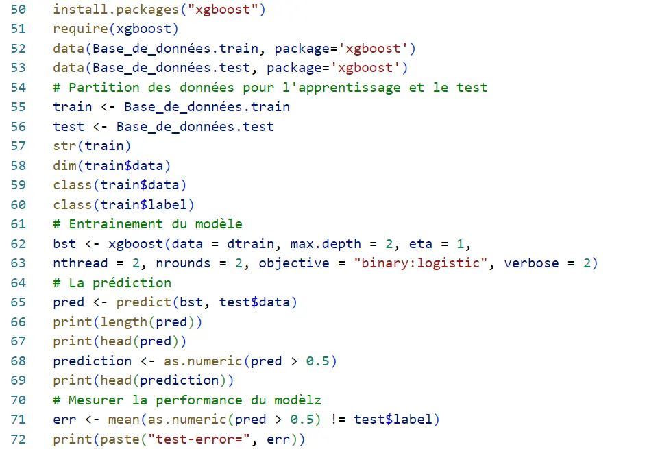

## Table des matières

- [Introduction](#section-1)
- [Cheminement des données](#section-2)
- [Introduction à R](#section-3)
- [Ressources utilisées](#section-4)
- [Perspectives](#section-5)

## Introduction 
L'analyse statistique met en avant les compétences essentielles nécessaires pour comprendre, traiter et interpréter des données, afin de prendre des décisions éclairées en se basant sur des données empiriques plutôt que sur des conjectures, de tester des hypothèses, de gérer les risques et d'optimiser les processus. Pour un ingénieur en informatique, ces compétences trouvent une application cruciale dans le traitement de données massives, le développement de modèles d'apprentissage automatique, la gestion de la qualité du code, l'optimisation des ressources informatiques, la prédiction de la demande et bien d'autres domaines. 

## Cheminement des données 
 
  

### Etape 1 : Touver les données

La première étape consiste à obtenir des données, qu'il s'agisse d'utiliser une base de données préétablie ou d'établir les variables nécessaires et de créer et mettre en œuvre une méthode de collecte, par exemple : 

- **Informations provenant de particuliers** : Sondages d'opinion délibératifs, Journaux , Échelles de réalisation des objectifs, Tri hiérarchique des cartes, Entretiens, Photolangage, Isoloir de vote, Techniques projectives, Questionnaires en face à face, Questionnaire , Calendriers saisonniers, Cartographie d'esquisse, Histoires de changement, Histoires personnelles
-	**Informations des groupes Bilan après action** : Réflexion / brainstorming, Cartographie conceptuelle (carte mentale ou de carte de cluster), Étude Delphes, Dotmocratie, Entretiens, ORIDE, Méthodologie Q, Analyse SWOT
-	**Observation** : Excursions, Observation non participante, Observation participante, Enregistrement photographique/vidéo pour la collecte de données, Transect
-	**Mesures physiques** biophysique ou géographique
-	**Examen des enregistrements et des données existants** : Big Data, documents existants, évaluations et recherches antérieurs 

### Etape 2 : Nettoyer les données 
Une fois qu’on obtient les données, on doit les explorer pour comprendre le format et les variables et les vérifier et voir s'il y a des erreurs et des valeurs manquantes. Il peut être nécessaire de nettoyer les données avant de les utiliser à des fins d'analyse, ce qui comprend notamment la correction du formatage, le retrait ou la correction de données erronées. 
Et ce en exploitant des outils selon la nature des données, comme IBM Infosphere Quality Stage, tableurs, Power BI, etc.

Le nettoyage des données est une étape d’importance cruciale, sans laquelle un bon modèle d’analyse perd sa valeur.

 
  

### Etape 3 : Analyser les données
Le but de l'analyse et de la modélisation est d'utiliser des techniques statistiques pour transformer les données en information afin de fournir des observations utiles. L'analyse et la modélisation servent à décrire un phénomène, à tirer des conclusions au sujet d'une population ou à faire des prédictions au sujet d'événements futurs.
 
 -**Analyse bivariée** : L’analyse bivariée a pour objectif d’analyser le lien qui peut exister entre deux variables. Le schéma mentale suivant résume les étapes à suivre dans ce type d'analyses : 

  

## Introduction à R 
### Statistiques descriptives 
Les statistiques descriptives permettent à résumer et à comprendre vos données. R propose des fonctions telles que summary(), mean(), median(), sd() et quantile() pour calculer des statistiques descriptives de base pour les variables numériques.

  

### Tests d'hypothèses :
R offre de nombreuses fonctions et packages pour les tests d'hypothèses, notamment les tests t, les tests du chi-carré, et bien d'autres. Les fonctions t.test(), chisq.test() et wilcox.test() sont des exemples d'outils utilisés pour les tests d'hypothèses.

  

### Analyse de régression :
L'analyse de régression est utilisée pour modéliser la relation entre une ou plusieurs variables indépendantes et une variable dépendante. La fonction lm() de R est couramment utilisée pour la régression linéaire, tandis que glm() est utilisée pour les modèles linéaires généralisés (par exemple, la régression logistique).

  

### Graphiques statistiques :
La création de représentations graphiques appropriées des données est essentielle pour comprendre les relations et les tendances. Le package ggplot2 de R est un outil puissant pour créer une large gamme de graphiques statistiques, notamment des graphiques de dispersion, des boîtes à moustaches, des histogrammes, et plus encore.

  

### Apprentissage automatique :
R est également largement utilisé pour les tâches d'apprentissage automatique. Les packages tels que caret, randomForest, xgboost et caret fournissent des outils pour la classification, la régression, le regroupement, et bien plus encore.

  

## Ressources utilisées 
-	Statistics course. Disponible sur : https://www.youtube.com/playlist?list=PLqzoL9-eJTNAB5st3mtP_bmXafGSH1Dtz 
- Présentation des méthodes de collecte et d'analyse de données dans l'évaluation d'impact, Greet Peersman. Disponible sur : https://www.unicef-irc.org/publications/pdf/brief_10_data_collection_analysis_fre.pdf
- BetterEvaluation, page Internet « Collect and/or Retrieve Data ». Disponnible sur : http://betterevaluation.org/plan/describe/collect_retrieve_data 
- Analyse Statistique M2 IGAST, et DESIGEO. Disponible sur : https://www.umr-lastig.fr/paul-chapron/resources/cours_site/bivariee.html

## Perspectives 
Mon objectif est de mettre en pratique ce cours par la suite, pour analyser des données et générer des informations précieuses pour l’aide à la décision. 