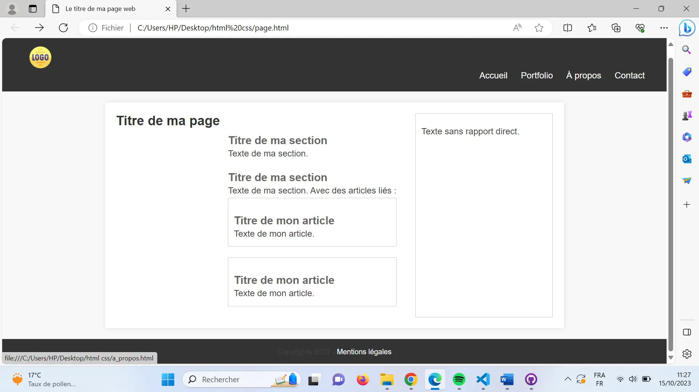

## Introduction
Le développement front-end, également connu sous le nom de développement côté client, fait référence à la création de l'interface utilisateur d'un site web ou d'une application, que les utilisateurs finaux voient et avec laquelle ils interagissent directement.

Dans ce mon, j’ai appris les bases de HTML & CSS. Ce qui m’a permis de développer un site web qui pourra  me servir comme modèle dans mes prochains Pokémon.

## Structure du site web
Une structure de page web fait référence à l'organisation et à la disposition des éléments sur une page web. Elle définit comment les différents éléments, tels que le texte, les images, les liens, les formulaires et autres médias, sont agencés et hiérarchisés pour créer une page web cohérente et conviviale.

La majorité de sites web (y compris celui que j’ai développé) sont organisés de la façon suivante : 


## Code HTML

Il s'agit du langage de balisage qui permet de structurer le contenu d'une page web. Il définit les éléments tels que les titres, les paragraphes, les listes, les images, les liens, les formulaires, et bien d'autres encore. Les &lt;balises&gt; encadrent le contenu et déterminent comment il doit être affiché dans le navigateur

Structure du code HTML :
```html
<!DOCTYPE html>
<html>

<head>
    <meta charset="utf-8" >
    <title>Titre du site</title>
</head>

<body>
    <header>
      <!-- contenu de l'en-tête-->
    </header>
    <main>
      <!--contenu principal de la page-->
    </main>
    <footer>
      <!--contenu du pied de page-->    
    </footer>
</body>

</html>
```
En appliquant cette structure, j’ai développé le code du site que vous prouvez visualiser [ici](https://github.com/KawtarBahri/Template-Site-Web/blob/main/page.html).
## Code CSS

CSS utilisé pour styliser et formater les éléments HTML. Il permet de définir la couleur, la police, la taille, la mise en page et d'autres propriétés visuelles des éléments sur une page web. CSS permet de séparer le contenu (HTML) de sa présentation, ce qui rend le design plus flexible et maintenable.


Structure du code CSS : 
```css
element {
  Propriété : valeur ;
  Propriété : valeur ;
}

/*exemple*/
main {
    max-width: 800px;
    margin: 20px auto;
    background-color: #fff;
    padding: 20px;
    box-shadow: 0 0 10px rgba(0, 0, 0, 0.1);
}
/*Pour styliser plusieurs éléments à la fois, 
"element" peut etre remplacé par ".class" ou "#id"*/
```
En appliquant cette structure, j’ai développé le stylesheet du site que vous prouvez visualiser [ici](https://github.com/KawtarBahri/Template-Site-Web/blob/main/style.css).

## Résultat
En liant les deux codes HTML et CSS explicités précédemment, j’ai obtenu le résultat suivant : 


## Références : 

-	[Cours de Openclassrooms HTML5 et CSS3](https://openclassrooms.com/fr/courses/1603881-creez-votre-site-web-avec-html5-et-css3)
- [HTML Tutorial](https://www.w3schools.com/html/default.asp)
- [CSS Tutorial](https://developer.mozilla.org/fr/docs/Learn/CSS/First_steps/How_CSS_is_structured)


