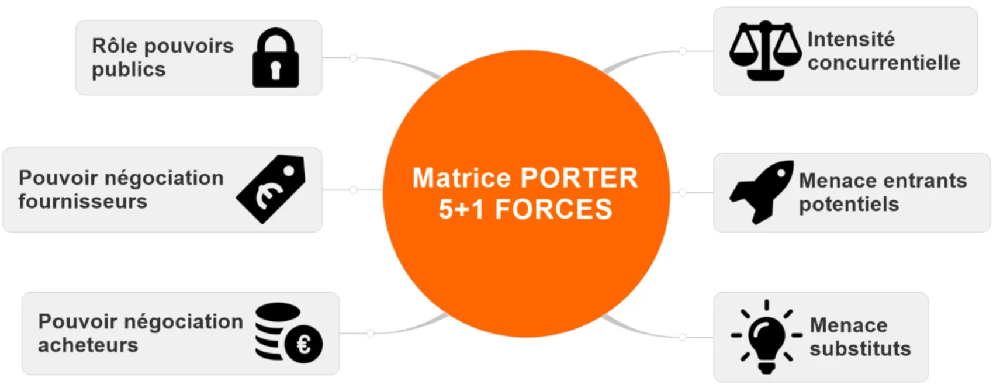
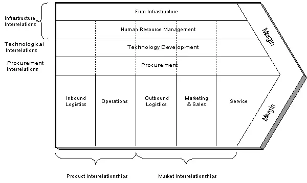

## Horodatage 
- Cours de Mme Piet + l'étude de cas : ***5hrs*** Le 18/02 
- Les autres modèles de stratégie IT : ***3hrs*** Le 21/02 
- La planification adoptée dans les cabinets de conseil (exemple de Gartner) : ***2hrs*** Le 24/02 

## Résumé du cours Stratégie IT 
### Modèles de stratégie IT 

    
        
        

          <strong>Modèle des cinq forces</strong> : est un outil d'analyse qui évalue l'environnement concurrentiel dans lequel une entreprise opère. Il identifie cinq forces qui influencent la compétitivité d'une industrie : la menace de nouveaux entrants, le pouvoir de négociation des fournisseurs, le pouvoir de négociation des clients, la menace des produits de substitution et l'intensité de la rivalité concurrentielle. Dans le contexte de la stratégie IT, ce modèle peut aider à évaluer les forces qui façonnent le paysage concurrentiel des solutions technologiques, permettant ainsi aux entreprises de développer des stratégies pour se positionner avantageusement sur le marché.  
          <strong>Modèle de la chaîne de valeur</strong> : est un outil qui analyse les activités spécifiques au sein d'une organisation et les divise en deux catégories : les activités principales et les activités de soutien. Les activités principales sont directement liées à la création, à la production, à la commercialisation et à la livraison d'un produit ou service, tandis que les activités de soutien fournissent le soutien nécessaire aux activités principales. Dans le contexte de la stratégie IT, ce modèle permet aux entreprises d'identifier les processus et les technologies qui ajoutent de la valeur à leurs opérations, ainsi que ceux qui pourraient être optimisés ou externalisés pour améliorer l'efficacité et réduire les coûts.
        

    

    
        
        

            
             
            
        

    

### Outils de gestion en stratégie IT 
***Tableau de Bord Stratégique (Balanced Scorecard)***: permet d'aligner les objectifs stratégiques à long terme avec les actions opérationnelles quotidiennes en prenant en compte quatre perspectives principales : Finance, Apprentissage organisationnel, Processus internes et Client.
***Matrice de Gestion de Portefeuille des Projets*** : permet d'évaluer et prioriser les projets au sein d'une organisation en fonction de leur alignement stratégique, de leur rentabilité potentielle et des ressources disponibles. Elle se compose de : 
- L'axe horizontal représente l'importance stratégique du projet pour l'organisation.
- L'axe vertical représente la faisabilité ou la complexité du projet.

## Autres modèles : 

***Modèle de gouvernance des technologies de l'information*** vise à garantir que les investissements en TI sont alignés sur les besoins de l'entreprise, qu'ils sont gérés de manière efficace et qu'ils génèrent de la valeur ajoutée. Ce modèle s'interesse également aux enjeux suivant : l’alignement stratégique, la création de valeur, la gestion du risque informatique, la mesure de performance, et la gestion des ressources
***Modèle de maturité en gestion des services*** évalue le niveau de maturité d'une organisation dans la mise en œuvre des pratiques ITSM et fournit une feuille de route pour améliorer progressivement ces pratiques. 
Il dérive du modèle de maturité des capacités intégré (CMMI) qui a été développé par le Software Engineering Institute (SEI) de la Carnegie Mellon University en 1999, et vise à fournir un cadre pour évaluer et améliorer les processus organisationnels dans divers domaines, notamment dans la gestion des services informatiques.

## Planification stratégique - Gartner
- Développer un ***plan stratégique initial minimum viable***, permettant une flexibilité et une adaptation aux changements ultérieurs.
- ***Planification transversale non hiérarchique*** favorisant  une implication et une compréhension globales.
- Mettre en parallèle le chemin directeur des DSI avec les objectifs stratégiques de l'entreprise pour assurer une alignement étroit entre la technologie et les objectifs organisationnels.
- Reconnaître que le rôle des DSI va au-delà de la simple gestion des systèmes informatiques, mais qu'il inclut également une compréhension approfondie de la manière dont la technologie peut stimuler la transformation et l'innovation au sein de l'entreprise.
- Encourager une approche proactive et stratégique de la gestion informatique, en mettant l'accent sur la rentabilité et la valeur ajoutée pour l'organisation dans son ensemble.

## Conclusion

-	Les différentes théories et modèles de stratégie IT et les outils de gestion utiles
- Les bonnes pratiques à adopter dans la planification IT
- La complexité d'estimer le ROI en matière des TI



-	[Cours de Mme Laetitia Piet](https://moodle.centrale-marseille.fr/course/view.php?id=979)
- [Modèle de maturité pour les services informatiques ](https://espaces-numeriques.org/wp-content/uploads/2019/01/l65p34.pdf)
- [Capability Maturity Model Integration - Carnegie Mellon](https://insights.sei.cmu.edu/documents/91/2010_019_001_28803.pdf)
- [Gouvernance des technologies de l'information](https://www.cegsi.org/images/stories/document/gouvtechsi-wikipedia.mht.pdf)
- [Le modèle de planification stratégique pour les services informatiques de Gartner](https://emt.gartnerweb.com/ngw/globalassets/intl-fr/insights/documents/planification-strategique/les-bases-de-la-planification-strategique.pdf?_gl=1*1fnpoja*_ga*MTk3MTM5OTkwOC4xNzA4NzY4NjI3*_ga_R1W5CE5FEV*MTcwODc2ODYyNi4xLjEuMTcwODc2ODc5OC4zOC4wLjA)
- [The Evolving CIO Role: From IT Operator to Business Strategist](https://media.techtarget.com/digitalguide/images/Misc/EA-Marketing/Eguides/The_Evolving_CIO_Role_From_IT_Operator_to_Business_Strategist_2022.pdf)
