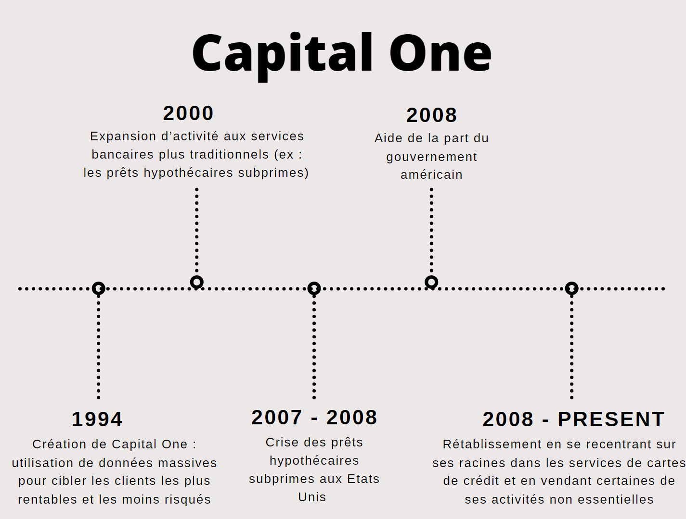
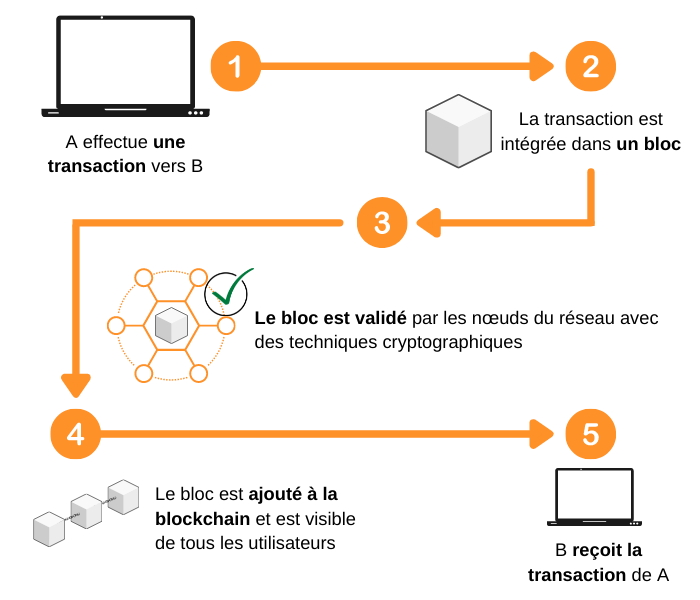

## Déroulement du MON  
Pour m'initier à la fintech, j’ai suivi un cours sur Coursera : [Fondements et vue d'ensemble de FinTech]( https://www.coursera.org/programs/s9-common-track-uqhpe/learn/fintech?authProvider=ecole-centrale-casablanca&source=search) de 15 heures. 

| Tâche      | Contenu                                       | Date       | Durée |
|------------|-----------------------------------------------|------------|-------|
| Chapitre 1 | Qu'est-ce que FinTech ?                       | 11/03/2024 | 3h    |
| Chapitre 2 | Applications commerciales des FinTech         | 15/03/2024 | 3h    |
| Chapitre 3 | La technologie des FinTech                    | 16/03/2024 | 4h    |
| Chapitre 4 | Implications des FinTech pour les entreprises & Projet final | 21/03/2024  | 5h    |

## Chapitre 1 : Qu'est-ce que FinTech ?
### Pour les entrepreneurs : 
L’utilisation de la technologie par les institutions financières n'est pas un phénomène récent, mais remonte à plusieurs siècles ; L'innovation majeure que représente le distributeur automatique de billets (ATM) avait un impact majeur sur l'accès aux services financiers. En plus de l'impact transformateur de plateformes comme Yu'e Bao d'Alibaba sur le marché financier chinois, et éventuellement mondial. 
Avec l'introduction de réglementations telles que l'API bancaire ouverte, les utilisateurs finaux gagnent plus de contrôle sur leurs données financières. Cela ouvre la voie à une personnalisation massive des services financiers, où les utilisateurs peuvent accéder à leurs données personnelles et les utiliser comme bon leur semble, comme pour solliciter un prêt ou acheter une propriété. Cette ouverture crée également un environnement favorable à l'innovation, où de nouveaux entrepreneurs peuvent proposer des services créatifs et innovants, contournant ainsi les blocages traditionnels des banques. En conséquence, les frais bancaires ont tendance à baisser à mesure que de nouveaux acteurs entrent sur le marché et que les utilisateurs finaux ont plus de choix. Cependant, les banques sont confrontées au défi de rester compétitives dans un environnement où les clients ont des attentes changeantes et où la technologie évolue rapidement. 
Dans ce contexte, on rencontre plusieurs défis liés à l'analyse de vastes quantités d'informations, ainsi que des défis règlementaires liés à la monétisation des données, la propriété de la donnée et le potentiel de vol de données. 
### Pour les investisseurs : 
Dans le monde des cryptomonnaies, les cycles de gains et de pertes sont amplifiés, ce qui peut rendre les investissements très volatils. Cette volatilité est exactement ce qui attire de nombreux jeunes investisseurs, qui sont habitués à une gratification instantanée dans d'autres aspects de leur vie.
En dehors des cryptomonnaies, d'autres formes de Fintech existent, telles que le financement participatif et la banque en ligne (Crowdfunding / Crowdsourcing). Ces innovations semblent naturelles pour la génération actuelle, qui a grandi avec la technologie à portée de main.
Pour des fins d’investissements, les entreprises aussi utilisent la technologie blockchain pour générer des revenus par des moyens innovants comme les ICO (Initial Coin Offerings).  Il s’agit d’une opération de levée de fonds par laquelle une société ayant un besoin de financement émet des jetons, aussi appelés « tokens », auxquels les investisseurs souscrivent principalement avec des crypto-monnaies. Ces jetons peuvent leur permettre d’accéder, dans le futur, à des produits ou services de cette société.
### Pour les consommateurs : 
L'importance de la commodité et de la rapidité dans les services financiers est indéniable. Security First Network Bank, pionnière en tant que première banque internet aux États-Unis dès 1995, a révolutionné l'accès aux services bancaires en ligne. En exploitant la technologie Internet, elle a proposé des services bancaires sans succursale, attirant ainsi de nombreux clients grâce à sa gratuité et sa praticité. Cependant, malgré son succès initial, son modèle exclusivement basé sur internet a été éclipsé par l'émergence d'autres banques offrant des services similaires gratuitement. Les consommateurs ont clairement exprimé leur préférence pour des services bancaires en ligne gratuits avec la possibilité d'interactions humaines au besoin, plutôt que d'être limités à une banque internet sans succursale.
Dans ce contexte de transformation du secteur financier, les grandes entreprises technologiques telles qu'Amazon et PayPal gagnent la confiance des consommateurs en offrant des expériences utilisateur fluides et intuitives et en facilitant les transactions en ligne, au détriment des banques traditionnelles. Cela souligne l'importance cruciale de l'innovation et de l'adaptabilité dans le domaine financier. En effet, bien que les technologies existent depuis un certain temps, ce sont les applications novatrices qui façonnent véritablement l'avenir de la banque.
### Etude de Cas
Dans cette analyse de cas sur Capital One, on aborde l'évolution de cette entreprise, de ses débuts en tant que pionnier de la Fintech à sa transformation en un géant bancaire confronté à des défis de gestion et de marché. L'histoire de Capital One illustre les défis et les opportunités auxquels sont confrontées les entreprises FinTech lors de leur croissance et de leur évolution dans un paysage financier en constante évolution.

**N.B** : Les hypothèques subprimes font référence à un type spécifique de prêts hypothécaires accordés à des emprunteurs considérés comme présentant un risque plus élevé de non-remboursement. 

## Chapitre 2 : Applications commerciales des FinTech 
Cette analyse de cas sur les entreprises de prêts FinTech telles que Lending Club et Kabbage, démontre comment ces entreprises ont perturbé le secteur traditionnel des prêts et des services financiers, ainsi que leur évolution et leur succès sur le marché.
### Prêts et finances personnelles 

Lending Club a été l'un des premiers acteurs à introduire le concept de prêts entre pairs (peer-to-peer lending) sur sa plateforme en ligne. En permettant aux investisseurs de financer des prêts à plusieurs emprunteurs, Lending Club a offert une alternative aux prêts bancaires traditionnels. Cette approche a permis aux investisseurs de diversifier leurs risques en finançant des portefeuilles de prêts plutôt que des prêts individuels, tout en offrant aux emprunteurs des taux d'intérêt compétitifs. Bien que Lending Club ait rencontré des problèmes de gestion et des controverses au fil des ans, son modèle commercial a permis de démontrer le potentiel de perturbation de la technologie dans le secteur des prêts



De même, Kabbage a révolutionné le financement des petites entreprises en utilisant des données massives et des algorithmes sophistiqués pour évaluer le risque et octroyer des prêts rapidement. En s'appuyant sur des partenariats avec des entreprises telles que UPS et Intuit, Kabbage a pu accéder à une grande variété de données commerciales pour prendre des décisions de prêt éclairées. Bien que les taux d'intérêt de Kabbage puissent être plus élevés que ceux des banques traditionnelles, sa rapidité et sa flexibilité ont attiré de nombreux entrepreneurs qui ont du mal à obtenir un financement auprès des institutions financières traditionnelles.


### Crowdfunding: Reward based model, Social welfare model & Equity based model

**Le modèle basé sur la récompense** permet aux contributeurs de recevoir des récompenses en échange de leur financement. Ces récompenses peuvent être des produits, des services ou des expériences liés au projet financé. Par exemple, les contributeurs peuvent recevoir des exemplaires anticipés de produits, des crédits dans un film ou même participer à la conception d'un produit ou d'un service.


Kickstarter est l'une des plus grandes plateformes de crowdfunding, spécialisée dans le financement de projets créatifs. Kickstarter permet aux créateurs de projets artistiques, musicaux, cinématographiques et de produits créatifs de solliciter des fonds auprès de la communauté. Les contributeurs reçoivent souvent des récompenses uniques, telles que des exemplaires anticipés de produits ou des expériences exclusives liées au projet. Au fil des ans, Kickstarter a permis de lever près de deux milliards de dollars auprès de près de dix millions de contributeurs pour financer plus d'un quart de million de projets créatifs. Cette plateforme offre une alternative démocratique et diversifiée au financement traditionnel, permettant aux créateurs de projets de trouver un soutien financier directement auprès de leur public.


**Le modèle axé sur le bien-être social** incite les gens à financer des projets pour des raisons altruistes ou sociales. Les contributeurs peuvent être motivés par le désir de contribuer à des causes qui leur tiennent à cœur, telles que la protection de l'environnement, la lutte contre les injustices sociales ou le soutien à des initiatives communautaires.


Neighborly est une plateforme axée sur le financement de projets communautaires. Neighborly a commencé en tant que site de financement participatif basé sur les dons pour les projets civiques. Cependant, ils ont évolué vers un modèle commercial basé sur le financement de micro-prêts ou de petites obligations municipales. Contrairement aux obligations municipales traditionnelles, qui nécessitent souvent des investissements importants, Neighborly permet aux voisins de co-investir de petites sommes dans des projets locaux, tels que des parcs ou des infrastructures communautaires. En offrant un retour financier aux investisseurs, Neighborly a réussi à mobiliser plus de fonds pour des projets communautaires, levant plus de deux millions et demi de dollars au cours des deux dernières années pour 55 projets communautaires.


Enfin, **le modèle basé sur l'équité** permet aux contributeurs de posséder une part du projet financé. Ils peuvent recevoir des actions de l'entreprise ou une part des bénéfices futurs en échange de leur investissement. Ce modèle offre aux contributeurs la possibilité de participer financièrement au succès du projet.


Indiegogo est une plateforme de financement participatif qui a commencé comme un site de développement de films indépendants. Indiegogo offre une plateforme pour les réalisateurs de films indépendants et les créateurs de projets artistiques pour mobiliser des fonds auprès du public. Contrairement à Kickstarter, Indiegogo permet aux projets de conserver les fonds recueillis même s'ils n'atteignent pas leur objectif financier initial. Cette approche offre une plus grande flexibilité aux créateurs de projets, mais elle peut également entraîner des défis pour atteindre les objectifs de financement. Indiegogo a été comparé à Kickstarter, mais il se distingue par sa politique de financement flexible, permettant aux projets de collecter des fonds de manière continue, même après avoir atteint leur objectif initial.


### Paiements et des transactions de détail

PayPal a émergé comme un pionnier et un innovateur dans le domaine des paiements numériques depuis sa fondation en 1998 par Elon Musk. Sa mission initiale était de permettre des transactions numériques rapides et sécurisées entre portefeuilles virtuels. Malgré sa longue existence, PayPal a su maintenir sa pertinence en s'adaptant aux évolutions constantes du paysage technologique et financier. Grâce à une série de développements et de fusions stratégiques, telles que l'acquisition de Braintree en 2013, PayPal est devenu une force majeure dans le secteur des paiements en ligne, avec plus de 100 millions de comptes dans plus de 190 marchés différents. Son engagement envers l'innovation continue et sa capacité à anticiper et à répondre aux besoins changeants des consommateurs ont permis à PayPal de se différencier des banques traditionnelles et de prospérer dans un environnement FinTech en constante évolution.



Venmo, une acquisition clé de Braintree avant son intégration à PayPal, incarne une révolution dans le domaine des transferts d'argent entre pairs. Lancée comme une application de paiement mobile aux États-Unis, Venmo offre une plateforme intuitive permettant aux utilisateurs de transférer de l'argent de manière simple et rapide à leurs pairs. Son acquisition par PayPal en 2013 a renforcé la position de cette dernière dans le secteur des paiements mobiles. Contrairement à PayPal, Venmo offre une expérience utilisateur unique en permettant aux utilisateurs de fusionner des éléments de médias sociaux avec des messages textuels et des emojis pour contextualiser les transferts d'argent. Cette approche ludique et sociale a permis à Venmo de se différencier, offrant une alternative attrayante aux plateformes de paiement traditionnelles. En mettant l'accent sur la simplicité d'utilisation et la convivialité, Venmo a su capturer l'attention des consommateurs, consolidant ainsi sa position en tant que leader dans le domaine des paiements mobiles entre pairs.



Les investissements en actions et le trading sont des pratiques financières de plus en plus importantes dans le domaine de la technologie financière. Une plateforme notable dans ce domaine est Robinhood, qui permet aux investisseurs d'acheter et de vendre des actions sans commission sur leurs smartphones. Cependant, des préoccupations persistent quant à sa compétitivité face aux banques traditionnelles et à la qualité de l'exécution des transactions. Par ailleurs, des alternatives telles que eToro offrent des services de conseil financier permettant aux utilisateurs de suivre et de copier les transactions de traders expérimentés en temps réel, visant à assurer la transparence et la crédibilité des transactions. En outre, Quantopian propose une plateforme permettant aux utilisateurs de développer des modèles mathématiques et d'intelligence artificielle pour le trading, offrant ainsi une approche systématique pour développer et tester des stratégies de trading. Cependant, des préoccupations subsistent quant à la fiabilité de ces modèles dans des conditions de marché imprévues. Ces pratiques soulèvent également des questions importantes sur la compétitivité, la transparence et la réglementation dans le domaine des investissements et du trading.

### Cryptocurrency
Les cryptomonnaies ont émergé comme des acteurs perturbateurs dans le paysage financier mondial, offrant une alternative novatrice aux monnaies fiduciaires traditionnelles. En réponse aux limites et aux contraintes des systèmes monétaires traditionnels, des pionniers tels que Bitcoin et Litecoin ont introduit un nouveau paradigme financier basé sur la décentralisation et la technologie blockchain. Ces cryptomonnaies, souvent qualifiées de "cryptomonnaies de valeur stockée", ont suscité un intérêt croissant en raison de leur capacité à offrir des transactions numériques sécurisées et transparentes, sans l'intervention de tiers tels que les banques ou les gouvernements.

Dans le paysage des cryptomonnaies, une catégorie importante se distingue par leur orientation vers la confidentialité. Monero et Dash, par exemple, se positionnent comme des alternatives offrant des niveaux de confidentialité accrus. Ces cryptomonnaies intègrent des fonctionnalités sophistiquées telles que des adresses à usage unique et des ledgers privés, qui garantissent un anonymat renforcé pour les utilisateurs lors de leurs transactions. Cette orientation vers la confidentialité répond à un besoin croissant de préserver la vie privée des utilisateurs dans un monde numérique de plus en plus surveillé. En offrant des mécanismes de protection des données et une confidentialité accrue, Monero et Dash s'imposent comme des acteurs essentiels dans l'écosystème des cryptomonnaies, offrant aux utilisateurs une alternative sécurisée et privée pour leurs transactions financières en ligne.



Dans le domaine des cryptomonnaies, les réseaux de règlement jouent un rôle crucial dans la facilitation des transactions et la fourniture d'alternatives stables aux investisseurs. Des cryptomonnaies telles que Ripple et Tether sont conçues spécifiquement pour cette fin. Ripple se distingue par son objectif de fournir une infrastructure de paiement mondiale rapide et peu coûteuse, permettant des transactions transfrontalières rapides et efficaces. Tether, quant à elle, est connue pour son ancrage aux monnaies fiduciaires traditionnelles, offrant ainsi aux utilisateurs une alternative stable pour effectuer des transactions en ligne. Ces réseaux de règlement témoignent de l'évolution du paysage financier vers des solutions numériques plus efficaces et accessibles, ouvrant la voie à une nouvelle ère de transactions financières rapides et sécurisées à l'échelle mondiale.



Ethereum et Cardano sont des exemples de cryptomonnaies distinguées par leur orientation vers les contrats intelligents. Contrairement aux cryptomonnaies traditionnelles qui se concentrent principalement sur les transactions monétaires, Ethereum et Cardano offrent une fonctionnalité supplémentaire en permettant l'exécution de contrats intelligents. Ces contrats sont des protocoles informatiques auto-exécutoires qui facilitent, vérifient ou mettent en œuvre les termes d'un accord, sans nécessiter d'intermédiaire. Cette fonctionnalité révolutionnaire ouvre de nouvelles perspectives pour diverses applications, allant de la finance décentralisée aux systèmes d'identification numérique sécurisés. En intégrant les contrats intelligents dans leurs architectures, Ethereum et Cardano offrent un potentiel considérable pour la création de systèmes autonomes et transparents, tout en renforçant la confiance dans l'écosystème des cryptomonnaies.



Les tokens jouent un rôle diversifié, servant de jetons numériques pour une multitude d'applications. Des exemples tels que Tron et Dorado illustrent cette variété d'utilisations. Tron est souvent associé aux applications de divertissement numérique, tandis que Dorado se concentre sur les services de livraison. Cependant, avec cette diversité d'utilisations vient une série de risques potentiels. Des exemples tels que Bitconnect, un schéma de Ponzi notoire, et Dogecoin, initialement créé comme une blague mais finalement devenu une cryptomonnaie valide, soulignent les dangers inhérents à l'investissement dans les tokens. En outre, les ICO (Initial Coin Offerings) représentent un terrain fertile pour les fraudes et les escroqueries, nécessitant une vigilance accrue de la part des investisseurs. Malgré ces risques, les tokens continuent de jouer un rôle significatif dans l'écosystème des cryptomonnaies, offrant des opportunités d'investissement et d'innovation tout en exigeant une gestion prudente des risques associés.


## Chapitre 3 : La technologie des FinTech 

### Identité, vie privée et anonymat
Les fondements de l'identité, de la confidentialité et de l'anonymat dans le contexte de la technologie financière reposent sur plusieurs principes clés : 
-	L’identité est essentielle pour sécuriser les transactions financières, en fournissant des preuves tangibles de propriété et d'autorisation. Les outils traditionnels tels que les signatures, les documents d'identité et les mots de passe sont utilisés pour établir et vérifier l'identité des parties impliquées dans une transaction. 
-	La confidentialité est cruciale pour protéger les informations sensibles des utilisateurs, telles que les données financières et personnelles, contre les accès non autorisés. Les utilisateurs doivent avoir confiance dans la sécurité de leurs informations lorsqu'ils effectuent des transactions en ligne ou partagent des données avec des institutions financières. 
-	L’anonymat peut être important dans certains contextes pour préserver la vie privée des individus lorsqu'ils effectuent des transactions financières ou participent à des activités en ligne. Cependant, trouver un équilibre entre l'anonymat et la vérification de l'identité est crucial pour prévenir la fraude et garantir la légitimité des transactions financières.  

Malgré les progrès technologiques, les fraudes continuent d'être un problème majeur, que ce soit dans les transactions par carte de crédit, les devises physiques ou les documents officiels. On trouve diverses méthodes de prévention de la fraude, telles que l'utilisation de signatures, d'identifiants biométriques comme les empreintes digitales ou la reconnaissance faciale, et de mots de passe. Cependant, même ces méthodes ne sont pas parfaites et peuvent être contournées ou compromises. 
Enfin, l'identification est importante comme technologie sous-jacente à de nombreuses applications FinTech et autres, et comment son développement ouvre de nouvelles perspectives pour des transactions plus sécurisées, efficaces et confidentielles. D’où la nécessité de trouver un équilibre entre sécurité, commodité et protection de la vie privée.

### Blockchain et cryptage
Bien que la blockchain soit souvent associée à Bitcoin, elle n'est pas la seule manière de tirer parti de cette technologie. Elle est présentée comme un outil puissant et largement accepté, bien qu'il existe d'autres approches pour exploiter les avantages des grands livres distribués*.
La blockchain est présentée comme une technologie qui favorise la transparence grâce à la traçabilité des transactions. Elle est également vantée pour sa sécurité, car une fois qu'une transaction est enregistrée dans un bloc, il est pratiquement impossible de la modifier sans modifier tous les blocs suivants. Le chiffrement est souligné comme une composante essentielle de la blockchain, garantissant l'intégrité des données et facilitant des fonctionnalités telles que la préservation de la confidentialité des utilisateurs tout en permettant la vérification des transactions.
La blockchain est donc présentée comme une technologie révolutionnaire qui élimine le besoin d'intermédiaires centraux dans les transactions financières. 
*Grand livre distribué : base de données décentralisée qui enregistre les transactions sur plusieurs sites ou participants

### Big data et analyse
### IA, DSS et automatisation
### Smartphones et technologie client





## Chapitre 4 : Implications des FinTech pour les entreprises & Projet final