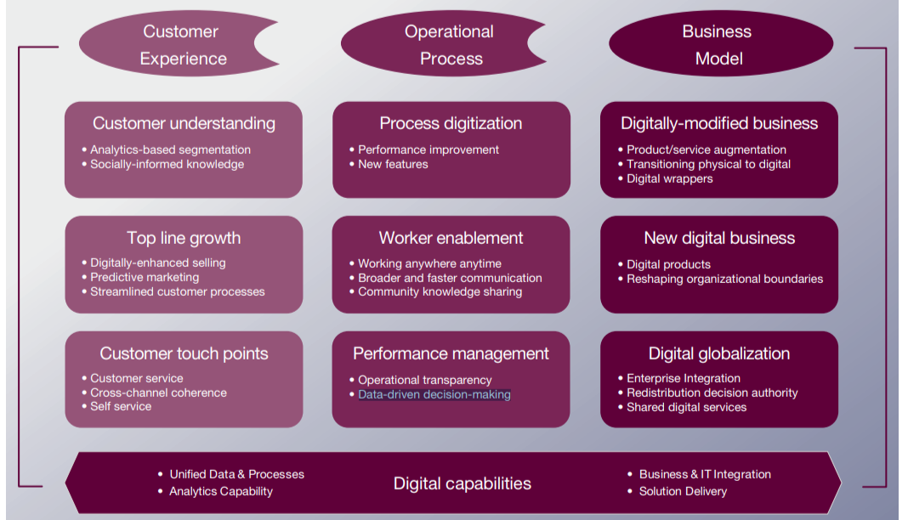

## Introduction 
La transformation numérique désigne l'adoption par une entreprise de méthodes de travail inédites et novatrices en s'appuyant sur les progrès technologiques. Il s'agit donc d'une mutation basée sur des outils numériques à travers laquelle une entreprise améliore ou remplace ses pratiques existantes à l'aide de nouvelles technologies.

Le but de ce POK est d'étudier l'écosystème numérique de l’entreprise où j’ai effectué mon dernier stage, d’identifier des opportunités de transformation digitale, et d’élaborer un plan d’action de cette transformation.

## Démarche 
Cette démarche est inspirée de l’approche que nous avons vu dans le cours d’écosystème digital, qui est souvent adoptée dans les cabinets de conseil  :

  


-	Évaluation des besoins et des opportunités
-	Benchmarking concurrentiel
- Définition des objectifs de transformation
-	Élaboration d'un plan d'action
-	Gestion du changement 


## Évaluation des besoins et des opportunités 
L’entreprise qui servira de référence dans cette étude est une entreprise de gestion de relation client et de BPO (Business Process Outsourcing).

Comme il s’agit de l’externalisation des processus, cette entreprise travail pour le compte de plusieurs clients. Les collaborateurs se trouvent donc souvent obligés de travailler sur les environnements des clients. 

Ceci entraîne plusieurs problèmes et défis, notamment : manque d'interopérabilité entre les outils, difficultés de collaboration entre les équipes, et difficultés de reporting et d'analyse.

## Définition des objectifs de transformation 
Ci après les principales catégories des tranformations digitales selon une étude de Capgemini Consulting & MIT Sloan Management : 

  
L’opportunité que j’ai identifiée pour l'entreprise étudiée s’inscrit dans la catégorie Operational Process, Performance management, Data-driven decision-making. Les objectifs sont donc :
-	Centraliser les données pour faciliter le reporting 
- Améliorer l'interopérabilité des outils

## Benchmarking concurrentiel 
Pour résoudre ces problèmes, de nombreuses entreprises cherchent à rationaliser leurs systèmes en adoptant des solutions intégrées, en améliorant l'interopérabilité des outils ou en investissant dans des plates-formes de gestion unifiée. L'objectif est de simplifier l'environnement informatique, d'augmenter l'efficacité et de réduire les coûts opérationnels.

## Élaboration d'un plan d'action 
(A faire)

## Gestion du changement 
Comme les employés sont habitués aux systèmes qu'ils utilisent actuellement, ils peuvent résister au changement. L'introduction de nouveaux outils peut rencontrer de la résistance, ce qui peut ralentir l'adoption. D'où l'importance du Change management.

## Références : 

-	A roadmap for a digital transformation, Mars 2017. Disponible sur : https://www.mckinsey.com/industries/financial-services/our-insights/a-roadmap-for-a-digital-transformation. Consulté le 6 octobre 2023.
-	Digital strategy roadmap. Disponible sur : https://www.bcg.com/capabilities/digital-technology-data/digital-strategy-roadmap. Consulté le 6 octobre 2023.
-	Digital transformation : a roadmap for billion-dollar organizations. Disponible sur : https://www.capgemini.com/wp-content/uploads/2017/07/Digital_Transformation__A_Road-Map_for_Billion-Dollar_Organizations.pdf. Consulté le 5 octobre 2023.
- Interopérabilité des outils et des données : https://www.puceplume.fr/ged-interoperabilite-des-outils-et-des-donnees/. Consulté le 7 octobre 2023.


