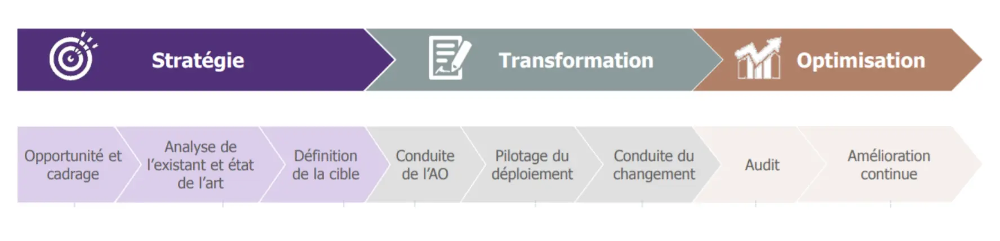
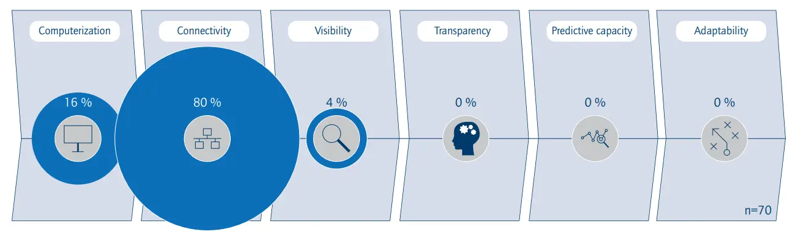
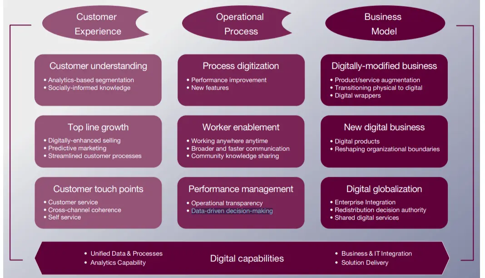
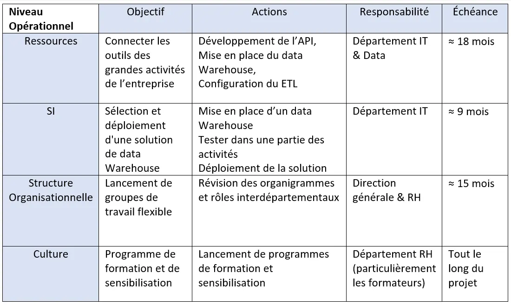
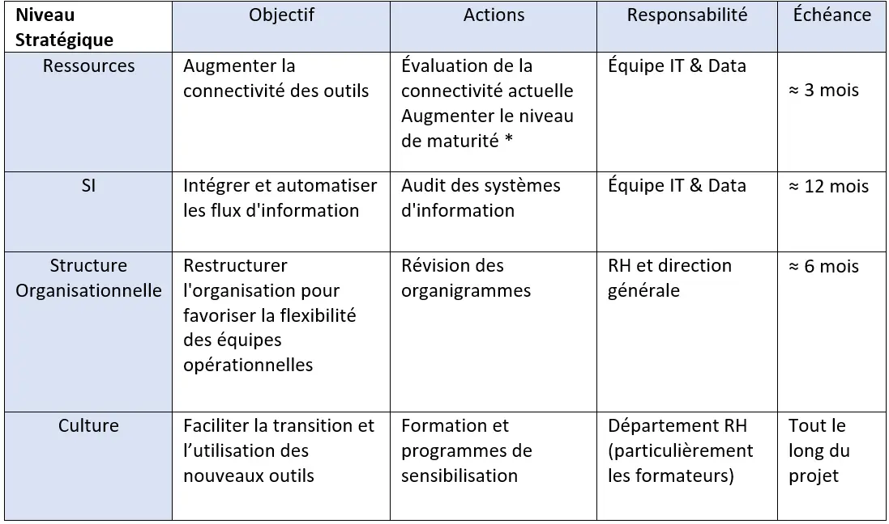

## Introduction 
La transformation numérique désigne l'adoption par une entreprise de méthodes de travail inédites et novatrices en s'appuyant sur les progrès technologiques. Il s'agit donc d'une mutation basée sur des outils numériques à travers laquelle une entreprise améliore ou remplace ses pratiques existantes à l'aide de nouvelles technologies.

Le but de ce POK est d'étudier l'écosystème numérique de l’entreprise où j’ai effectué mon dernier stage, d’identifier des opportunités de transformation digitale, et d’élaborer un plan d’action de cette transformation.

## Démarche 
Cette démarche est inspirée de l’approche que nous avons vu dans le cours d’écosystème digital, qui est souvent adoptée dans les cabinets de conseil  :

  


-	Évaluation des besoins et des opportunités
-	Benchmarking concurrentiel
- Définition des objectifs de transformation
-	Élaboration d'un plan d'action
-	Gestion du changement 


## Évaluation des besoins et des opportunités 
L’entreprise qui servira de référence dans cette étude est une entreprise de gestion de relation client et de BPO (Business Process Outsourcing).

Comme il s’agit de l’externalisation des processus, cette entreprise travail pour le compte de plusieurs clients. Les collaborateurs se trouvent donc souvent obligés de travailler sur les environnements des clients. 

Ceci entraîne plusieurs problèmes et défis, notamment : manque d'interopérabilité entre les outils, difficultés de collaboration entre les équipes, et difficultés de reporting et d'analyse.

## Définition des objectifs de transformation 
Faire un projet de transformation digitale ne se résume pas à l'automatisation totale. Comme illustré dans le schéma ci-dessous, il est essentiel de traverser plusieurs étapes pour atteindre un niveau de maturité plus élevé. De plus, il est important de noter que la majorité des entreprises ne possèdent qu'un niveau de maturité digitale relativement bas, avec 80 % d'entre elles (y compris l'entreprise sujet dece POK) se situant à l'étape de la connectivité.

Ci après les principales catégories des tranformations digitales selon une [étude de Capgemini Consulting & MIT Sloan Management](https://www.capgemini.com/wp-content/uploads/2017/07/Digital_Transformation__A_Road-Map_for_Billion-Dollar_Organizations.pdf): 

  
L’opportunité que j’ai identifiée pour l'entreprise étudiée s’inscrit dans la catégorie Operational Process, Performance management, Data-driven decision-making. Les objectifs sont donc :
-	Centraliser les données pour faciliter le reporting 
- Améliorer l'interopérabilité des outils

## Benchmarking concurrentiel 
Pour résoudre ces problèmes, de nombreuses entreprises cherchent à rationaliser leurs systèmes en adoptant des solutions intégrées, en améliorant l'interopérabilité des outils ou en investissant dans des plates-formes de gestion unifiée. L'objectif est de simplifier l'environnement informatique, d'augmenter l'efficacité et de réduire les coûts opérationnels.

|Solution|Rôle|Exemple d'entreprise|Source de l'information| 
|---    |---    |---    |---   |---    |
|API (Application Programming Interface)|Permet la communication entre différentes applications informatiques.|Salesforce utilise des API pour intégrer des applications tierces.|[Site Web de Salesforce](https://www.salesforce.com/products/integration/overview/)|
|Data Warehousing|Stockage centralisé de données pour une analyse avancée, souvent accompagné d'ETL|Amazon Web Services (AWS) utilise Amazon Glue pour ETL, Netflix utilise Amazon Redshift pour le data warehousing.|[Netflix TEch Blog](https://www.salesforce.com/products/integration/overview/)|
|Middleware|Facilite la communication entre différentes applications et systèmes.|IBM WebSphere est un middleware utilisé par diverses entreprises.|[IBM WebSphere](https://www.ibm.com/products/websphere-application-server)|
|Enterprise Service Bus (ESB)|Facilite l'intégration de différents systèmes d'entreprise.|SAP Process Integration (PI/PO) est utilisé par Procter & Gamble.|[SAP Integration Suite](https://www.sap.com/products/technology-platform/integration-suite.html)|
|Master Data Management (MDM)|Gestion centralisée de données maîtresses pour assurer la cohérence.|Nestlé et Kering utilisent le MDM.|[La revue du digital](https://www.larevuedudigital.com/chez-nestle-et-kering-le-controle-des-donnees-est-deplace-vers-les-metiers/)|
|Messages queues |Technique de programmation utilisée pour la communication interprocessus ou la communication de serveur-à-serveur|Permet à Uber de communiquer de manière asynchrone|[Uber Blog](https://www.uber.com/en-FR/blog/cherami-message-queue-system/)|
|Plateformes d'Intégration d'Applications d'Entreprise (EAI)|Connecter et intégrer applications, données et services.|IBM App Connect|[IBM App Connect](https://www.ibm.com/fr-fr/products/app-connect)|

>Analyse multicritères de ces solutions :

|Solution|Facilité d'intégration|Coût|Performance|Flexibilité|Gestion des données|Fiabilité|
|---    |---    |---    |---   |---    |
|API|	Élevée|	Faible|Très rapide|	Élevée|	Élevée|	Très fiable|
|ETL|	Élevée|	Moyen|	Élevée|	Moyenne|	Élevée|	Élevée|
|Data Warehousing & ETL|	Moyenne|	Moyen|	Élevée|	Moyenne|	Élevée|	Élevée|
|Middleware|	Moyenne|	Moyen|	Moyenne|	Élevée|	Moyenne|	Moyenne|
|ESB|	Moyenne|	Moyen|	Moyenne|	Élevée	|Faible|	Moyenne|
|MDM|	Faible|	Moyen|	Moyenne|	Moyenne|	Élevée|	Élevée|
|Messages Queues|	Élevée|	Faible |Très rapide|	Moyenne|	Moyenne|	Très fiable|
|EAI|	Élevée|	Moyen|	Élevée|	Élevée|	Moyenne|	Élevée|

D'après cette analyse, on peut dire que les solutions les plus adaptées pour l'entreprise étudiée sont une API Gateway pour l'interopérabilité des outils, et un Data Warehouse pour la centralisation des données.

## Élaboration d'un plan d'action 
Plan de déploiement des solutions choisies  :

    

        
    

    

        
    

*Niveau de maturité défini dans [Managing the Digital Transformation of Companies]( https://www.acatech.de/wp-content/uploads/2020/04/aca_STU_MatInd_2020_en_Web.pdf)

## Gestion du changement 
Comme les employés sont habitués aux systèmes qu'ils utilisent actuellement, ils peuvent résister au changement. L'introduction de nouveaux outils peut rencontrer de la résistance, ce qui peut ralentir l'adoption. D'où l'importance du Change management.

Pour faire face à cette problématique, il est essentiel d'engager activement les collaborateurs (les utilisateurs des nouveaux outils) à chaque étape de cette transformation. Nous pouvons commencer par les sensibiliser aux situations dans lesquelles ils peuvent constater les limitations des outils qu'ils utilisent actuellement, ce qui les encouragera à soutenir ce changement. En outre, il est crucial de fournir des formations complètes pour renforcer leurs compétences.

## Conclusion : 

-	Temps perdu suivre la mauvaise méthodologie 
-	Changé l’approche
-	Point avec M. Florian 
-	Documentation sur les exemples de cas de transformation digitale
-	Documentation sur les technologies (qui peuvent répondre à la problématique) 
-	Comparaison de ces technologies
-	Mise en forme des recherches selon le plan défini
-	Choix de la solution 
-	Elaboration du plan de transformation 


-	Comment passer d’un système en silos séparés en fonction des différentes activités à un seul système
-	On ne peut pas atteindre un niveau de maturité numérique élevé en implémentant des prototypes individuels et isolés.
-	La connectivité a des inconvénients (complexité des systèmes + maintenance plus couteuse). Cependant, renoncer à la connectivité des systèmes peut entraver la croissance et le progrès de l'entreprise.


-	A roadmap for a digital transformation, Mars 2017. Disponible sur : https://www.mckinsey.com/industries/financial-services/our-insights/a-roadmap-for-a-digital-transformation. Consulté le 6 octobre 2023.
-	Digital strategy roadmap. Disponible sur : https://www.bcg.com/capabilities/digital-technology-data/digital-strategy-roadmap. Consulté le 6 octobre 2023.
-	Digital transformation : a roadmap for billion-dollar organizations. Disponible sur : https://www.capgemini.com/wp-content/uploads/2017/07/Digital_Transformation__A_Road-Map_for_Billion-Dollar_Organizations.pdf. Consulté le 5 octobre 2023.
- Interopérabilité des outils et des données. Disponile sur : https://www.puceplume.fr/ged-interoperabilite-des-outils-et-des-donnees/. Consulté le 7 octobre 2023.
- Managing the Digital Transformation of Companies. Disponible sur : https://www.acatech.de/wp-content/uploads/2020/04/aca_STU_MatInd_2020_en_Web.pdf. Consulté le 11 octobre 2023.
- L’API Menace L’Industrie Du Middleware. Disponible sur : https://www.forbes.fr/business/lapi-menace-lindustrie-du-middleware-et-cest-tant-mieux/. Consulté le 15 otobre 2023.


