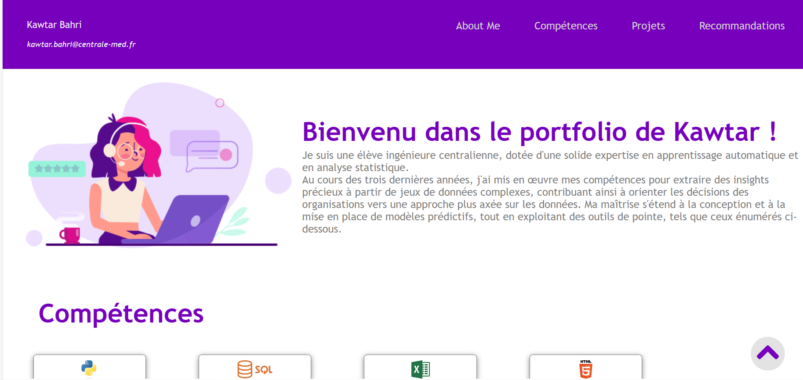
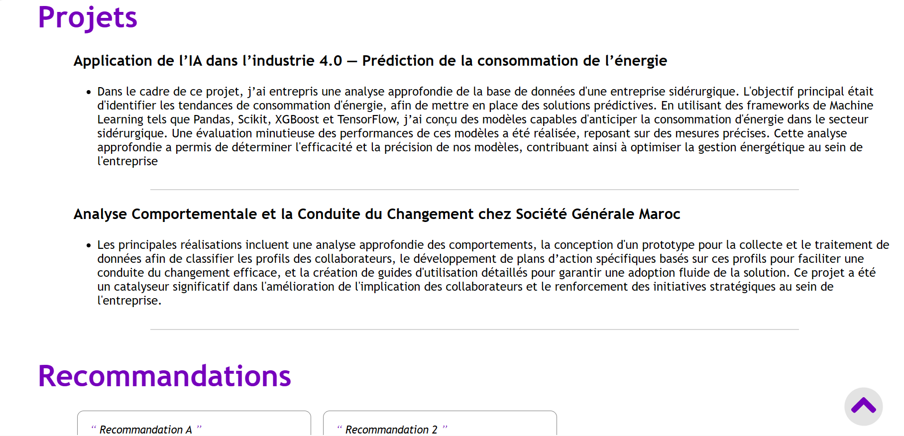
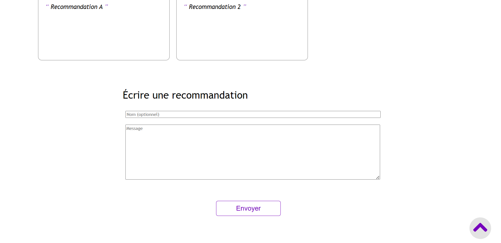

## Roadmap : 

- Documentation (Découvrir JavaScript) ***5h***
- Planification et Conception du contenu et de l’interface du portfolio ***1h***
- Développement du Front-End ***4h***


- Développement du Back-End ***4h*** 
- Tests, Débogage ***1h***
- Hébergement du site ***5h***


## Réalisation du sprint 1:
1.	Documentation : Pour découvrir JavaScript en relation avec ce que j'ai appris en MON Temps en HTML et CSS, j'ai choisi ce [cours](https://www.coursera.org/learn/introduction-to-web-development-with-html-css-javacript). Cette étape est effectuée (voir [certificat](https://www.coursera.org/account/accomplishments/certificate/NRN8SQK7J9QS)).
2.	Planification et Conception du contenu et de l’interface du portfolio 
Objectifs du Portfolio : 
•	Présenter mes compétences, mes projets passés, attirer des employeurs ou des clients potentiels
•	Communiquer avec ces employeurs / clients (via une rubrique de demandes & recommandations) 

3.  Développement du Front-End 

## Réalisation du sprint 2:
1. Développement du Back-End (en cours)
2. Tests, Débogage (pas encore)
3. Hébergement du site (pas encore)
