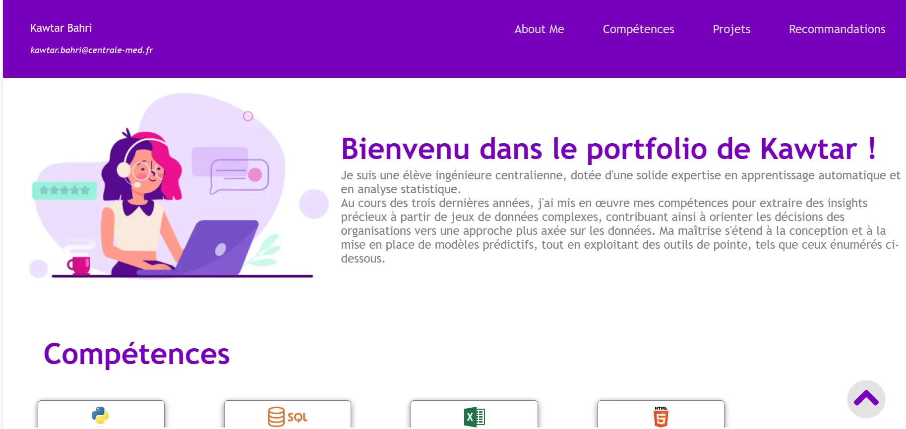
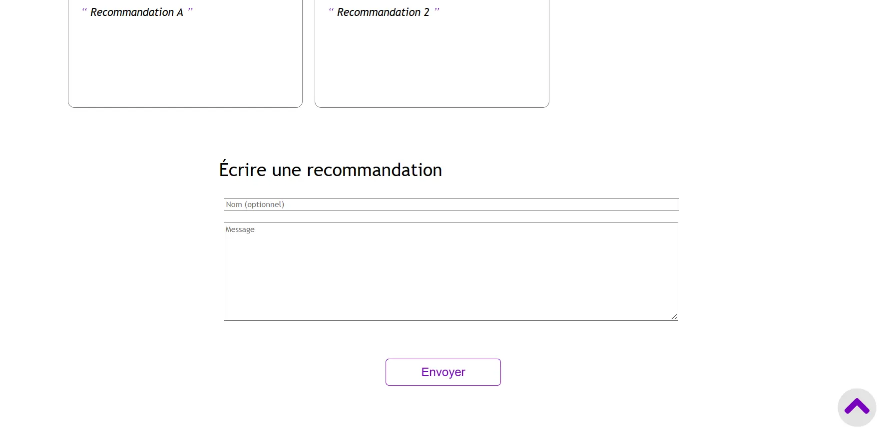
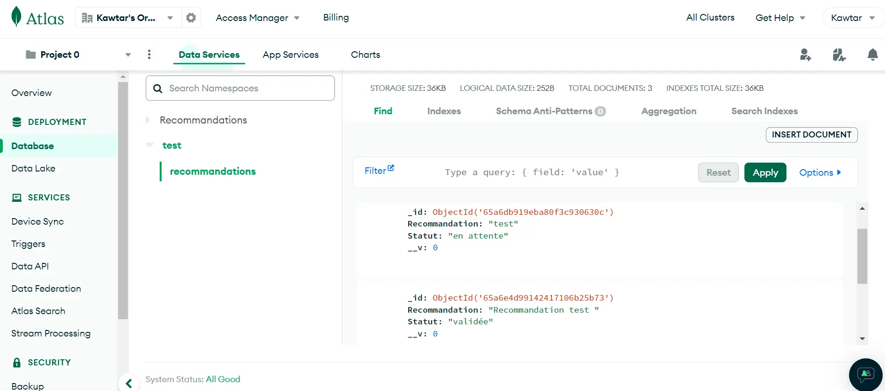
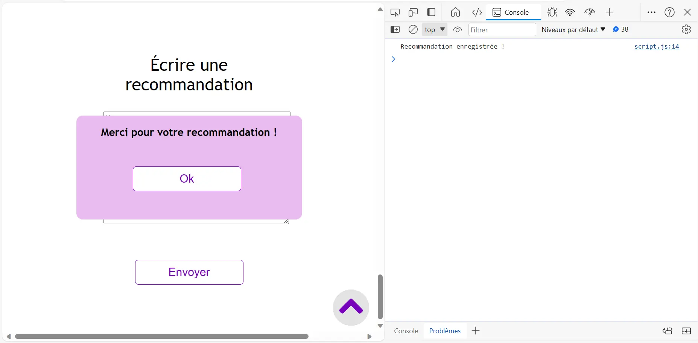
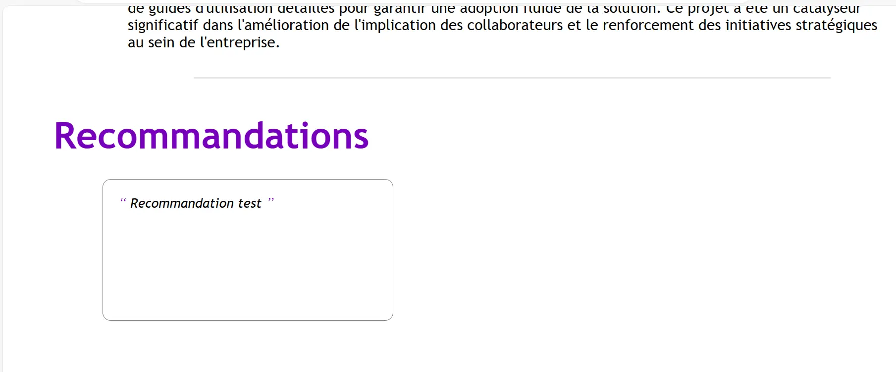

## Roadmap : 

- Documentation (Découvrir JavaScript) ***5h***
- Planification et Conception du contenu et de l’interface du portfolio ***1h***
- Développement du Front-End ***4h***


- Développement du Back-End ***4h*** 
- Tests, Débogage ***1h***
- Hébergement du site ***5h***


## Réalisation du sprint 1:
1.	Documentation : Pour découvrir JavaScript en relation avec ce que j'ai appris en MON Temps en HTML et CSS, j'ai choisi ce [cours](https://www.coursera.org/learn/introduction-to-web-development-with-html-css-javacript). Cette étape est effectuée (voir [certificat](https://www.coursera.org/account/accomplishments/certificate/NRN8SQK7J9QS)).
2.	Planification et Conception du contenu et de l’interface du portfolio 
Objectifs du Portfolio : 
•	Présenter mes compétences, mes projets passés, attirer des employeurs ou des clients potentiels
•	Communiquer avec ces employeurs / clients (via une rubrique de demandes & recommandations) 

3.  Développement du Front-End 




## Réalisation du sprint 2:
***1. Installation des outils***
- Configuration de l'environnement du projet 
- Installation de : Node.js, Express, Mongoose, ThunderClient

***2. Création d’un serveur***
- Création d'un serveur simple 
- Liaison du Back et Front du site

***3. Création d’une base de données***
- Création d'une base de données sur MongoDB Atlas
- Etablissement de la connexion de la base données et le serveur
```js
//La chaine de connexion est fournie par MongoDB
mongoose.connect('chaine de connexion,
  { useNewUrlParser: true,
    useUnifiedTopology: true })
  .then(() => console.log('Connexion à MongoDB réussie !'))
  .catch(() => console.log('Connexion à MongoDB échouée !'));
```
- Conception du schéma de base de données

```js
const mongoose = require('mongoose');

const monSchema = mongoose.Schema({
  //le nom est un champs non obligatoire
  Nom: { type: String, required: false }, 
  Recommandation: { type: String, required: true },  
  Statut: { type: String, default: 'en attente' },
});

module.exports = mongoose.model('Recommandations', monSchema);
```
***4. Configuration des routes***
- Route POST pour récupérer les recommandations provenant du formulaire
- Route GET pour publier les recommandations validées sur le site 

***5. Tests & Debogage***
La base de données :

Le serveur : 

Le site :

Le code : 
Le code développé dans ce POK est disponible sur mon [github repository ](https://github.com/KawtarBahri/Mon-portfolio/)