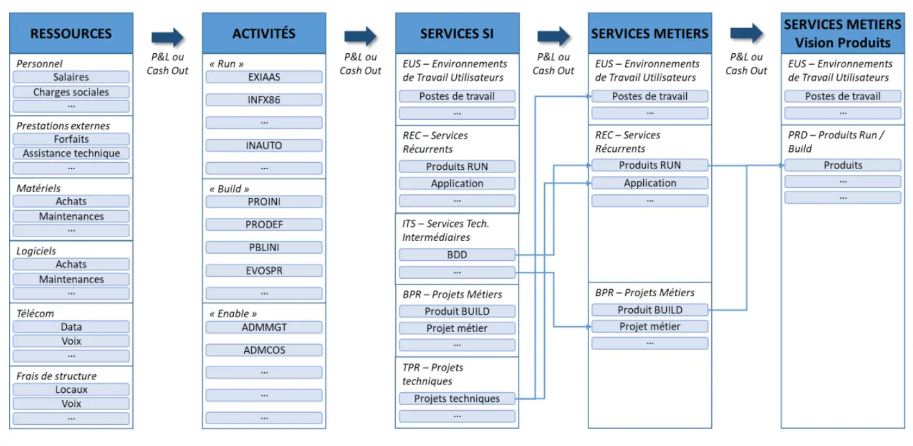
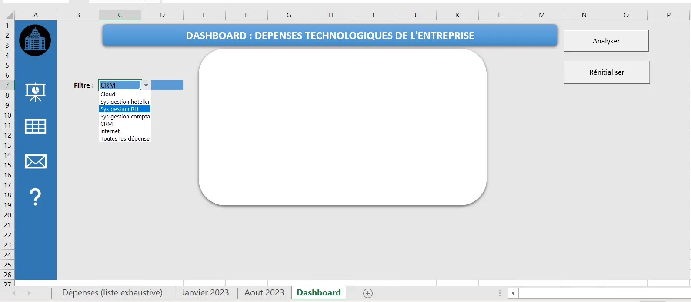
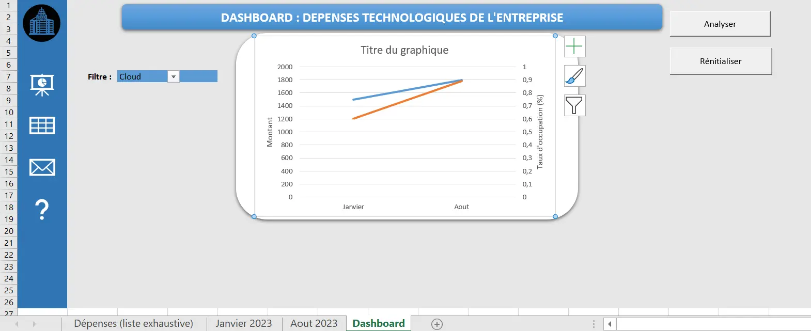

## Horodatage
### Sprint 1 
| Tâche               | Description      | Date       | Durée |
|---------------------|------------------|------------|-------|
| Tuto bases de VBA 1| [Leçons 1 - 6](https://www.excel-pratique.com/fr/vba) | 19/02/2024 | 4hrs  |
| Tuto bases de VBA 2| [Leçons 7 - 11](https://www.excel-pratique.com/fr/vba) | 21/02/2024 | 5hrs  |

### Sprint 2 
| Tâche    | Description                    | Date   | Durée |
|----------------------------------------------|--------------------------------------|--------|-------|
| Modèle d’analyse et de benchmarking des couts informatiques | Lecture œuvre en référence | 04/03  | 2hrs  |
| Spécifier l'exemple d’entreprise | Choisir le domaine d’activité et la taille de l’entreprise | 04/03| 1h |
| Faire une feuille Excel données entreprise fictive      | Lister les catégories de dépenses | 04/03  | 1h |
| Estimer les dépenses (en fct du CA et nb d'utilisateurs)| Simulation devis en ligne | 08/03  | 3hrs  |
| Conception du Dashboard |          VBA Excel                                 |   24/03     |   3hrs    |
| Perspectives d’optimisation des dépenses technologiques|Rercherches sur les bonnes pratiques en entreprise|25/03      |  1h     |

## Introduction 
Les dépenses technologiques font référence à toutes les dépenses liées à l'acquisition, à l'utilisation et à la maintenance de technologies de l'information et de la communication (TIC) dans le cadre des opérations commerciales d'une entreprise. On distingue donc deux types de dépenses technologiques ; Au-delà des services récurrents (logiciels, SaaS, Plateforme On Premise/Cloud …), la DSI fournit aussi des projets demandés par les métiers (exemple : l’évolution des pratiques « projets » et « opérations » vers des approches agiles et plus largement DevOps).

Les dépenses technologiques des entreprises dépendent de plusieurs éléments (le domaine d’activité, la taille de l’entreprise, son chiffre d’affaires, …).
Le coût moyen d’un budget informatique type, selon WalkMe, est le suivant : 
-	Les petites entreprises : moins de 50 millions de dollars (6,9 % du chiffre d’affaires) 
-	Les entreprises de taille moyenne : entre 50 millions et 2 milliards de dollars (4,1 % du chiffre d’affaires) 
-	Les grandes entreprises : plus de 2 milliards de dollars (4,1 % du chiffre d’affaires).

## Modèle des coûts informatiques
Le modèle d'analyse et de benchmarking des coûts informatiques est un outil élaboré par le Cigref, une association regroupant de grandes entreprises françaises, pour aider les organisations à évaluer et comparer leurs coûts liés à l'informatique. Son approche structurée et ses multiples niveaux d'analyse en font un allié précieux pour les organisations cherchant à améliorer leur efficacité et leur rentabilité dans le domaine de l'informatique.
<figure style="text-align: center;">
    
    <figcaption style="margin-top: 10px;">Architecture du modèle</figcaption>
</figure>

Ce modèle m'a aidé à recenser les dépenses technologiques de l'entreprise, et l'adapter à l'exemple sur lequel je travaille. 

## L'entreprise fictive 
Dans ce POK je choisi de travailler sur une PME à l’exemple de l’entreprise BOFINGER SARL dans le domaine de l'hébergement et la restauration. Le chiffre d'affaires est de l'ordre de 3 millions d’euros et le nombre d’employés est 100. Le fonctionnement de cette entreprise repose sur les éléments suivants : 
- Publicité des hôtels 
-	Collecte des réservations auprès des différents canaux 
-	Enregistrements des clients 
-	Génération des factures et gestion des paiements 
-	Fidélisation et satisfaction des clients 

Son SI est donc composé de : 

Permet aux clients de voir les promotions et offres, d'effectuer leurs réservations et transmet les informations aux système de gestion hôtelière et au CRM.

Nombre de clients = Chiffre d'affaires total / Prix moyen par client
Nombre de clients = 3,000,000 € / 100 € = 30,000 clients

Le taux de conversion moyen sur un site e-commerce serait de 3%. Donc ce site web a 1 million visiteurs par an, soit ~8500 utilisateurs par mois. On peux donc estimer les frais mensuels d'hébergement d'un tel site web sur les serveurs cloud AWS. 

Pour héberger un site web en cloud, on aura besoin des services suivants : 
- EC2 (Elastic Cloud Computing) : fournit des instances de serveur virtuel sur lesquelles on peut exécuter le site web.
- ELB (Elastic Load Balancing) pour ajuster automatiquement la capacité en fonction du trafic.
- RDS (Relational Databases Services) : pour stocker les bases de données sur les hôtels, les disponibilités, les réservations, les utilisateurs, etc.

A l'aide d'AWS Pricing Calculator, on trouve que les frais mensuels s'élèvent à : 1 495,27 USD



Il gère les opérations quotidiennes de l'hôtel, y compris la maintenance des chambres, la gestion des services aux clients et les réservations. Il reçoit des données du système de réservation en ligne et partage les informations sur l'occupation et les besoins des clients avec le CRM et les systèmes de gestion RH et comptable.

Pour le PMS, une simulation de devis en ligne a montré que les frais mensuels pour un hôtel de 500 chambres sont de 180 euros. Cette entreprise payera mensuelement 720 euros (si on considère que l'entreprise a 4 hôtels de 500 chambres chacun). 



Il gère les informations concernant le personnel de l'hôtel. Les informations sur les heures de travail et le personnel requis, influencées par les données d'occupation provenant du système de gestion hôtelière, sont essentielles pour la planification des ressources humaines.

Pour 100 employés, les frais mensuels d'un logiciel RH sont de 300 euros. 



Il traite toutes les transactions financières, y compris les revenus provenant des réservations et les paiements au personnel. Les données de revenus sont fournies par le système de gestion des réservations en ligne et le système de gestion hôtelière, tandis que les informations sur les salaires viennent du système de gestion RH.
Frais mensuels : 89 euros. 



Il centralise les données des clients pour le marketing, les ventes et le service après-vente. Il reçoit des informations du système de réservation et du système de gestion hôtelière pour offrir une expérience client personnalisée et gérer les relations clients.
Frais mensuels pour 5 utilisateurs : 345 euros.



Cela comprend les serveurs hébergent les données (dans ce cas, tous les logiciel cités ci-dessus sont en mode SaaS et le site web est hébergé dans le cloud) et le réseau qui permet la connectivité et les échanges de données entre les systèmes. Tous les systèmes susmentionnés dépendent de l'infrastructure informatique pour un fonctionnement ininterrompu et sécurisé.
Les frais mensuels d'internet : 2539 euros. 


Pour estimer les coûts des systèmes ci-dessous pour cette entreprise, j'ai obtenu des [devis](https://drive.google.com/drive/folders/1-OVvAbypUaF9puBc4iRZjyubTQo1qBHj?usp=sharing) en ligne auprès des fournisseurs des differentes solutions.

## Analyse des dépenses - Dashboard en Excel VBA
Télécharger le [fichier Excel](pok_3.zip)

Création du dashboard :
•	Créer la liste déroulante pour le filtre des dépenses
•	Créer les boutons "Analyser" et "Réinitialiser"
•	Écrire le code VBA pour les macros pour ces deux actions 

L'utilisateur choisit la dépense qu'il souhaite visualiser dans liste déroulante du filtre : 



```
Sub AnalyserButton_Click()
    Dim ws1 As Worksheet
    Dim ws2 As Worksheet
    Dim expensesList As Range
    Dim selectedExpense As String
    
    Set ws1 = ThisWorkbook.Sheets("Janvier 2023")
    Set ws2 = ThisWorkbook.Sheets("Aout 2023")
    Set expensesList = ThisWorkbook.Sheets("Dashboard").Range("C7")
    
    selectedExpense = expensesList.Value
    
    If selectedExpense <> "" Then
        Dim januaryExpense As Double
        Dim augustExpense As Double
        
        januaryExpense = ws1.Range("A:A").Find(selectedExpense).Offset(0, 1).Value
        augustExpense = ws2.Range("A:A").Find(selectedExpense).Offset(0, 1).Value

        
        ' Créer le graphique
        Dim chartSheet As Chart
        Set chartSheet = ThisWorkbook.Sheets("Dashboard").Shapes.AddChart2(227, xlLineMarkers).Chart
        
        ' Définir les données du graphique
        chartSheet.SetSourceData Source:=ws1.Range("A1:B2")
        chartSheet.SeriesCollection.NewSeries
        chartSheet.SeriesCollection(1).Name = "Janvier 2023"
        chartSheet.SeriesCollection(1).XValues = Array("Janvier", "Aout")
        chartSheet.SeriesCollection(1).Values = Array(januaryExpense, augustExpense)

            
        ' Ajouter les étiquettes d'axe
        chartSheet.Axes(xlCategory, xlPrimary).CategoryNames = Array("Janvier", "Aout")
        chartSheet.Axes(xlValue, xlPrimary).HasTitle = True
        chartSheet.Axes(xlValue, xlPrimary).AxisTitle.Text = selectedExpense
        
        ' Afficher le graphique
        chartSheet.Parent.Activate
        chartSheet.Parent.Name = "Graphique_" & selectedExpense
        
    Else
        MsgBox "Veuillez sélectionner une dépense à analyser."
    End If
End Sub

``` 


en cliquant sur le bouton 'Analyser', on peut visualiser l'evolution de la dépense choisie en parallèle de l'évolution de l'activité (mesurée par le taux d'occupation des hôtels par exemple).


Le bouton 'Rénitialiser' efface le contenue du dashboard, pour pouvoir relancer le code par la suite. 


```
Sub RénitialiserButton_Click()
    Dim chartSheet As chartObject
    
    ' Vérifier si un graphique existe sur la feuille "Dashboard"
    For Each chartSheet In ThisWorkbook.Sheets("Dashboard").ChartObjects
        chartSheet.Delete
    Next chartSheet
End Sub
``` 


Faute de temps, j'ai pas pu ajouter plus de fonctionnalités dans le dashboard (comme les alertes quand les dépenses dépassent un seuil).

## Perspectives d’optimisation des dépenses technologiques
Optimiser les dépenses ne veut pas dire réduire les dépenses uniquement. Il s’agit plutôt d’une gestion financière stratégique à long terme qui vise à économiser de l’argent tout en augmentant la valeur des applications, des services, etc. Et ceci à travers une évaluation continue des processus technologiques. Pour ce faire, l’entreprise doit commencer par **cartographier l’environnement informatique** ainsi que les capacité métier. Ensuite, l’entreprise peut **rationnaliser ses applications** éliminant les redondances dans son système informatique. 
Il faut tirer le meilleur parti des différents fournisseurs, notamment du cloud en ayant la configuration la plus adaptée au besoin. Et aussi en consolidant les fournisseurs pour bénéficier des contrats groupés, ce qui réduit les coûts administratifs et permet d'avoir des tarifs réduits.
Enfin, un système de gestion centralisé ou un bus de service d'entreprise (ESB)* peut faciliter les interactions entre les éléments du SI en permettant une communication fluide et une synchronisation en temps réel entre les systèmes. Cela aide à améliorer l'efficacité opérationnelle, à offrir une expérience utilisateur améliorée, et surtout à réduire les redondances ce qui affecte le coût.

*ESB : une architecture logicielle, comme une sorte de canal centralisé à travers lequel les différents composants logiciels d'une entreprise peuvent communiquer entre eux de manière standardisée. Il fournit un ensemble de fonctionnalités telles que la médiation, la transformation des données, la gestion des messages et la sécurité pour faciliter l'intégration des systèmes hétérogènes.


## Conclusion 

- Bases de VBA (Automatiser de simples tâches en enregistrant une macro + modifier le code + créer bouton d’exécution)
- Modèle des coûts informatiques 
-	Ordre de grandeurs des dépenses technologiques pour une entreprise
-	Perspectives d’optimisation des dépenses technologiques



-	[Documentation VBA](https://www.excel-pratique.com/fr/vba)
- [Modèle d’analyse et de benchmarking des couts informatiques selon Cigref (Club informatique des grandes entreprises françaises)](https://www.cigref.fr/wp/wp-content/uploads/2018/07/2018-Modele_d_analyse_et_de_benchmarking_des_couts_informatiques-Cigref-mise-a-jour-2018_web.pdf)
- [Dépenses technologiques selon WalkMe](www.walkme.com/fr/glossaire/it-budget/#:~:text=Le%20co%C3%BBt%20moyen%20d'un,%25%20du%20chiffre%20d'affaires)
- [Optimisation des coûts informatiques](https://www.leanix.net/fr/wiki/apm/it-cost-optimization#:~:text=Transformation%20continue-,Qu'est%2Dce%20que%20l'optimisation%20des%20co%C3%BBts%20informatiques,l'infrastructure%20et%20les%20applications)
- [Définitions et dénombrement des PME et TPE](https://www.economie.gouv.fr/files/finances/presse/dossiers_de_presse/entrepreneuriat_feminin/fiche3.pdf) 
- [Entreprises selon leur taille](https://data.oecd.org/fr/entrepreneur/entreprises-selon-leur-taille.htm) 
