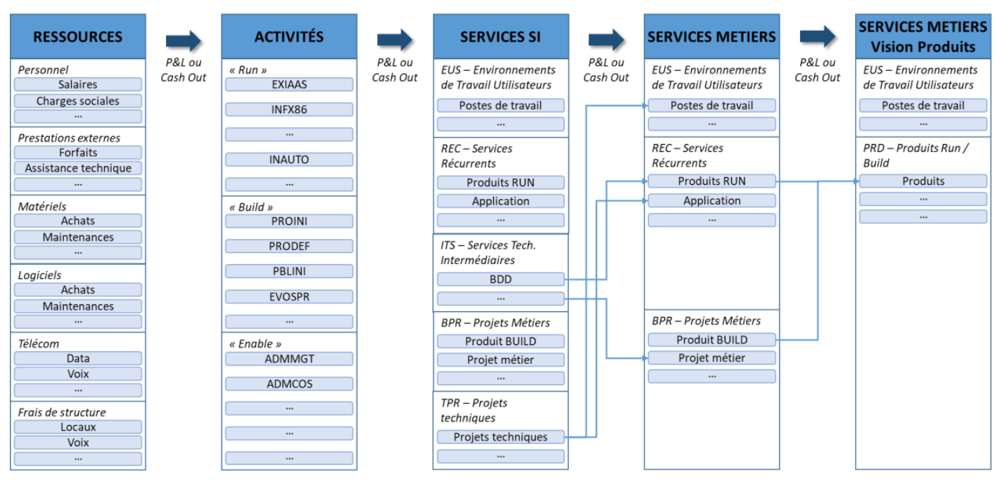

## Horodatage
### Sprint 1 
| Tâche               | Description      | Date       | Durée |
|---------------------|------------------|------------|-------|
| Tuto bases de VBA 1| [Leçons 1 - 6](https://www.excel-pratique.com/fr/vba) | 19/02/2024 | 4hrs  |
| Tuto bases de VBA 2| [Leçons 7 - 11](https://www.excel-pratique.com/fr/vba) | 21/02/2024 | 5hrs  |

### Sprint 2 
| Tâche    | Description                    | Date   | Durée |
|----------------------------------------------|--------------------------------------|--------|-------|
| Modèle d’analyse et de benchmarking des couts informatiques | Lecture œuvre en référence | 04/03  | 2hrs  |
| Spécifier l'exemple d’entreprise | Choisir le domaine d’activité et la taille de l’entreprise | 04/03| 1h |
| Faire une feuille Excel données entreprise fictive      | Lister les catégories de dépenses | 04/03  | 1h |
| Estimer les dépenses (en fct du CA et nb d'utilisateurs)| Simulation devis en ligne | 08/03  | 3hrs  |
| Conception du Dashboard |                                               |        |       |
| Perspectives d’optimisation des dépenses technologiques|             |        |       |

## Introduction 
Les dépenses technologiques font référence à toutes les dépenses liées à l'acquisition, à l'utilisation et à la maintenance de technologies de l'information et de la communication (TIC) dans le cadre des opérations commerciales d'une entreprise. On distingue donc deux types de dépenses technologiques ; Au-delà des services récurrents (logiciels, SaaS, Plateforme On Premise/Cloud …), la DSI fournit aussi des projets demandés par les métiers (exemple : l’évolution des pratiques « projets » et « opérations » vers des approches agiles et plus largement DevOps).

Les dépenses technologiques des entreprises dépendent de plusieurs éléments (le domaine d’activité, la taille de l’entreprise, son chiffre d’affaires, …).
Le coût moyen d’un budget informatique type, selon WalkMe, est le suivant : 
-	Les petites entreprises : moins de 50 millions de dollars (6,9 % du chiffre d’affaires) 
-	Les entreprises de taille moyenne : entre 50 millions et 2 milliards de dollars (4,1 % du chiffre d’affaires) 
-	Les grandes entreprises : plus de 2 milliards de dollars (4,1 % du chiffre d’affaires).

Dans ce POK je choisi de travailler sur une PME à l’exemple de l’entreprise BOFINGER SARL dans le domaine de l'hébergement et la restauration. Le chiffre d'affaires est de l'ordre de 3 millions d’euros et le nombre d’employés est 100.

## Modèle des coûts informatiques
Le modèle d'analyse et de benchmarking des coûts informatiques est un outil élaboré par le Cigref, une association regroupant de grandes entreprises françaises, pour aider les organisations à évaluer et comparer leurs coûts liés à l'informatique. Son approche structurée et ses multiples niveaux d'analyse en font un allié précieux pour les organisations cherchant à améliorer leur efficacité et leur rentabilité dans le domaine de l'informatique.
<figure style="text-align: center;">
    
    <figcaption style="margin-top: 10px;">Architecture du modèle</figcaption>
</figure>

Ce modèle m'a aidé à recenser les dépenses technologiques de l'entreprise, et l'adapter à l'exemple sur lequel je travaille. 

## Conclusion 

- Bases de VBA (Automatiser de simples tâches en enregistrant une macro + modifier le code + créer bouton d’exécution)
- Modèle des coûts informatiques 
-	Ordre de grandeurs des dépenses technologiques pour une entreprise
-	Perspectives d’optimisation des dépenses technologiques



-	[Documentation VBA](https://www.excel-pratique.com/fr/vba)
- [Modèle d’analyse et de benchmarking des couts informatiques selon Cigref (Club informatique des grandes entreprises françaises)](https://www.cigref.fr/wp/wp-content/uploads/2018/07/2018-Modele_d_analyse_et_de_benchmarking_des_couts_informatiques-Cigref-mise-a-jour-2018_web.pdf)
- [Dépenses technologiques selon WalkMe](www.walkme.com/fr/glossaire/it-budget/#:~:text=Le%20co%C3%BBt%20moyen%20d'un,%25%20du%20chiffre%20d'affaires)
- [Optimisation des coûts informatiques](https://www.leanix.net/fr/wiki/apm/it-cost-optimization#:~:text=Transformation%20continue-,Qu'est%2Dce%20que%20l'optimisation%20des%20co%C3%BBts%20informatiques,l'infrastructure%20et%20les%20applications)
- [Définitions et dénombrement des PME et TPE](https://www.economie.gouv.fr/files/finances/presse/dossiers_de_presse/entrepreneuriat_feminin/fiche3.pdf) 
- [Entreprises selon leur taille](https://data.oecd.org/fr/entrepreneur/entreprises-selon-leur-taille.htm) 
