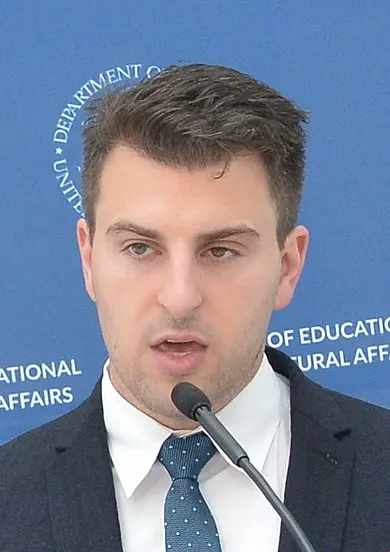
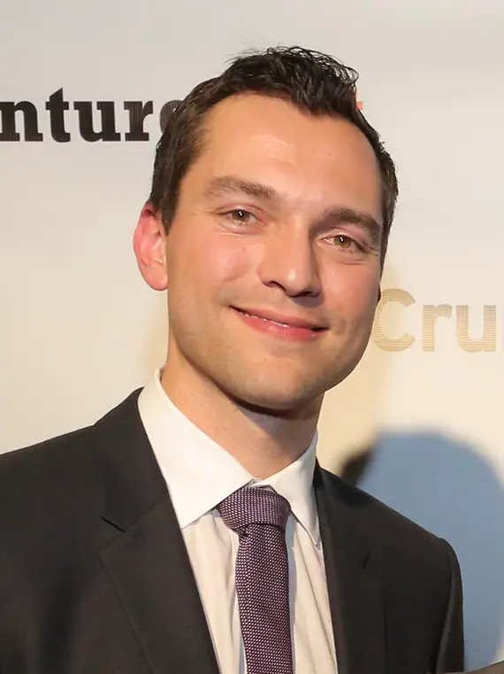
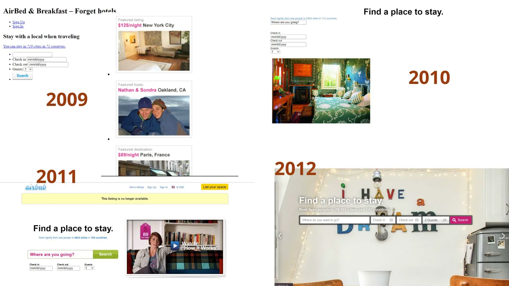
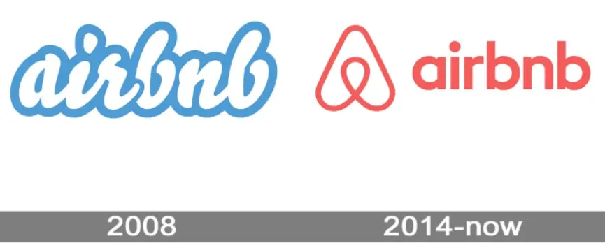
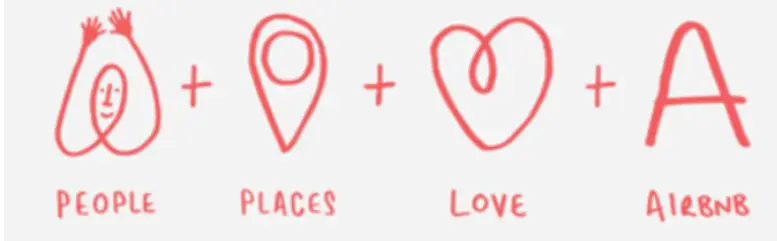

## Sommaire
- Histoire de la création
- Défis
- Conclusion
- Documentation

## Histoire de la création

L'histoire débute avec trois amis, Nathan, Joe, et Brian, qui vivaient ensemble en colocation. En octobre 2007, ils se sont retrouvés face à un dilemme lorsque le loyer de leur appartement a subi une augmentation de 25%. Deux d'entre eux, Nathan et un autre colocataire, décident de déménager. Brian, quant à lui, vivait à Los Angeles à l'époque. Cependant, une opportunité s'est présentée à lui de rejoindre ses amis à San Francisco et de se lancer dans l'aventure entrepreneuriale. Brian a donc décidé de quitter son emploi à Los Angeles et de déménager à San Francisco.

Malheureusement, une fois arrivé, Brian s'est rendu compte qu'il faisait face à un problème financier. Il ne lui restait que mille dollars sur son compte, et le loyer s'élevait à 1150 dollars. À ce moment-là, un événement fortuit se produisit : une conférence de design devait avoir lieu à San Francisco. Brian et Joe, qui étaient tous deux designers, ont alors eu l'idée ingénieuse de transformer leur appartement en chambre d'hôte, ou plutôt, en "Air Bed and Breakfast", car ils n'avaient qu'un matelas gonflable à offrir.

Ils ont mis en place une simple page web pour faire de la publicité à leur offre unique. En un jour, trois personnes ont répondu à leur annonce. Ce week-end-là, non seulement ils ont réussi à gagner le mille dollars dont ils avaient besoin, mais ils ont également noué des amitiés précieuses avec leurs invités. L'un d'eux les a même invités à son mariage deux ans plus tard.

En janvier 2008, le trio a décidé d'officialiser leur entreprise, partant du principe que leur idée pourrait être utile à d'autres dans des situations similaires. Ils ont réfléchi à ce concept et ont décidé de créer Airbnb.

### Fondateurs
|Photo |  | ||
| -------- | -------- |-------- |-------- |
| Nom    | *Brian Chesky*     |*Joe Gebbia*    |*Nathan Blecharczyk*    |
| Rôle    |  *PDG et co-fondateur d'Airbnb*     |*CPO (Chief Product Officer) et co-fondateur d'Airbnb*    |*CTO (Chief Technology Officer) et co-fondateur d'Airbnb*    |
| Formation   |  *Brian Chesky a étudié à la Rhode Island School of Design (RISD) où il a obtenu un baccalauréat en design industriel*     |* Comme Brian Chesky, Joe Gebbia a également étudié à la Rhode Island School of Design, où il a obtenu un diplôme en design graphique et industriel*    |* Nathan Blecharczyk a une formation en informatique et a étudié à l'Université Harvard*    |
| Parcours   |  *Avant Airbnb, il a travaillé en tant que designer industriel et a également créé une entreprise qui fabriquait des housses de protection écologiques pour ordinateurs portables*     |*Il a travaillé en design avant de fonder Airbnb et a été colocataire de Brian Chesky*    |* Il était un entrepreneur en série et un développeur de logiciels accompli avant de co-fonder Airbnb*    |
| Contribution     |  * En tant que PDG, il a été le visage public d'Airbnb et a joué un rôle déterminant dans la formulation de la vision et de la stratégie de l'entreprise, en mettant l'accent sur la culture de l'entreprise et l'expérience utilisateur*     |*Joe Gebbia a joué un rôle crucial dans la conception et le développement des produits d'Airbnb, en s'assurant que l'interface utilisateur et l'expérience utilisateur soient optimales. Il a également été un défenseur de la culture du design au sein de l'entreprise*    |*En tant que CTO, Nathan Blecharczyk a été responsable de la construction de la plateforme technologique d'Airbnb. Il a dirigé les équipes d'ingénierie et a été crucial pour le développement des technologies sous-jacentes qui alimentent Airbnb*    |

### Moments marquants au début

1. **L'évolution du concept & le mode de payement**

En **janvier 2008**, après avoir quitté leurs emplois respectifs, Nathan, Joe, et Brian ont décidé de créer une entreprise ensemble, basée sur l'idée originale qu'ils avaient conçue en octobre. Ils ont réfléchi et se sont dit que d'autres personnes, dans d'autres situations, pourraient bénéficier de ce concept. Ils se sont donc lancés dans la création d'un site web. Le site initial était assez simple et différent de ce lui d'aujourd'hui. Il était principalement un annuaire d'événements où les locaux pouvaient lister leurs chambres disponibles pour ces événements et où les visiteurs pouvaient les consulter et les contacter. Ce site, qui ressemblait beaucoup à un [Craigslist ](https://marseilles.craigslist.org/)  amélioré, a été construit en trois semaines et a été lancé pour le festival South by Southwest en **mars 2008**.

Ils ont réussi à lister une douzaine de propriétés sur le site, et deux ou trois personnes, dont Brian, l'ont effectivement utilisé. Brian s'est rendu à Austin, Texas, où son hôte l'a accueilli chaleureusement, avec un dîner préparé par la femme de l'hôte et un lit gonflable confortable. Cependant, un problème s'est posé lorsque l'hôte a demandé à Brian le paiement, car à ce moment-là, le site n'acceptait pas encore les paiements en ligne. Brian avait oublié d'aller au distributeur de billets et a demandé s'il pouvait payer le lendemain.

Le lendemain, Brian oublie à nouveau d'aller au distributeur de billets, et l'hôte commence à devenir méfiant. Il se demande qui est cet homme qu'il ne connaît pas vraiment et qui dort chez lui, trouvé sur internet. L'hospitalité commence à s'estomper, et cela a fait réfléchir les fondateurs d'Airbnb sur les améliorations qu'ils pouvaient apporter à leur service, notamment en ce qui concerne les transactions financières. Ce fut un moment crucial dans l'évolution d'Airbnb, qui a souligné l'importance de la confiance et de la sécurité dans le modèle d'affaires de la plateforme de partage de logements.

2. **Amélioration de l'expérience utilisateur pour la première fois**

Après cet événement, les fondateurs d'Airbnb ont appris quelque chose de crucial : les gens voulaient utiliser leur service même s'ils ne se rendaient pas à un événement. Au début, ils étaient réticents, car ils pensaient que la présence à un événement créait une confiance entre l'hôte et l'invité. Cependant, ils ont commencé à réfléchir à une nouvelle vision pour Airbnb : pourquoi ne pas rendre la réservation d'une maison aussi facile que celle d'un hôtel ? Ils ont adopté le slogan "Trois clics pour réserver". L'utilisateur irait sur la page d'accueil, taperait une destination, verrait quelques résultats et, s'il trouvait quelque chose qu'il aimait, il pourrait le réserver en trois clics.

**Fin 2008**, ils ont décidé de lancer ce nouveau concept lors d'un autre événement : la convention nationale démocrate à Denver, où Barack Obama allait recevoir la nomination du parti pour la présidence. Ils ont remarqué une opportunité car le stade où l'événement devait avoir lieu pouvait accueillir 80 000 personnes, mais il n'y avait que 17 000 chambres d'hôtel à Denver. Ils ont donc rapidement construit le site web et l'ont lancé deux semaines avant l'événement. En une semaine, 800 personnes ont listé leurs propriétés sur le site. Les médias locaux et même internationaux, dont CNN, ont rapidement couvert Airbnb, ce qui a contribué à sa popularité. Pour cet événement, environ 100 personnes ont utilisé leur service.

3. **Comment financer les dépenses de la start-up ?**

Tout semblait aller parfaitement bien pour les fondateurs d'Airbnb après le lancement de leur entreprise. Il y avait une effervescence, une couverture médiatique importante, et ils se sentaient au sommet du monde. Cependant, cette euphorie s'est rapidement dissipée et a été remplacée par une période de difficultés et de découragement. Personne ne s'intéressait plus à eux, et ils n'étaient plus pertinents. Cela a conduit à une longue période où, peu importe ce qu'ils faisaient, les choses ne s'amélioraient pas.

Dans cette période difficile, les fondateurs devaient trouver des moyens de financer l'entreprise et de générer de la presse. Après la convention, ils avaient les contacts de nombreux journalistes qui avaient couvert l'événement. Ils ont réfléchi à la façon d'utiliser ces contacts pour obtenir plus de couverture médiatique. À l'approche des élections, ils ont décidé de capitaliser non seulement sur le concept "air bed", mais aussi sur le "breakfast", et ils ont créé des céréales thématiques présidentielles appelées "Obama O's" et "Cap'n McCains". Ils ont conçu des boîtes originales, les ont remplies de céréales achetées au supermarché, et les ont envoyées à des journalistes. L'idée était de piquer la curiosité des journalistes pour qu'ils les contactent et écrivent sur eux.

L'idée a fonctionné. Ils ont de nouveau été mis en lumière sur CNN, et ils ont réussi à vendre ces boîtes de céréales à $40 l'unité sur leur site web, générant environ $30,000. Cela a permis de financer l'entreprise dans ses premiers jours, bien que ce ne fût pas idéal. C'est de là que vient le terme "être un entrepreneur en série" (serial entrepreneur), jouant sur les mots "cereal" (céréale) et "serial" (série/en série).

4. **Problème de financement**

La situation s'est détériorée à l'automne 2009 avec le début de la récession. Après environ dix mois sans emploi et sans avoir pu lever de fonds significatifs, sauf les $30,000 obtenus de la vente des céréales (qui couvraient à peine les coûts de production), la startup était dans une situation précaire. En plus, [Sequoia Capital](https://www.sequoiacap.com/) avait publié une présentation annonçant la fin des bons temps et recommandant à tout le monde de conserver du capital, signalant une difficulté accrue à lever des fonds.

Airbnb ne générait que $200 par semaine, et l'équipe envisageait sérieusement d'abandonner. Ils ont alors décidé d'appliquer au programme d'accélérateur Y Combinator, fondé par Paul Graham, dans une dernière tentative pour redresser la barre. L'équipe n'avait pas encore donné son 100%, travaillant sur d'autres projets parallèlement, et ils étaient dispersés entre Boston et San Francisco.

L'interview pour [Y Combinator](https://www.ycombinator.com/) s'est mal passée au début, avec Paul Graham essayant de les convaincre de changer leur idée d'entreprise. Cependant, en quittant l'interview, ils ont donné à Paul une boîte de leurs céréales Obama O’s, ce qui a changé sa perception d'eux. Ils ont raconté l'histoire de la création des céréales, montrant leur résilience et leur créativité, qualités très appréciées par Paul Graham, qui a souvent parlé de l'importance d'être « comme un cafard », c'est-à-dire indestructible et débrouillard. Impressionné par leur initiative et leur ingéniosité, il les a acceptés dans le programme, marquant un tournant pour la société.

5. **L'accompagnement d'Y Combinator**

L'équipe d'Airbnb est devenue extrêmement disciplinée et concentrée. Ils sont tous retournés à San Francisco et ont vécu ensemble dans le même appartement qu'ils avaient montré auparavant. Ils étaient hyper concentrés, se levant tous à la même heure, à 8 heures du matin. L'un d'entre eux dormait sur un Airbed dans la chambre de Joe. Ils travaillaient toute la journée, ne prenant des pauses que pour aller au gymnase, prendre une douche, faire les courses, préparer le petit déjeuner, le déjeuner et le dîner. Autrement, ils travaillaient six jours par semaine avec une concentration intense.

En raison de la récession, PG (Paul Graham) leur avait fait savoir que le revenu serait crucial. Il était important qu'ils soient rentables pour le "demo day", la fin du programme Y Combinator, où ils devaient présenter leur entreprise aux investisseurs. Ils ont alors créé le concept de "ramen profitability", signifiant qu'ils avaient besoin de mille dollars par semaine, juste assez pour acheter des ramens et payer le loyer. Ils ont affiché leurs objectifs de revenus partout dans l'appartement pour maintenir leur focus.

PG  leur a suggéré de se rendre à New York pour rencontrer leurs utilisateurs. Malgré le manque de fonds, l'équipe a pris son conseil à cœur et, lors de quatre week-ends différents, ils ont visité New York et rencontré tous leurs utilisateurs, qui étaient à l'époque seulement 20 ou 30 hôtes. Ils ont remarqué que beaucoup avaient de mauvaises photos de leurs propriétés et ont donc proposé d'envoyer un photographe professionnel pour prendre des photos de leurs appartements gratuitement.

C'était, en réalité, Joe et Brian, les cofondateurs de l'entreprise, qui sont venus prendre les photos avec un appareil photo loué. Ils ont également recueilli des feedbacks sur le produit et ont invité les hôtes à boire une bière, construisant des relations et partageant l'histoire de leur entreprise, et essayant de les convertir en évangélistes.

De retour à San Francisco, forts de ces relations nouvellement établies, ils étaient en mesure de demander aux hôtes de faire des améliorations sur leurs profils et d'ajuster leurs prix. La prise de photos de haute qualité, la baisse des prix, l'amélioration des descriptions de profil et la coopération générale des hôtes ont grandement contribué à améliorer le service d'Airbnb.

6. **La prospection**

Le produit d’Airbnb a commencé à prendre forme, transformant leur idée novatrice en un service mondial. Les logements à New York, dotés de belles photos et de descriptions améliorées, ont commencé à attirer des visiteurs du monde entier. Les hôtes satisfaisants ont partagé leur succès avec leurs amis, propageant ainsi l’utilisation du service. La réputation d’Airbnb a grandi, et des propriétés ont commencé à apparaître dans des villes du monde entier, telles que Berlin, Barcelone et Hong Kong. Fin 2009, le site a compté 600 000 propriétés dans 192 pays, accueillant environ 150 000 personnes chaque nuit.

Airbnb a non seulement révolutionné le secteur de l'hospitalité, mais a également donné naissance à une nouvelle génération d'entrepreneurs. Une étude en Espagne a révélé que 28% des hôtes d'Airbnb étaient des entrepreneurs, générant environ 40 000 emplois. Ces entrepreneurs utilisaient également Airbnb pour créer des réseaux, rencontrer des clients et recueillir des avis sur leur travail. La vision d’Airbnb pour connecter les entrepreneurs du monde entier s'est matérialisée, créant des opportunités pour des collaborations fructueuses.

Les réalisations d'Airbnb ont été marquées par un succès exponentiel, accueillant sept millions de nouveaux visiteurs en 2013 après quatre années pour atteindre les quatre millions initiaux. La croissance explosive était l'incarnation même de la courbe ascendante classique, montrant l’adoption massive et rapide du service à travers le monde.

Enfin, la collaboration d'Airbnb avec des événements et des forums a cherché à connecter des entrepreneurs du monde entier, créant une plateforme pour l’innovation, l'inspiration et le développement professionnel et entrepreneurial.

### Site web au fil du temps
Le site web de Airbnb a connu d'énormes changements depuis sa création en 2008. Vous trouverez dans le site [WayBackMachine](https://web.archive.org/web/20161122123602/https://www.airbnb.com/?cdn_locale_redirect=1)  les détails de ces changements.
Exemple : 

En 2014, l'entreprise a décidé de changer son logo et de choisir un qui reflète sa vision et ses valeurs.

La communauté d'Airbnb n'a pas compris la signification du new logo. ***"[Le Bélo ](https://youtu.be/nMITXMrrVQU?si=3DijuNji2BUyxVeg)"*** est le nom de ce logo : The Story of a Symbol of Belonging 

## Défis

### Questions de Sécurité et de Discrimination : 
Des incidents concernant la sécurité des utilisateurs et des cas de discrimination sur la plateforme ont nécessité des mesures correctives et des améliorations de la part d'Airbnb.
**En 2011**, Airbnb a dû faire face à un incident de sécurité majeur et très médiatisé, qui a révélé des vulnérabilités dans ses politiques et ses systèmes de protection des utilisateurs.

1. L'Incident: 
Un hôte Airbnb, qui a publié son expérience sous le pseudonyme "EJ", a rapporté que son domicile avait été vandalisé et pillé par un locataire qu'elle avait trouvé via la plateforme Airbnb. Selon EJ, le locataire a causé des dommages significatifs à sa propriété et a volé ses biens personnels, y compris des documents importants et des objets de valeur.
2. Mesures Correctives:
Face à la réaction publique et aux retombées médiatiques, Brian Chesky, le PDG d'Airbnb, a admis publiquement que l'entreprise avait fait des erreurs dans sa gestion de l'incident. Il a présenté ses excuses pour la manière dont l'incident a été géré et a annoncé une série de mesures visant à améliorer la sécurité sur la plateforme, y compris :

-  Garantie Hôte :
Airbnb a introduit une garantie hôte de 50 000 dollars (plus tard augmentée à 1 million de dollars) pour couvrir les dommages à la propriété causés par des locataires.
- Améliorations de la sécurité :
Airbnb a renforcé ses procédures de vérification des utilisateurs et a introduit de nouvelles fonctionnalités de sécurité, comme les profils vérifiés et un système de messagerie sécurisé.
- Service client amélioré :
Airbnb a investi dans l'amélioration de son service clientèle, y compris la mise en place d'une ligne d'assistance disponible 24h/24 et 7j/7.

### Défis et Controverses :
Problèmes de Réglementation : Airbnb a fait face à des défis réglementaires dans de nombreuses villes où les autorités ont imposé des restrictions sur les locations de courte durée.

## Conclusion
Je pense que l’histoire d’Airbnb est un récit chaleureux et inspirant qui nous invite à regarder au-delà de l'ordinaire, à embrasser l'inconnu, et à trouver la magie dans les possibilités infinies qui nous entourent. C'est un rappel vivifiant que, avec passion, résilience et une touche d'innovation, nous pouvons tous contribuer à créer un monde plus inclusif et accueillant pour tous.



* [The real story about how Airbnb was founded - Nathan Blecharczyk Co-founder Airbnb -](https://youtu.be/M6GBqqk2mY4?si=v4lXQi_bvU_q9ro4)
* [Brian Chesky sur le lancement d'Airbnb et les défis de l'échelle](https://youtu.be/W608u6sBFpo?si=fPQlVDwCF62A5wAL)
* [L’explication du logo d’AirBNB](https://www.creation-logo.net/blog/explication-du-logo-d-airbnb.html)
* [COMMENT AIRBNB EST DEVENUE UN PHÉNOMÈNE MONDIAL ? – EP 1](https://inspire-media.fr/airbnb-1-la-creation-cereales-et-galeres/)
* [COMMENT AIRBNB EST DEVENUE UN PHÉNOMÈNE MONDIAL ? – EP 2](https://inspire-media.fr/airbnb-2-comment-airbnb-est-devenue-un-phenomene-mondial/)

