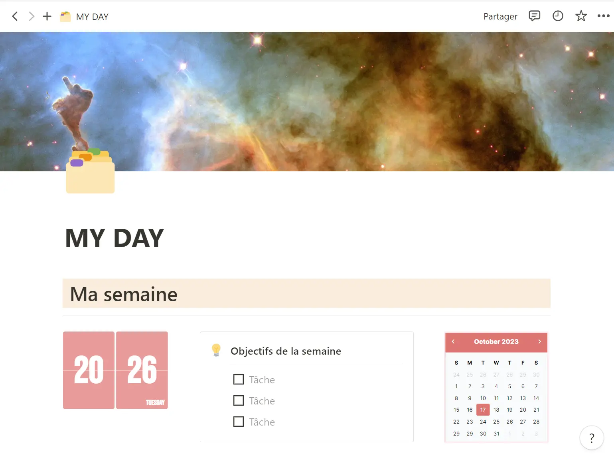
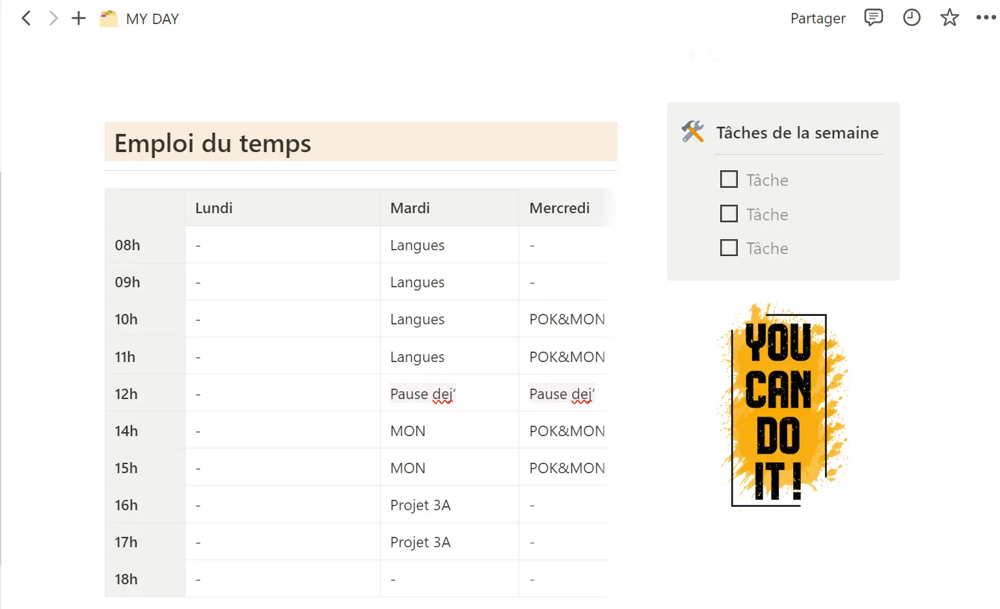
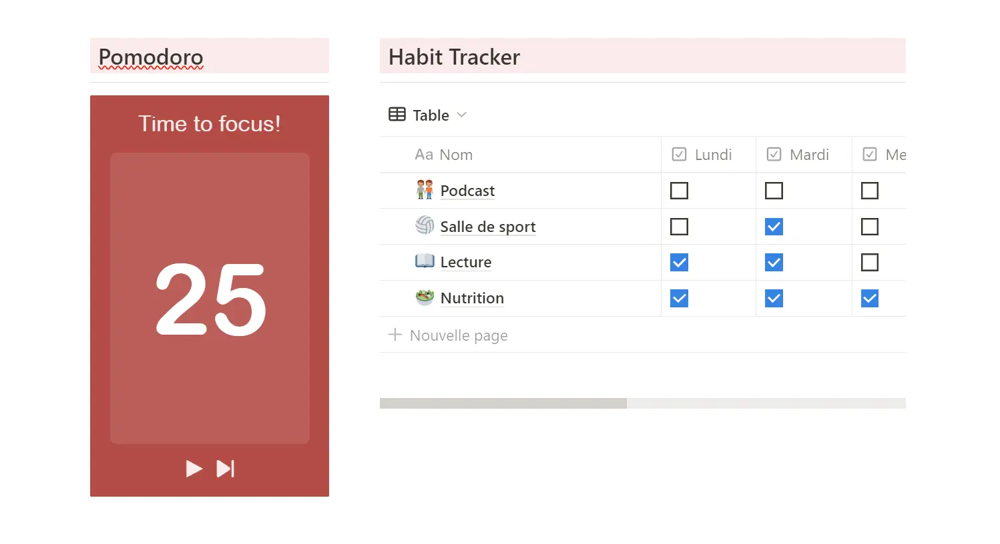
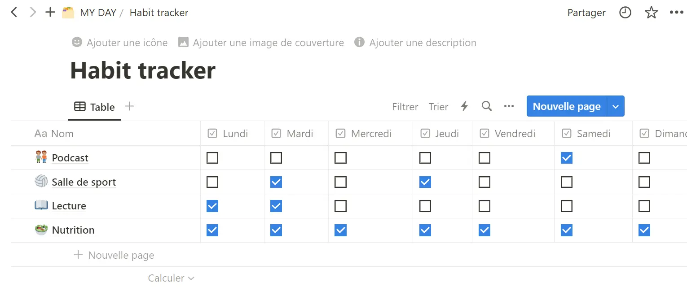
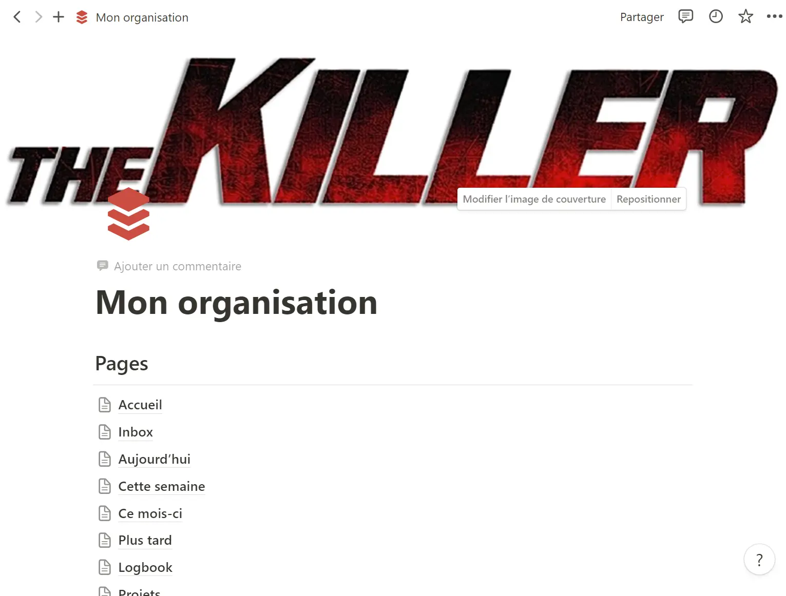

## Qu'est-ce que Notion ?
- Une plateforme tout-en-un pour la gestion de projets, la documentation, et l'organisation personnelle.
- Fusion de nombreuses applications en une seule interface.

## Pourquoi Notion ?
**Notion** est un outil de gestion de l'information et de productivité qui a gagné en popularité pour plusieurs raisons. Voici quelques raisons principales pour lesquelles de nombreuses personnes et entreprises l'ont adopté :

- Interface personnalisable : possibilité de structurer votre espace de travail comme vous le souhaitez, avec des pages imbriquées, des modèles personnalisés et une mise en page flexible.
- On peut utiliser le **Markdown**
- Collaboration en temps réel : sur des documents, des bases de données et d'autres contenus en temps réel avec des membres de l'équipe ou des personnes extérieures.
- Intégration avec d'autres outils : Bien que Notion soit un outil tout-en-un, il offre également des intégrations avec d'autres outils populaires comme **Figma**, **Github**..., ce qui facilite le flux d'information entre différentes plateformes.
- Prix : Notion offre une version gratuite qui est assez généreuse en termes de fonctionnalités. 
- Modèles préfabriqués 
- Communauté active 
- Evolution constante 
- Esthétiquement plaisant : L'interface propre et moderne de Notion rend le travail agréable. 

## Planification d'un projet de développement logiciel:

- Utilisation de bases de données imbriquées pour suivre les sprints, les tickets, et les releases.
- Templates pour la documentation technique et les guides utilisateur.

## Ce que j'ai appris à faire:

- Créer et structurer ma première page
- Ajouter une table des matières
- Créer une base de données de ses cours
- Ajouter les widgets horloge & calendrier
- Ajouter un pomodoro
- Ajouter son Google Agenda
- Créer un habit tracker

## Pourquoi j'ai choisi Notion ?
L'idée était de créer une template pour structurer notre projet 3A, avec un tableau de bord, une liste de tâches, une page pour noter nos idées... où on peut visualiser notre avancement du jour le jour. 
So, j'ai créé un espace bien organisé, avec une liste de pages et une liste de BD.

## Références : 


-	[COMMENT S'ORGANISER AVEC NOTION EN TANT QU'ÉTUDIANT ? ](https://youtu.be/dKQmXp15Efk?si=uSJceWaojdnuzcdL)
- [Notion : la Formation Ultime](https://youtu.be/S94dLBGiLUk?si=ZcjD88YGXhXCYeDL)
- [Easily Manage Complex Projects in Notion!](https://youtu.be/OOYmBRr3zVs?si=LE7Hl8IN7WybWCTd)


