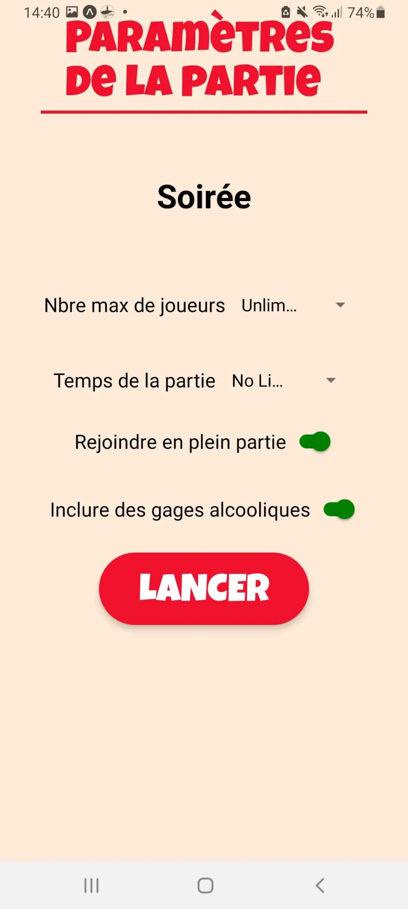
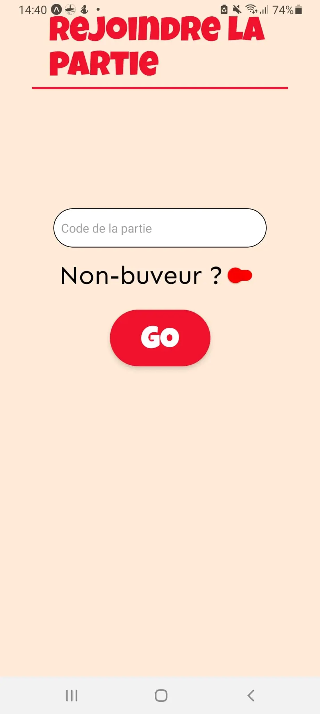

Avant de commencer React Native, vaut mieux avoir des bases sur React. Je vous propose de jeter un coup d'oeil sur [React.js et Tailwind CSS](https://francoisbrucker.github.io/do-it/promos/2023-2024/Rioual-Lucas/mon/temps-2.1/) fait par [ Lucas Rioual](https://francoisbrucker.github.io/do-it/promos/2023-2024/Rioual-Lucas/) 

## Qu'est-ce que React Native ?

React Native est un framework de développement d'applications mobiles créé par Facebook. Il permet aux développeurs de construire des applications mobiles en utilisant JavaScript et React, tout en offrant une expérience proche de celle d'une application native. Les principaux avantages de React Native incluent la capacité de réutiliser le code entre les plateformes iOS et Android, une grande communauté de développeurs, et un développement plus rapide.

## Les Bases de React Native
Pour commencer avec React Native, on aura besoin d'installer Node.js, Watchman, et l'environnement de développement React Native CLI. Une fois installé, on peut créer un premier projet en exécutant *npx react-native init MonApplication*. 
Un projet React Native typique a une structure de dossiers contenant des fichiers JavaScript pour les composants, ainsi que des dossiers pour les ressources et les tests.

## Exemples de Code de Base
React Native utilise des composants pour construire l'interface utilisateur. Par exemple, un composant simple peut être un bouton ou une vue texte. La navigation entre les écrans se fait à l'aide de bibliothèques comme React Navigation. Les états et les props sont utilisés pour gérer les données et rendre les composants réactifs. Voici un exemple de composant simple :

```js
import React from 'react';
import { View, Text, Button } from 'react-native';

const MonComposant = () => {
  return (
    <View>
      <Text>Bienvenue dans React Native!</Text>
      <Button title="Cliquez ici" onPress={() => alert('Bouton cliqué!')} />
    </View>
  );
};

export default MonComposant;
```
## Construire une Application Simple
On peut maintenant voir comment construire une application simple. Je vais créer une application de liste de tâches. Le but est de se familiariser avec la création de composants, l'utilisation de l'état, et la manipulation des données.
### Création du Projet
Ouvrez votre terminal et exécutez la commande suivante pour créer un nouveau projet React Native :
``` html
npx react-native init MaListeDeTaches

```
### Structure de Base
En naviguant dans le dossier du projet et en l'ouvrant dans l'éditeur de code,on va trouver plusieurs dossiers et fichiers.On va principalement travailler dans le fichier **App.js**

### Développement de l'Interface Utilisateur
Dans App.js, on commence par importer les composants nécessaires de React Native :

```js
// Importer les composants nécessaires de React et React Native
import React, { useState } from 'react';
import { View, Text, TextInput, Button, FlatList } from 'react-native';

```

Ensuite, on crée un composant fonctionnel **App** :



```js
// Créer le composant principal App
const App = () => {
  // Utiliser le Hook d'état pour gérer les tâches et la liste des tâches
  const [tache, setTache] = useState(''); // Pour la tâche actuellement saisie
  const [listeDeTaches, setListeDeTaches] = useState([]); // Pour toutes les tâches ajoutées

  // Fonction pour ajouter une nouvelle tâche à la liste
  const ajouterTache = () => {
    setListeDeTaches([...listeDeTaches, tache]); // Ajouter la tâche actuelle à la liste
    setTache(''); // Réinitialiser le champ de saisie de la tâche
  };

  // Rendu de l'interface utilisateur de l'application
  return (
    <View style={{ padding: 20 }}>
      <Text>Liste de Tâches</Text>
      <TextInput
        placeholder="Ajoutez une tâche..." // Placeholder pour le champ de saisie
        value={tache} // Valeur actuelle de la tâche
        onChangeText={setTache} // Mise à jour de la valeur à chaque modification du texte
        style={{ borderWidth: 1, borderColor: 'black', marginBottom: 10 }} // Style du champ de saisie
      />
      <Button title="Ajouter" onPress={ajouterTache} /> {/* Bouton pour ajouter une tâche */}
      <FlatList
        data={listeDeTaches} // Données pour la liste des tâches
        renderItem={({ item }) => <Text>{item}</Text>} // Comment afficher chaque tâche
        keyExtractor={(item, index) => index.toString()} // Clé unique pour chaque élément de la liste
      />
    </View>
  );
};

export default App; // Exporter le composant pour utilisation dans l'application

```

Dans ce code, on a:

Un *TextInput* pour saisir les tâches.
Un *bouton Ajouter* pour ajouter des tâches à la liste.
Un *composant FlatList* pour afficher les tâches.

### Exécution de l'Application

Pour exécuter l'application, dans le terminal, on navigue vers le dossier de votre projet et on exécute :
``` html
npx react-native run-android

```
## Exemples d'application :

Projet 3A : **KILLER**

<div style="display: flex; justify-content: space-around;">
  
  
</div>


## Bibliographie 

- React native official site **Tout au long de la phase d'apprentissage** : (https://reactnative.dev/docs/getting-started)
- Build your first React Native app - Todo List Tutorial **Temps estimé = 1h**, , **Niveau débutant**: (https://www.youtube.com/watch?v=0kL6nhutjQ8&t=54s)
-	React Native Course – Android and iOS App Development **Temps estimé = 5h**, **Niveau débutant** : (https://youtu.be/obH0Po_RdWk?si=sR43Z5PRW9saUu_q) 
-	Build and Deploy a React Native App **Temps estimé = 3H**, **Niveau Avancé** : (https://youtu.be/mJ3bGvy0WAY?si=E2pUqappCHahguCX)
