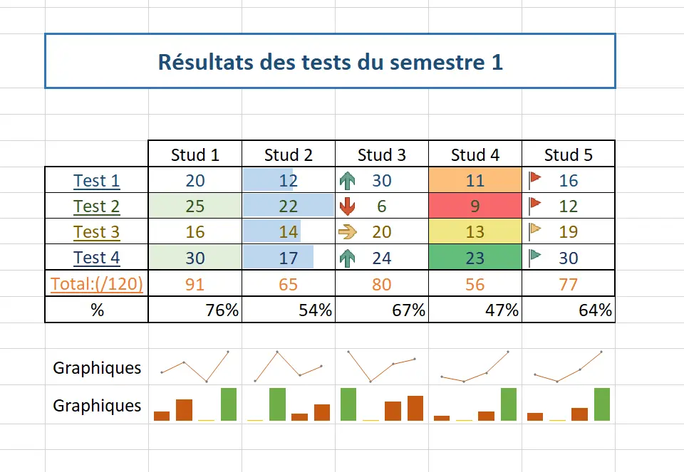
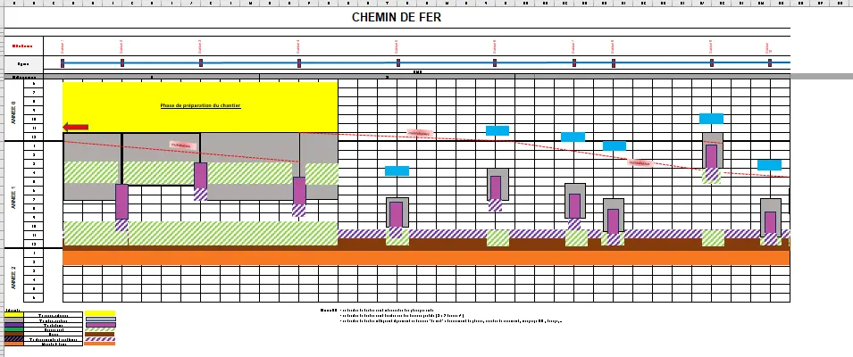

Ce MON a pour objectif revoir les bases d'Excel et apprendre à maîtriser cet outil.
Je vais commencer par me baser sur le MON de Lola [Excel - Repartir sur de bonnes bases](https://francoisbrucker.github.io/do-it/promos/2023-2024/Lola-Bourdon/mon/temps-1.2/) et le MON de Henri [Un peu d'Excel/Google Sheets pour mourir moins idiot   ](https://francoisbrucker.github.io/do-it/promos/2023-2024/TAING-Henri/mon/temps-2-1/)

# Rafraîchir sa mémoire sur les trucs cool d'Excel
J'ai commencé par lire et appliquer les cas pratiques du MON de Lola, en parcourant le site du cours qu'elle a suivi : [Formation Excel](https://www.excel-pratique.com/). Cependant, le site ne m'a pas captivé, alors j'ai cherché des tutoriels plus dynamiques et concis. Je suggère cette série de vidéos qui aborde l'essentiel de façon efficace [Cours complet Microsoft EXCEL](https://www.youtube.com/playlist?list=PL8sQnj6qF1Lv6ejdklq25MGfPJFxThMw6), vous trouverez les bases suivantes:
- Les POURCENTAGES, Fcts Max/Min
- Créer un GRAPHIQUE avec EXCEL et l'améliorer
- TRIER et FILTRER une LISTE (base de données)
- Utiliser la MISE EN FORME automatique CONDITIONNELLE 
- NBVAL et NB.SI
- Les MINI-GRAPHIQUES d'une case (Graphiques Sparkline)
- Utiliser la FONCTION SI Condition à 2 possibilités, à 3 possibilités ou PLUS (si imbriqués)
- Les fonctions ET et OU + utilisation avec SI 
- ALEA, ALEA.ENTRE.BORNES et TABLEAU.ALEA (Les nombres aléatoires (tirage au sort))
- Créer une LISTE DÉROULANTE
- La VALIDATION des DONNÉES (Créer un formulaire sans erreur d'encodage)
- Les fonctions RECHERCHEV et RECHERCHEH 
- Créer un TABLEAU CROISÉ DYNAMIQUE + GRAPHIQUE
- La fonction RANG (établir un classement)
- Réaliser un CLASSEMENT AUTOMATIQUE 
- Créer une CARTE GÉOGRAPHIQUE automatique (statistiques par pays, régions et villes)
- CONVERTIR des DEVISES (convertisseur de monnaie automatique)
- Créer un BINGO automatique 
- Comment CRÉER un MODÈLE EXCEL réutilisable ? 
- L'ANALYSEUR de DONNÉES (Tableaux et graphiques automatiques)

## Exemples d'application

  

  

  

## Bibliographie 

-	Réappliquer le cours   **Temps estimé = 3h**: [Formation Excel](https://www.excel-pratique.com/).
-	La formation   **Temps estimé = 3h**: [Cours complet Microsoft EXCEL](https://www.youtube.com/playlist?list=PL8sQnj6qF1Lv6ejdklq25MGfPJFxThMw6).
- Appliquation "Chemin de Fer"  **Temps estimé =2h**


