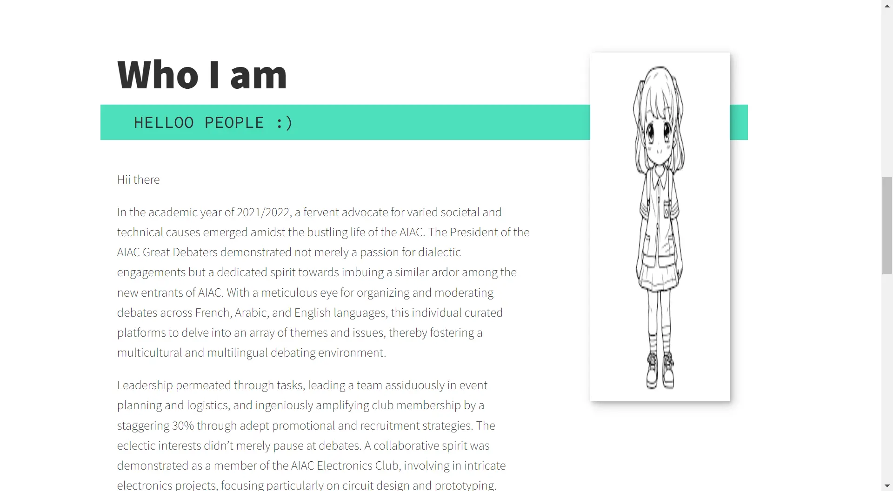

## Objectif 
Créer un portfolio avec Html, Css et Javascript en se concentrant sur le design du portfolio

## Plan d'action
1. Planification
   - Définir l'Objectif : Déterminez le but/design du portfolio.
   - Organiser le Contenu : Rassemblez les informations, projets, et images que vous souhaitez inclure.
2. Création de la Structure de Base avec HTML
3. Style avec CSS
4. Ajout de Fonctionnalités avec JavaScript
5. Mise en Forme et Style
6. Animation et Interactivité

## Ce que j'ai fait
1. Commencer à travailler avec Html et Css
2. Chercher des tutoriels guidés
3. Commencer un cours Css en ligne

## Les erreurs commises 
1. Pas de planification claire et détaillée
2. Perdre du temps à chercher l'idée du design
3. Se lancer au travail sans faire une maquette du résultat final

# Sprint 2


## Ce que j'ai fait

J'ai créé un portfolio avec Html & Css, où je montre mes projets personnels et le travail que je fais. 
J'ai appliqué les connaissances que j'ai pris dans les formations que j'ai suivi sur un site web e-commerce, j'ai créé:
- Header Section
- Home Section
- About Section
- Portfolio Section
- Services Section


 
 Et par la suite j'ai entrepris le travail sur mon Portfolio.


## Code HTML



Structure du code HTML :
```html
<!DOCTYPE html>
<!DOCTYPE html>
<html lang="en">
<head>
    <meta charset="UTF-8">
    <meta name="viewport" content="width=device-width, initial-scale=1.0">
    <title>KhaoulaDev Porfolio</title>

    <!-- in order to normalize the pages -->
    <link rel="stylesheet" href="https://cdnjs.cloudflare.com/ajax/libs/normalize/7.0.0/normalize.min.css"> 
    <link rel="stylesheet" href="https://cdnjs.cloudflare.com/ajax/libs/font-awesome/5.11.2/css/all.css" integrity="sha256-46qynGAkLSFpVbEBog43gvNhfrOj+BmwXdxFgVK/Kvc=" crossorigin="anonymous" />  
    <link rel="stylesheet" href="styles/style.css">

    <link rel="stylesheet" href="https://cdnjs.cloudflare.com/ajax/libs/font-awesome/6.4.2/css/all.min.css" integrity="sha512-z3gLpd7yknf1YoNbCzqRKc4qyor8gaKU1qmn+CShxbuBusANI9QpRohGBreCFkKxLhei6S9CQXFEbbKuqLg0DA==" crossorigin="anonymous" referrerpolicy="no-referrer" />
    <!-- Fonts -->
    <link href="https://fonts.googleapis.com/css?family=Source+Code+Pro:400,900|Source+Sans+Pro:300,900&display=swap" rel="stylesheet">
</head>


<body>
    <header>
      <!-- contenu de l'en-tête-->
    </header>
    <main>
      <!--contenu principal de la page-->
    </main>
    <footer>
      <!--contenu du pied de page-->    
    </footer>
</body>

</html>
```
 Vous prouvez trouver le code Html [ici](https://github.com/KhaoulaBelaaziz/Portfolio-Html-Css/blob/main/index.html).

## Code CSS

J’ai développé le stylesheet du site. Vous prouvez le visualiser [ici](https://github.com/KhaoulaBelaaziz/Portfolio-Html-Css/blob/main/Styles/style.css).

## Résultat final





## Points d'amélioration
Le site est opérationnel, mais faute de temps, certaines de mes idées n'ont pas été implémentées. Je souhaite améliorer sa conception responsive et ajouter plus d'éléments interactifs pour enrichir l'expérience utilisateur.

## Références : 

-	[Projet HTML,Css](https://youtu.be/9mhyO-qf_nU?si=QEmIG04kaaFmV8rV)
- [HTML Tutorial 1](https://youtu.be/J-pO5UIqkBE?si=6oYzcvvrQqNZ8dqK)
- [HTML Tutorial 2](https://youtu.be/U7A-lOeILdU?si=PH9R_yM6Lo_7VMAo)
- [CSS Tutorial 1](https://youtu.be/czf0aHOayWg?si=If3LJ_BShte2pFrN)
- [CSS Tutorial 2](https://youtu.be/xpFNbKYzzfU?si=O0GVPeypsN8E4DJ2)
- [CSS Tutorial 3](https://youtu.be/HtYGgEuiG8o?si=lSI9nM0FFNUaLjfe)
- [Template : Build and deploy a portfolio website ](https://youtu.be/_xkSvufmjEs?si=0QYDhdelan53PqaC)


