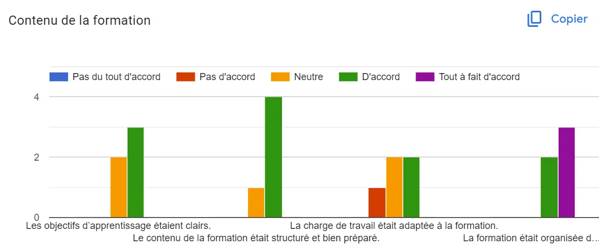

## Roadmap : 

- Documentation (Revoir les bases de Dialux) ***5h***
- Les normes européennes de l'éclairage ***1h***



- Faire l'étude d'un projet réel de l'entreprise ***3h***
- Point avec M.Magnani ***2h***
- Analyse du besoin ***?h***
- Formation ***3h***


# Choix du logiciel

| | DIALux | Relux | 
|-----------|-----------|-----------|
|Fonctionnalités  |- Options avancées pour la simulation d'éclairage intérieur et extérieur.  - Large gamme de bibliothèques de luminaires et de matériaux.|- Options robustes pour la planification d'éclairage intérieur, extérieur et de la lumière du jour. - Bibliothèques de produits constamment mises à jour. | 
|Interface Utilisateur   |- Interface relativement complexe, nécessitant un temps d'adaptation. - Personnalisable selon les besoins de l'utilisateur.|- Interface utilisateur plus intuitive et facile à naviguer. - Conviviale pour les nouveaux utilisateurs. | 
|Convivialité            |- Convient mieux aux utilisateurs ayant une certaine expérience de la conception d'éclairage. - Documentation et tutoriels détaillés disponibles pour l'apprentissage. |- Approprié pour les débutants et les utilisateurs intermédiaires. - Tutoriels et guides d'utilisation pour faciliter l'apprentissage.| 
|Capacités de Simulation |- Simulations précises et détaillées. - Bonne représentation de l'effet de la lumière sur différents matériaux.| Simulations de haute qualité, avec un accent sur la lumière naturelle. - Rendus rapides et efficaces.| 
|Compatibilité           |- Peut importer des données de différents formats de fichiers CAO. - Bonne intégration avec d'autres outils de conception. |- Bonne intégration avec divers formats de fichiers CAO. - Exporte facilement les données vers d'autres logiciels. | 
|Ressources              |- Cours de formation et certifications disponibles. - Communauté d'utilisateurs active et forums de support.|- Support technique et formation en ligne disponibles. - Base d'utilisateurs moins vaste comparée à DIALux, mais communauté active. | 

## Normes européennes de l'éclairage public

Les critères de l'Union Européenne pour l'acquisition publique écologique (GPP) concernant l'éclairage routier et les signaux de circulation visent à réduire les impacts environnementaux liés à la conception, l'installation et l'exploitation de ces systèmes. Ces critères se concentrent sur trois aspects principaux : la consommation d'énergie, la pollution lumineuse et la durabilité. Ils incluent l'utilisation de luminaires et de sources lumineuses à haute efficacité lumineuse, la gradation de l'éclairage pendant les périodes de faible utilisation des routes, et la sélection de la classe de lumière la plus basse nécessaire pour éviter un éclairage excessif. De plus, des limites sont proposées pour la température de couleur corrélée et l'émission de lumière bleue, ainsi que des exigences pour les garanties minimales, la protection contre les intrusions, les taux de défaillance du matériel de commande et la réparabilité, afin de garantir une qualité suffisante et une longue durée de vie des équipements d'éclairage​

## Bilan du Sprint 1
J'ai choisi DIALux comme logiciel d'éclairage pour la formation de mon équipe. J'ai revu les bases de ce logiciel mais je suis un peu en retard par rapport à la rédaction du support de la formation.

## Ce qui est envisagé pour le Sprint 2
- Faire un point avec M. Magnani à propos de l'analyse du besoin
- Finaliser le support de formation
- Faire la formation aux membre de l'équipe

# Sprint 2
## Préparation et Déroulement de la formation
Mon idée a été de faire une conception guidée d'un projet d'une villa.
Mes objectifs de cette première formation est :
- Installer et paramètrer le logiciel
- Comprendre les menus essentiels du logiciel
- Mettre la main dans la pâte et commencer un projet
- Prendre en main les menus essentiels du logiciel
La durée fixée à l'avance : 2h


<a href="Manuel Formation DIALux evo.pdf" target="_blank">Manuel de formation</a>
<a href="GF+for+Dialux.pdf" target="_blank">Plan 1 de construction</a>
<a href="2F+for+Dialux.pdf" target="_blank">Plan 2 de construction</a>


Résultat attendu de cette première prise en main du logiciel: 
1. Construire le première étage de la Villa

  

2. Ajouter des luminaires au projet et faire une simulation du calcul :

  

Tous les collaborateurs ont bien réussi la première étape de construction. Un des collaborateurs a laché au bout de la deuxième étape d'ajout de luminaires car, selon lui, il y avait trop d'informations à retenir.


- Je n'ai pas prévu les problèmes possibles au niveau de l'installation et aussi au niveau de la manipulation du logiciel


## Analyse du besoin
### Formulaire d'analyse du besoin

Voici les questions que j'ai proposées pour mieux cerner le besoin de la deuxième formation :


1. Notez le contenu de la formation : "Pas du tout d'accord - Pas d'accord - Neutre - D'accord - Tout à fait d'accord " : 
  - Les objectifs d’apprentissage étaient clairs.	
  - Le contenu de la formation était structuré et bien préparé.	
  - La  charge de travail était adaptée à la formation.	
  - La formation était organisée de manière à faire participer pleinement tous les membres de l'équipe.	
2. Quels aspects de la première formation DIALux avez-vous trouvés les plus utiles ?
3. Y a-t-il des points de la formation qui n'étaient pas clairs ou qui nécessitent plus d'explication ?
4. Quel est votre niveau de satisfaction vis-à-vis des supports utilisés pour la formation ?
5. Comment je peux améliorer cette formation ?
6. Quel élément de la formation auriez-vous souhaité voir plus développé ?
7. Avez-vous des suggestions pour améliorer la structure ou le contenu de la prochaine session ?
8. Quels sujets ou fonctionnalités spécifiques de DIALux souhaitez-vous voir aborder lors de la prochaine formation ?
9. Votre niveau d'implication ?
* Médiocre
* Moyen
* Satisfaisant
* Très bon
* Excellent
10. Comment évalueriez-vous la qualité globale de cette première étape de la formation DIALux ?
* Très insatisfaisant
* Insatisfaisant
* Moyen
* Bon
* Excellent
11. Que pensez-vous de la durée de la formation ?
* Trop longue
* Correcte
* Trop courte
12. Comment évalueriez-vous la performance de la formatrice ?
* élevées
* correctes
* faibles
13. Sur une échelle de 1 à 10, comment évaluez-vous le degré d'interactivité pendant la formation ?
14. La formation a-t-elle correspondu à vos attentes ?
15. Selon vous, les objectifs de la formation ont-ils été atteints ?
16. Seriez-vous intéressé pour suivre la deuxième formation ?
17. Quelle est votre niveau de confiance dans l'utilisation de DIALux après la première formation ?
* 1 Pas confiant du tout : je me sens perdu et ai besoin d'une formation
* 5 Très confiant : je me sens à l'aise avec les fonctionnalités de base et prêt à explorer davantage.


### Réponses

Je vous ai mis les réponses des mes cinqs collaborateurs qui ont assisté à la réunion. J'ai trouvé que les réponses ne sont pas très précises et ne sont pas directes.
<a href="Formation Feedbacks.pdf" target="_blank">Feedbacks de la formation</a>

  

### Next steps

  


- Je dois préparer un plan détaillé du déroulement de la prochaine formation, en chronométrant chaque étape du processus.


1. Choisir une zone d'études

  

  

Pourquoi cette station ? 
- La station écopôle est une station tramway de la ligne 3 qui est à côté du site de Montpellier, donc tous les collaborateurs la connaissent.
- La station est sujette d'un nouveau projet mené par l'équipe, donc ils connaissent la station existantes et les futurs changements 
2. Préparer le fichier Autocad
3. Faire une simulation Post-Formation pour fixer le temps 
4. Fixer la date de la deuxième formation
5. Préparer un nouveau manuel plus détaillé qui se base sur la conception à réaliser 

## Bibliothèque


- DIALux evo for Beginners **Temps estimé: 4** : (https://www.udemy.com/course/dialux-evo-for-advance-users/)
- Street Lighting **Temps estimé: 7,5 heures au total** :(https://www.udemy.com/course/jgjcigwg/)
- DIALux evo 11 : explications des principaux menus :(https://www.lightzoomlumiere.fr/2022/11/21/dialux-evo-11-explications-des-principaux-menus/)


- Quels sont les besoins en formation ? :(https://pro.global-exam.com/fr/blog/quels-sont-les-besoins-en-formation)
- Les outils pour le recueil des besoins de formation en entreprise :(https://pro.global-exam.com/fr/blog/analysez-besoins-formation-entreprise)
- Questionnaire de satisfaction formation : comment recueillir les retours des apprenants ?:(https://360learning.com/fr/blog/questionnaire-satisfaction-formation/)
- Fiche d’évaluation de formation : modèle et conseils pour l’élaborer dans les règles de l’art !:(https://www.appvizer.fr/magazine/ressources-humaines/formation/fiche-evaluation-de-formation-modele)
- Comment rédiger le questionnaire de satisfaction parfait suite à une formation: (https://skeepers.io/fr/blog/questionnaire-parfait-satisfaction-formation/)


