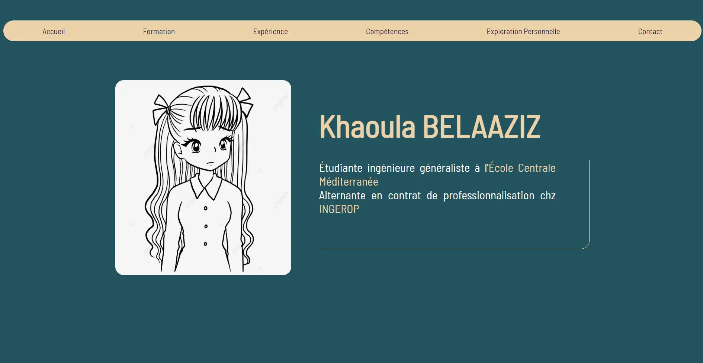
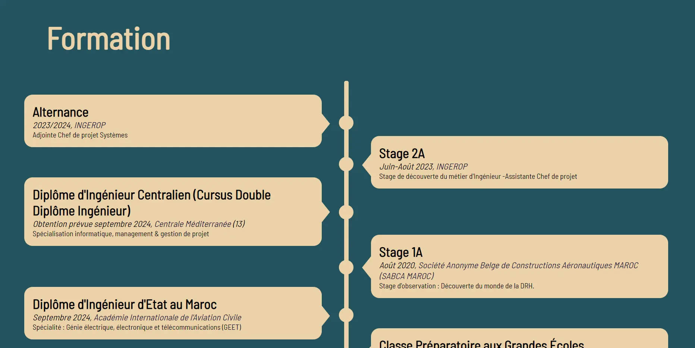
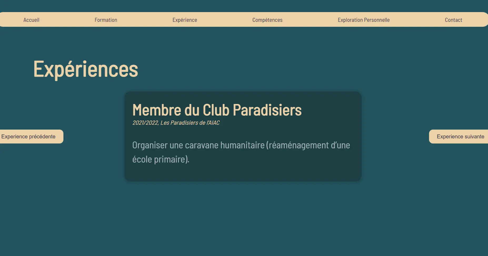
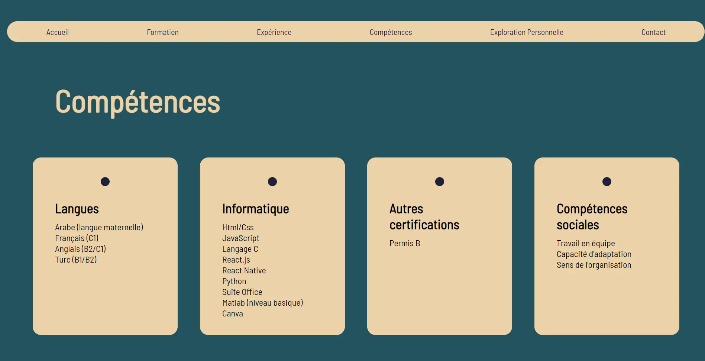
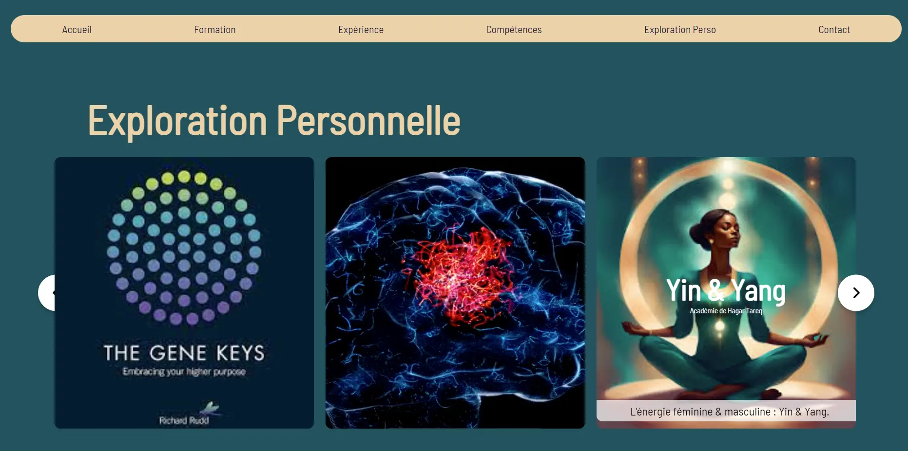

Un POK a pour objectif de créer mon premier CV en intéractif. Pour cela je vais me baser sur les POK d'Agathe [Création d'un CV en ligne interactif ](https://francoisbrucker.github.io/do-it/promos/2023-2024/Agathe-Rabachou/pok/temps-1/) et de Mathis [CV interactif ](https://francoisbrucker.github.io/do-it/promos/2023-2024/Mathis%20Schultz/pok/temps-2/).

## Introduction
Un CV interactif est une version numérique et dynamique du curriculum vitae traditionnel. Contrairement au format papier ou au simple fichier PDF, un CV interactif utilise des éléments web comme HTML, CSS, et JavaScript pour créer une expérience engageante pour le spectateur.

### La différence entre le CV intéractif et le Portfolio ?
Un CV interactif et un portfolio servent tous deux à présenter vos compétences et expériences professionnelles, mais ils ont des objectifs et des structures différents.
#### Points Clés de Différence
- Focus : Le CV interactif est axé sur le parcours professionnel global, tandis que le portfolio met l'accent sur des exemples spécifiques de travail ou de projets.
- Utilisation : Le CV est souvent utilisé pour postuler à des emplois ou présenter des qualifications générales, tandis que le portfolio est utilisé pour montrer des compétences spécifiques et des réalisations dans un domaine particulier.
- Structure : Le CV a tendance à suivre une structure plus traditionnelle et linéaire, même dans sa forme interactive, tandis que le portfolio offre plus de liberté créative dans la présentation des travaux.

## Sprint 1
Pendant ce Sprint, j'ai lu et compris le travail d'Agathe et de Mathis.
- Suivre le cours : [Coder un site CV responsive ](https://www.youtube.com/watch?v=KYDrF6OnuOE&list=PLcQBsrNMWIfJGc6GybxdxlqLSLz6YfSRg&index=1) pour savoir les grandes lignes de la création du CV
- Se familiariser avec le projet d'Agathe: analyser la structure du code HTML et explorer les diverses fonctionnalités
- Parcourir le code de Mathis et comprendre comment il a publié son CV.
- Adapter le code de Mathis à mon propre parcours scolaire et professionnel.
### Conclusion
Le travail fait par Agathe et Mathis est très intéressant et très bien décrit. J'ai passé ce Sprint à comprendre leur travail pour savoir comment je peux l'approprier, l'adapter à mon parcours et l'améliorer, et c'est ce que je vais faire pendant le deuxième Sprint de ce POK. 

## Sprint 2
L'objectif de ce print est de personnaliser le CV intéractif, l'améliorer et le rendre le plus complet possible. Pour y arriver, je compte :
- Ajouter une page "Exploration Personnelle" où je peux partager les sujets qui m'interressent et surlequels je travaille.
- Optimiser le code de Mathis
- Changer un peu le design
- Détailler les informations du parcours suivi pourqu'il soit plus clair et parlant à tout le monde.

### Rendu final

<div style="display: flex; justify-content: space-around;">
  
</div>
<div style="display: flex; justify-content: space-around;">
  
</div>
<div style="display: flex; justify-content: space-around;">
  
</div>
<div style="display: flex; justify-content: space-around;">
  
</div>
<div style="display: flex; justify-content: space-around;">
  
</div>



- IL faut cloner le projet localement et  utiliser la commande suivante dans votre terminal
```
git clone https://github.com/KhaoulaBelaaziz/CV_interactif.git
``` 
- Créer et initialiser un nouveau dépôt Github
- Il faut Supprimer le lien du dépôt original et initialisez un nouveau dépôt Git
```
cd projet_original
rm -rf .git
git init
git add .
git commit -m "Initial commit"
``` 
Cela supprime l'historique de version du projet original et commence un nouvel historique pour votre projet.
- Liaison du nouveau dépôt Github
```
git remote add origin URL_DU_NOUVEAU_DEPOT
``` 
- Finalement, il faut pousser le code au nouveau dépôt 
```
git push -u origin main
``` 


### Conclusion
J'ai pu ajouter la page que je veux dans ce CV, mais elle est loin d'être intéractive comme j'ai prévu. Cette page a pour but d'afficher des blogs qui sont liées aux thématiques qui m'intéressent, un espace ou je peux exprimer mes pensées et mes recherches à propos de ces sujets. J'ai rencontré plusieurs problèmes techniques dont je ne savais pas la source et cela m'a attardé vachement puisque je ne code pas d'une manière fréquente.
Bref, ce projet est intéressant et je vais sûrment l'améliorer avec le temps pour qu'il soit un espace informatif et intéractionnel avec mon entourage.
### Horodateur
| Date       | Heures passées | Tâches                           | Commentaires                                                    |
|------------|----------------|----------------------------------|-----------------------------------------------------------------|
| Vendredi 22/03 | 3h             | - Lancer le site en local        | J’ai rencontré un problème de chargement et de lancement en local du site web et je ne savais pas la source du problème => J’ai passé le temps à réinstaller les packages et à chercher sur internet des pistes applicables. |
| Samedi 23/03   | 1h30min        | - Rechercher les pistes d’amélioration du CV et du code | Rechercher sur Internet des inspirations pour booster le design |
| Samedi 23/03   | 5h             | - Coder la page “Explorations Personnelles” | Le carrousel a été un vrai challenge                           |
| Mardi 26/03    | 2h             | - Mettre le code au propre       | J’ai optimisé le code en combinant les parties redondantes comme le header et le footer car si on modifiait le footer d’une page, il ne se modifiait pas dans les autres, il fallait à chaque fois recopier les changements. |
