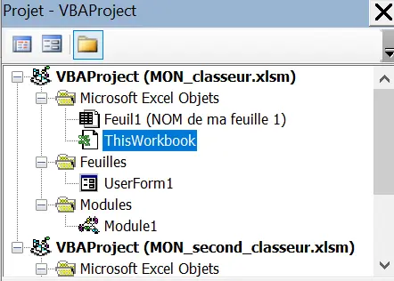


Prérequis : Aucun


## Introduction

Au début de ce MON mon but était de chercher à développer mes connaissances en VBA (Visual Basics for Applications), le langage de programmation d'Excel, du point de vue de sa syntaxe et de son utilisation sous Excel. En effet, j'avais entendu parler de ce langage et j'avais eu l'occasion de lire et de manipuler quelques lignes de code, certes sans vraiment comprendre leurs fonctionnements mais cela m'avait tout de même permis de toucher du doigt le potentiel de ce langage dans Excel.

## Sommaire

1. Revue de ce qui est présent dans les MON précédents
2. Choix d'un mook
3. Enseignements importants que j'en ai tiré

## 1. Revue de ce qui est présent dans les MON précédents

Avant de me lancer tête baissée dans un cours, J'ai commencé par faire le point sur ce qui se trouve sur le site !
En parcourant les MON des différents élèves, on peut voir que [Louise Gacoin](../../../../2022-2023/Gacoin-Louise/index.md), [Sarah Honoré](../../../../2022-2023/Honoré-Sarah/index.md) et [Ossama Abdane](../../../../2022-2023/Abdane-Ossama/index.md) sont les élèves s’étant intéressés au langage VBA.
Louise Gacoin, pour son MON sur le VBA, a suivi un MOOC à ce sujet. Dans son compte-rendu, elle retrace tout d'abord ce qu’elle a vu tout au long du MOOC. Ensuite, elle fait un petit retour sur le cours. Et enfin elle présente une application de ce cours, dans un Excel permettant de suivre l’avancée de documents.
Sarah Honoré, lors de son temps 3 a fait ses deux MON sur Excel et les VBA. Son premier MON traite surtout des différentes fonctionnalités d’Excel, fonctionnalités très utiles mais qui ne nous intéressent pas spécialement ici. Son second MON traite plus spécifiquement des macros en langage VBA. Pour ce MON, Sarah a suivi le même cours que Louise Gacoin. Il n’y a donc pas grand-chose à ajouter sur le plan technique mais elle propose une analyse plus poussée de la formation.
Ossama Abdane a suivi la même formation que Louise et Sarah. Donc il n’y a pas non plus d’apport technique.

## 2. Choix du MOOC

Après une recherche des MOOC sur le VBA présents sur Internet, les résultats ont été assez pauvres. En effet, je n'ai pas trouvé d'autre MOOC que ceux déjà suivis par Louise et Sarah. Ainsi, à la vue des retours de Louise, Sarah et Ossama, j'ai décidé de suivre le même [cours](https://www.excel-pratique.com/fr/vba) qu'eux.

## 3. Enseignements importants que j'en ai tiré

Louise Gacoin, dans son [MON 5: Bases de VBA](../../../../2022-2023/Gacoin-Louise/mon/MON5/index.md), détaille précisément le contenu du cours. Mais le fait de pratiquer le VBA avec ce cours, m'a permis de bien comprendre comment cela est agencé sous Excel, même si ce n'est pas explicitement indiqué. 

En fait, lorsqu'on ouvre l'éditeur de macros (voir le [MON de Louise](../../../../2022-2023/Gacoin-Louise/mon/MON5/index.md)), voilà la présentation face à laquelle on arrive : 

On va commencer par s'intéresser à l'onglet en haut à gauche : 

C'est là que sont répartis les différents endroits où l'on peut écrire nos macros, notre code VBA. Il y a trois catégories : 
+ **Microsoft Excel Objects** - dans cette catégorie, il y a une page de programmation par élément d'Excel (le classeur et chaque feuille) où l'on va pouvoir écrire du code qui s'éxecutera à un moment précis de l'élément en question. 
+ **Feuilles** - cette catégorie est optionnelle et contient une page de programmation par formulaire créé. Oui, Excel permet de créer des formulaires et le code écrit dans la page de programmation correspondante au formulaire permet à Excel de savoir comment se comporter aux moments clefs du formulaire (validation, annulation,...). 
+ **Modules** - cette catégorie est également optionnelle et permet quand à elle de créer des pages de programmation qui ne sont liées à aucunélément en tant que tel et dont le code peut être exécuté n'importe où dans Excel (même dans un autre classeur tant que celui de base, qui contient le code, est ouvert). 

Ensuite, l'autre onglet intéressant est celui de droite. C'est là que vont être écrites les macros. 
Dans l'image présentée plus haut, la page de programmation ouverte correspondait à celle du classeur *MON_classeur* (ThisWorkbook dans VBAProject (MON_classeur)). Il n'y a aucune ligne de code qui n'a été rentrée. Mais dans l'explemple suivant, la page de programmation de la feuille 1, nommée *NOM de ma feuille 1*, il y a du code d'indiqué : 

Ce code se déclanche lorsqu'on change de cellule dans la feuille (Worksheet_selectionChange). Et ce sont les deux volets dépliants supérieurs qui ont permis de choisir ce mode. Il y a beaucoup d'autres modes possibles (à l'activation de la feuille, au click sur un lien hypertexte,...). 

Finalement, en ce qui concerne la programmation d'une macro en tant que tel, le mieux est de retourner sur le [MON de Louise](../../../../2022-2023/Gacoin-Louise/mon/MON5/index.md) qui l'explique très bien ou de suivre directement le [cours de VBA du site d'ExcelPratique](https://www.excel-pratique.com/fr/vba). 

En ce qui me concerne, j'ai trouvéé ce MOOC assez bien construit. L'élève est bien accompagné tout au long du cours et les notions sont vues à un bon rythme qui permet vraiment d'apprendre toujours des nouvelles notions sans non plus être submergé. 

#### PS

Une dernière chose que je voulais ajouter concernant les VBA est le rapport aux arguments (paramètres d'entrée) des fonctions et des macros. En effet, il est possible de choisir s'ils seront appelés simplement par valeur ou plutôt par référence (celà permet de choisir si les arguments appelés peuvent être modifiés ou non dans la fonction ou la macro). 