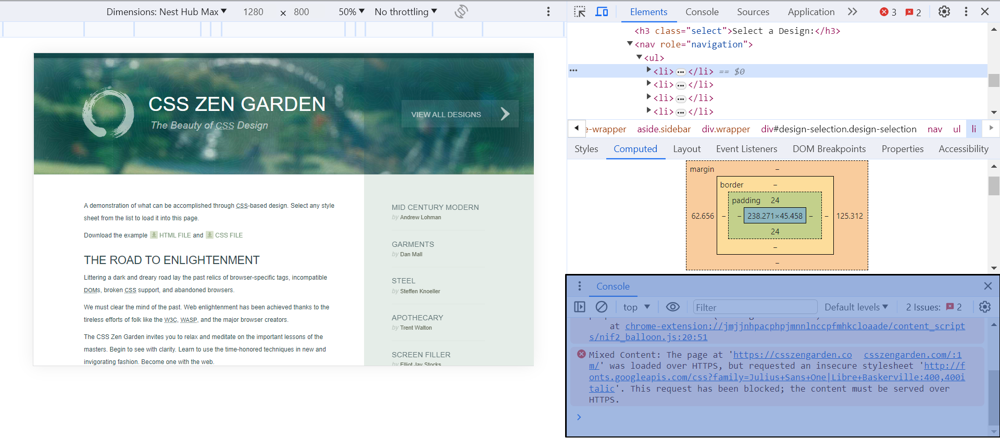
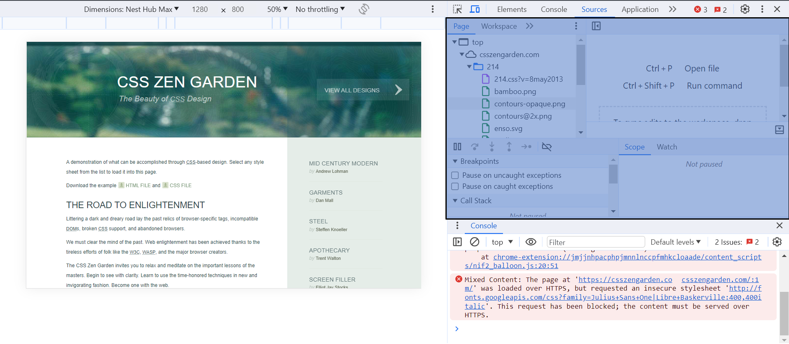
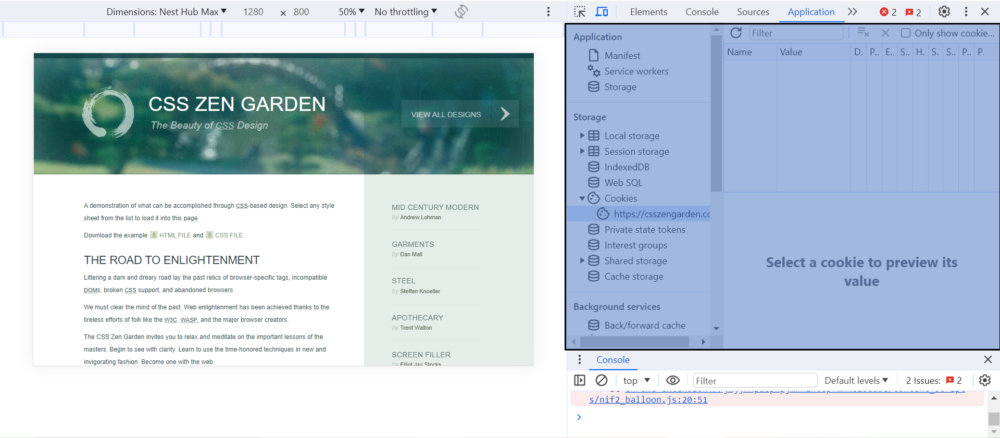

## Introduction

## Sommaire

1. Outils de développement : approfondissement

## 1. Outils de développement : approfondissement

Ayant déja suivi un cours sur le html et le css, j'avais déjà été amené à utiliser certaines parties des outils de développement. Mais il me restait encore plusieurs lacunes et ce cours m'a permis d'en combler certaines. Voici les différents menu des outils de développement que j'ai parcourus pendant ce cours : 

#### Le menu *Elements*

C'est surtout ce menu que j'avais déjà utilisé donc je connaissais la plupart des informations présentent dans le cours. Mais j'ai tout de même appris que la partie *Console* correspond à l'execution de la partie Javascript du site que l'on inspecte. 

#### Le menu *Sources*

En ce qui concerne ce menu, j'ai tout découvert. Il s'agit de la présentation de l'arborescence des fichiers du site sur lequel on est. Cela permet notamment d'avoir accès à chaque fichier en particulier, comme par exemple certains fichiers `.png` qui sont utilisés pour la mise en forme du site. 

#### Le menu *Network*

Ici également j'ai tout appris quant à l'utilité de l'onglet. On y voit les informations relatives aux réponses des requêtes faites par le site au serveur. 
Dans l'image suivante on voit quecsszengarden.comest undocumentde5.0kBqui a été rendu par le serveur en615msavec un statut de200(ce qui correpsond à une réponse sans problème). 

#### Le menu *Application*

Ce menu (dont j'ai aussi découvert l'existence) permet de voir les informations stockées par le site, comme les cookies. 

## Horodateur 
| Date | Heures passées | Indications | 
| -------- | -------- |-------- |
| Jeudi 30/11/2023 | 2H | Suivi des parties "[Introduction avec les outils de développement](https://francoisbrucker.github.io/cours_informatique/cours/web/outils-de-d%C3%A9veloppement/)" et "[Introduction à html chez soit dans un seul fichier](https://francoisbrucker.github.io/cours_informatique/cours/web/html-introduction/)" du cours sur le [Web](https://francoisbrucker.github.io/cours_informatique/cours/web/) |
| Vendredi 01/12/2023 | 1H30 | Suivi de la partie "[Différence entre exécuter un fichier soit et sur un serveur : Qu'est qu'une url ?](https://francoisbrucker.github.io/cours_informatique/cours/web/anatomie-url/)" du cours sur le [Web](https://francoisbrucker.github.io/cours_informatique/cours/web/) |
| Samedi 02/12/2023 | 0H30 | Effectuation de la partie "[Projet html](https://francoisbrucker.github.io/cours_informatique/cours/web/projet-html/)" du cours sur le [Web](https://francoisbrucker.github.io/cours_informatique/cours/web/) |
