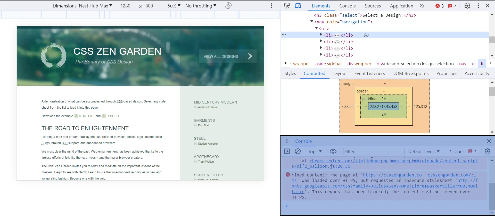
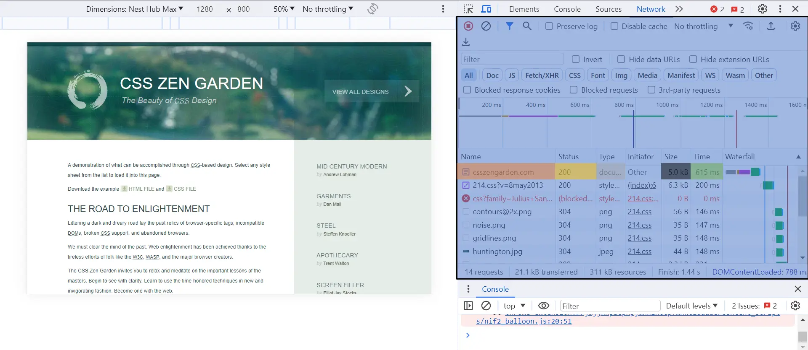
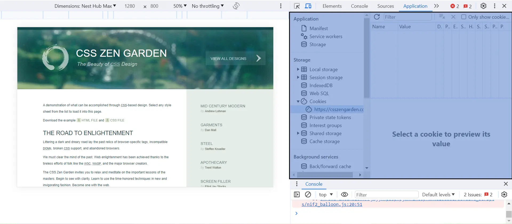
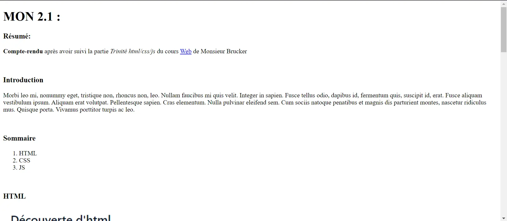
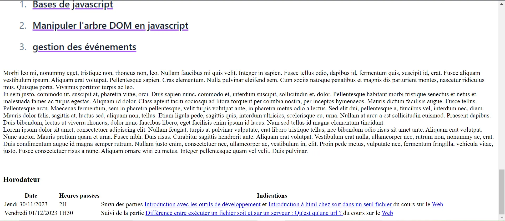
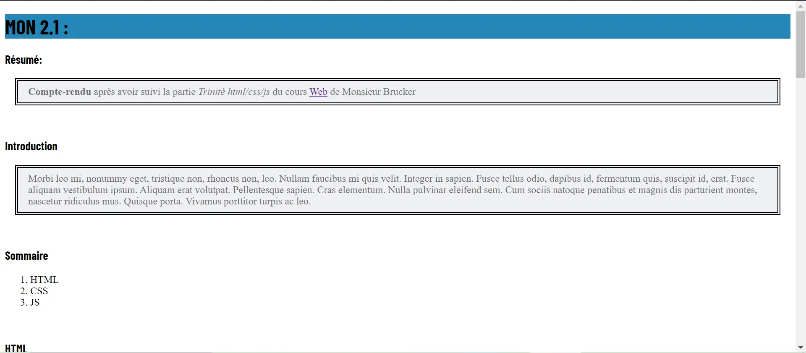
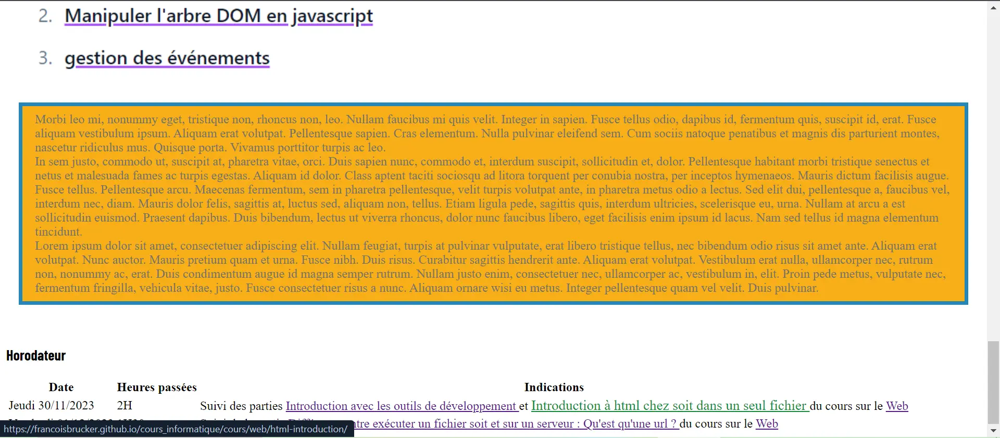


Prérequis : Aucun


<div id="introduction"></div>

## Introduction

En soi, aucun prérequis n'est nécessaire pour suivre ce cours[[1](#Web)] mais en ce qui me concerne, j'avais déjà suivi un cours sur le html et le css. De nombreux points m'étaient donc déjà connus, c'est pourquoi j'aborderai uniquement les nouvelles notions que j'ai rencontrées pendant ce MON. 

<div id="sommaire"></div>

## Sommaire

- [Introduction](#introduction)
- [Sommaire](#sommaire)
- [1. Outils de développement](#1-outils-de-développement)
    - [Le menu *Elements*](#le-menu-elements)
    - [Le menu *Sources*](#le-menu-sources)
    - [Le menu *Network*](#le-menu-network)
    - [Le menu *Application*](#le-menu-application)
- [2. Introduction à html](#2-introduction-à-html)
    - [Arbre DOM](#arbre-dom)
    - [Markup Validation Service](#markup-validation-service)
- [3. Anatomie d'une URL](#3-anatomie-dune-url)
- [4. Projet html](#4-projet-html)
- [5. Introduction à css](#5-introduction-à-css)
- [6. Unités et couleurs](#6-unités-et-couleurs)
    - [Unités](#unités)
    - [Couleurs](#couleurs)
- [7. Sélecteurs css](#7-sélecteurs-css)
- [8. Modèle de boîtes](#8-modèle-de-boîtes)
- [9. Balises anonymes](#9-balises-anonymes)
- [10. Positionnement](#10-positionnement)
- [11. Projet css](#11-projet-css)
- [12. Gestion des fichiers](#12-gestion-des-fichiers)
- [Sources](#sources)
- [Horodateur](#horodateur)

<div id="1-outils-de-développement"></div>

## 1. Outils de développement

Lien vers le cours : [Outils de développement](https://francoisbrucker.github.io/cours_informatique/cours/web/outils-de-d%C3%A9veloppement/). 
Concernant les outils de développements, je les avaient déjà utilisés mais il me restait encore plusieurs lacunes et ce cours m'a permis d'en combler certaines. Voici les différents menu des outils de développement que j'ai parcourus pendant ce cours : 

<div id="le-menu-elements"></div>

#### Le menu *Elements*

C'est surtout ce menu que j'avais déjà utilisé donc je connaissais la plupart des informations présentent dans le cours. Mais j'ai tout de même appris que la partie *Console* correspond à l'execution de la partie Javascript du site que l'on inspecte. 

<div></div>

<div id="le-menu-sources"></div>

#### Le menu *Sources*

En ce qui concerne ce menu, j'ai tout découvert. Il s'agit de la présentation de l'arborescence des fichiers du site sur lequel on est. Cela permet notamment d'avoir accès à chaque fichier en particulier, comme par exemple certains fichiers `.webp` qui sont utilisés pour la mise en forme du site. 

<div></div>

<div id="le-menu-network"></div>

#### Le menu *Network*

Ici également j'ai tout appris quant à l'utilité de l'onglet. On y voit les informations relatives aux réponses des requêtes faites par le site au serveur. 
Dans l'image suivante on voit que<span style="background-color:#c59989;">csszengarden.com</span>est un<span style="background-color:#a0acc2;">document</span>de<span style="background-color:#4e5a70;">5.0kB</span>qui a été rendu par le serveur en<span style="background-color:#86b194;">615ms</span>avec un statut de<span style="background-color:#CEC970;">200</span>(ce qui correspond à une réponse sans problème). 

<div></div>

<div id="le-menu-application"></div>

#### Le menu *Application*

Ce menu (dont j'ai aussi découvert l'existence) permet de voir les informations stockées par le site, comme les cookies. 

<div></div>

<div id="2-introduction-à-html"></div>

## 2. Introduction à html

Lien vers le cours : [Introduction à html](https://francoisbrucker.github.io/cours_informatique/cours/web/html-introduction/). 
Dans cette partie la plupart du contenu a constitué uniquement des révisions mises à part deux nouveautés : 
- l'arbre DOM, 
- et le Markup Validation Service du W3C(*World Wide Web Consortium*, organisme de standardisation chargé de promouvoir la compatibilité des technologies du *World Wide Web*[[2](#W3C)]). 

<div id="arbre-dom"></div>

#### Arbre DOM

L'arbre DOM est le nom donné à la façon dont les fichiers html sont structurés. En effet, les fichiers *html* ont une structure bien particulière dans laquelle les balises forment une arborescence dont la balise `<html></html>` est la racine. Voici un exemple d'arborescence que l'on pourrait trouver dans un fichier html très simple : 
```
html
├── head
│   ├── meta
│   └── title
└── body
    ├── h1
    └── p
```
Pour décrire les liens entre les balises, on utilise un vocabulaire généalogique. Ainsi : 
- la balise `<body></body>` est la balise *parent* des balises `<h1></h1>` et `<p></p>`, 
- la balise `<title></title>` est la balise *enfant* de la balise `<head></head>`, 
- et les descendants de la balise `<html></html>` sont les balises `<head></head>`, `<meta></meta>`, `<title></title>`, `<body></body>`, `<h1></h1>` et `<p></p>`. 

Cet arbre s'appelle l'arbre DOM justement parce que le DOM (de l'anglais *Document Object Model*) est l'interface de programmation normalisée par le W3C, qui permet à des scripts d'examiner et de modifier le contenu du navigateur web[[3](#DOM)]. 

<div id="markup-validation-service"></div>

#### Markup Validation Service

le [Markup Validation Service du W3C](https://validator.w3.org/#validate_by_upload+with_options) est un service permettant de vérifier qu'un document html a une syntaxe correcte. 

<div id="3-anatomie-dune-url"></div>

## 3. Anatomie d'une URL

Lien vers le cours : [Anatomie d'une URL](https://francoisbrucker.github.io/cours_informatique/cours/web/anatomie-url/). 
La notion d'URL est évidemment très commune et ne m'est pas inconnue. Par contre son architecture  m'était complêtement étrangère. 

Une URL (de l'anglais *Uniform Resource Locator*) est une commande pour accéder à n'importe quel élément d'internet. Toutes les URL sont construites sur le même schéma : 
```
<protocole>://<serveur>[:port]/<ressource> [?<requête>] [#<lien>]
```

Le protocole est le moyen d'accéder à la ressource. Dans le web, il y a essentiellement 3 protocoles utilisés :
- http : permet d'envoyer et de recevoir des fichiers. Généralement des fichiers textes. 
- https: le même que http mais de façon sécurisé (le "s" veut dire "secure"). 
- file : permet d'accéder à un fichier de l'ordinateur. Le chemin est alors le chemin absolu vers le fichier. 

Le serveur est l'adresse internet de l'ordinateur sur lequel la ressource est stockée. Cela peut être :
- un nom comme `fr.wikipedia.org`, 
- une adresse IP comme `62.40.98.186`. 
Remarque : Il n'y a pas de serveur lorsque l'on utilise le protocole file, c'est pourquoi les url utilisant le protocole file commencent toujours par `file:///`. 

La ressource est ensuite déterminée par le serveur et est envoyée au demandeur, c'est à dire le navigateur.
Dans le cadre d'une page web, cette ressource pourra être :
- du html : la structure de la page, 
- du css : le style de la page, 
- du javascript : qui gère les interactions avec l'utilisateur, 
- une image, 
- des données décrite au format json, 
- ...

<div id="4-projet-html"></div>

## 4. Projet html

Lien vers le cours : [Projet html](https://francoisbrucker.github.io/cours_informatique/cours/web/projet-html/). 
Dans cette partie, j'ai réalisé un page html basique. 
Voici un apperçu du haut de la page : 
<div></div>
Et un apperçu du bas de la page : 
<div></div>

```
<!doctype html>
<html lang="fr">
  <head>
      <meta charset="utf-8">
      <title>MON 2.1</title>
      <link rel="stylesheet" href="./style.css">
      <link rel="preconnect" href="https://fonts.googleapis.com">
      <link rel="preconnect" href="https://fonts.gstatic.com" crossorigin>
      <link href="https://fonts.googleapis.com/css2?family=Barlow+Condensed:wght@700&display=swap" 
            rel="stylesheet">
  </head>
  <body>
    <h1>MON 2.1 : </h1>
    <h3>Résumé:</h3>
    <p><strong>Compte-rendu</strong> après avoir suivi la partie <em>Trinité html/css/js</em> du cours <a href="https://francoisbrucker.github.io/cours_informatique/cours/web/">Web</a> de Monsieur Brucker</p>
    <br>
    <h3>Introduction</h3>
    <p>Morbi leo mi, nonummy eget, tristique non, rhoncus non, leo. Nullam faucibus mi quis velit.
      Integer in sapien. Fusce tellus odio, dapibus id, fermentum quis, suscipit id, erat. Fusce aliquam vestibulum ipsum.
      Aliquam erat volutpat. Pellentesque sapien. Cras elementum. Nulla pulvinar eleifend sem. Cum sociis natoque penatibus et
      magnis dis parturient montes, nascetur ridiculus mus. Quisque porta. Vivamus porttitor turpis ac leo.
    </p>
    <br>
    <h3>Sommaire</h3>
    <ol>
      <li>HTML</li>
      <li>CSS</li>
      <li>JS</li>
    </ol>
    <br>
    <h3>HTML</h3>
    
    <p class="partie">Morbi leo mi, nonummy eget, tristique non, rhoncus non, leo. Nullam faucibus mi quis velit. Integer in sapien.
      Fusce tellus odio, dapibus id, fermentum quis, suscipit id, erat. Fusce aliquam vestibulum ipsum. Aliquam erat volutpat.
      Pellentesque sapien. Cras elementum. Nulla pulvinar eleifend sem. Cum sociis natoque penatibus et magnis dis parturient montes,
      nascetur ridiculus mus. Quisque porta. Vivamus porttitor turpis ac leo.
      <br>
      In sem justo, commodo ut, suscipit at, pharetra vitae, orci. Duis sapien nunc, commodo et, interdum suscipit, sollicitudin et,
      dolor. Pellentesque habitant morbi tristique senectus et netus et malesuada fames ac turpis egestas. Aliquam id dolor.
      Class aptent taciti sociosqu ad litora torquent per conubia nostra, per inceptos hymenaeos. Mauris dictum facilisis augue.
      Fusce tellus. Pellentesque arcu. Maecenas fermentum, sem in pharetra pellentesque, velit turpis volutpat ante,
      in pharetra metus odio a lectus. Sed elit dui, pellentesque a, faucibus vel, interdum nec, diam. Mauris dolor felis, sagittis at,
      luctus sed, aliquam non, tellus. Etiam ligula pede, sagittis quis, interdum ultricies, scelerisque eu, urna.
      Nullam at arcu a est sollicitudin euismod. Praesent dapibus. Duis bibendum, lectus ut viverra rhoncus, dolor nunc faucibus libero,
      eget facilisis enim ipsum id lacus. Nam sed tellus id magna elementum tincidunt.
      <br>
      Lorem ipsum dolor sit amet, consectetuer adipiscing elit. Nullam feugiat, turpis at pulvinar vulputate, erat libero
      tristique tellus, nec bibendum odio risus sit amet ante. Aliquam erat volutpat. Nunc auctor. Mauris pretium quam et urna.
      Fusce nibh. Duis risus. Curabitur sagittis hendrerit ante. Aliquam erat volutpat. Vestibulum erat nulla, ullamcorper nec,
      rutrum non, nonummy ac, erat. Duis condimentum augue id magna semper rutrum. Nullam justo enim, consectetuer nec, ullamcorper ac,
      vestibulum in, elit. Proin pede metus, vulputate nec, fermentum fringilla, vehicula vitae, justo. Fusce consectetuer risus a nunc.
      Aliquam ornare wisi eu metus. Integer pellentesque quam vel velit. Duis pulvinar.
    </p>
    <br>
    <h3>CSS</h3>
    
    <p class="partie">Morbi leo mi, nonummy eget, tristique non, rhoncus non, leo. Nullam faucibus mi quis velit. Integer in sapien.
      Fusce tellus odio, dapibus id, fermentum quis, suscipit id, erat. Fusce aliquam vestibulum ipsum. Aliquam erat volutpat.
      Pellentesque sapien. Cras elementum. Nulla pulvinar eleifend sem. Cum sociis natoque penatibus et magnis dis parturient montes,
      nascetur ridiculus mus. Quisque porta. Vivamus porttitor turpis ac leo.
      <br>
      In sem justo, commodo ut, suscipit at, pharetra vitae, orci. Duis sapien nunc, commodo et, interdum suscipit, sollicitudin et,
      dolor. Pellentesque habitant morbi tristique senectus et netus et malesuada fames ac turpis egestas. Aliquam id dolor.
      Class aptent taciti sociosqu ad litora torquent per conubia nostra, per inceptos hymenaeos. Mauris dictum facilisis augue.
      Fusce tellus. Pellentesque arcu. Maecenas fermentum, sem in pharetra pellentesque, velit turpis volutpat ante,
      in pharetra metus odio a lectus. Sed elit dui, pellentesque a, faucibus vel, interdum nec, diam. Mauris dolor felis, sagittis at,
      luctus sed, aliquam non, tellus. Etiam ligula pede, sagittis quis, interdum ultricies, scelerisque eu, urna.
      Nullam at arcu a est sollicitudin euismod. Praesent dapibus. Duis bibendum, lectus ut viverra rhoncus, dolor nunc faucibus libero,
      eget facilisis enim ipsum id lacus. Nam sed tellus id magna elementum tincidunt.
      <br>
      Lorem ipsum dolor sit amet, consectetuer adipiscing elit. Nullam feugiat, turpis at pulvinar vulputate, erat libero
      tristique tellus, nec bibendum odio risus sit amet ante. Aliquam erat volutpat. Nunc auctor. Mauris pretium quam et urna.
      Fusce nibh. Duis risus. Curabitur sagittis hendrerit ante. Aliquam erat volutpat. Vestibulum erat nulla, ullamcorper nec,
      rutrum non, nonummy ac, erat. Duis condimentum augue id magna semper rutrum. Nullam justo enim, consectetuer nec, ullamcorper ac,
      vestibulum in, elit. Proin pede metus, vulputate nec, fermentum fringilla, vehicula vitae, justo. Fusce consectetuer risus a nunc.
      Aliquam ornare wisi eu metus. Integer pellentesque quam vel velit. Duis pulvinar.
    </p>
    <br>
    <h3>JS</h3>
    
    <p class="partie">Morbi leo mi, nonummy eget, tristique non, rhoncus non, leo. Nullam faucibus mi quis velit. Integer in sapien.
      Fusce tellus odio, dapibus id, fermentum quis, suscipit id, erat. Fusce aliquam vestibulum ipsum. Aliquam erat volutpat.
      Pellentesque sapien. Cras elementum. Nulla pulvinar eleifend sem. Cum sociis natoque penatibus et magnis dis parturient montes,
      nascetur ridiculus mus. Quisque porta. Vivamus porttitor turpis ac leo.
      <br>
      In sem justo, commodo ut, suscipit at, pharetra vitae, orci. Duis sapien nunc, commodo et, interdum suscipit, sollicitudin et,
      dolor. Pellentesque habitant morbi tristique senectus et netus et malesuada fames ac turpis egestas. Aliquam id dolor.
      Class aptent taciti sociosqu ad litora torquent per conubia nostra, per inceptos hymenaeos. Mauris dictum facilisis augue.
      Fusce tellus. Pellentesque arcu. Maecenas fermentum, sem in pharetra pellentesque, velit turpis volutpat ante,
      in pharetra metus odio a lectus. Sed elit dui, pellentesque a, faucibus vel, interdum nec, diam. Mauris dolor felis, sagittis at,
      luctus sed, aliquam non, tellus. Etiam ligula pede, sagittis quis, interdum ultricies, scelerisque eu, urna.
      Nullam at arcu a est sollicitudin euismod. Praesent dapibus. Duis bibendum, lectus ut viverra rhoncus, dolor nunc faucibus libero,
      eget facilisis enim ipsum id lacus. Nam sed tellus id magna elementum tincidunt.
      <br>
      Lorem ipsum dolor sit amet, consectetuer adipiscing elit. Nullam feugiat, turpis at pulvinar vulputate, erat libero
      tristique tellus, nec bibendum odio risus sit amet ante. Aliquam erat volutpat. Nunc auctor. Mauris pretium quam et urna.
      Fusce nibh. Duis risus. Curabitur sagittis hendrerit ante. Aliquam erat volutpat. Vestibulum erat nulla, ullamcorper nec,
      rutrum non, nonummy ac, erat. Duis condimentum augue id magna semper rutrum. Nullam justo enim, consectetuer nec, ullamcorper ac,
      vestibulum in, elit. Proin pede metus, vulputate nec, fermentum fringilla, vehicula vitae, justo. Fusce consectetuer risus a nunc.
      Aliquam ornare wisi eu metus. Integer pellentesque quam vel velit. Duis pulvinar.
    </p>
    <br>
    <h3>Horodateur</h3>
    <table>
      <tr>
         <th>Date</th>
         <th>Heures passées</th>
         <th>Indications</th>
      </tr>
      <tr>
        <td>Jeudi 30/11/2023</td>
        <td>2H</td>
        <td>
          Suivi des parties
          <a href="https://francoisbrucker.github.io/cours_informatique/cours/web/outils-de-d%C3%A9veloppement/">
            Introduction avec les outils de développement
          </a>
          et
          <a href="https://francoisbrucker.github.io/cours_informatique/cours/web/html-introduction/">
            Introduction à html chez soit dans un seul fichier
          </a>
          du cours sur le
          <a href="https://francoisbrucker.github.io/cours_informatique/cours/web/">
            Web
          </a>
        </td>
      </tr>
      <tr>
        <td>Vendredi 01/12/2023</td>
        <td>1H30</td>
        <td>
          Suivi de la partie
          <a href="https://francoisbrucker.github.io/cours_informatique/cours/web/anatomie-url/">
            Différence entre exécuter un fichier soit et sur un serveur : Qu'est qu'une url ?
          </a>
          du cours sur le
          <a href="https://francoisbrucker.github.io/cours_informatique/cours/web/">
            Web
          </a>
        </td>
      </tr>
    </table>
  </body>
</html>
```


<div id="5-introduction-à-css"></div>

## 5. Introduction à css

Lien vers le cours : [Introduction à css](https://francoisbrucker.github.io/cours_informatique/cours/web/css-introduction/). 
Je n'ai rien à rapporter de cette partie car toutes les notions m'étaient connues. 

<div id="6-unités-et-couleurs"></div>

## 6. Unités et couleurs

Lien vers le cours : [Unités et couleurs](https://francoisbrucker.github.io/cours_informatique/cours/web/unit%C3%A9s-couleurs/). 
Cette partie traite de l'utilisation des unités et des normes utilisables pour les couleurs, en css. 

<div id="unités"></div>

#### Unités

En css, il existe de nombreuses unités pour dimensionner les éléments. Il y a à la fois des unités assez communes, comme le centimètre, **cm**, ou le pixel, **px**, mais aussi des unités spécifiques, comme l'*emphasis*, **em**, ou le *root emphasis*, **rem**. Le cours indique deux bonnes pratiques dans l'utilisation des unités en css : 
- Toujours utiliser des unités relatives **em** et **rem** dans vos design. 
- Toujours donner les unités des images en **px** sans redimensionnement. 

<div id="couleurs"></div>

#### Couleurs

En css, il existe plusieurs façons de décrire les couleurs. On peut : 
- les nommer (par exemple **black**, **red**,...), 
- utiliser les valeurs en hexadécimale, 
- utiliser des formats tels que rgb. 

<div id="7-sélecteurs-css"></div>

## 7. Sélecteurs css

Lien vers le cours : [Sélecteurs css](https://francoisbrucker.github.io/cours_informatique/cours/web/s%C3%A9lecteurs-css/). 
Cette section m'a permis de développer mon vocabulaire sur les différents sélecteurs même si leur utilisation m'était déjà familière. Voici les différents types de sélections qui existent : 
- sélection par combinaison de sélecteurs (`p, h1` --> les paragraphes et les titres de type h1), 
- sélection par attribut (`*[style]` --> toutes les balises avec un attribut style), 
- sélection par spécialisation (`A > B` --> toutes les balises B descendant directement de balises A), 
- sélection par pseudo-classe (`a:hover` --> lorsque la souris passe sur un lien), 
- sélection par pseudo-élément (`p::first-letter` --> la première lettre d'un paragraphe), 
- sélection par sélecteur de classe (`.spacious` --> tous les éléments de classe *spacious*), 
- sélection par sélecteur d'identifiant (`#demo` --> l'élément avec l'identifiant *demo*). 

<div id="8-modèle-de-boîtes"></div>

## 8. Modèle de boîtes

Lien vers le cours : [Modèle de boîtes](https://francoisbrucker.github.io/cours_informatique/cours/web/mod%C3%A8le-boites/). 
Cette partie aborde différentes valeurs de la propriété css `display` ainsi que les notions de *padding*, *margin* et *border*. 
En s'appuyant sur un code html fournit par le cours, on teste plusieurs styles pour bien comprendre l'utilité des propriété css et de leurs attributs. 

<div id="9-balises-anonymes"></div>

## 9. Balises anonymes

Lien vers le cours : [Balises anonymes](https://francoisbrucker.github.io/cours_informatique/cours/web/balises-anonymes/). 
Les balises anonymes sont des balises html qui n'ont pas de role spécifique si ce n'est de grouper d'autres balises sous une même balise parent. Les deux principales balises anonymes sont : 
- la balise `<div></div>`, 
- et la balise `<span></span>`. 

<div id="10-positionnement"></div>

## 10. Positionnement

Lien vers le cours : [Positionnement](https://francoisbrucker.github.io/cours_informatique/cours/web/positionnement/). 
Le positionnement correspond, comme son nom l'indique à la position des éléments sur une page web. Les propriétés qui permettent de s'en occuper sont les suivantes : 
- `display` permet de changer le flux d'un élément, 
- `position` permet de positionner les éléments en passant outre le flux. 

Ces propriétés sont principalements utilisées pour des balises de comportement telles que `<header></header` ou `<footer></footer>`. 

<div id="11-projet-css"></div>

## 11. Projet css

Lien vers le cours : [Projet css](https://francoisbrucker.github.io/cours_informatique/cours/web/projet-css/). 
Pour s'assurer de la bonne aquisition des notions vues, le cours propose de s'entraîner à ajouter du style en css sur le fichier html produit dans la partie [4. Projet html](#4-projet-html). 
Voici donc à quoi ressemble maintenant la page : 
<div></div>
Et le bas de page avec un lien sur lequel passe la souris : 
<div></div>

```
p {
    color : #71706f;
    background-color: #eff0f4;
    border: black 5px double;
    margin: 1rem;
    padding: 0.5rem 1rem;
}
.partie {
    background-color: #f7af17;
    border: #2487b9 5px solid;
}
h1 {
    background-color: #2487b9;
    font-family: 'Barlow Condensed', sans-serif;
}
h3 {
    font-family: 'Barlow Condensed', sans-serif;
}
a:hover {
    color: #128c38;
    font-size: large;
}
```


<div id="12-gestion-des-fichiers"></div>

## 12. Gestion des fichiers

Lien vers le cours : [Gestion des fichiers](https://francoisbrucker.github.io/cours_informatique/cours/web/) (3ème partie du cours sur le web). 
Cette partie explique les bonnes pratiques pour ranger les fichiers d'un site : 
1. Il faut un dossier spécifique où ranger tout le site. 
2. A l'intérieur de ce dossier, l'entrée du site (la première page qui est sensée s'afficher) a pour nom `index.html`. 
3. Il faut toujours avoir des dossiers spécifiques pour ranger les différents types de fichiers utilisés. 
C'est donc ce que j'ai mis en place dans mon fichier *html* de mon compte de Centrale. Ainsi, comme j'ai des images et un fichier de style, l'arborescence est la suivante : 
```
html
├── index.html
├── Images
│   ├── css.webp
│   ├── html.webp
│   └── js.webp
└── Styles
    └── style.css
```
Et comme cela est sur mon compte de Centrale, mon site est accessible à l'adresse : [http://paul.le_bihan.perso.centrale-marseille.fr](http://paul.le_bihan.perso.centrale-marseille.fr). 

<div id="sources"></div>

## Sources

<div id="Web"></div>

1. Cours « [Web](https://francoisbrucker.github.io/cours_informatique/cours/web/) » de Monsieur François Brucker. 

<div id="W3C"></div>

2. « [World Wide Web Consortium](https://fr.wikipedia.org/wiki/World_Wide_Web_Consortium) » sur wikipedia.org (consulté le 11/12/2023). 

<div id="DOM"></div>

3. « [Document Object Model](https://fr.wikipedia.org/wiki/Document_Object_Model) » sur wikipedia.org (consulté le 11/12/2023). 

<div id="horodateur"></div>

## Horodateur 
| Date | Heures passées | Indications | 
| -------- | -------- |-------- |
| Jeudi 30/11/2023 | 2H | Suivi des parties [Introduction avec les outils de développement](https://francoisbrucker.github.io/cours_informatique/cours/web/outils-de-d%C3%A9veloppement/) et [Introduction à html chez soit dans un seul fichier](https://francoisbrucker.github.io/cours_informatique/cours/web/html-introduction/) du cours sur le [Web](https://francoisbrucker.github.io/cours_informatique/cours/web/) |
| Vendredi 01/12/2023 | 1H30 | Suivi de la partie [Différence entre exécuter un fichier soit et sur un serveur : Qu'est qu'une url ?](https://francoisbrucker.github.io/cours_informatique/cours/web/anatomie-url/) du cours sur le [Web](https://francoisbrucker.github.io/cours_informatique/cours/web/) |
| Samedi 02/12/2023 | 1H | Réalisation de la partie [Projet html](https://francoisbrucker.github.io/cours_informatique/cours/web/projet-html/) du cours sur le [Web](https://francoisbrucker.github.io/cours_informatique/cours/web/) |
| Vendredi 08/12/2023 | 1H30 | Suivi des parties [Introduction à css](https://francoisbrucker.github.io/cours_informatique/cours/web/css-introduction/) et [Unités et couleurs](https://francoisbrucker.github.io/cours_informatique/cours/web/unit%C3%A9s-couleurs/) du cours sur le [Web](https://francoisbrucker.github.io/cours_informatique/cours/web/) |
| Samedi 09/12/2023 | 2H | Suivi des parties [Sélecteurs css](https://francoisbrucker.github.io/cours_informatique/cours/web/s%C3%A9lecteurs-css/), [Modèle de boîtes](https://francoisbrucker.github.io/cours_informatique/cours/web/mod%C3%A8le-boites/) et [Balises anonymes](https://francoisbrucker.github.io/cours_informatique/cours/web/balises-anonymes/) du cours sur le [Web](https://francoisbrucker.github.io/cours_informatique/cours/web/) |