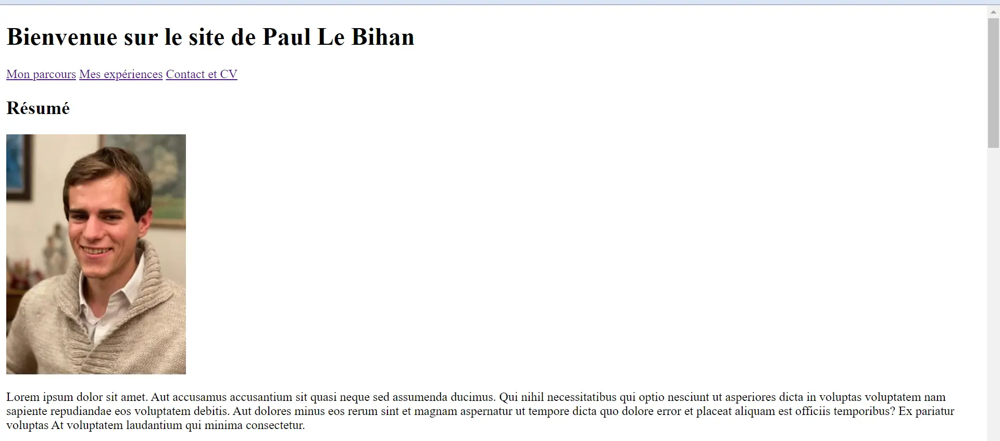
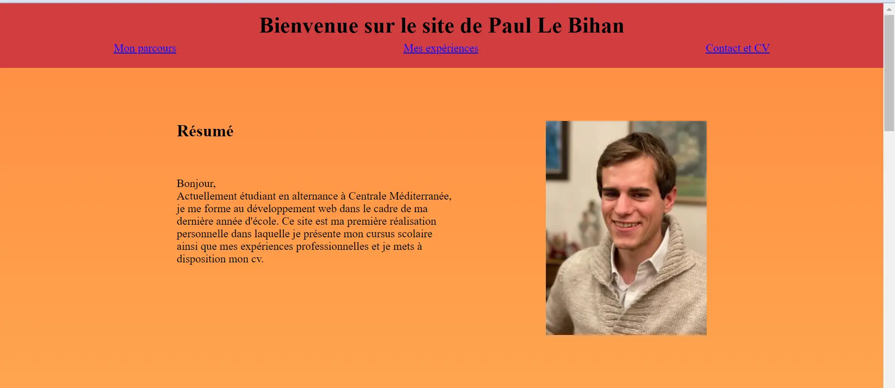
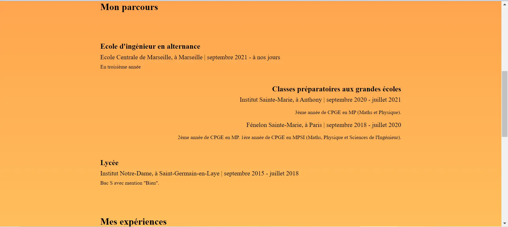
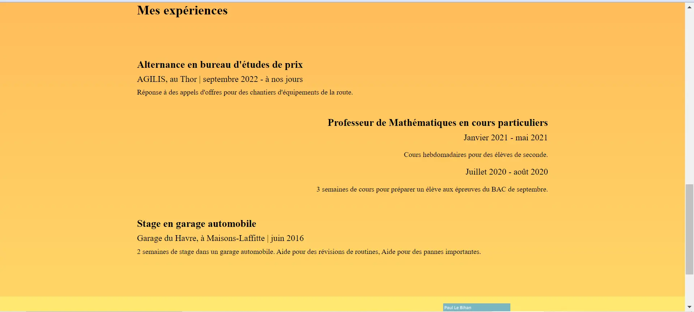
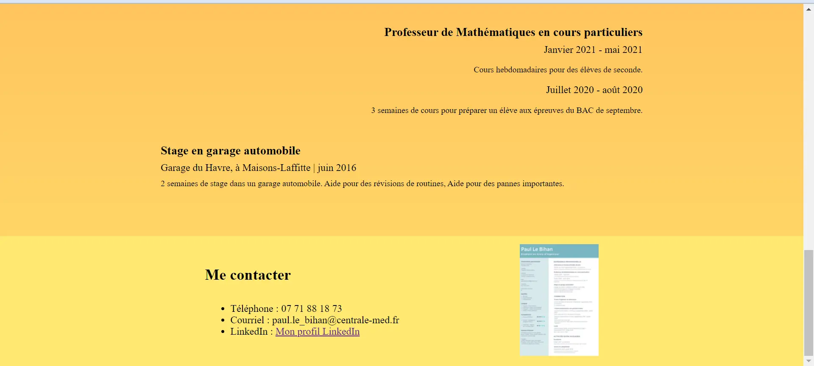

## Introduction

Comme je l'ai dit dans mon [MON](../../mon/temps-1.1/index.md) sur HTML et CSS, il me semble important d'avoir les bases pour développer un site web. En effet, tout passe par internet et pour pouvoir transmettre des infos, il est nécessaire d'être présent sur Internet. Ainsi, n'ayant aucune connaissance au préalable, j'ai décidé de faire le MOOC de HTML et CSS. Et pour être sûr que ces connaissances soient bien intégrées et vue qu'elles sont très denses, j'ai jugé bon de me faire la main en réalisant un premier site web de A à Z.

## Sommaire

1. La structure HTML
2. Le design CSS

## 1. La structure HTML

Pour réaliser un site web, la première chose à faire est de créer le contenu, en HTML, de ce site.

J'ai commencé par réfléchir à l'architecture du site. Et, vu que ce n'est pas un site très complexe, il m'a semblé plus intéressant de le faire sur une seule page web. En effet, cela me permettra de le mettre sur le domaine personnel que nous fournit l'école.

Vient maintenant la rédaction du contenu en tant que tel. Afin d'utiliser au mieux ce que j'ai appris pendant mon MON, je vais essayer de remettre un maximum de choses, notamment :
+ une image,
+ des titres,
+ des liens qui redirigent vers les bons endroits de la page,
+ un lien vers un site web existant,
+ mon cv au format pdf qui peut s'ouvrir dans un autre page,
+ et beaucoup d'autres choses qui ne seront pas forcément visibles mais qui serviront pour le CSS.

D'ailleurs, ne sachant pas bien comment serait agencé mon texte, j'ai également commencé par y mettre du faux-texte. Voilà ce à quoi ressemblait alors ma page web :

Vous pouvez retrouver le code source [ici](https://github.com/FrancoisBrucker/do-it/blob/main/src/promos/2023-2024/Le_Bihan-Paul/pok/temps-1/mon-site/).

## 2. Le design CSS

Le gros du travail en ce qui me concerne s'est trouvé là. En effet, après mon MON, je n'avais pas encore bien cerné les conséquences de certaines fonctionnalités. Il m'a donc fallu longtemps tâtonner et mélanger différentes fonctionnalités :
+ les fonctionnalités courantes telles que `width`, `font-size`, `background`,
+ d'autres avec lesquelles j'ai plus de mal comme le `margin` et le `padding`,
+ et enfin, certaines ce qui concerne les Flexbox, comme `flex-direction`, `align-items` et `justify-content`.

Et voici un apperçu du rendu final, qui se trouve avec le [code HTML](https://github.com/FrancoisBrucker/do-it/blob/main/src/promos/2023-2024/Le_Bihan-Paul/pok/temps-1/mon-site/): 

