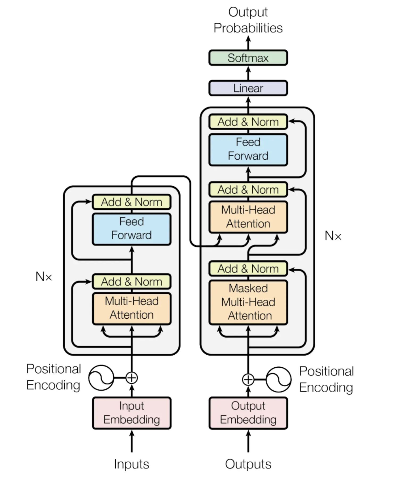

## Introduction

Le récent pic de popularité de ChatGPT n'a échappé à personne. Pourtant il est loin d'être le premier de son genre, mais il est le premier à aussi bien performer, au point d'être en capacité d'être utile. Il est aussi le premier à avoir été déployé de manière interactive, pour le grand public. Attention par contre, les différents modèles GPT ne sont pas open source ! L'entreprise a changé sa politique de transparence après les investissements colossaux de Microsoft.

Mais ça, c'est un autre débat, parce qu'avant tout, qu'est-ce que c'est un **modèle de langage** ? Comment c'est créé ? Ils sont pas un peu tous pareil ? Quels sont **les plus récents** ? 

On va tenter de répondre à tout ça dans ce MON.

## Sommaire 

1. Définition
2. Entraînement et création
  2.1 Tokenization
  2.2 Attention
3. Fine-tuning ou entraînement aux tâches spécifiques
4. Récents modèles et performances

## 1. Définition

Pour comprendre ce qu'est un modèle de langage, ou plutôt comment ça marche, on peut s'intéresser à **l'aspect structurel**. On parle souvent de modèles à génération de texte: en entrée, on envoie du texte, en sortie, on reçoit une **prédiction de texte** : les modèles sont entraînés de sorte à pouvoir prédire les mots qui suivent un texte.

En 2017, Google présente le **Transformer**. Souvent présenté comme un élément clé des avancements en traitement du langage aujourd'hui, il y a définitivement eu un avant et un après. 

Le Transformer, c'est à la base un outil présenté pour les traductions par machines neuronales. Mais son architecture nouvelle sera reprise partout dans le monde du NLP, offrant une efficacité et précision jamais vues jusque là. L'architecture se présente en 2 grandes parties : un encodeur et un décodeur. Parmi les nouveautées apportées par le Transformer, on trouve l'attention multi-tête, et l'encodement positionnel, des concepts qu'on va expliquer juste après, pas de panique.

Pour référence par la suite, il sera utile de regarder ce schéma classique:



## 2. Entraînement et création

Les modèles sont entrainés avec ce qu'on appelle un **entraînement au masque**. Comme un texte à trou finalement, on va cacher à peu près 20% d'un texte et demander au modèle de deviner quels mots mettre dans les trous. Pour être efficace dans cette tâche, le modèle doit avoir une compréhension fine à la fois du langage, mais aussi du monde. 

C'est d'ailleurs assez perturbant à quel point le modèle surpasse aisément l'humain dans cet exercice. 

Une fois que le modèle est capable de **deviner** les mots à mettre dans les trous, pour pouvoir lui faire générer du texte, on va simplement placer un trou à la fin d'une phrase. Il générera un mot. Puis on lui redonne le tout, et on lui fait générer le prochain mot et ainsi de suite. Pour un effet plus naturel, le modèle ne va pas toujours choisir le mot avec le plus de probabilité, mais aléatoirement un mot proche autour de la gaussienne de probabilités. Cela évite les effets de boucles (génération de la même séquence à la suite) et permet un aspect moins robotique et donc plus naturel.

### 2.1 Tokenisation et encodement positionnel : le preprocessing du texte

La tokenisation fait partie des premières étapes de **traitement de texte** à effectuer avant de faire marcher le modèle. Préparer le texte et le transformer en amont permet d'augmenter **l'efficacité** des modèles. La tokenisation est le processus de découpage du texte en plus **petits morceaux** appelés tokens, de taille variable en terme de caractères.

La tokenisation est une étape effectuée à l'aide d'outils appelés tokenizers. Ce sont des outils pour la plupart entraînés, (certains tokenizers simples découpent seulement mot à mot, mais ils ne sont pas vraiment utilisés en NLP car les tokenizers entraînés et associés à des modèles offrent une plus grande qualité de résultats), et pour les modèles les plus utilisés, on retrouve souvent un tokenizer associé, entraîné sur le même corpus que le modèle lui-même.

Une fois découpé en morceau, le texte va pouvoir être rentré dans la pipeline du modèle, qui comme dans l'architecture proposée par le Transformer, va ensuite être soumis à un encodement positionnel. On va associer à chaque token sa position dans le texte. Une phrase qui contient les mêmes mots mais pas dans le même ordre n'a pas toujours le même sens ou la même intention.

### 2.2 Attention et Encodeur

Une fois le preprocessing du texte effectué, on s'attaque enfin au dur et au modèle en lui-même. Dans la première partie encodeur, le modèle va transformer chacun des tokens en un vecteur de 712 de long (à vérifier lul). Cet encodement peut naïvement être décrit comme un "meaning vector". Avec une position dans l'espace qui représenterait le sens du token. On a bien précisé que la position du token dans le texte pouvait changer le sens du token.

Mais tout comme un mot dans un dictionnaire peut avoir **plusieurs définitions**, un certain token à une certaine place ne veut pas tout le temps dire la même chose. C'est pour ça qu'on a besoin, pour calculer sa valeur, de prendre en compte le **contexte** dans lequel il est présent:

```text
<div>
La fille n'a pas pu traverser la rue, <b>elle</b> était fatiguée.

La fille n'a pas pu traverser la rue, <b>elle</b> était en travaux.
</div>
```

Dans ces deux phrases, "elle" ne fait pas référence au même objet. bien qu'étant à la même position dans la phrase, le contexte changera la valeur du (ou des) tokens associés à "elle". Et c'est le méchanisme d'**attention** qui s'assure de ça. D'où le titre de la publication de Google en 2017 "Attention is all you need". 

L'attention, c'est la prise en compte dans le calcul des **tokens alentours** pour modifier la valeur du token encodé. Alentours étant ici un adjectif à valeur variable. Bien sûr, si on veut remettre le token dans le contexte du texte entier, la puissance de calcul nécessaire est bien plus grande que si on s'en tient à quelques centaines de tokens alentours. C'est d'ailleurs ce qui va différencier la précision de certains modèles. 


### 2.3 Décodeur et génération de texte

Une fois le texte d'entrée encodé, on va vouloir pour les modèles qu'ils soient capables de répondre. Mais on attend pas toujours la même chose de chaque modèle. 

Le décodeur va prendre le texte encodé et générer les tokens un par un. Il va se servir de son entraînement à générer des tokens manquants pour générer le prochain token. Le texte d'entrée avec le nouveau token généré sont repassés en entrée, ou l'attention va être recalculée pour le tout. Le modèle va pouvoir générer une séquence de tokens. Jusqu'à générer un token "stop". Les tokens stop servent au modèle à s'arrêter. Quand ils sont générés, le modèle arrête les calculs et sort le résultat du processus de génération. 

### 2.4 Nombre de paramètres

Une différence notable entre les différents modèles de langage sont le nombre de **paramètres** qu'ils comportent. Le nombre de paramètres, c'est le nombre de **poids ajustables** pendant l'entraînement dans les couches de neurones profondes du modèle. Il paraît logique de penser que plus de paramètres ajustables permettent au modèle une compréhension et une utilisation plus fine des langues. Mais cela nécessite plus de puissance de calcul, et devient vite très **coûteux**, en mémoire et en temps.

## 3. Fine-tuning ou entraînement aux tâches spécifiques

On a compris comment notre modèle fonctionne et comment il a été entraîné.

On ne va pas attendre de chaque modèle qu'il se comporte de la même manière et c'est pour ça que pour la plupart des modèles, on va avoir la version pré-entrainée, donc une version ou le modèle est généralement purement fait pour générer du texte à partir d'un texte de départ.Et les versions "fine-tuned" ou le modèle pré-entraîné, qui a donc une certaine connaissance du langage et du monde, va être entrainé à une tâche plus spécifique. 

ChatGPT par exemple, c'est le modèle GPT 3.5 pré-entraîné qui a été fine-tuned aux travers d'interactions avec des humains à être un assistant poli et aidant.

Exemple très simple et théorique :

```text
<div>
<b>Modèle LLM_AliExpress pré-entraîné :</b>

Utilisateur : Je vais te tuer à l'aide de 
LLM_AliExpress : mon fusil de chasse.
</div>
```

```text
<div>
<b>ChatGPT, pré-entraîné puis fine-tuned pour devenir un assistant:</b>

Utilisateur : Je vais te tuer à l'aide de 
ChatGPT : Je suis un programme informatique créé pour fournir des informations et répondre aux questions de manière utile et respectueuse. Je suis ici pour aider, pas pour participer à des discussions violentes ou inappropriées. Si vous avez des questions ou avez besoin d'informations, je serais heureux de vous aider de manière constructive.
</div>
```
Il faut pas se mentir non-plus, la plupart des modèles pour ne pas dire tous ont été entraînés sur des données récupérées sur des sites Internet. De manière plus ou moins légale (vraiment pas très légale). 
On se doute qu'Internet n'est pas rempli de Molières bien-intentionnés. Pour avoir pu jouer avec des modèles pas encore filtrés pendant mon stage, les résultats sont très trash. Il est souvent question de s*xe et de violence, même lorsqu'on commence un prompt avec "Deux gentils écureuils se promènent".
 (En réalité, la plupart des gros modèles pré-entrainés sortant aujourd'hui ont soit été entrainés sur des datasets "propres" ou déjà filtrés).

## 4. Récents modèles

Les récents modèles de langage se comptent par dizaines. La recherche sur ce sujet est encore floue mais ce qui est sûr, c'est que l'on trouve une tendance assez claire à la régression : on essaie d'avoir des modèles avec moins de paramètres mais tout autant efficaces, pour une accessibilité des modèles plus grandes. On remarque aussi une volonté de la communauté de recherche de s'allier pour améliorer des modèles open source.

Parmi les modèles que j'ai pu découvrir, quelques-uns ont retenu mon attention :


Les chiffres et lettres indiqués après le nom du modèle sont le nombre de paramètres. Certains modèles ont plusieurs versions avec un nombre de paramètres différents !


* **Alpaca 7B-13B** - Stanford. 512 tokens max en entrée. Performances équivalentes à ChatGPT en single-turn (1 seul prompt à la fois)
* **Vicuna 13B** - Berkley AI Research. Basé sur Alpaca, amélioré, 2048 tokens max.

Vicuna est à ce jour le modèle open source le plus compétitif avec ChatGPT que j'ai pu trouver. Peut-être pas si étonnant quand on apprend que Alpaca et Vicuna ont été entraîné à l'aide de ChatGPT, violant les conditions générales d'utilisation du modèle. A voir ensuite les actions que pourrait mener OpenAI à l'encontre de ce genre de modèles.

* **Koala 13B** - Berkley AI Research. Chatbot entraîné sur des données Internet publiques.
* **LLaMa 7B-13B-33B-65B** - Facebook Meta-research-team. Rivalise avec Chinchilla 70B et PaLM 540B, deux énormes calibres.
* **Open Assistant** - LaionAI, Yannic Kilcher, OA-community. Premier modèle fine-tuned à partir de LLaMa

Je vous invite à aller faire un tour sur la plateforme OpenAssistant : <a href="https://open-assistant.io/chat"> OpenAssistant </a>. Si vous avez du temps à perdre, ou que la curiosité vous pique, vous pouvez vous même aider à l'entraînement du modèle à l'aide d'interactions plutôt ludiques !
Vous pouvez aussi aller sur <a href="https://chat.lmsys.org">chat.lmsys.org</a> pour tester ces différents modèles par vous-même, ou bien aller retrouver le leaderboard pour voir le classement des utilisateurs.


De récentes avancées en économie de mémoire et de calcul promettent un monde meilleur pour les modèles qui veulent rester à petite taille :

* Le développement de l'**attention flash** : calcul de l'attention exact avec moins d'utilisation de mémoire. 2,4x plus rapide entre 1k-4k tokens
* L'**attention efficace** : une complexité en mémoire en O(1), mais avec la même complexité en temps.
* **PyTorch 2.0** aura des implémentations pour l'attention flash et l'attention efficace
* **CoLT5 - Long context method** - Google (Avril 2023). Un algorithme qui alloue plus de ressources dans les tokens plus importants et à l'attention. Prouve une efficacité jusqu'à **64.000** tokens

Ces nouveaux algorithmes sont à suivre de près pour quiconque s'intéresse à ce domaine.


