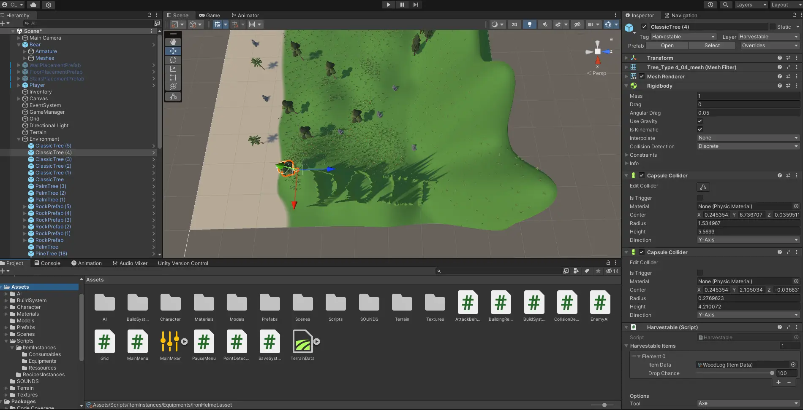
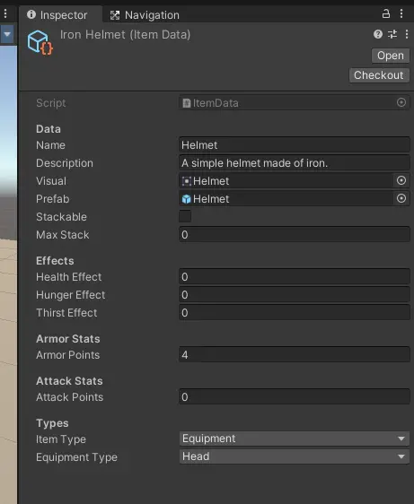
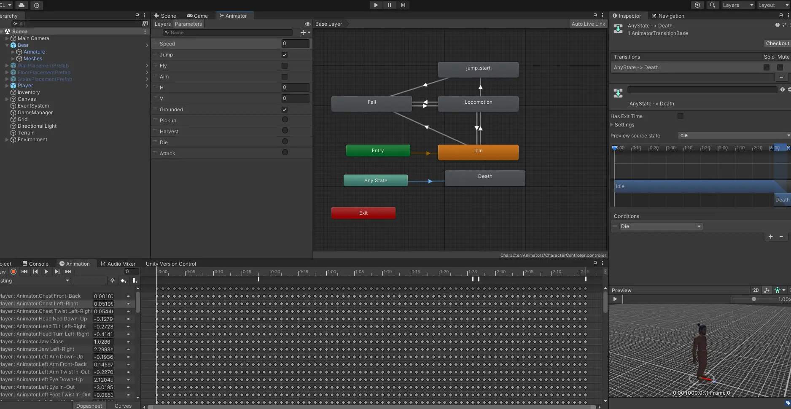
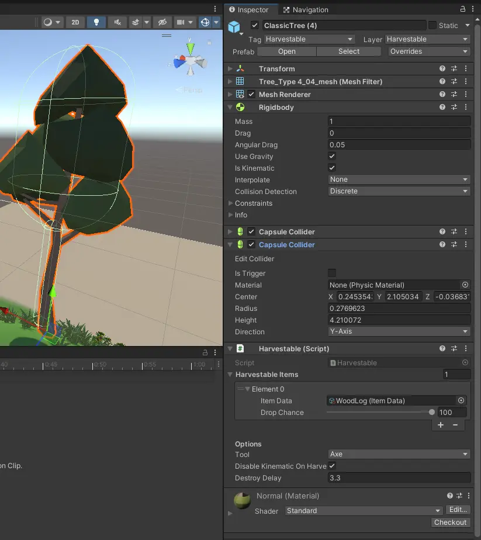
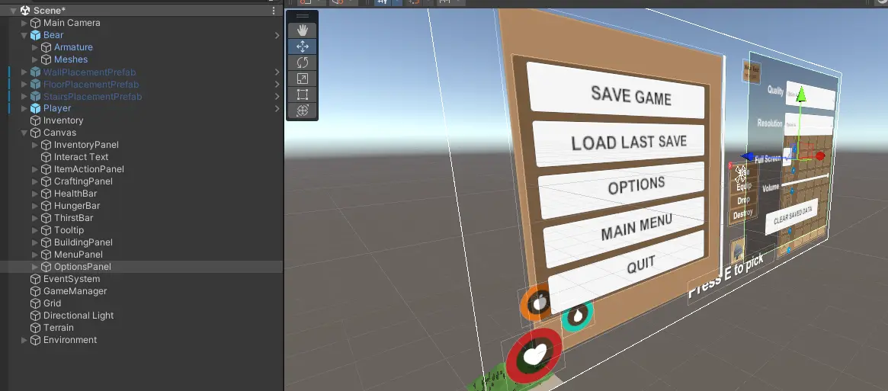
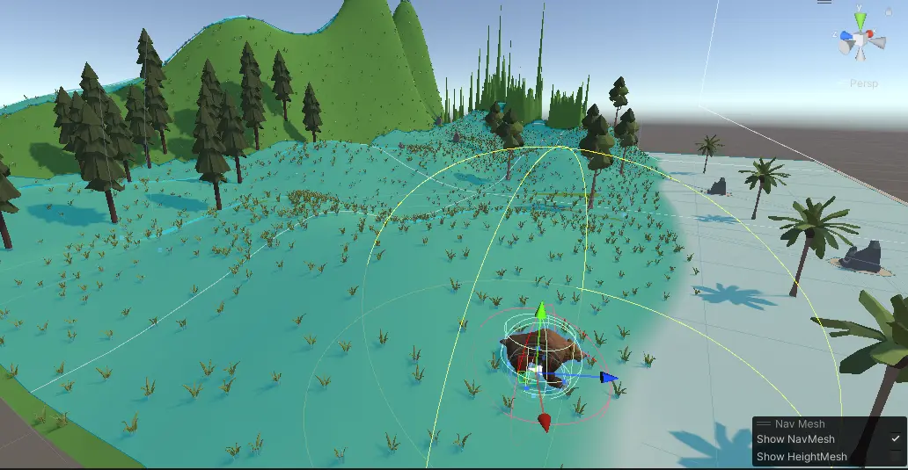



* des notions de programmation
* un ordinateur pas trop mauvais, au risque de se taper la tête contre le mur quand chaque compilation dure 1 minute vers la fin du projet




## Introduction

Dans ma quête d'expansion de mes compétences en développement, j'ai décidé de m'initier à la création de jeux en 3D à l'aide d'Unity. J'ai choisi Unity car c'est un moteur de jeu populaire, utilisé par des indépendants aussi bien que des très grands développeurs.

J'ai suivi un tutoriel déniché sur YouTube pour créer un jeu en 3D. Ce tutoriel, d'une durée totale d'approximativement 18 heures de vidéo, couvre la création d'un jeu de survie de A à Z. J'y ai manié de nombreux scripts en C#, que j'ai pu lié à la plateforme Unity, créé des scènes de jeux, des terrains, des objets, différents mécanismes d'interaction... Jusqu'à arriver au build du jeu et à l'intégration d'un installer, c'est à dire le moment où on va compiler l'ensemble et le monter en un seul fichier application exécutable, et partageable avec n'importe qui.


## C'est parti


Tout d'abord, sachez que l'adresse mail de Centrale nous donne accès à une license étudiante gratuite pour Unity.

On créé un projet vide et on commence par importer un petit package. Dans ce package, on a un modèle de joueur en 3D, ainsi qu'un script de déplacement. C'est le seul script du jeu qu'on n'écrira pas nous-même. Et tant mieux, car à ce stade, je n'ai aucune notion du logiciel et je n'ai jamais codé en C#.

## Prefabs, GameObjects, Instances

Ce n'est qu'en avançant dans le tutoriel que j'ai commencé à comprendre les différents concepts fondamentaux liés à l'utilisation d'Unity. C'était assez obscur au début, mais à la fin des 20h, je pense maîtriser les bases. Voici donc un petit résumé de ce que j'ai compris :

### Prefab 

Une Prefab, dans l'univers d'Unity, représente un modèle ou un prototype d'objet. C'est une sorte de version préconfigurée d'un GameObject, comprenant tous les détails comme les composants, les propriétés, et les scripts nécessaires. Les Prefabs sont utiles pour créer des objets de manière efficace, les utilisant comme des modèles que l'on peut reproduire plusieurs fois dans une scène.

### GameObject 

Le GameObject est la pierre angulaire dans Unity. Il symbolise toute entité visualisable dans la scène, qu'il s'agisse de personnages, d'objets, de lumières, de caméras, et plus encore. Ces GameObjects sont constitués de divers composants tels que des transformateurs, des mesh renderers, ou des scripts. Ils forment ainsi la structure de base de toute scène Unity.



### Instance 

Une Instance est une occurrence particulière d'un Prefab dans la scène. Lorsqu'on place un Prefab dans la scène, il devient une Instance unique avec ses propres caractéristiques. Chaque Instance peut être manipulée individuellement sans impacter les autres. En illustrant, si un Prefab représente un arbre, chaque arbre spécifique placé dans la scène est considéré comme une Instance de ce Prefab. On parle aussi d'instances quand on créé une instance particulière d'un type plus général. Par exemple, j'ai défini une classe Item, et les ItemsInstances étaient des définitions de pierre, morceau de bois, chapeaux...




## Syntaxe C#

La syntaxe C# n'était pas particulièrement choquante à adopter, ayant fait un peu de C et de Java, ça m'a rappelé comme un mélange des deux. J'ai utilisé Microsoft Visual Studio comme IDE, et l'intégration avec Unity était très bien. L'autocomplétion était assez intelligente. Les noms de méthode commencent par contre par une majuscule. Ce qui est assez pratique visuellement je dois l'admettre.

La grosse nouveauté pour moi ça a été les variables en SerializeField. Pour résumer, on peut indiquer une variable en private, donc pas accessible depuis d'autres scripts, mais le fait de l'initialiser en SerializeField va nous permettre de Drag&Drop dans Unity même la valeur qu'on veut lui associer (un gameobject, un autre script, un float...)

Nous avons aussi la possibilité de rendre une variable public mais de mettre le tag HideInInspector pour ne pas pouvoir la modifier depuis Unity directement.

J'ai également découvert les méthodes void Update, void Start, void Awake... qui sont différentes méthodes, qui comme leur nom l'indique, sont appelées directement soit au début du script (Start), soit à chaque frame (Update), soit à l'instantiation même (Awake)...


```csharp
using Unity;

[SerializeField]
private GameObject welcomeText;

[HideInInspector]
public float myMoney;

public class MyClass : MonoBehaviour
{
    public void IncreaseMoney()
    {
        myMoney++;
    }

    void Start() {
        welcomeText.SetActive(true);
    }

    void Update() {
        IncreaseMoney();
    }
}

```

Voici un script bidon qui montre l'architecture typique des scripts que j'ai pu écrire pour le jeu. J'espère que le taux de rafraichissement de votre écran est élevé, car la fonction Update va être appelée plus souvent et vous rendre plus riche.

Nous avons aussi fait apparaître le texte de bienvenue dans la scène quand ce script est appelé.

## Animations, Audio et évènements

Le volet animation, audio et gestion des évènements a été une étape satisfaisante dans le développement du jeu. Pour certaines actions comme le minage ou le ramassage d'objets, j'ai intégré des éléments sonores et des animations pour renforcer l'immersion du joueur. Les évènements ont été utilisés pour déclencher des actions en fonction des interactions dans le jeu, créant ainsi une expérience plus dynamique. Unity permet d'associer un évènement à une certaine Frame de l'animation.

Par exemple, on a rajouté un bruit de pioche qui s'active grâce à un script, et on l'a attaché à un évènement à la frame où l'animation de minage touche la pierre.

On a aussi traité la spatialisation audio et le mixage.



## Box Collider, RigidBody

La gestion des collisions a été réalisée grâce aux composants Box Collider et RigidBody d'Unity. Le Box Collider a été utilisé pour définir les zones de détection des collisions, tandis que le RigidBody a permis de simuler les interactions physiques, offrant une expérience de jeu plus réaliste. On a pu changer la masse des objets, les rendre fixes, atteints par la gravité...


## Layers et RayCast

L'organisation des éléments dans le jeu a été facilitée par l'utilisation de Layers, permettant de catégoriser les GameObjects et d'optimiser les interactions. Différents Layers ont été utilisés comme le layer Item, Harvestable, UI... Les RayCast ont été employés pour gérer les scripts de pickUp et de l'IA ennemie. Les RayCast sont commes des lasers ou des fils qu'on tire depuis un objet dans une direction et on peut détecter par exemple si le joueur regarde un objet, ou s'il est près d'un ennemi.



## UI - Game Menus

J'ai été surprise par la manière de créer des Menus dans une scène, on dirait que le Menu est affiché en géant dans la scène, à côté du terrain qui a l'air minuscule.
J'ai galéré à personnaliser cette partie, j'ai trouvé que le UI était difficile à gérer dynamiquement, car il y a beaucoup de choses et de paramètres à prendre en contre. Par exemple l'inventaire c'est un *panel dans un *canvas qui contient un *content, et ce content et composé de *slots qui contiennent une *image dont on configure le *sprite. 

Il y avait des layout grids, des alignements dynamiques dans tous les sens, et j'ai pas vraiment la fibre front donc pour moi c'était un peu de la magie noire mais heureusement le tutoriel est bien fait.



## Unity Terrain 

La création du terrain de jeu a été simplifiée grâce à l'outil Terrain d'Unity. J'ai pu sculpter le relief, peindre les textures et intégrer des éléments naturels pour donner vie à l'environnement du jeu. Je n'ai pas été très créative ou pointilleuse sur cette partie bien qu'elle soit amusante. Le level design est un métier en soi et il n'est pas facile de s'improviser maestro dans ce sujet.


## AI et NavMesh

L'intégration de l'intelligence artificielle (AI) dans le jeu a été très intéressant. L'utilisation de NavMesh a simplifié la navigation des entités dans l'environnement du jeu. Il a suffit d'ajouter un script de déplacement aléatoire à notre Ours, d'ajouter un component NavMesh sur sa Prefab, et cliquer sur le bouton Bake NavMesh, en sélectionnant les Layers affectés (Terrain, etc...). C'est un gros raccourci mais ça a été surprenamment pas si long à mettre en place, Unity mâche bien le travail.

L'ours se délace aléatoirement et librement sur le NavMesh, et peut se mettre à nous courser et nous attaquer si on est trop près.



## Fonctionnalités Finales

Les fonctionnalités finales du jeu sont:

* Barre de faim et de soif qui descendent au fil du temps
* Barre de vie qui descend si l'ours attaque ou si la faim et la soif sont à 0
* Inventaire(Tab), ToolTip, Utilisation d'item, Equiper un item ou le détruire
* Stacker des items du même type
* S'equiper d'une armure qui réduit les dégâts pris
* Consommer de la nourriture, des kits de soins qui nous rendent des stats
* Craft(R) d'objets à partir d'une recette 
* Construction de murs, escaliers et sols genre Fortnite
* Couper des arbres
* Miner des rochers
* Ramasser des objets
* Menu pause(ESC), navigation entre les menus
* Sauvegarde rapide(F5)
* Chargement dernière sauvegarde(F9)
* Changement de qualité, résolution, fullscreen, volume ...

## Démonstration

<iframe width="560" height="315" src="https://www.youtube.com/embed/-NTqzMroQNM?si=uooI9cz_aetpy9f4" title="YouTube video player" frameborder="0" allow="accelerometer; autoplay; clipboard-write; encrypted-media; gyroscope; picture-in-picture; web-share" allowfullscreen></iframe>

## Installez mon jeu chez vous !

Comme mentionné au début, on a même intégré un installeur, vous pouvez donc jouer à mon jeu sur Windows en le téléchargeant [depuis ce lien](http://node.basilic.ovh1.ec-m.fr/download-rpg-game)

Je n'ai pas encore pris le temps de build le jeu sur Mac, mais c'est possible aussi.

Disclaimer : vous devrez probablement désactiver la protection en temps réél dans les paramètres Windows Defender/Protection contre les virus et menaces, le temps du téléchargement, si vous me faites confiance. L'application est détectée comme dangereuse, probablement car c'est un exécutable d'un auteur inconnu... Je ne sais pas comment ça fonctionne. Mais en tout cas, j'ai testé chez des amis, ça marche bien.


## Conclusion

Ce projet de jeu de survie en 3D avec Unity a été fantastique. D'une part c'est impressionant de voir ce qu'on peut faire et apprendre en 20h, d'une autre super satisfaisant de tout avoir fait soi-même (sauf les modèles 3D des items et personnages mais c'est pas le but ici) et d'avoir un résultat utilisable et partageable. Je le conseille vivement aux intéréssés du Game Development. Le tutoriel est complet et très clairement expliqué, on est rarement perdus, sauf au début peut-être mais c'est normal le temps de découvrir.

## Sources

* [**Playlist du tutoriel**](https://www.youtube.com/playlist?list=PLUWxWDlz8PYIvzRTHyvx54tgWTCkgZzkZ)
* [**Mon repo GitHub avec tout le code final du jeu**](https://github.com/Cledins/rpg)

## Horodateur

26/11 **|** 4h
30/11 **|** 6h
14/01 **|** 10h