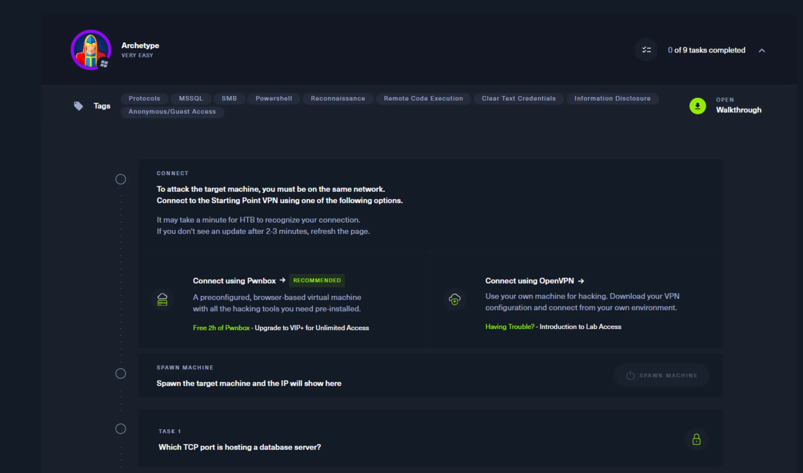
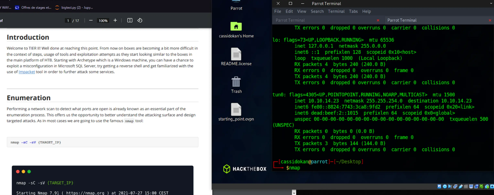
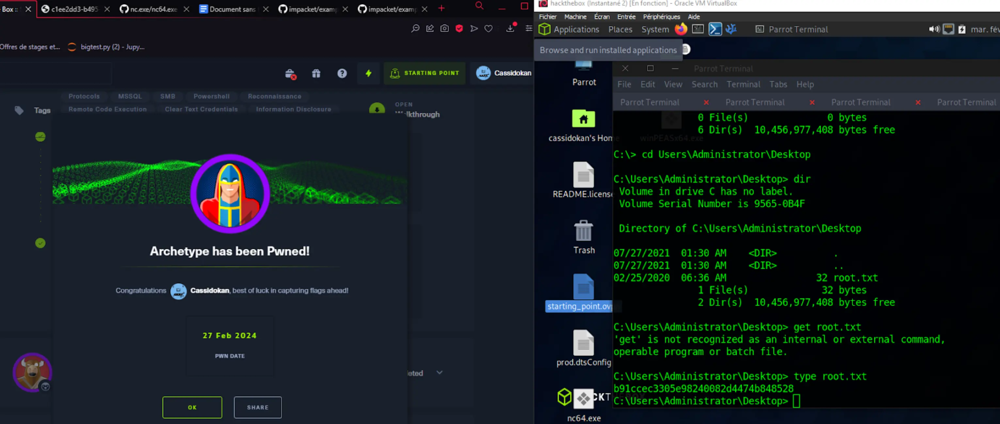

## Introduction

Je voudrais découvrir le pentest en effectuant les exercices pour débutant sur les plateformes Tryhackme puis Hackthebox. Ces plateformes sont réputées pour être noob-friendly.

## Prise en main et prérequis

Pour débuter les exercices chez hackthebox, on nous propose une option payante ou on peut jouer sur le navigateur directement avec une VM (machine virtuelle) personnalisée, ou alors le faire à la main nous-même, c'est-à-dire installer une VM sur notre ordinateur et mettre en place le VPN comme des grands. Le but étant ensuite, d'à partir de notre VM, faire des exercices de CTF (capture the flag), concrètement aller récupérer un fichier "flag.txt" qui contient un code sur une machine à laquelle on essaie d'accéder en trouvant des failles.

Il y a une vidéo d'explication qui n'est pas très bien référencée, et qui n'explique pas grand chose car ils incitent surtout à utiliser la version payante, j'ai dû me débrouiller moi-même, donc faire le setup de la VM et partition de disque. Je pense que cette étape de préparation peut repousser les gens qui sont moins à l'aise avec l'informatique.

## Déroulé d'un exercice

Pour "pwn" une machine, on lance l'exercice, on se connecte au VPN, et quand HackTheBox nous détecte, on nous donne accès à l'IP de la machine à percer. Chaque étape est bloquée par les étapes précédentes.

Une fois que c'est fait, la machine cible est mise en marche, et on peut suivre le PDF explicatif de la machine. Tout est en anglais. On exécute alors pas à pas les manipulations proposées par le PDF. J'ai trouvé toutes les explications assez claires, même si parfois on ne comprend pas vraiment pourquoi on fait une manipulation avant la fin du Lab où ça devient souvent plus clair. Le PDF renvoie souvent a des liens extérieurs pour nous en faire apprendre plus sur les failles, techniques et architectures rencontrées. 

Il faut parfois savoir être patient, surtout avec les scans qui peuvent mettre leur petit temps. Jamais rien ne se passe comme prévu, il faut aussi prendre son mal en patience lorsqu'on rencontre des erreurs non-prévues. Et surtout ne pas fermer un terminal avec un truc qui tourne dessus. (arriver à la fin d'une machine qu'on a mis 2 heures à percer puis faire CTRL+C par réflexe c'est vraiment pas fun). 

Mais c'est en faisant qu'on apprend, et je trouve que HackTheBox est un environnement agréable pour un débutant qui a la fibre info mais je ne pense pas conseiller pour quelqu'un qui n'est pas du tout dans le domaine, surtout pour le côté utilisation gratuite où il faut tout faire à la main. C4est formateur en tout cas.

Après avoir suivi les explications, on arrive enfin à lire le flag final !

Pour ce lab par exemple, il aura fallu scanner les ports, détecter le service MicrosoftSQL, accéder au service puis :

- trouver et récupérer un dossier de configuration dans lequel le mot de passe était affiché
- utiliser le mot de passe pour se connecter à la base dans un dossier non-administrateur
- utiliser des injections SQL pour changer la configuration et réussir à run des commandes powershell
- utiliser ncat et upload un fichier binaire pour reverse shell
- une fois en reverse shell, utiliser winPEAS pour effectuer une escalation de privilège 
- finalelement naviguer dans la machine pour trouver le flag !

Bien joué ! Le PDF du déroulé de cette machine faisait 17 pages. Donc prévoyez du temps, surtout quand vous avancez dans des labs plus laborieux et "réalistes". C'est pas vraiment possible de les finir en 30 minutes, surtout le temps de tout démarrer, mettre en place, et comprendre ce qui se passe, à moins d'être un pro. Et vous ne pouvez pas reprendre un lab au milieu, il faut tout faire d'un coup. 

Donc à moins de s'y connaître déjà, si vous débutez comme moi, et qu'en plus la moindre mouche vous déconcentre, prévoyez a minima 1 bonne heure par lab, le temps de comprendre et résoudre les problèmes inattendus.

## Conclusion

J'ai vraiment appris plein de choses et j'ai trouvé ça super satisfaisant comme format d'exercice. C'était bien plus long que ce que je pensais donc je n'ai pas pu tester TryHackMe. Mais je recommande tout à fait aux hackeurs en herbe. Ca m'a sensibilisée sur beaucoup de failles basiques et même sur les risques présents sur les serveurs en général. J'ai pu faire 11 machines sur les 13 gratuites pour débutants. Chaque machine ayant son propre thème, c'est très instructif.

