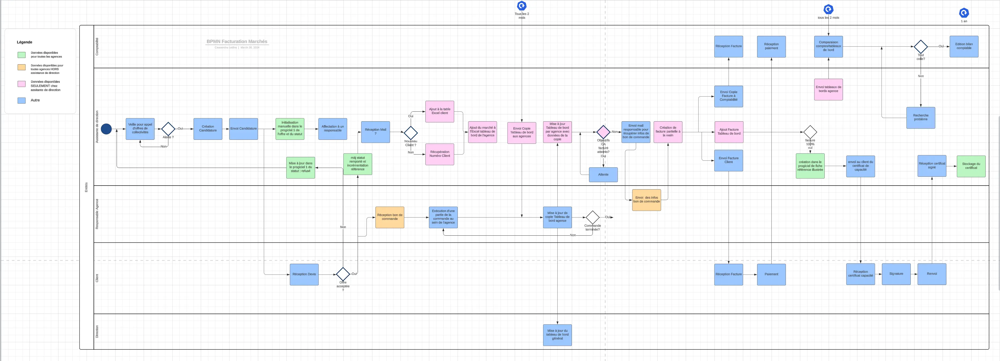

## Introduction

Après une discussion avec un membre de ma famille, qui se plaignait de devoir utiliser Excel pour des tâches répétitives de son travail qui lui font perdre beaucoup de temps, mais aussi ne met pas à l'abris des fautes d'étourderies et d'incohérence des informations entre les services, j'ai pensé au cours de conception SI. Je me suis donc dit que je voudrais l'interviewer, pour faire un schéma du process en question que je ne connais pas du tout, essayer de cerner les problèmes, et définir un petit cahier des charges pour un hypothétique ERP, ou du moins une liste des exigences techniques et technologiques.

Je réfererai à ce membre ultérieurement par "l'assistante de direction".

### Processus d'Interview :

L'interview a été préparée en amont pour comprendre en détail le processus de facturation de l'entreprise. Les étapes suivantes ont été suivies pour garantir une collecte complète et précise des informations :

1. **Préparation de l'Entrevue :**
   Avant l'interview, une préparation minutieuse a été effectuée afin de formuler des questions pertinentes et d'identifier les lacunes potentielles dans le processus actuel. J'ai essayé de rester ouverte et factuelles dans mes questions de préparation qui ont surtout été axées sur la structure de l'entreprise, ainsi que son envergure pour mieux comprendre le contexte, en laissant la place à l'improvisation pour la description du processus.

2. **Conduite de l'Entrevue :**
   L'entrevue s'est déroulée de manière interactive, me permettant ainsi de poser des questions ouvertes pour encourager l'assistante de direction à détailler chaque étape du processus de facturation. J'ai demandé des exemples concrets pour clarifier les aspects plus complexes du processus.

3. **Analyse des Réponses :**
   Les réponses fournies par l'assistante de direction ont été par la suite analysées à l'aide entre autre d'un diagramme pour identifier les étapes clés du processus de facturation, les points de friction potentiels et les opportunités d'amélioration. 

### Présentation de l'entreprise et de la personne interviewée

J'ai eu une autorisation de consultation des dossiers de l'entreprise mais pas une autorisation de diffusion des informations. Je vais donc tout au long de la description anonymiser l'entreprise et changer les détails qui pourraient associer cette entreprise à mon MON.

L'entreprise compte moins de 30 salariés, est donc une PME, et fait partie d'un groupe, qui au total compte moins de 100 salariés. 
Elle effectue des études sur un thème environnemental, principalement pour des collectivités, elle répond donc a des appels d'offres. Elle se trouve en concurrence avec beaucoup d'autres entreprises du marché, de toutes tailles, mais les principaux concurrents sont des mastodontes du domaine.

La personne interviewée est l'assistante de direction, qui a des tâches très variées dans l'organisme, de part la taille relativement petite de l'entreprise. 

### Diagramme BPMN avec couloirs:

Après consultation d'un des <a href="https://francoisbrucker.github.io/do-it/promos/2023-2024/Sarah-Sebastien/mon/temps-2.2/">MON de Sarah</a>, j'ai créé un diagramme BPMN pour représenter visuellement le processus de facturation tel qu'il a été décrit lors de l'interview. Les étapes suivantes ont été implémentées lors de la création du diagramme :

1. **Identification des Activités :**
   À partir des informations recueillies lors de l'interview, les différentes activités impliquées dans le processus de facturation ont été identifiées. Cela comprenait la création des factures, la vérification des données, l'envoi aux clients, etc.

2. **Définition des Flots de Séquence :**
   Les flots de séquence ont été établis pour indiquer l'ordre dans lequel les activités sont effectuées. Cela a permis de visualiser clairement le cheminement du processus de facturation, y compris les conditions de déclenchement pour passer d'une activité à l'autre.

3. **Modélisation des Événements :**
   Les événements initiaux (déclencheurs) et finaux (résultats) du processus ont été identifiés et modélisés dans le diagramme. Cela comprenait des événements tels que la réception d'une commande, la génération d'une facture, et la réception du paiement.

Mais aussi :

3. **Revue et correction avec l'assistante de direction :**
   Pour être sûre d'avoir modélisé correctement le process, le diagramme a été partagé avec l'assistante de direction et son directeur, pour revue. Cela a permis d'apporter quelques précisions, mais aussi d'ajouter une étape (l'étape de création de certificat à la fin d'une mission) qui avait été oubliée lors de l'interview.

### Identification des problèmes

Après consultation d'un autre <a href="https://francoisbrucker.github.io/do-it/promos/2023-2024/Sarah-Sebastien/mon/temps-1.1/">MON de Sarah</a>, j'ai pu remarquer des patterns décrit dans les entreprises sans ERP généralisé. On remarque plusieurs problèmes grâce au diagramme et à l'interview.

- Les données éparpillées 
- Perte de temps à communiquer pour récupérer des données
- Création manuelle de facture alors qu'elles pourraient être automatiquement générées à partir des données
- Répétition de tâches par différents services (ex: mise à jour des tableaux de bords)
- Grande place à l'erreur tout au long du process. Il n'y a pas de vérification automatisée du respect des étapes ni des informations copiées.
- Dépendance trop importante sur une seule personne : une absence ou un départ non à l'amiable de l'assistante de direction pourrait s'avérer presque fatal pour l'entreprise.

Les tableaux de bords tenus par l'assistante de direciton et la commptabilité ne sont comparés qu'une fois tous les 2 mois : possible grande perte de temps pour trouver l'erreur quand il y a différence. Il y a aussi une possibilité d'avoir des répercussions pénales si les comptes sont évalués par un inspecteur et qu'il y a une erreur non détectée qui pourrait être prise pour de la fraude. 

Après avoir posé la question de **pourquoi** les données étaient séparées entre une agence et toutes les autres, on m'a répondu qu'un contrat était en cours entre l'agence isolée et un prestataire de serveurs. L'agence isolée a donc ses propres serveurs et, à cause des clauses du contrat, ne peut pas accéder aux données des autres agences directement. Et celà pour encore **2 ans**.

L'assistante de direction a estimé que le travail de facturation (et seulement la création des factures) lui prenait 1h30 par semaine (lissé sur l'année). On peut imaginer que le reste du processus, qui présente aussi des défauts, prend un temps non négligeable sur son travail, mais aussi aux autres services, qui pourraient gagner en **efficacité** en adoptant un logiciel généralisé. 

### Tableau des spécifications techniques pour le Logiciel de Facturation 

On peut commencer par définir les éléments attendus dans un cahier des charges. Il pourra comprendre les éléments suivants :

1. **Introduction :**
   Une brève introduction expliquant le contexte de l'entreprise et la nécessité d'un logiciel de facturation pour optimiser le processus existant.

2. **Objectifs du Logiciel :**
   Définir clairement les objectifs du logiciel, tels que l'automatisation des tâches de facturation, la réduction des erreurs, et l'amélioration de l'efficacité globale du processus.

3. **Fonctionnalités Requises :**
   Une liste détaillée des fonctionnalités que le logiciel doit offrir, basée sur les besoins identifiés lors de l'interview et de l'analyse du processus de facturation. Comme par exemple la création automatisée de factures, la gestion des clients, le suivi des paiements, etc. Donc quelque chose de cross-service.

4. **Exigences Techniques :**
   Spécifications techniques telles que la compatibilité avec les systèmes existants (utilisés par les autres agences), les langages de programmation à utiliser, les exigences en matière de sécurité des données (différents niveaux d'accès pour différents types d'utilisateurs), etc.

5. **Interface Utilisateur :**
   Description de l'interface utilisateur souhaitée, en mettant l'accent sur la convivialité et l'ergonomie pour garantir une utilisation intuitive par l'assistante de direction et les autres utilisateurs. Ca peut être quelque chose de secondaire, mais je pense que sur un engagement à long terme comme celui de l'adoption d'un ERP, il est important d'être sûre que l'interface soit cohérente avec l'image de l'entreprise.

6. **Contraintes de Développement :**
   Contraintes telles que le budget alloué au projet, les délais de livraison, les ressources disponibles, etc.

7. **Validation et Test :**
   Méthodes de validation et de test pour s'assurer que le logiciel répond aux exigences spécifiées et fonctionne de manière fiable dans le contexte opérationnel de l'entreprise.

Ce cahier des charges servira de document de référence pour le développement du logiciel de facturation, garantissant ainsi que les besoins de l'entreprise sont correctement pris en compte et que le produit final répondra aux attentes. 

Pour ce MON, j'ai tenté d'ériger un tableau de spécification technique qui pourrait faire partie du cahier des charges. J'ai mal utilisé le mot cahier des charges lors de la présentation et l'introduction du MON. Je pensais en effet plutôt à une liste de spécifications techniques.

### Tableau de spécification technique

On pourrait imaginer une solution dans un Cloud tel que le reste des agences utilise déjà (avec Microsoft 360).

| Fonctionnalité | Description | Technologies Requises |
|----------------|-------------|----------------------|
| Création et édition de factures | Permet à l'utilisateur de créer de nouvelles factures à partir de données existantes et de les éditer ultérieurement. | Django, PostgreSQL |
| Gestion des clients | Permet à l'utilisateur d'ajouter, de modifier et de supprimer des clients de la base de données. | Django, PostgreSQL |
| Suivi des paiements et des comptes débiteurs | Fournit un moyen de suivre les paiements reçus et de gérer les comptes débiteurs des clients pour la comptabilité. | Django, PostgreSQL |
| Génération de rapports | Permet la génération de rapports personnalisés sur les ventes, les paiements et les comptes débiteurs, pour mieux gérer les envois de factures dans le temps. | Django, PostgreSQL |
| Génération de tableaux de bords | Permet la génération de tableaux de bords personnalisés, incluant les différents rapports, missions en cours et passées | Django, PostgreSQL |
| Intégration avec les systèmes existants | Permet l'intégration avec d'autres systèmes utilisés par l'entreprise, tels que la comptabilité et les données Microsoft 360. | API, PostgreSQL |
| Sécurité des Données | Assure la sécurité des données en mettant en place l'authentification des utilisateurs, le cryptage des données sensibles et des sauvegardes régulières. | Django, PostgreSQL |
| Interface Utilisateur | Fournit une interface utilisateur conviviale et réactive pour une utilisation facile et intuitive. | HTML, CSS, JavaScript |
| Contraintes de Développement | Respecte le budget alloué au projet, le délai de livraison et les ressources disponibles, y compris une équipe de développement. | - |
| Validation et Test | Avant la livraison du logiciel, une phase de validation et de test approfondie sera menée pour garantir le bon fonctionnement du logiciel. | Tests de performance, tests de sécurité, tests de convivialité |

## Conclusion

Et alors concrètement ? Il y a plusieurs limitations qui pourraient empêcher l'implémentation d'un ERP, dont la souscription d'un contrat de serveurs dans une seule agence, qui l'isole des autres agences, pendant encore 2 ans. Le budget est aussi limitant : pour l'instant, la direction ne souhaite pas investir dedans car les bénéfices ne semblent pas assez conséquents. Pour une PME comme celle-ci, et au vu de la situation bloquée sur plusieurs plans, on pourrait imaginer développer une solution temporaire pour l'édition automatique de facture, comme des **macros Excel**. L'adoption d'un ERP semble pourtant déjà être un sujet à considérer si l'entreprise veut s'agrandir et s'imposer face aux mastodontes de la concurrence. Les solutions adoptées pour le moment semblent atteindre leurs limites.