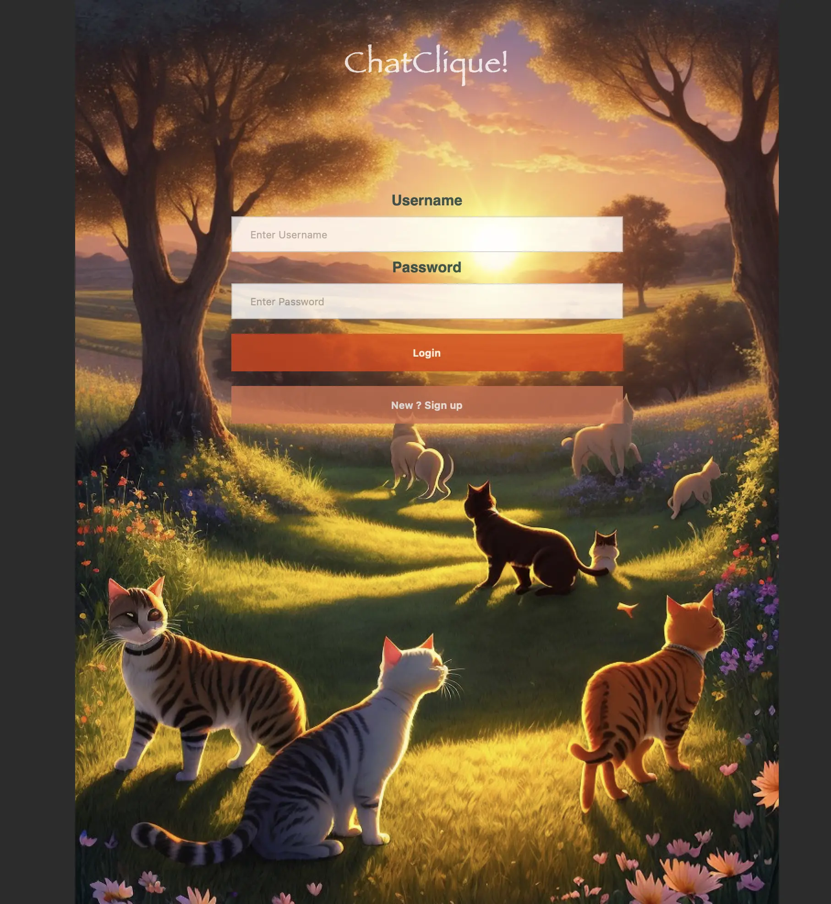
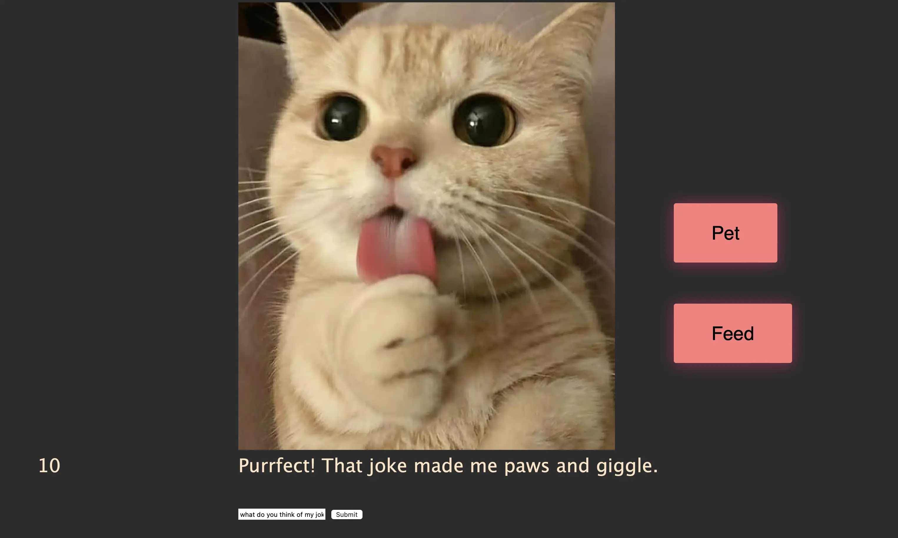

**Tout dans ce POK a été réalisé en HTML, JavaScript, CSS, Python, à la main.**

## Point Sprint 1

### Ce que je voulais faire 

Je n'avais pas bien compris qu'il fallait découper les objectifs du POK en deux sprints, donc je n'avais pas en tête un objectif pour le sprint 1. Je savais en tout cas que j'allais démarrer par :

- mettre en place une API Flask
- mettre en place une page de login
- commencer le front pour la main page du jeu

### Ce que j'ai fait 

La page de login du site est prête et fonctionelle. Les appels sont fait à une API faite avec Flask sur Python. J'avais dans l'idée d'intégrer un système de chat avec son animal (intégrer l'API ChatGPT). L'intégration de l'API à l'air simple mais je ne me rends pas compte du temps de mise en place des prompts. 

Donc pour l'instant on peut **créer un compte et se connecter**.

En tout cas la partie graphique ne va pas m'intéresser sur ce POK. J'ai généré des images sur des sites de génération gratuite. La partie sécurité non-plus, pour l'instant je stocke les données utilisateurs en clair.

Je pense implémenter quelques actions simples (cliquer sur un bouton pour nourrir/jouer). Stocker les données utilisateurs dans une petite base de données.

Puis ensuite implémenter le chatbot, du mieux que je peux.

Je n'ai pas passé 10h sur ce premier sprint, et je n'ai donc pas eu le temps d'avancer sur la main page.



## Sprint 2

### Main page

Les prochains objectifs étaient donc de construire la main page. J'ai commencé par établir un lien de redirection, puis juste mettre une image d'un chat. 

### Fonction de discussion

J'ai essayé de créer un appel à l'API de ChatGPT mais j'ai mis un peu de temps car j'ai l'impression que leur documentation n'est pas à jour. J'ai dû débugger pendant un moment avant de comprendre comment le faire marcher.

Maintenant que la première étape est réussie, on veut que la page main puisse appeler à mon API Flask, qui elle va appeler l'API ChatGPT. Et le résultat sera retourné et montré en direct sur la page du jeu. Pour cela, on va créer un champ d'input avec un bouton submit pour que l'utilisateur puisse entrer son message, avec un code javascript pour appeler mon API ensuite.

Voilà à quoi ressemble le **prompt** dans mon API Flask:

```
@app.route("/gpt-response", methods=['GET'])
def gptresponse():
    prompt = request.args.get('text')
    user = request.args.get('user')
    mood = mydatabase["cat_status"][mydatabase["user"].index(user)]
    if mood<3:
        mood='very angry'
    elif mood<6:
        mood="bored"
    elif mood<8:
        mood="satisfied"
    else:
        mood="very happy and playful"

    data = {
        "model": "gpt-3.5-turbo",
        "messages": [
            {
                "role": "system",
                "content": "we roleplay. you talk like a cat in short sentences. you are here to express your cat needs. right now you are "+mood
            },
            {
                "role": "user",
                "content": prompt
            }
            ],
        "max_tokens": 200,
        "n": 1,
        "stop": None,
        "temperature": 1
    }
    response = requests.post(url, headers=headers, data=json.dumps(data))
    response = response.json()
    print(response)
    return response['choices'][0]['message']
```
La température, c'est le degré de créativité autorisé. Entre 0 et 1, ici je l'ai mis à 1 pour avoir des réponses originales !
Un nombre max de token (longueur de réponse), pour éviter qu'il nous écrive un roman et pour pas brûler tous mes crédits d'un coup.

Pour l'instant, je ne créé pas de "mémoire" au chat, c'est-à-dire qu'après vous avoir répondu, si vous renvoyez un message, il ne saura pas de quoi vous avez parlé avant.

J'ai ajouté un effet de display lettre par lettre, comme on peut retrouver dans l'API ChatGPT. Sauf que j'ai triché, je l'ai fait avec un random timeout() en JavaScript. Je voulais le faire en live avec l'option stream=True qu'on peut ajouter au prompt de ChatGPT pour récupérer les infos de génération en direct, mais après quelques essais infructueux, parce que les exemples de la documentation ne marchaient pas pour moi, j'ai décidé de le faire à la main.

### Fonction nourrir et caresser

J'ai ajouté deux boutons pour nourrir et caresser le chat. Les boutons font plusieurs choses quand on les clique (déjà ils ont une animation en css javascript vraiment stylée, que j'ai allègrement emprunté à <a href="https://webdeasy.de/en/top-css-buttons-en/?utm_content=cmp-true">Nour Saud</a>). 

Ils font aussi apparaître un gif sur le chat, représentant l'action. Ils envoient aussi des données à l'API qui met à jour la base de données.

L'API met à jour la base de données avec le nombre de fois que l'utilisateur a effectué les actions, l'humeur du chat, et une monnaie. J'aurais voulu ajouter des accesoires à débloquer avec la monnaie, les gifs sont d'ailleurs tous prêt, mais je n'ai pas eu le temps de l'implémenter.

On reconnait l'utilisateur grâce à un cookie créé ou modifié sur la page de connexion.




On voit ici que l'humeur est affichée à gauche, sur 10 (donc là il est très content). Je lui ai raconté une blague et il m'a répondu qu'il avait rit. On voit aussi les boutons caresser et nourrir. On est pas sur un design de niveau GAFA encore. Mais l'utilisation est simple en tout cas.

### La structure

On a donc 3 fichiers, l'app.py, le template login.html et le template main.html (en plus des différentes images et font utilisées, toutes regroupées dans un fichier image).


Je n'ai pas fait de template css par mauvaise habitude de toujours tout mettre au même endroit, après avoir eu des problèmes dans certains serveurs...

## Le code

Tout le monde l'attend, et il est là. Disclaimer, les développeurs parmi vous vont faire des crises cardiaques à la vue de mon code. Mais a priori tout fonctionne correctement.


```python
import flask
from flask import Flask, jsonify, after_this_request, abort, make_response
from flask import render_template, request, send_file
import re
import os
import sys
import pickle
from sqlitedict import SqliteDict
from flask_cors import CORS
from flask import Response
import traceback 
import openai
import requests
import json

app = Flask(__name__)
CORS(app)

openai.api_key =                                          #ALLEZ CHERCHER VOTRE PROPRE CLE API DANS LES PARAMETRES DE VOTRE COMPTE OPEN AI!!
url = "https://api.openai.com/v1/chat/completions"
headers = {
    "Authorization": "Bearer " + openai.api_key,
    "Content-Type": "application/json"
}

mydatabase = SqliteDict("mydatabase.sqlite")

@app.route("/")
def init():
    return render_template("login.html")

@app.route("/getimage/<name>")
def getimage(name):
    return send_file("images/"+name)

@app.route("/login/<username>-<password>")
def login(username, password):
    value =(username[1:],password[1:])
    print(value)
    success = False
    user_info=mydatabase.get(username[1:])
    if user_info!=None:
        if password[1:]==user_info["password"]:
            success=True
    response = {"success" : success}
    print(response)
    return jsonify(response), {'Content-Type': 'application/json'}

@app.route("/signup/<username>-<password>")
def signup(username, password):
    value =(username[1:],password[1:])
    print(value)
    success = False
    if mydatabase.get(username[1:])==None:
        success = True
        mydatabase[username[1:]]={"password":password[1:], "cat_status":0, "money":0, "feed":0, "pet":0}
        mydatabase.commit()
    response = {"success" : success}
    print(response)
    return jsonify(response), {'Content-Type': 'application/json'}

@app.route("/gpt-response", methods=['GET'])
def gptresponse():
    prompt = request.args.get('text')
    user = request.args.get('user')
    mood = mydatabase[user]["cat_status"]
    if mood<3:
        mood='very angry'
    elif mood<6:
        mood="bored"
    elif mood<8:
        mood="satisfied"
    else:
        mood="very happy and playful"

    data = {
        "model": "gpt-3.5-turbo",
        "messages": [
            {
                "role": "system",
                "content": "we roleplay. you talk like a cat in short sentences. you are here to express your cat needs. right now you are "+mood
            },
            {
                "role": "user",
                "content": prompt
            }
            ],
        "max_tokens": 200,
        "n": 1,
        "stop": None,
        "temperature": 1
    }
    response = requests.post(url, headers=headers, data=json.dumps(data))
    response = response.json()
    print(response)
    return response['choices'][0]['message']

@app.route("/button-<action>", methods=['POST'])
def do(action):
    data = request.get_json()
    user = data.get('username')
    info=mydatabase[user]
    temp=info["cat_status"]
    if action=="feed" and temp!=0:
        mydatabase[user]={"password":info["password"], "cat_status":info["cat_status"]-1, "money":info["money"]+1, "feed":info["feed"]+1, "pet":info["pet"]}
        mydatabase.commit()
    elif action=="pet" and temp!=10:
        mydatabase[user]={"password":info["password"], "cat_status":info["cat_status"]+1, "money":info["money"]+1, "feed":info["feed"], "pet":info["pet"]+1}
        mydatabase.commit()
    return ('', 204)

@app.route("/getinfo-<column>", methods=['GET'])
def getinfo(column):
    if column=="password":
        return ('', 404)
    user = request.args.get('user')
    return jsonify(info=mydatabase[user][column])

@app.route("/session/<name>")
def session(name):
    return render_template("main.html")


if __name__ == '__main__':
    app.run(port=49130)
```



```html
<!DOCTYPE html>
<html>
<head>
    <style>
    body{
        background-color: #2c2c2c;
        background-repeat: no-repeat;
        background-attachment: fixed;
        background-image: URL("getimage/test.webp");
        background-position: center top; 
        font-family: "Open Sans", sans-serif;
        color: #00353F;
        opacity: 0.8;
        margin-top: 3%;
        margin-left: 25%;
        margin-right: 25%;
    }

    input[type=text], input[type=password] {
    width: 100%;
    padding: 12px 20px;
    margin: 8px 0;
    display: inline-block;
    border: 1px solid #ccc;
    box-sizing: border-box;
    }

    button {
    background-color: #D46F4D;
    color: white;
    padding: 14px 20px;
    margin: 8px 0;
    border: none;
    cursor: pointer;
    width: 100%;
    font-weight: bold;
    }
    button:hover {
    background-color: #E33A00;
    opacity: 1 !important;
    }

    .container {
    width: 50%;
    padding: 16px;
    margin: auto;
    vertical-align: middle;
    text-align: center;
    opacity: 1;
    }

    .vertical-center {
    margin: 0;
    top: 50%;
    left: 25%;
    -ms-transform: translateY(-50%);
    transform: translateY(-50%);
    }
    @font-face {
    font-family: fantasy;
    src: url("getimage/IMMORTAL.ttf");
    }
    
    h2 {
        position: center top;
        font-family: fantasy;
        color: white;
        text-align: center;
        padding-bottom: 200px;
        font-size:xx-large;
    }
    h3 {
        position: center bottom;
        font-family: fantasy;
        color: red;
        text-align: center;
        font-size:x-large;
        padding-top: 30px;
    }


    </style>

</head>
<body>
    <label for="title"><h2>ChatClique!</h2></label>
    <div class="container" display=inline-block>
        
        <div class="vertical-center">
            
        <label for="uname"><b>Username</b></label>
        <input type="text" id="username" placeholder="Enter Username" name="uname" required>
    
        <label for="psw"><b>Password</b></label>
        <input type="password" id="password" placeholder="Enter Password" name="psw" required>
    
        <button id="login">Login</button>
        
        </script>
        <button id="signup">New ? Sign up</button>

                
        </div>
      </div>

    <div id="hiddenText" style="display: none;">
            <h3>No such credentials found in our server</h3>
        </div>
    <div id="hiddenText2" style="display: none;">
        <h3>Account created successfully. You can now login, meow !</h3>
    </div>
    <div id="hiddenText3" style="display: none;">
        <h3>Username taken. Please choose another one !</h3>
    </div>

                
        </div>
      </div>

    <script type="text/javascript">
        document.getElementById("signup").addEventListener("click", function() {
            hiddenText.style.display = "none";
            hiddenText2.style.display = "none";
            hiddenText3.style.display = "none";
            const inputValueU = document.getElementById("username").value.toString();
            const inputValueP = document.getElementById("password").value.toString();

            fetch("http://localhost:49130/signup/U"+inputValueU+"-P"+inputValueP)
                .then(response => {
                    if (!response.ok) {
                        throw new Error('Network response was not ok');
                    }
                    return response.json(); 
                })
                .then(data => {

                    const apiResponse = data.success; 
                    const hiddenText2 = document.getElementById("hiddenText2");
                    if (apiResponse) {
                        hiddenText2.style.display = "block";
                    } else {
                        hiddenText3.style.display = "block";
                    }
                })
            
        });

        document.getElementById("login").addEventListener("click", function() {
            hiddenText.style.display = "none";
            hiddenText2.style.display = "none";
            hiddenText3.style.display = "none";
            const inputValueU = document.getElementById("username").value.toString();
            const inputValueP = document.getElementById("password").value.toString();
            

            fetch("http://localhost:49130/login/U"+inputValueU+"-P"+inputValueP)
                .then(response => {
                    if (!response.ok) {
                        throw new Error('Network response was not ok');
                    }
                    return response.json(); 
                })
                .then(data => {

                    const apiResponse = data.success; 
                    const hiddenText = document.getElementById("hiddenText");
                    if (apiResponse) {
                        document.cookie = "username=" + inputValueU;
                        window.location.href = "http://localhost:49130/session/"+apiResponse;
                    } else {
                        hiddenText.style.display = "block";
                    }
                })
            
        });
    </script>
</body>
</html>
```




```html
<!DOCTYPE html>
<html lang="fr">
<head>
    <meta charset="UTF-8">
    <meta name="viewport" content="width=device-width, initial-scale=1.0">
    <script src="https://code.jquery.com/jquery-3.6.0.min.js"></script>

    <style>
        @font-face {
        font-family: lucidaconsole;
        src: url("getimage/LUCON.TTF");
        }

        body{
        background-color: #2c2c2c;
        color:bisque;
        font-family:'Lucida Sans', 'Lucida Sans Regular', 'Lucida Grande', 'Lucida Sans Unicode', Geneva, Verdana, sans-serif;
        font-size: 2em;
        margin-left: 30%;
        margin-right: 25%;
        }
        
        #pet{
            
        font-family: 'Helvetica', 'Arial', sans-serif;
        display: inline-block;
        font-size: 1em !important;
        padding: 1em 2em;
        margin-left: 100px;
        margin-top: 20%;
        -webkit-appearance: none;
        appearance: none;
        background-color: #FF7D7A;
        color: black;
        border-radius: 4px;
        border: none;
        cursor: pointer;
        position: absolute;
        transition: transform ease-in 0.1s, box-shadow ease-in 0.25s;
        box-shadow: 0 2px 25px rgba(255, 0, 130, 0.5);
        
        &:focus {
            outline: 0;
        }
        
        &:before, &:after{
            position: absolute;
            content: '';
            display: block;
            width: 140%;
            height: 100%;
            left: -20%;
            z-index: -1000;
            transition: all ease-in-out 0.5s;
            background-repeat: no-repeat;
        }
        
        &:before{
            display: none;
            top: -75%;
            background-image:  
            radial-gradient(circle,#FF7D7A 20%, transparent 20%),
            radial-gradient(circle,  transparent 20%, #FF7D7A 20%, transparent 30%),
            radial-gradient(circle, #FF7D7A 20%, transparent 20%), 
            radial-gradient(circle,#FF7D7A 20%, transparent 20%),
            radial-gradient(circle,  transparent 10%, #FF7D7A 15%, transparent 20%),
            radial-gradient(circle, #FF7D7A 20%, transparent 20%),
            radial-gradient(circle, #FF7D7A 20%, transparent 20%),
            radial-gradient(circle, #FF7D7A 20%, transparent 20%),
            radial-gradient(circle, #FF7D7A 20%, transparent 20%);
        background-size: 10% 10%, 20% 20%, 15% 15%, 20% 20%, 18% 18%, 10% 10%, 15% 15%, 10% 10%, 18% 18%;
        background-position: 0% 80%, -5% 20%, 10% 40%, 20% 0%, 30% 30%, 22% 50%, 50% 50%, 65% 20%, 85% 30%;
        }
        
        &:after{
            display: none;
            bottom: -75%;
            background-image:  
            radial-gradient(circle, #FF7D7A 20%, transparent 20%), 
            radial-gradient(circle, #FF7D7A 20%, transparent 20%),
            radial-gradient(circle,  transparent 10%, #FF7D7A 15%, transparent 20%),
            radial-gradient(circle, #FF7D7A 20%, transparent 20%),
            radial-gradient(circle, #FF7D7A 20%, transparent 20%),
            radial-gradient(circle, #FF7D7A 20%, transparent 20%),
            radial-gradient(circle, #FF7D7A 20%, transparent 20%);
            background-size: 15% 15%, 20% 20%, 18% 18%, 20% 20%, 15% 15%, 10% 10%, 20% 20%;
            background-position: 5% 90%, 10% 90%, 10% 90%, 15% 90%, 25% 90%, 25% 90%, 40% 90%, 55% 90%, 70% 90%;
        }
        
        &:active{
            transform: scale(0.9);
            background-color: darken(#FF7D7A, 5%);
            box-shadow: 0 2px 25px rgba(255, 0, 130, 0.2);
        }
        
        &.animate{
            &:before{
            display: block;
            animation: topBubbles ease-in-out 0.75s forwards;
            }
            &:after{
            display: block;
            animation: bottomBubbles ease-in-out 0.75s forwards;
            }
        }
        }

        @keyframes topBubbles {
        0%{
            background-position: 5% 90%, 10% 90%, 10% 90%, 15% 90%, 25% 90%, 25% 90%, 40% 90%, 55% 90%, 70% 90%;
        }
            50% {
            background-position: 0% 80%, 0% 20%, 10% 40%, 20% 0%, 30% 30%, 22% 50%, 50% 50%, 65% 20%, 90% 30%;}
        100% {
            background-position: 0% 70%, 0% 10%, 10% 30%, 20% -10%, 30% 20%, 22% 40%, 50% 40%, 65% 10%, 90% 20%;
        background-size: 0% 0%, 0% 0%,  0% 0%,  0% 0%,  0% 0%,  0% 0%;
        }
        }

        @keyframes bottomBubbles {
        0%{
            background-position: 10% -10%, 30% 10%, 55% -10%, 70% -10%, 85% -10%, 70% -10%, 70% 0%;
        }
        50% {
            background-position: 0% 80%, 20% 80%, 45% 60%, 60% 100%, 75% 70%, 95% 60%, 105% 0%;}
        100% {
            background-position: 0% 90%, 20% 90%, 45% 70%, 60% 110%, 75% 80%, 95% 70%, 110% 10%;
        background-size: 0% 0%, 0% 0%,  0% 0%,  0% 0%,  0% 0%,  0% 0%;
        }
        }
    
    button[name=feed]{
        margin-top: 30% !important;
    }

    #leftsideinfo{
        margin-left: -20% !important;
        position: absolute !important;
    }
        
    </style>
    <script>
        function getCookie(name) {
            var cookies = document.cookie.split(';');
            for (var i = 0; i < cookies.length; i++) {
                var cookie = cookies[i].trim();
                if (cookie.indexOf(name + "=") === 0) {
                return cookie.substring(name.length + 1);
                }
            }
            return "";
            }
    
        var storedUsername = getCookie("username");
        
        </script>
    <title>ChatClique</title>
</head>
<body>
    
    <button id="pet" name="pet">Pet</button>
    <button id="pet" name="feed">Feed</button>
    <br>
    <div id="leftsideinfo">yes</div>
    <div id="result">Talk to me </div>
    <br>
    <input type="text" id="user_input" placeholder="Type something">
    <button id="submit_button">Submit</button>
    <script>
      var resultElement = $("#result");
      resultElement.text("Hello "+storedUsername);

      

      $(document).ready(function() {
        updateLeftSideInfo();
        $("#submit_button").click(function() {
          resultElement.text("...");
          var userInput = $("#user_input").val();
          $.ajax({
            type: "GET",
            url: "/gpt-response?text=" + userInput + "&user=" + storedUsername,
            success: function(response) {
              
              displayStreamingText(response.content);
            }
          });
        });
      });
      
      function displayStreamingText(text) {
        var resultElement = $("#result");
        $("#result").empty();
        var index = 0;
    
        function addNextCharacter() {
            if (index < text.length) {
            var randomDelay = Math.random() * 100; 
            setTimeout(function() {
                resultElement.append(text.charAt(index));
                index++;
                addNextCharacter();
            }, randomDelay);
            }
        }
        addNextCharacter();
      }

      var animateButton = function(e) {

        e.preventDefault();
        e.target.classList.remove('animate'); 

        var name = e.target.getAttribute('name');

        fetch("/button-"+name, {
          method: 'POST',
          body: JSON.stringify({ username: storedUsername }),
          headers: {
            'Content-Type': 'application/json'
          }
        });
        updateLeftSideInfo();

        if (name === "pet") {
            replaceImage("/getimage/bigpet.gif");
        } else if (name === "feed") {
            replaceImage("/getimage/feedthecat.gif");
        }

        e.target.classList.add('animate');
        setTimeout(function() {
            e.target.classList.remove('animate');
            replaceImage("/getimage/cutiecat.webp");
        }, 1200);
    };

    function updateLeftSideInfo() {
        fetch('/getinfo-cat_status?user='+storedUsername) 
            .then(response => response.json())
            .then(data => {
                var info = data.info;
                document.getElementById('leftsideinfo').textContent = info;
            })
            .catch(error => {
                console.error('API request error:', error);
            });
    }


    function replaceImage(imageSrc) {
        var imageElement = document.getElementById("catImage");
        if (imageElement) {
            imageElement.src = imageSrc;
        }
    }

    var petButton = document.getElementsByName("pet")[0]; 
    var feedButton = document.getElementsByName("feed")[0]; 

    feedButton.addEventListener('click', animateButton, false);
    petButton.addEventListener('click', animateButton, false);

    </script>
    
</body>
</html>
```



## Voyez par vous-même

J'ai essayé de lancer l'appli sur le serveur ovh de do-it mais cela n'a pas fonctionné. C'est peut-être dû à la gestion de Flask.

Voici donc une petite démo du fonctionnement. Le score d'humeur est à gauche. Le caresser le rend heureux, le nourrir le rend malheureux, pour des besoins de démonstration !! 

<iframe width="560" height="315" src="https://www.youtube.com/embed/X0wQnHDmt8I?si=o1d2ll1UJ6evGSzD" title="YouTube video player" frameborder="0" allow="accelerometer; autoplay; clipboard-write; encrypted-media; gyroscope; picture-in-picture; web-share" allowfullscreen></iframe>


## Par la suite

Ca m'a beaucoup amusée de développer ce petit projet. Il y a un nombre incalculable de choses à améliorer, que ce soit dans l'optimisation du chargement des gifs, de la base de donnée utilisateur, de l'augmentation de la mémoire et des caractéristiques du chat (ajouter une barre de faim), on pourrait enregistrer des dates de dernière connexion et faire monter la barre de faim au fil du temps... 

Ajouter des styles grâce à la monnaie (j'ai déjà une panoplie de gifs de ce même chat décliné avec des accesoires). C'est quelque chose que j'aurais voulu ajouter mais où j'ai clairement pas eu le temps.

Je pense continuer à l'améliorer dans mon temps libre, en espérant pouvoir mettre ça sur l'ovh plus tard.

## Sources et crédits

- <a href="https://webdeasy.de/en/top-css-buttons-en/?utm_content=cmp-true">le css des boutons</a>
- <a href="https://www.pawlicy.com/blog/cat-photos-for-monday/">la photo du chat</a>
- <a href="https://platform.openai.com/docs/api-reference">documentation openAI</a>

J'ai créé moi-même les gifs.