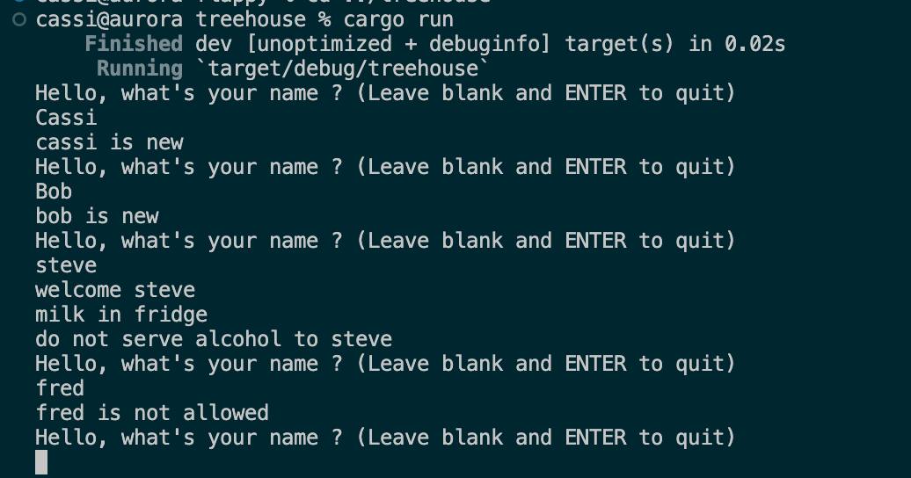
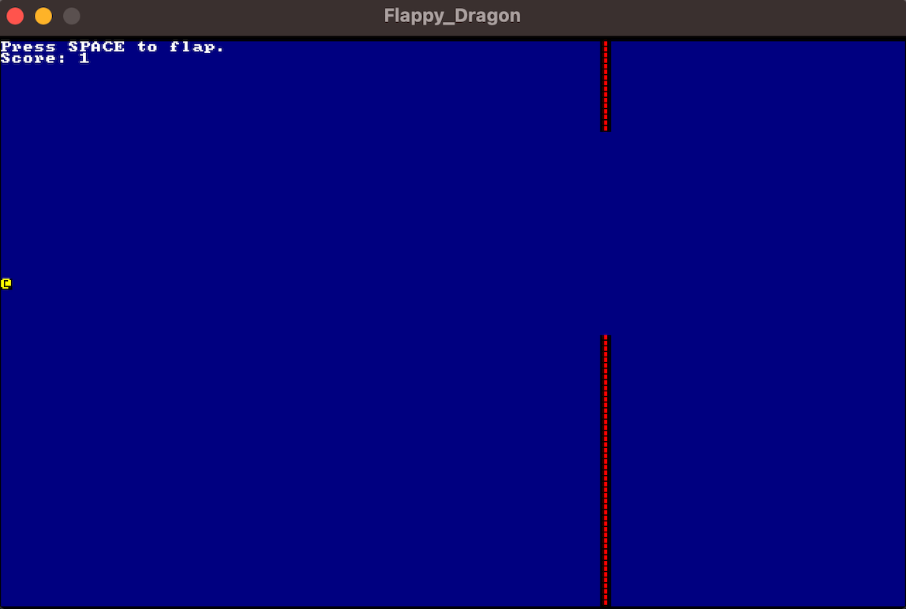



* savoir comment marche un pointeur
* niveau intermédiaire de programmation



# Objectifs

Inspirée par les POK&MON d'Assane et de Victor, j'ai voulu en apprendre plus sur Rust et réaliser la programmation d'un jeu-vidéo comme proposé par le livre Hands-on Rust, prêté par M. Brucker.

Dans un premier temps, j'aimerais me familiariser avec les concepts du langage Rust, puis ensuite enchaîner avec la création du dungeon crawler proposé par le livre:

- Installation, familiarisation avec la syntaxe, défrichage des concepts **3h**
- Comprendre les concepts de possession, de références et d'emprunt **4h**
- Introduction à la programmation de jeux vidéo **4h**
- Développement du dungeon crawler **9h**


## Rust : Un Aperçu


### Bref Historique

Rust a été créé par Mozilla Research, avec le travail initial de Graydon Hoare en 2006. Il a été rendu open source en 2010, et sa première version stable a été publiée en 2015. Rust a gagné en popularité grâce à sa combinaison unique de performances élevées et de garanties de sécurité, ce qui le rend particulièrement attrayant pour le développement de systèmes.

Rust est un langage de programmation moderne qui offre des performances élevées, des garanties de sécurité et une gestion avancée de la mémoire grâce à des concepts tels que la possession, les emprunts et les durées de vie. C'est un choix puissant pour les applications nécessitant à la fois rapidité et fiabilité.

### Syntaxe de Rust

La syntaxe de Rust est conçue pour être expressive tout en étant précise. Faisons un rapide tour.

#### Déclarations de variables

Par défaut, les variables sont immuables, et il faut ajouter le mot clé **mut** pour pouvoir les changer plus tard.

```rust
let x = 5;      // variable immuable
let mut y = 10;  // variable mutable
```

#### Fonctions

Comme dans de nombreux langages de programmation, on déclare le type de variable retourné par les fonctions au moment de la déclaration. On peut également utiliser des fonctions en cascade sur une variable avec la syntaxe suivante :

```rust
fn add(a: i32, b: i32) -> i32 {
    return a + b;
}

variable
  .fonction1()
  .fonction2()
  .fonction3()
  .....
```

#### Structures de contrôle

Les structures logiques sont semblables à la plupart des autres langages de programmation.

```rust
if condition {
  ...
} else {
 ...
}
for item in iterable {
    ...
}
```

### Concepts Clés

J'ai lu [la documentation Rust officielle](https://doc.rust-lang.org/stable/book/title-page.html), en partie seulement, pour essayer de comprendre les concepts liés au langage. Ces concepts ont déjà été évoqués dans les Pok&Mon d'Assane et de Victor, je ne vais donc pas m'étendre, dessus mais en voici un bref résumé.


#### Possession, Emprunt et Références

- **Possession (Ownership) :** Rust suit le principe de possession unique. Chaque valeur a un unique "propriétaire". La propriété peut être transférée, mais une seule entité peut posséder la valeur à la fois.

- **Emprunt (Borrowing) :** Rust permet d'emprunter temporairement la valeur plutôt que de transférer la propriété. Cela permet à plusieurs parties du code d'accéder à une valeur sans en être propriétaire. On peut emprunter la valeur d'une variable x en appellant &x.

- **Références :**  Et si j'ai bien tout compris, on parle de référence quand une variable a emprunté la valeur d'une autre.

#### Crates, Ownership et Lifetime

- **Crates :** Les crates sont l'équivalent des bibliothèques ou modules en Rust. Les développeurs peuvent partager et réutiliser leur code en l'emballant dans des crates.

- **Ownership et Lifetime :** Rust utilise le système de possession et de durée de vie pour garantir l'absence de violations de la mémoire. Chaque référence a une durée de vie spécifiée, et le compilateur Rust s'assure que les références restent valides pendant toute leur durée de vie. Plus concrètement, une variable vit dans le scope où elle a été déclarée.

### Mes premiers petits projets

Etant impatiente de découvrir le livre Hands-on Rust, j'ai vite sauté sur les premiers chapitres, qui sont en fait des petits exercices de démarrage. On y découvre des outils tels que **Clippy**, une sorte d'IA code-reviewer qui aime faire des suggestions pour rendre le code plus intelligent. On découvre aussi les commandes **cargo new** pour créer un projet, **cargo run** pour le lancer, **cargo fmt** pour bien aligner les tabulations...

#### TreeHouse

Dans le premier exercice TreeHouse, on joue au vigil avec l'invite de commande, pour savoir si on a le droit de rentrer ou non dans le TreeHouse, et si on a un traitement spécial. On y apprend donc les assignations et modification de variables.



### La programmation de jeu avec Rust

On arrive donc à la partie ludique, celle où on parle de programmer notre premier jeu : un **Flappy Dragon**

On y implémente des structures, l'équivalent des déclarations de classe, ainsi que des implémentations liées aux structures, comme le constructeur et toutes les autres fonctions qu'on veut lier à nos structures.

On y découvre aussi le concept de "contexte", en gros les informations liées au jeu transmises sous forme graphique.



## Fin du Sprint 1

La fin du sprint 1 a été un peu mouvementée pour moi, donc je ne sais pas dire exactement où j'en étais.

Mais après avoir fini Flappy Dragon, voici le résumé des heures passées : 


- Installation, familiarisation avec la syntaxe, défrichage des concepts **3h** REALISE comme prévu, la réalisation des petits exercices m'a emmenée à peu près vers 3 heures.

- Comprendre les concepts de possession, de références et d'emprunt **4h**  X NON REALISE. 

        J'ai lu la documentation dans le cadre de la première partie, et même si j'avais des notions à ce moment, c'est tout au long du POK que j'ai commencé à mieux maîtriser les concepts. Cet objectif n'était pas assez concret du tout. Je pense tout de même que si on compte le temps de débogage et de lectures liés à l'apprentissage des concepts, l'estimation de 4h n'était pas abberante.

- Introduction à la programmation de jeux vidéo : Réaliser le Flappy Dragon **3h** REALISE, c'était plus rapide que prévu


### Nouveaux objectifs Sprint 2

Pour le temps qui reste, c'est à dire à peu près 10 heures après le flappy dragon, je veux réaliser le dungeon crawler. Plus précisément, mon objectif sera d'**avoir un MVP** donc d'arriver à avoir un jeu jouable, avec un écran de victoire ou de défaite, ce qui correspond au Chapitre 10 du livre, soit un peu plus des 2 tiers. Il ne me semble pas réalisable en 10h de terminer toutes les améliorations proposées, à mon niveau.

# Sprint 2

L'entièreté du sprint 2 a donc été consacré à la programmation du dungeon crawler du livre Hands-on Rust.

## Découpage du projet

La première nouveauté par rapport aux premiers exercices et exemples, c'est que le projet aura besoin de plus (beaucoup plus) qu'un seul fichier main.

### Initialisation et génération pseudo-random de la map

On commence par réaliser un map-builder, qui génère des rectangles adjacents, qu'on relie par des couloirs. Le tout sera affiché en caractères du type "#" pour les murs, "," pour le sol.

 On ajoute ensuite le déplacement du joueur sur les endroits valide de la carte (donc le sol). Le joueur sera représenté par "@".

 J'ai oublié de sauvegarder une image de cette étape, mais pour le coup on peut pas faire plus rétro qu'afficher une grille de caractères comme ça.

 ### Style et déplacement de caméra

 On importe ensuite une image pour donner du style à nos caractères. A chaque caractère est associé un petit sprite, par exemple un sprite de Chevalier pour notre héros qui en avait marre de ressembler à un @ qui se balade sur des , .

 ### Monstres et arrivée des Components

 - Rappel à Unity

 ### Collisions et déplacements randomisés

 ### Turn by Turn et système d'attaque

 ### HUD et régéneration des points de vie

 ### Condition de fin, Game Over ou Victory


 ## Fin du Sprint 2

 Objectif accompli :thumbs_up:

## Sources

* [Mon repo github avec les exercices, le flappy dragon et le dungeon crawler]()
* [La documentation Rust officielle](https://doc.rust-lang.org/stable/book/title-page.html)

## Horodateur

01/12 **|** 6h
23/12 **|** 7h
15/01 **|** 7h
