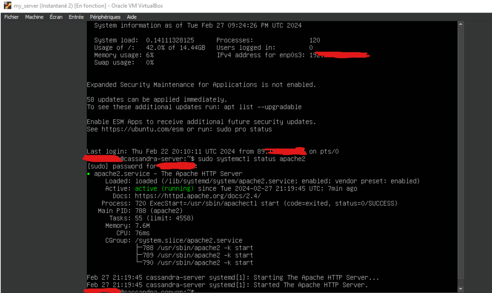

## Introduction 

Pour voir la naissance d'une application de A à Z, j'ai envie d'en savoir plus sur la mise en place d'un serveur en passant directement par la pratique. A la fin, j'aimerais pouvoir mettre en ligne mon site (site générique), et qu'une base de données soit servie aussi. Je pense quand même que ça ne sera pas aussi simple qu'en théorie, et j'espère ne pas me faire attaquer. Je pensais mettre ça en place sur une VM pour plus de sécurité perso. Le serveur n'a évidemment aucune vocation à persister.

## Backlog prévu

### Sprint 1

- [ ] Recherche et familiarisation (3 heures) - Niveau de difficulté : 2
  - Recherche sur les bonnes pratiques de mise en place d'un serveur web.
  - Familiarisation avec les concepts de sécurité, de configurations réseau et d'administration système.

- [ ] Installation et configuration du serveur web (2 heures) - Niveau de difficulté : 2
  - Choix et installation du serveur web (Apache, Nginx, etc.).
  - Configuration de base du serveur web pour répondre aux besoins du site.

- [ ] Configuration du pare-feu et des règles de sécurité (4 heures) - Niveau de difficulté : 8
  - Configuration du pare-feu pour limiter l'accès au serveur aux adresses IP autorisées.
  - Mise en place de règles de sécurité pour protéger le serveur contre les attaques.

### Sprint 2

- [ ] Configuration d'une base de données (2 heures) - Niveau de difficulté : 3
  - Installation et configuration d'une données (MySQL).
  - Configuration des autorisations d'accès à la base de données.

- [ ] Déploiement et configuration du site web (4 heures) - Niveau de difficulté : 3
  - Transfert des fichiers du site web sur le serveur.
  - Configuration du serveur web pour servir correctement le site.
  - Test du fonctionnement du site sur le serveur local.

- [ ] Tests et ajustements finaux (5 heures) - Niveau de difficulté : 5
  - Tests de fonctionnalité pour s'assurer que le site fonctionne comme prévu.
  - Ajustements éventuels de la configuration du serveur en fonction des besoins du site.
  - Vérification de la sécurité et des performances du serveur.

## Fin du Sprint 1

- [X] Recherche et familiarisation (temps réél : 3h)
  - Recherche sur les bonnes pratiques de mise en place d'un serveur web.
  - Familiarisation avec les concepts de sécurité, de configurations réseau et d'administration système.

- [X] Installation et configuration du serveur web (temps réél : 2h)
  - Choix et installation du serveur web (Apache, Nginx, etc.).
  - Configuration de base du serveur web pour répondre aux besoins du site.

- [X] Configuration du pare-feu et des règles de sécurité (temps réel : 2 heures) - Niveau de difficulté : 8
  - Configuration du pare-feu pour limiter l'accès au serveur aux adresses IP autorisées.
  - Mise en place de règles de sécurité pour protéger le serveur contre les attaques.

- [X] Déploiement et configuration du site web (temps réel : 2 heures) - Niveau de difficulté : 3
  - Transfert des fichiers du site web sur le serveur. **NON FAIT**
  - Configuration du serveur web pour servir correctement le site.
  - Test du fonctionnement du site sur le serveur local.

### Review

Ce n'est pas évident d'estimer précisément la durée de chaque tâche car elles se sont entremêlées. Finalement le setup du serveur basique n'a pas pris autant de temps que ce que j'avais prévu, j'ai donc avancé un peu sur les tâches qui étaient initialement prévues pour le Sprint 2. La majorité du temps passé sur ce Sprint 1 a consisté en réparer les boulettes que j'ai fait en manipulant les adresses réseaux. Mon routeur et mon ordinateur n'étaient pas très contents. Je ne pense pas avoir été capable de le faire aussi "vite" snas avoir assisté au cours Réseaux, qui m'a permis de comprendre les grandes lignes de l'architecture réseau et de la communication avec l'extérieur.

A la fin du sprint : je pouvais me connecter en SSH sur ma VM depuis un réseau extérieur, et je pouvais voir la page d'accueil par défaut de Apache sur mon IP depuis un réseau extérieur aussi. Je suis sur Internet Maman !

Le serveur ne tourne pas en permanence et j'ai encore peur de ne pas avoir configuré assez bien le pare-feu et mon routeur, donc je ne divulguerai pas mon adresse pour l'instant.

### Technique

J'ai utilisé une VM Ubuntu-server, installé Apache, définis une IP pour ma VM, changé l'adresse IP de mon routeur, cassé mon routeur, changé l'adresse IP de mon ordi et redémarrer mon routeur pour réparer tout ça, et puis finalement ils n'étaient pas dans le même sous-réseau donc la page ne s'affichait pas sur Internet alors j'ai changé la plage d'IP pour qu'ils puissent communiquer plus facilement, mais en fait le problème n'avait rien à voir. Finalementil fallait reconfigurer la VM.

Tout ça pour dire que j'ai bidouillé dans tous les sens, gaffé beaucoup, appris et compris beaucoup par la même occasion.

Photo montage de mon aventure :

L'envers du décor avec la VM :

Le pont qui dessert ma VM :

J'accède au site depuis mon téléphone en 5G :

### Horodateur

**18/02 :** 3h, lecture, compréhension, installation de la VM
**22/02 :** 7h, installation Apache et autres modules, bidouille routeur