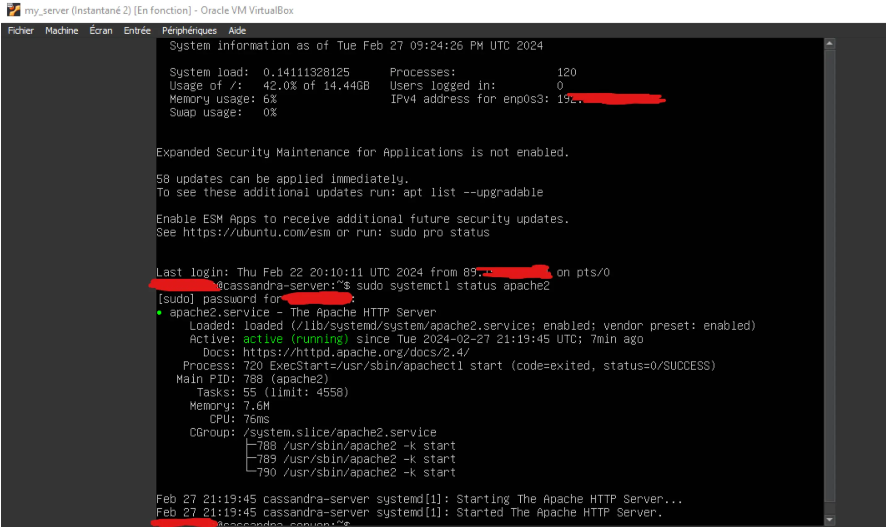
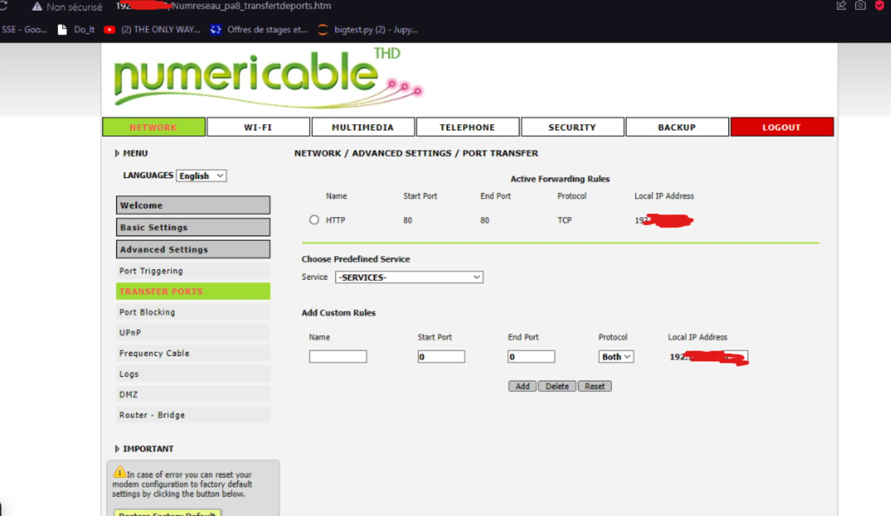
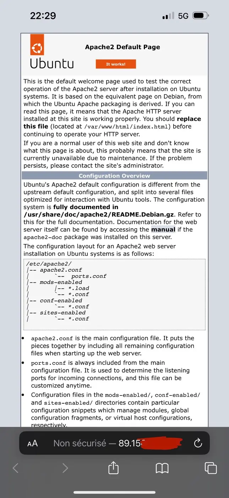
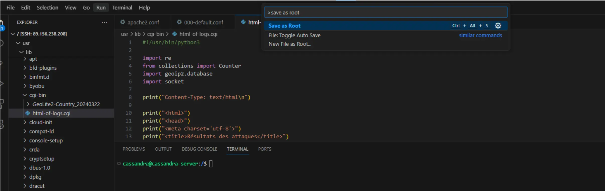
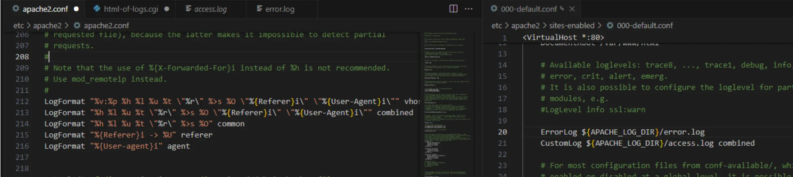
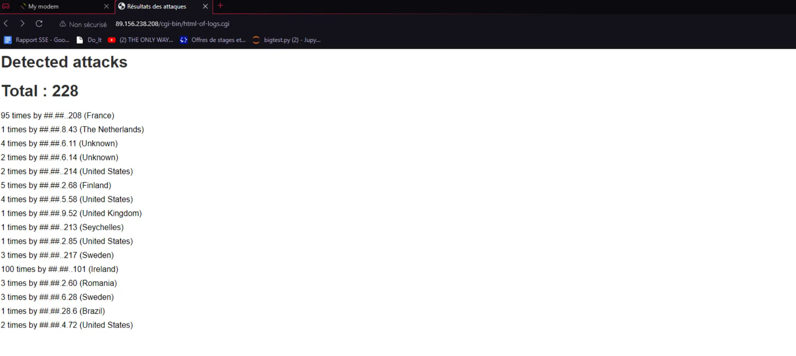
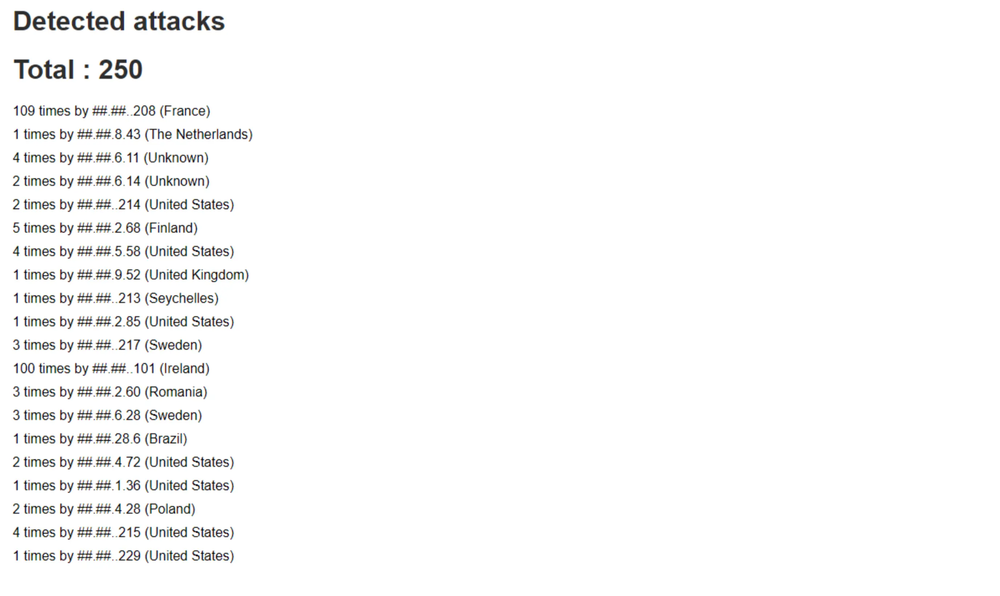

## Introduction 

Pour voir la naissance d'une application de A à Z, j'ai envie d'en savoir plus sur la mise en place d'un serveur en passant directement par la pratique. A la fin, j'aimerais pouvoir mettre en ligne mon site (site générique), et qu'une base de données soit servie aussi. Je pense quand même que ça ne sera pas aussi simple qu'en théorie, et j'espère ne pas me faire attaquer. Je pensais mettre ça en place sur une VM pour plus de sécurité perso. Le serveur n'a évidemment aucune vocation à persister.

## Backlog prévu

### Sprint 1

- [ ] Recherche et familiarisation (3 heures) - Niveau de difficulté : 2
  - Recherche sur les bonnes pratiques de mise en place d'un serveur web.
  - Familiarisation avec les concepts de sécurité, de configurations réseau et d'administration système.

- [ ] Installation et configuration du serveur web (2 heures) - Niveau de difficulté : 2
  - Choix et installation du serveur web (Apache, Nginx, etc.).
  - Configuration de base du serveur web pour répondre aux besoins du site.

- [ ] Configuration du pare-feu et des règles de sécurité (4 heures) - Niveau de difficulté : 8
  - Configuration du pare-feu pour limiter l'accès au serveur aux adresses IP autorisées.
  - Mise en place de règles de sécurité pour protéger le serveur contre les attaques.

### Sprint 2

- [ ] Configuration d'une base de données (2 heures) - Niveau de difficulté : 3
  - Installation et configuration d'une données (MySQL).
  - Configuration des autorisations d'accès à la base de données.

- [ ] Déploiement et configuration du site web (4 heures) - Niveau de difficulté : 3
  - Transfert des fichiers du site web sur le serveur.
  - Configuration du serveur web pour servir correctement le site.
  - Test du fonctionnement du site sur le serveur local.

- [ ] Tests et ajustements finaux (5 heures) - Niveau de difficulté : 5
  - Tests de fonctionnalité pour s'assurer que le site fonctionne comme prévu.
  - Ajustements éventuels de la configuration du serveur en fonction des besoins du site.
  - Vérification de la sécurité et des performances du serveur.

## Fin du Sprint 1

- [X] Recherche et familiarisation (temps réél : 3h)
  - Recherche sur les bonnes pratiques de mise en place d'un serveur web.
  - Familiarisation avec les concepts de sécurité, de configurations réseau et d'administration système.

- [X] Installation et configuration du serveur web (temps réél : 2h)
  - Choix et installation du serveur web (Apache, Nginx, etc.).
  - Configuration de base du serveur web pour répondre aux besoins du site.

- [X] Configuration du pare-feu et des règles de sécurité (temps réel : 2 heures) - Niveau de difficulté : 8
  - Configuration du pare-feu pour limiter l'accès au serveur aux adresses IP autorisées.
  - Mise en place de règles de sécurité pour protéger le serveur contre les attaques.

- [X] Déploiement et configuration du site web (temps réel : 2 heures) - Niveau de difficulté : 3
  - Transfert des fichiers du site web sur le serveur. **NON FAIT**
  - Configuration du serveur web pour servir correctement le site.
  - Test du fonctionnement du site sur le serveur local.

### Review

Ce n'est pas évident d'estimer précisément la durée de chaque tâche car elles se sont entremêlées. Finalement le setup du serveur basique n'a pas pris autant de temps que ce que j'avais prévu, j'ai donc avancé un peu sur les tâches qui étaient initialement prévues pour le Sprint 2. La majorité du temps passé sur ce Sprint 1 a consisté en réparer les boulettes que j'ai fait en manipulant les adresses réseaux. Mon routeur et mon ordinateur n'étaient pas très contents. Je ne pense pas avoir été capable de le faire aussi "vite" snas avoir assisté au cours Réseaux, qui m'a permis de comprendre les grandes lignes de l'architecture réseau et de la communication avec l'extérieur.

A la fin du sprint : je pouvais me connecter en SSH sur ma VM depuis un réseau extérieur, et je pouvais voir la page d'accueil par défaut de Apache sur mon IP depuis un réseau extérieur aussi. Je suis sur Internet Maman !

Le serveur ne tourne pas en permanence et j'ai encore peur de ne pas avoir configuré assez bien le pare-feu et mon routeur, donc je ne divulguerai pas mon adresse pour l'instant.

### Technique

J'ai utilisé une VM Ubuntu-server, installé Apache, définis une IP pour ma VM, changé l'adresse IP de mon routeur, cassé mon routeur, changé l'adresse IP de mon ordi et redémarrer mon routeur pour réparer tout ça, et puis finalement ils n'étaient pas dans le même sous-réseau donc la page ne s'affichait pas sur Internet alors j'ai changé la plage d'IP pour qu'ils puissent communiquer plus facilement, mais en fait le problème n'avait rien à voir. Finalement, il fallait reconfigurer la VM.

Tout ça pour dire que j'ai bidouillé dans tous les sens, gaffé beaucoup, appris et compris beaucoup par la même occasion.

Photo montage de mon aventure :

L'envers du décor avec la VM :

Le pont qui dessert ma VM :

J'accède au site depuis mon téléphone en 5G :

## Sprint 2

A la fin du sprint 1, en réalisant que j'étais plus rapide que prévu sur les objectifs fixés au départ, je me suis dit qu'il pourrait être intéressant de mettre en place une sorte de sonde sur le serveur, qui analyserait les tentatives d'accès et afficherait des stats sur un site. Il me paraît aussi plus judicieux et instructif de faire cela que de simplement copier-coller un site déjà prêt.

Voici donc les objectifs du sprint 2 redéfinis.

### Nouveaux objectifs 

- [ ] Configuration d'une base de données et mise en place de la collecte des logs (3 heures) - Niveau de difficulté : 5
  - Installation et configuration d'une base de données.
  - Configuration des autorisations d'accès à la base de données.
  - Mise en place de la collecte des logs des accès au serveur.

- [ ] Création de la CGI pour afficher les logs avec localisation (3 heures) - Niveau de difficulté : 5
  - Apprentissage et mise en œuvre des CGI pour créer une page web dynamique.
  - Intégration de la base de données GeoLite pour la localisation des adresses IP.
  - Utilisation de GeoIP pour obtenir les informations de localisation.
  - Mise en forme des logs pour affichage sur la page web.

- [ ] Gestion avancée des autorisations et sécurité du serveur (4 heures) - Niveau de difficulté : 8
  - Apprentissage et mise en œuvre de la gestion avancée des autorisations (chmod).
  - Création de groupes spéciaux avec des accès restreints pour renforcer la sécurité du serveur.
  - Configuration et sécurisation des accès aux fichiers et répertoires nécessaires pour la CGI.
  - Test de sécurité pour s'assurer que seuls les utilisateurs autorisés peuvent accéder aux données sensibles.

Les nouveaux objectifs restent similaires à ceux précédemment définis, mais me permettront d'apprendre de manière plus poussée la récupération de logs, la gestion des permissions d'accès aux données, et puis finalement, de voir qui essaie de trouver des failles sur mon serveur (probablement beaucoup de robots).

### C'est parti

Pour pouvoir voir qui se connecte sur le site, il faut configurer la récupération des données dans Apache. Comme je ne suis pas encore une vraie admin système, et que j'en ai marre de tout coder sur un terminal avec Nano et sans souris, j'ai mis en place une connexion SSH-remote sur mon serveur pour pouvoir faire des manipulations sur mon serveur à partir : d'un IDE, et possiblement d'un autre ordinateur.

Je peux maintenant me connecter sur mon serveur à partir de n'importe quel ordinateur et avoir une vue d'ensemble des fichiers en quelques clics, sans avoir à "ls" dans tous les coins.

Mais un problème apparaît : Modifier et sauvegarder le fichier avec les commandes de l'IDE ne l'effectue pas en tant que 'sudo' (membre avec tous les droits). J'ai trouvé une extension VSCode qui permet de "Save as root", que j'ai lié à un shortcut au clavier. Pratique !

Cette étape n'était pas nécessaire et a ajouté une vulnérabilité à mon serveur en ouvrant un nouveau port pour la connexion SSH. Mais ce genre de pratique reste courante et réaliste. 

### Configurer les logs

Configurer les logs s'est fait en quelques lignes seulement dans les fichiers .conf d'Apache. Il fallait déterminer le format des informations qu'on récupère, ainsi que le fichier de sortie. Cette configuration a été rapide, mais la mise en place correcte des droits d'écriture et de lecture corrects pour les fichiers et dossiers de logs a été compliquée (pour moi en tout cas).

### Création de la CGI pour afficher les logs

Je me suis ensuite renseignée rapidement sur les CGIs puisque celà me semblait être une solution viable pour afficher des statistiques en direct à partir de mes documents .log. J'ai alors écrit un programme Python qui renvoie un html avec les IPs présents dans les logs. C'EST PAS TRES RGPD. Après 5 secondes de réflexion, j'ai réalisé que ça ne semblait pas très éthique. J'ai finalement masqué environ 75% des IPs pour pas qu'ils ne soient lisibles. 

### GeoLite 

J'ai ensuite trouvé une base de données gratuite appelée GeoLite qui permet d'associer une IP à un pays, une région ou une ville. J'ai choisi les pays, car je n'ai pas plus d'intérêt que ça à savoir exactement d'où les IPs proviennent. Après avoir importé et décompressé la base de données sur mon serveur, je l'ai inclue dans mon script Python. Et tada ! Ca ne marche pas du tout. 

### Le REGEX c'est pas marrant

Il se trouve que la récupération d'IP à partir de logs c'est pas évident. J'utilise une expression Regex, mais elle ne marchait pas correctement, et je me retrouvais avec des IPs au format non correct, et surtout je loupais pas mal d'IPs pour une raison inconnue (enfin si, je ne sais juste pas faire des regex propres). Donc j'ai bidouillé une expression jusqu'à ce que ça ait l'air de fonctionner... 

Et là ça marche ! C'est ce que j'aurais dit si j'avais eu des résultats à ce moment.

### Configuration des droits de lecture et d'écriture

Je ne m'étais pas encore bien occupée de la configuration de l'accès aux différents fichiers et dossiers.
Sans rentrer dans trop de détails, il a fallu :

- enable l'exécution de CGI
- créer un nouveau groupe de droits "Apache" 
- donner la propriété des logs à "Apache" et donc le droit en lecture et écriture
- donner la propriété de mon script Python à "Apache" pour qu'il puisse l'éxécuter
- après avoir géré les fichiers, il faut faire d'autres manipulations de droits sur les dossiers...

Et maintenant que j'ai fait ça... Je n'ai plus accès aux dossiers. Il est temps de se connecter en tant que root pour faire les modifications nécessaires.

Ca a été une partie vraiment pas évidente pour moi, sûrement parce qu'on s'improvise pas professionel dans la durée d'un POK. Le test de sécurité a simplement été de voir avec différents profils utilisateurs quels acccès j'avais ou non aux fichiers.

Mais tout fonctionne comme prévu maintenant. Au détail près que les logs affichés ne sont pas nécessairement des "attaques", mais au moins sont des visiteurs. En sachant que mon site n'est pas référencé, n'a pas de nom, et est juste mon adresse IP que je n'avais au préalable partagé avec personne, on peut en déduire que les visites détectées sont des robots parcourant le web, pas forcément tous avec de bonnes intentions.

## Fin du Sprint 2

- [X] Configuration d'une base de données et mise en place de la collecte des logs (3 heures) - Niveau de difficulté : 5
  - Installation et configuration d'une base de données.
  - Configuration des autorisations d'accès à la base de données.
  - Mise en place de la collecte des logs des accès au serveur.

- [X] Création de la CGI pour afficher les logs avec localisation (3 heures) - Niveau de difficulté : 5
  - Apprentissage et mise en œuvre des CGI pour créer une page web dynamique.
  - Intégration de la base de données GeoLite pour la localisation des adresses IP.
  - Utilisation de GeoIP pour obtenir les informations de localisation.
  - Mise en forme des logs pour affichage sur la page web.

- [X] Gestion avancée des autorisations et sécurité du serveur (4 heures) - Niveau de difficulté : 8
  - Apprentissage et mise en œuvre de la gestion avancée des autorisations (chmod).
  - Création de groupes spéciaux avec des accès restreints pour renforcer la sécurité du serveur.
  - Configuration et sécurisation des accès aux fichiers et répertoires nécessaires pour la CGI.
  - Test de sécurité pour s'assurer que seuls les utilisateurs autorisés peuvent accéder aux données sensibles.

## Résultats

J'ai laissé tourner mon détecteur pendant :

**1 heure**

**4 heures**

J'ai filtré quelques adresses telles que 127.0.0.1 ou autre mais je n'ai pas enlevé ma propre adresse, ce qui fausse le total. NEANMOINS ! On remarque que dès la première heure, il y a eu relativement beaucoup de visites sur le site (alors qu'il n'est pas référencé, et que je n'ai envoyé mon IP à personne). Notamment une IP irlandaise qui a tenté 100 accès, probablement pour "mapper" le site et voir les URLs disponibles, mais j'avoue que je n'ai pas approfondi les recherches.

## Conclusion

La mise en place du serveur a été vraiment différente de ce que j'ai pu imaginer au départ. Certaines choses ont été beaucoup plus rapides que prévues et à l'inverse, d'autre ont pris beaucoup plus de temps par manque de connaissances. Le cours Réseaux me paraît absolument nécessaire pour réaliser ce travail. Quelques notions de pentest peuvent aussi aider à se représenter la nature et la forme des dangers, pour éviter de faire n'importe quoi dans les réglages.

### Conclusion BIS

La prochaine fois je choisis un mot de passe sudo un poil plus court, j'ai passé la moitié du POK à le retaper dans tous les sens et à faire des fautes de frappe.

### Sources 

- <a href="https://dev.maxmind.com/geoip/geolite2-free-geolocation-data">Base de données GeoLite2 gratuite</a>

### Horodateur

**18/02 :** 3h, lecture, compréhension, installation de la VM
**22/02 :** 7h, installation Apache et autres modules, bidouille routeur
**18/03 :** 3h, configuration SSH, IDE, extension Sudo, configuration access log
**21/03 :** 3h, apprentissage et codage CGI, récupération et mise en place GeoLite
**23/03 :** 4h, Mise en place des groupes admin, droit de lecture, écriture et éxécution, test, correction de Regex