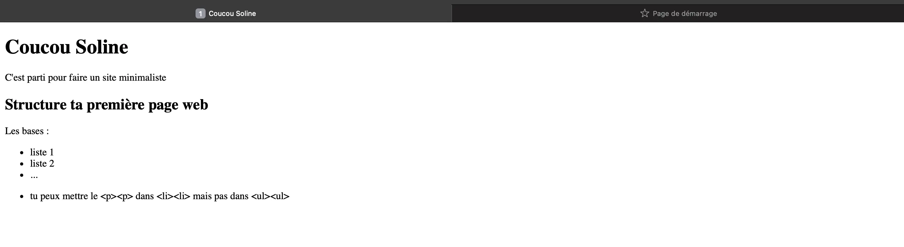
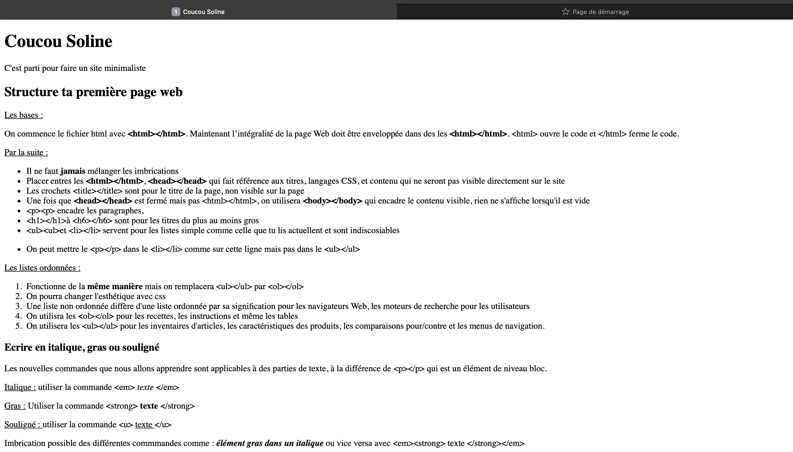
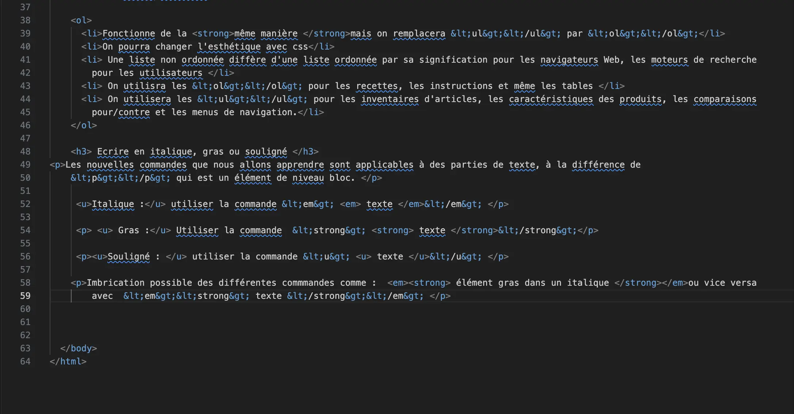
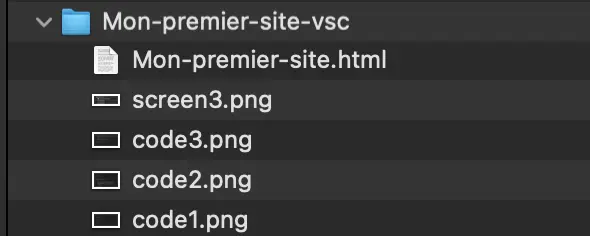
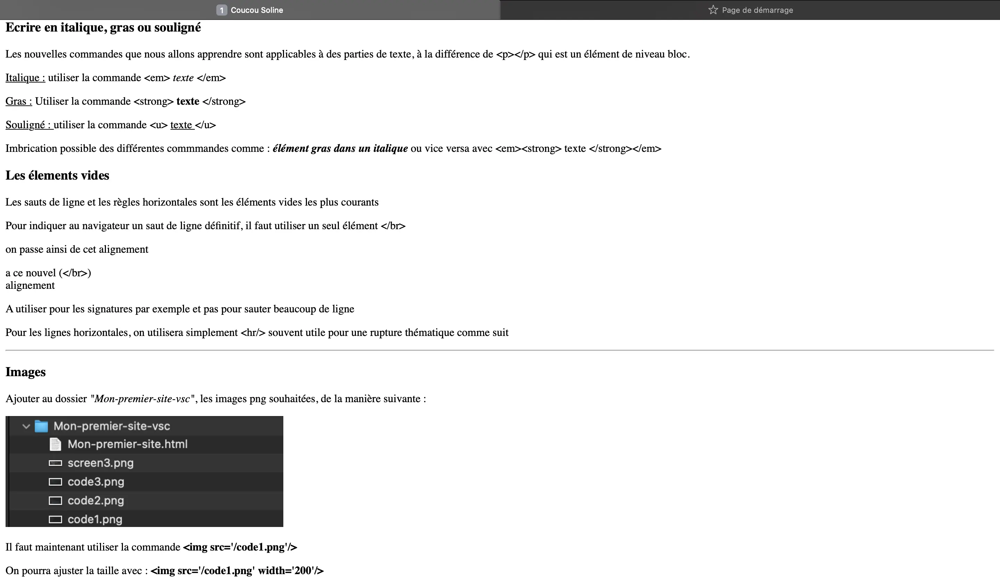
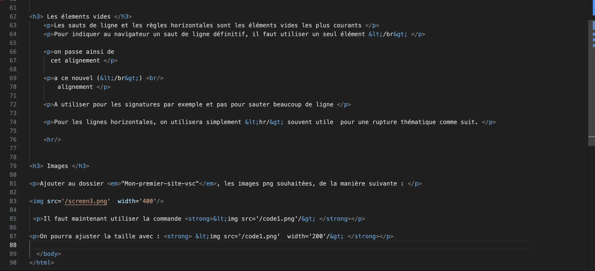
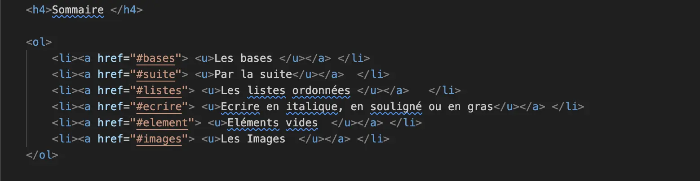
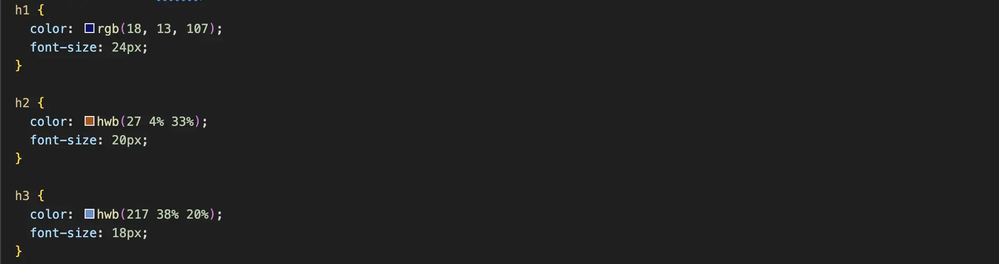
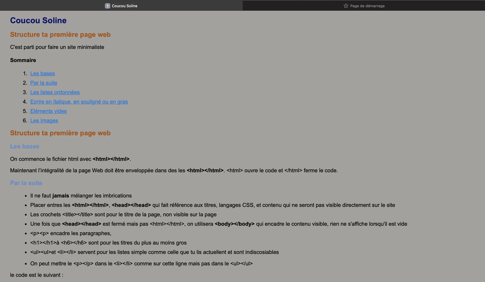
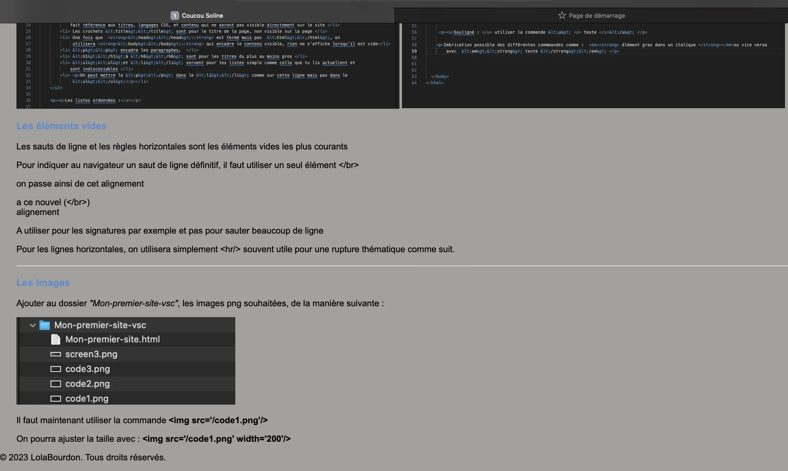

  


Mes objectifs pour ce premier MON sont de découvrir les bases des langages HTML et CSS afin d'être capable de coder un site internet simple pour appliquer ce que j'ai appris. Pour rendre cela plus ludique, je vais coder au fur et à mesure de mon apprentissage un site internet très basique décrivant une fiche méthode du langage html pour Soline qui n'a pas suivi la formation html. Par la suite j'améliorerait l'esthétique du site grâce à la découverte de CSS.

## Méthodologie

Pour me former aux langages html et css, je suis partie de zéro. J'ai suivi, comme beaucoup, les cours de https://internetingishard.netlify.app.
Il est temps de partager mes nouvelles compétences avec Soline pour qu'elle soit capable de faire son site web basique, sans trop approfondir ses connaissances.

## 1. Prérequis

Pour commencer, Soline aura besoin d'utiliser sur son ordinateur un éditeur de texte tel que Visual Studio Code qu'elle possède déjà, même si elle pourrait en utiliser d'autres.

Sur VScode, elle devra suivre les étapes suivantes : 

1. Dans l’explorateur de fichier, créer un dossier : "Mon-premier-site-vsc"
2. Ouvrir l'application VsCode et choisir Fichier > ouvrir > fichier puis naviguer jusqu'au dossier "Mon-premier-site-vsc".
3. Installer l’extension live folder : extension > live folder > installer, qui lui permettra de visualiser son super site web basique
4. Créer un nouveau fichier html "premier-essai.html", un icone <> devrait apparaitre devant le nom du dossier 

## 2. Les bases

Maintenant que Soline est sur la fenêtre de son fichier html, voici quelques bases :

Un fichier html se commence avec **&lt;html&gt;&lt;/html&gt;.**
Maintenant l’intégralité de la page Web doit être enveloppée dans  &lt;html&gt; tout le code &lt;/html&gt;.

Entres les **&lt;html&gt;&lt;/html&gt;.** :

- Il ne faut jamais mélanger les imbrications 
- Placer **&lt;head&gt;&lt;/head&gt;** qui fait référence au titre de la page, langages CSS, et contenu qui ne seront pas visible directement sur le site 
- Écrire le titre de la page entre &lt;title&gt;&lt;/title&gt; même si il n'apparaitra pas directement sur le site.

Maintenant que le &lt;/head&gt; est fermée mais pas le &lt;/html&gt;, placer &lt;body&gt;&lt;/body&gt; qui encadre le contenu visible, rien ne s'affiche  sur la page web lorsqu'il est vide.

Dans **&lt;body&gt;&lt;/body&gt;** :

- &lt;p&gt;&lt;/p&gt; encadre les paragraphes,  
- &lt;h1&gt;&lt;/h1&gt; à &lt;h6&gt;&lt;/h6&gt; sont pour les titres du plus au moins gros
- &lt;ul&gt;&lt;/ul&gt;et &lt;li&gt;&lt;/li&gt; servent pour les listes simple et sont indissociables
- On peut mettre le &lt;p&gt;&lt;/p&gt; dans le &lt;li&gt;&lt;/li&gt; mais pas dans le &lt;ul&gt;&lt;/ul&gt;
- Pour faire apparaître les crochets sur la page il suffira de les encadrer par &lt ; &gt ; sans espace entre le t et le point virgule

Voyons ce que ces premières informations rendent sur un site web basique. Pour cela il suffit de faire clique droit sur le nom du fichier html et de cliquer sur *Open with Live Server* :

Il existe également des liste ordonnées qui permettent de numéroter la liste. Cela fonctionne de la même manière mais on remplacera le &lt;ul&gt;&lt;/ul&gt; par &lt;ol&gt;&lt;/ol&gt;.

### Écrire en Italique, gras ou souligné

Pour écrire en *italique* :

- Utiliser  la commande &lt;em&gt; *texte* &lt;/em&gt; 

Pour écrire en **gras** :

- Utiliser la commande &lt;strong&gt; **texte** &lt;/strong&gt;

Pour écrire en <u>Souligné : </u>

- Utiliser la commande &lt;u&gt; <u> texte </u>&lt;/u&gt; 

On peux également imbriquer un élément gras dans un italique ou vice versa avec :</strong></em> &lt;em&gt;&lt;strong&gt;<em><strong> texte  </strong></em> &lt;/strong&gt;&lt;/em&gt;

Avec ces nouvelles informations, voyons ce que cela peut donner sur donner sur notre super site web :

### Les Eléments Vides 
Les sauts de ligne et les lignes horizontales sont les éléments vides les plus courants. 
Pour indiquer un <u>saut de ligne définitif,</u> utiliser un seul élément **&lt;/br&gt;**
Pour les lignes horizontales, utiliser **&lt;hr/&gt;**.

### Images

Pour finir la formation simple et rapide de Soline, parlons de comment insérer une image sur notre super site web basique.

Pour cela, il faudra ajouter au dossier *"Mon-premier-site-vsc"*, les images que l'on veut utiliser, de la manière suivante :

Partons du principe que Soline n'a que des images.webp. Il faut utiliser la commande **&lt;img src='/code1.webp'/&gt;**

On pourra ajuster la taille avec *width*: **&lt;img src='/screen3.webp'  width='200'/&gt;** selon le rendu souhaité.

Le fin du site final est le suivant :

## 3. Amélioration du site

L'objectif principal du site est terminée mais l'esthétique n'est pas forcément la meilleure. Pour l'améliorer j'ai fait mes premiers pas avec CSS en me basant toujours sur les cours de https://internetingishard.netlify.app. Finalement, j'ai tenté d'amener un côté plus pratique qu'esthétique. 

J'ai aimé créer un sommaire avec des liens cliquables (en html) qui créent des liens vers certains titres de la page de la manière suivante :

Dans les balises *&lt;head&gt;&lt;/head&gt;* du fichier *"mon-premier-site.html"* je suis venue ajouter de nouvelles commandes comme une nouvelle police, un nouveau fond (je ne citerai pas tout) et des commandes de couleurs, en CSS, parmi :

qui selon la taille des titres, les affiche de différentes couleurs.

## 4. Résultat

Pour finir ce premier MON sur le web front, j'ai pu découvrir les langages HTML et CSS. Mes conaissances sont encore à développer, notamment avec CSS mais je suis parvenue au résultat suivant : *(affiché en partie)*

