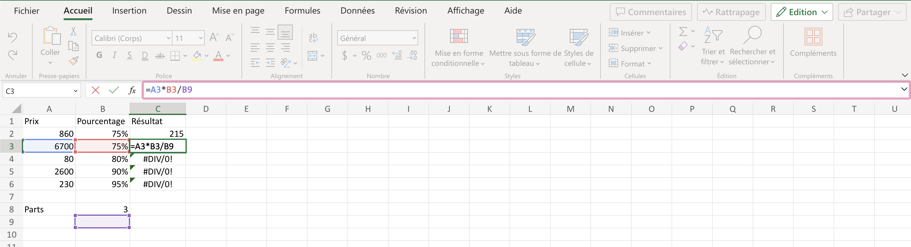
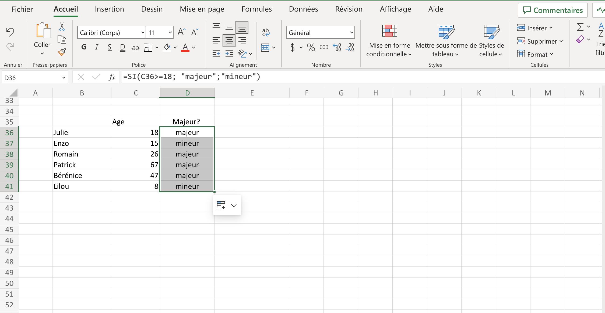

  


Mes objectifs pour ce deuxième MON sont de (re)découvrir les bases d'excel. En effet, lors de mes derniers stages, j'ai été amenée a utiliser excel mais je me suis souvent retrouvée en difficulté dans la manipulation des données. C'est pourquoi je repars du début afin d'être capable de les maîtriser convenablement et d'en apprendre d'avantage dans le cadre d'un futur stage en entreprise. Je souhaiterai également poursuivre le VBA.

### Méthodologie

Pour recommencer une formation sur excel a partir de zéro, j'ai suivi le cours excel sur excel.pratique.com. Le cours Excel se divise en 11 parties synthétiques :

1. Les bases
2. Les tableaux
3. Les formats
4. Insertions d'objets
5. Recopie incrémentée
6. Formules et fonctions
7. Les graphiques
8. Mise en forme conditionnelle
9. Tri et filtres
10. Validations de données
11. Tableau croisé dynamique

J'ai réalisé les exercices proposé tout au long de la formation.

État des lieux le 8 octobre : 10+h de formation.

### Chapitres 1 à 8 - revoir les bases

Dans cette première partie, je vais simplement faire une fiche méthode à utiliser la prochaine fois que j'aurai besoin d'excel. La formation sur excel.pratique.com étant très synthétique, je vais juste énumérer les points importants pour moi.

1. L'utilisation du `$` qui permet de fixer une cellule/colonne/ligne lorsque nous utilisons des formules, par exemple :

Dans cette exemple, on divise par la valeur **3**, qui apparaît dans la cellule **B8**. Seulement on veut pouvoir diviser à chaque fois par cette **même valeur** de cellule **B8** lors de la recopie. Corrigeons:

Pour cela; le premier `$` de `$B$8` fixe la **colonne** lors de la recopie et le second `$` fixe la **ligne**. Ici,  on aurait pu simplement fixer la ligne.


La suite de la formation a été réalisée sur un ordinateur avec excel en anglais (utile pour avoir le vocabulaire en anglais également).

2. Les formules SI, ET, OU :

   1. La **fonction SI** ou **IF** en anglais : **=SI(test logique, valeur si vrai, valeur si faux)**
    Elle permet de retourner une valeur ou une autre en fonction d'une condition et nécessite 3 arguments.
   Prenons l'exemple suivant, dans lequel on se demande si les personnes sont majeures selon leur âge :
   
   Il suffit de rentrer dans la cellule D36: **=SI(C36>=18 (qui explique la condition); "majeur";"mineur")** et de faire une recopie sur les cellules souhaitées.
  Si on essaye dans un cas plus complexe, comme dans cet exercice proposé par la formation:
  

  Ici, on souhaite calculer dans la cellule D3 la valeur du rabais en fonction de la quantité d'un article. POur cela il faut imbriquer une fonction SI dans une autre. Voici une option non unique: 
   1. La **fonction ET**
   2. La **Fonction OU**